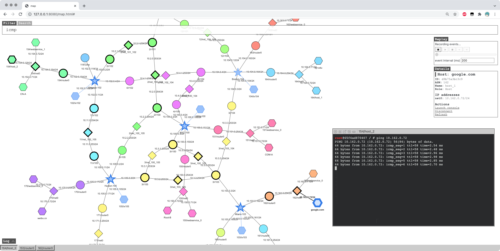

Internet Emulator
---

The objective of the SEED-Emulator project is to help create emulators of 
the Internet. These emulators are for educational uses, and they can be
used as the platform for designing hands-on lab exercises for various subjects,
including cybersecurity, networking, etc.

The project provides essential elements of the Internet (as Python classes), including 
Internet exchanges, autonomous systems, BGP routers, DNS infrastructure, 
a variety of services. Users can use these elements as the building blocks
to build their emulation programmatically. The output of the program 
is a set of docker container folders/files. When these containers are built and 
started, they form a small-size Internet. New building blocks are being added,
including Blockchain, Botnet, and many other useful elements of the Internet. 

## Table of Contents

-  [Getting Started](#getting-started)
-  [Documentation](#documentation)
-  [Contributing](#contributing)
-  [License](#license)

## Getting Started

To get started with the emulator, install docker, docker-compose, and python3. Then, take a look at the [examples/](./examples/) folder for examples. Detailed explanation is provided in the README file, as well as in the comments of the code. To run an example:

1. Pick an example, say `A00-simple-peering`. 
2. Add `seedemu` to `PYTHONPATH`. This can be done by running `source development.env` under the project root directory.
3. Build the emulation. For this example, cd to `examples/A00-simple-peering/`, and run `python3 ./simple-peering.py`. The container files will be created inside the `output/` folder. For some examples, such as `B02-mini-internet-with-dns`, they depend on other examples, so you need to run those examples first. This is part of our component design.
4. Build and run the containers. First `cd output/`, then do `docker-compose build && docker-compose up`. The emulator will start running. Give it a minute or two (or longer if your emulator is large) to let the routers do their jobs.
5. Optionally, start the seedemu web client. Open a new terminal window, navigate to the project root directory, cd to `client/`, and run `docker-compose build && docker-compose up`. Then point your browser to http://127.0.0.1:8080/map.html, and you will see the entire emulator. Use the filter box if you want to see the packet flow.

## Documentation

Documentation is in progress inside the [docs/](./docs/) folder.

## Contributing

Contributions to SEED-Emulator are always welcome. For contribution guidelines, please see [CONTRIBUTING](./CONTRIBUTING.md).

## License

The software is licensed under the GNU General Public License v3.0 license, with copyright by The SEED-Emulator Developers (see [LICENSE](./LICENSE.txt)).
