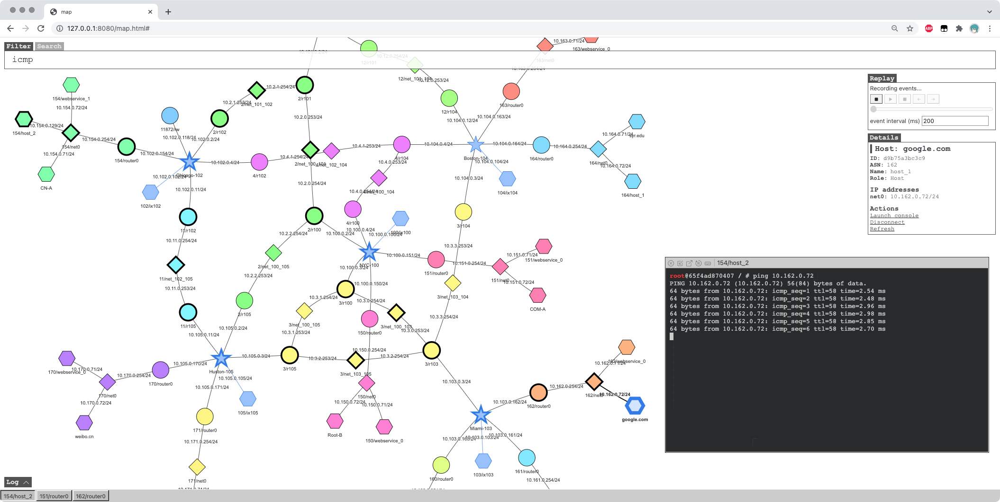

# SEED Emulator (`seed-email-service`)

`seed-email-service` is the core SEED Emulator repository. It provides:

- programmable Internet emulation (AS/IX/BGP/DNS/services)
- compiler outputs to Docker/Compose runtimes
- a modern MCP operations control plane (`SeedOps`) for running labs

This repo now supports two complementary workflows:

1. **BUILD path**: define topology -> compile -> run containers
2. **OPS path**: attach to running output -> observe/operate via MCP tools



---

## Quick Start (BUILD path)

### Prerequisites

- `python3`
- `docker`
- `docker-compose` (or compose plugin)

### Environment

```bash
source development.env
```

For persistent usage, add repo root to `PYTHONPATH` in your shell profile.

### Run a minimal example

```bash
cd examples/basic/A00_simple_as
python3 simple_as.py
cd output
docker-compose build && docker-compose up
```

After startup, routers need time to converge.

---

## Quick Start (OPS path / SeedOps MCP)

Start SeedOps MCP server:

```bash
cd mcp-server
export SEED_MCP_TOKEN=your-bearer-token
export FASTMCP_HOST=127.0.0.1 FASTMCP_PORT=8000 FASTMCP_STREAMABLE_HTTP_PATH=/mcp
python serve_http.py
```

Then use a client (for example `seed-agent`) to call SeedOps tools:

- workspace attach (`workspace_attach_compose` / `workspace_attach_labels`)
- inventory + selectors (`inventory_list_nodes`)
- batch ops (`ops_exec`, `ops_logs`, `routing_bgp_summary`)
- async jobs/artifacts (`playbook_run`, `job_get`, `artifacts_list`)

SeedOps manual:

- `docs/user_manual/mcp_seedops.md`

---

## Repository map

```text
seed-email-service/
├── examples/                 # Topology and scenario examples
├── mcp-server/               # SeedOps MCP server implementation
├── docs/user_manual/         # User manuals and feature guides
├── library/, seedemu/        # Emulator core packages
├── docker_images/            # Container image build assets
└── client/                   # Visualization/client components
```

---

## Documentation entrypoints

- Main user manual index: `docs/user_manual/README.md`
- Build flow overview: `docs/user_manual/overall_flow.md`
- SeedOps MCP operations: `docs/user_manual/mcp_seedops.md`
- Example catalogs:
  - `examples/basic/README.md`
  - `examples/internet/README.md`
  - `examples/blockchain/README.md`
  - `examples/scion/README.md`

---

## Notes for constrained network environments

If Docker Hub access is unstable:

- configure proxy: `docs/user_manual/dockerhub_proxy.md`
- or build local images: `docker_images/README.md`

---

## Related repository

High-level agent and Codex integration live in:

- `subrepos/seed-agent/README.md`

Recommended closed-loop launcher from `seed-agent`:

- `subrepos/seed-agent/scripts/seed-codex up`
- `subrepos/seed-agent/scripts/seed-codex ui`

---

## Contributing

See `CONTRIBUTING.md`.

## License

GNU GPL v3.0, see `LICENSE.txt`.
