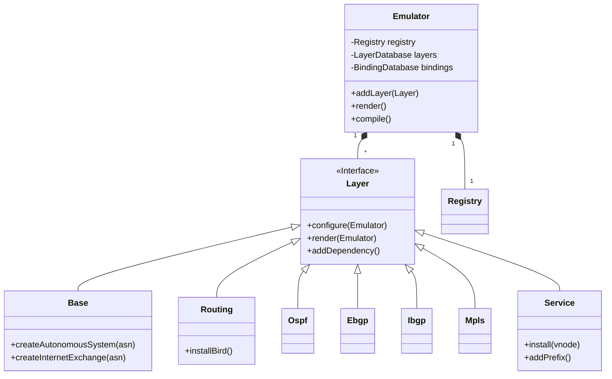
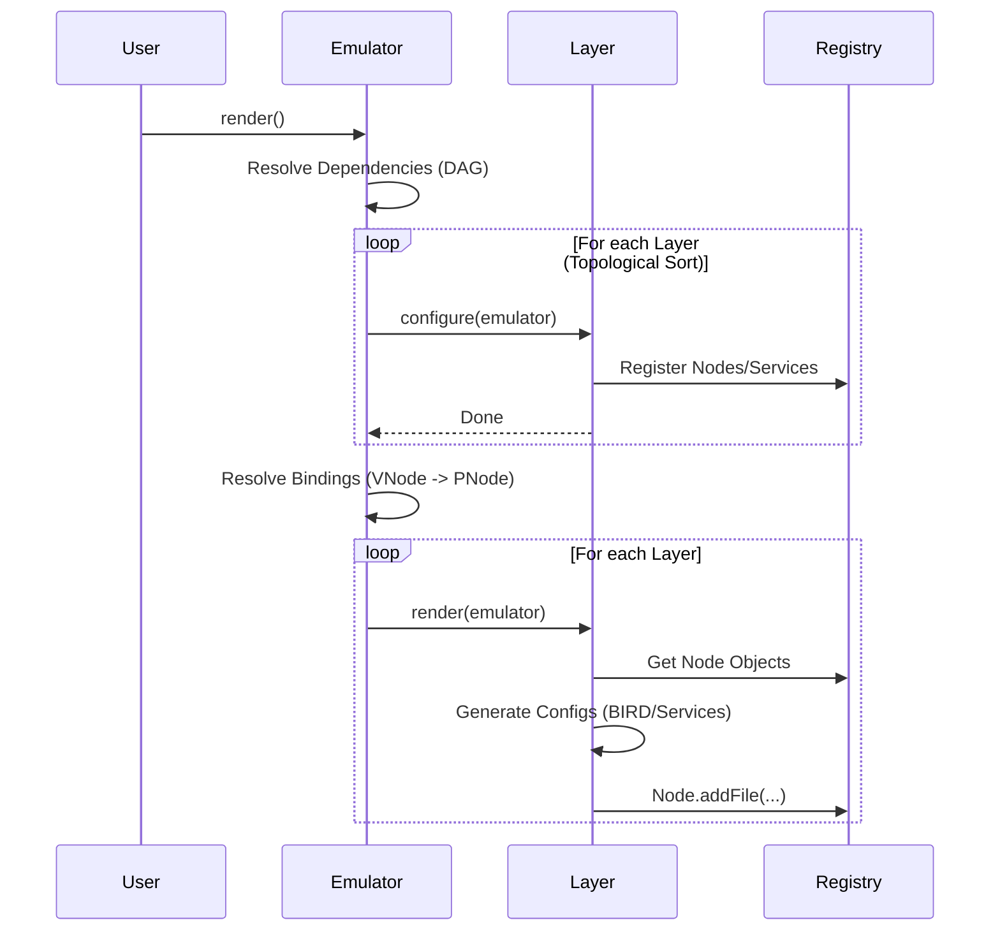

# SEED-Emulator 深度架构解析与开发指南

## 1. 项目概述 (Overview)

SEED-Emulator 是一个用于构建和仿真复杂网络环境的 Python 框架。其核心设计理念是 **分层架构 (Layered Architecture)**。通过将网络功能解耦为独立的“层 (Layer)”，用户可以像搭积木一样组合不同的层来构建网络场景。

这种设计使得仿真环境具有高度的 **模块化 (Modularity)** 和 **可重用性 (Reusability)**。例如，你可以定义一个基础的物理拓扑（BaseLayer），然后在其上叠加 OSPF 路由（OspfLayer）、BGP 路由（EbgpLayer/IbgpLayer），甚至应用层服务（Web/DNS）。

## 2. 核心架构 (Core Architecture)

### 2.1 类关系图 (Class Diagram)



### 2.2 渲染流程 (Render Flow)

`Emulator.render()` 是核心生命周期方法，它负责协调各个层的执行顺序。



---

## 3. 层级深度解析 (Deep Dive into Layers)

### 3.1 基础设施层 (Base Layer) `seedemu.layers.Base`

这是所有仿真的基石。

*   **API 暴露**:
    *   `createAutonomousSystem(asn: int) -> AutonomousSystem`: 创建 AS。
    *   `createInternetExchange(asn: int) -> InternetExchange`: 创建 IXP。
    *   `getAutonomousSystem(asn: int)`: 获取已存在的 AS 对象。
*   **作用域 & 副作用**:
    *   **Scope**: 全局。
    *   **Side Effect**: 向 `Registry` 注册 AS, Node, Network 对象。此时不产生具体配置文件，仅构建内存对象图。
*   **关键机制**:
    *   `AutonomousSystem` 对象是 AS 内部拓扑的工厂。
        *   `createRouter(name)`: 创建路由器。
        *   `createNetwork(name)`: 创建子网。
        *   `createHost(name)`: 创建主机。
    *   **隐式连接**: 节点通过 `node.joinNetwork(net)` 连接。

### 3.2 路由基础层 (Routing Layer) `seedemu.layers.Routing`

为节点赋予“路由能力”。

*   **API 暴露**:
    *   `__init__(loopback_range)`: 可配置 Loopback 地址池。
*   **核心逻辑**:
    *   **Configure 阶段**: 遍历所有 `rnode` (Router)，为其分配 Loopback IP。
    *   **Render 阶段**:
        *   安装 `bird2` 软件。
        *   生成 `/etc/bird/bird.conf` 骨架 (Router ID, Kernel Protocol, Direct Protocol)。
        *   为 Host 节点设置 Default Gateway (指向同网段的 Router)。
*   **Dependency**: 依赖 `Base`。

### 3.3 域间路由层 (Ebgp Layer) `seedemu.layers.Ebgp`

管理 AS 之间的 BGP 对等关系。

*   **API 暴露**:
    *   `addPrivatePeering(ix, asn1, asn2, relationship)`: 在 IXP 建立私有对等。
    *   `addCrossConnectPeering(asn1, asn2, relationship)`: 在直连链路建立对等。
    *   `addRsPeer(ix, asn)`: 将 AS 接入 IXP 的路由服务器 (Route Server)。
*   **枚举 `PeerRelationship`**:
    *   `Provider`: 向 Peer 导出所有路由（我是你的提供商）。
    *   `Peer`: 仅导出自身和客户路由（我们是平级）。
    *   `Unfiltered`: 无过滤（测试用）。
*   **实现细节**:
    *   生成复杂的 BIRD 过滤器配置 (`conf_filters`)。
    *   使用 BGP Large Community 标记路由来源 (`LOCAL`, `CUSTOMER`, `PEER`, `PROVIDER`) 以实现高层策略。
    *   **Mermaid 关系**:
        ```mermaid
        graph LR
        AS100 --"Provider(30)"--> AS200
        AS200 --"Customer(10)"--> AS100
        ```

### 3.4 域内路由层 (Ibgp Layer) `seedemu.layers.Ibgp`

全自动建立 AS 内部的 iBGP 全互联 (Full Mesh)。

*   **API 暴露**:
    *   `maskAsn(asn)`: 在特定 AS 禁用 iBGP (例如该 AS 仅运行 OSPF 或 MPLS)。
*   **算法**:
    *   使用 DFS (深度优先搜索) 遍历 AS 内部拓扑，找到所有连通的路由器。
    *   在所有路由器之间建立两两 BGP 会话 (`neighbor <loopback> as <my_asn>`)。
    *   配合 `Ospf` 层实现下一跳可达。

### 3.5 标签交换层 (Mpls Layer) `seedemu.layers.Mpls`

在 AS 核心启用 MPLS/LDP，替代 iBGP Full Mesh 的部分功能。

*   **API 暴露**:
    *   `enableOn(asn)`: 在指定 AS 启用 MPLS。
    *   `markAsEdge(asn, router_name)`: 显式标记边缘路由器 (PE)。
*   **深度逻辑**:
    *   自动识别 P (Provider) 路由器和 PE (Provider Edge) 路由器。
    *   **P Router**: 仅运行 OSPF + LDP，不运行 BGP。
    *   **PE Router**: 运行 OSPF + LDP + iBGP。
    *   安装 `frr` 替代默认的 `bird` 处理 OSPF/LDP (因为 BIRD2 不支持 LDP)。
    *   **依赖**: 自动 Mask 掉 `Ospf` 和 `Ibgp` 层在对应 AS 的默认行为，接管配置生成权。

### 3.6 服务抽象层 (Service Layer) `seedemu.core.Service`

所有应用层服务的基类。

*   **核心概念: 绑定 (Binding)**
    *   Service 层操作的是 **虚拟节点 (Virtual Node / vnode)**。
    *   `install(vnode_name)`: 请求在一个名为 `vnode_name` 的节点上安装服务。
    *   **Resolution**: 在 `Emulator.render()` 早期，系统会查找 `BindingDatabase`，将 `vnode` 映射到 `BaseLayer` 创建的物理节点 (`pnode`)。
    *   如果未通过 `Binding` 显式指定，Emulator 可能会抛错或需要自动分配策略（取决于实现）。
*   **开发自定义服务**:
    *   继承 `Service` 类。
    *   实现 `_createServer()` 返回一个 `Server` 对象（存储配置）。
    *   实现 `_doInstall(node, server)` 生成具体的 Docker 配置 (Dockerfile, files)。

---

## 4. MCP Server 设计参考 (For MCP Implementation)

基于上述分析，MCP Server 的实现路线图：

1.  **Stateful Wrappers**: 必须在 Python 内存中维护 `Emulator` 实例。因为 `Layer` 对象之间有强引用关系。
2.  **Identifier Mapping**:
    *   MCP 传递 User 视角的字符串 ID (e.g., "as100").
    *   Server 内部维护 `Dict[str, AutonomousSystem]` 映射表。
3.  **Atomic Operations vs Transactions**:
    *   `create_as`, `create_router` 是原子操作。
    *   但是 `render` 是事务性的，必须在所有拓扑构建完成后调用一次。
4.  **Error Handling**:
    *   Python 的 `AssertionError` (如 "AS already exists") 需要捕获并转换为 MCP ToolError。

## 5. 总结

SEED-Emulator 是一个声明式的、配置驱动的网络仿真编译器。
*   **Base** = 物理层 (L1/L2)
*   **Routing/OSPF/BGP** = 网络层控制面 (L3)
*   **Service** = 应用层 (L7)

MCP Server 的本质是将自然语言指令转换为对上述 API 的序列化调用。
