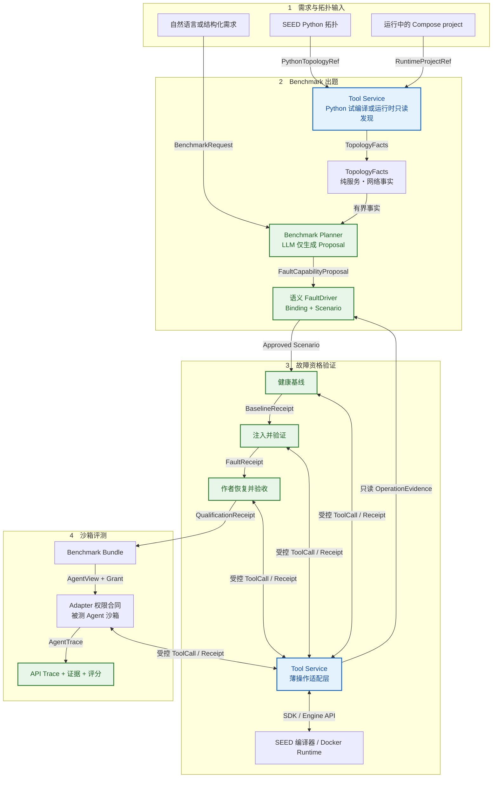
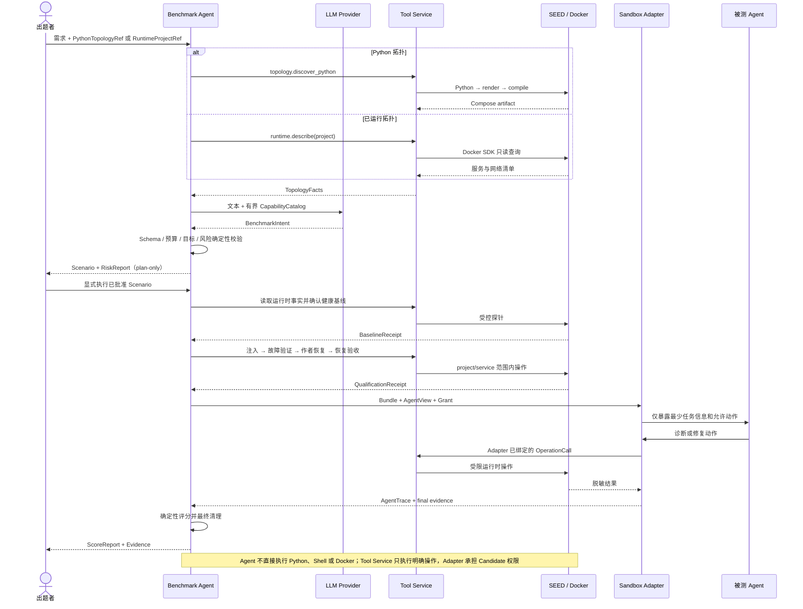
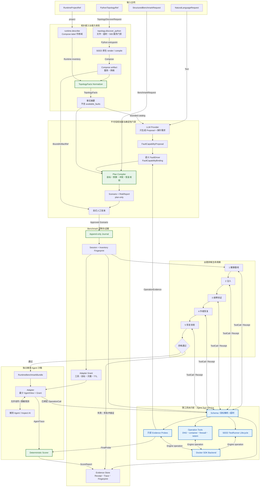
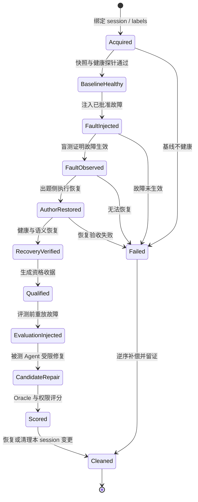

<!-- README_SYNC_REQUIRED -->

# Topology-to-Runtime Benchmark Authoring Agent

本分支设计一个最小可实现的 Benchmark 出题系统：用户可以指定一个 SEED 拓扑来源，也可以直接指定
一个已经运行的 Docker 拓扑。前者由 Agent **编排 SEED Emulator 既有编译链**，生成并启动健康 Docker
场景；后者直接执行只读发现和健康验收。两条路径从“已绑定且健康的运行时拓扑”开始共用同一套故障
注入、盲测、恢复、证据和评测打包流程。

Agent 不实现、更不重写 `Python → render → compile → Docker`。它只通过受控的拓扑物化接口提交已批准
的拓扑引用、预算和输出 session，由 SEED 原生编译器与 Docker backend 完成实际构建。

本文的权威主链是：

```text
自然语言 / 结构化需求
→（若提供拓扑文件：通过 API Service 编排 SEED 编译并部署）
→ 运行时 Docker
→ Benchmark Agent 通过 API Service 读取 Docker
→ 并行准备健康基线、故障设计、测试与恢复计划
→ 有序执行基线确认、注入、故障验证、恢复与恢复验收
→ RuntimeBenchmarkBundle
→ 独立沙箱 + Adapter
→ 被测 Agent 只通过 Adapter 暴露的 API 观测和修复
→ 按 API 使用轨迹、状态证据与测试结果评分
```

“并行”指只读采集和方案编译可以并行；同一场景的真实状态变更不能把注入与恢复同时执行，必须由持久化
DAG 保持因果顺序。包括拓扑启动、Docker 读取、故障注入、恢复、资格验证和被测 Agent 修复在内的所有
Docker 操作，都必须经过 Agent Tool Service API。

> [!IMPORTANT]
> **README_SYNC_REQUIRED（强制联级同步）**：新增或修改代码、Schema、工具、CLI、数据流、安全边界或
> 目录布局时，必须同步代码所在目录及所有祖先目录的 `README.md`。新增代码目录时必须同时创建带
> `README_SYNC_REQUIRED` 标记的 README。所有新增或修改的 Mermaid 图必须进行约 `1280 px` 和
> `768 px` 两种宽度的真实渲染检查；仅检查 Mermaid 语法或 Markdown 围栏不能视为完成。

## 当前状态

本文同时描述目标架构和可运行垂直切片。`benchmark_agent/` 已将 B00 DNS 专用工作流抽离为场景驱动的
`run_runtime_benchmark`，参考输入覆盖 DNS resolver、container stop、iptables OUTPUT drop 和 tc/netem。
API-only 生命周期：结构化请求、运行时事实、控制面 session、基线、可逆操作（带拓扑与能力漂移检测）、故障验证、
作者恢复、Bundle、Adapter 权威授权、API trace、评分和最终清理。
长期开发约束见 `DEVELOPMENT_WORKFLOW.md`。本切片的被测 Agent 已有两条共享同一 Adapter 的运行路径：
原生 `CandidateProvider` 循环，以及 Inspect AI harness。MIMO 是首个真实模型；Inspect 的 mock model 已用于
确定性工具循环测试，多厂商真实模型对比尚未执行。

Agent Tool Service 提供 Compose project 发现、纯 `TopologyFacts`、只读 operation evidence 与通用操作工具；
它不保存 session、grant 或 recovery-token 策略状态。Candidate 权限由 Adapter 承担，session 与恢复合同由 Benchmark 控制面持久化。
可信用户可直接给出宿主机上的任意现有 Python 入口，
Tool Service 进行有界 Python→Compose 试编译（不调用 Docker），并从 Compose 自动生成服务、网络、默认
健康事实和指纹化 `TopologyFacts`。对未知运行中拓扑，
`nl-runtime-plan` 经 Tool Service 只读发现（`runtime.projects` / `runtime.describe`）生成同一描述符，再走
同一 Intent 编译链（当前自动发现能力为 container
stop 一种）。MIMO 只生成严格 Intent，Tool、授权和生命周期由本地规则编译。iptables 能力发现、
更多故障、通用持久化 DAG、生产级鉴权、任意第三方 Agent 的多厂商实测和大规模能力仍是目标设计，
不得因首个切片通过而标记为已实现。
MIMO 现在还会根据服务名、镜像、网络和地址生成用途、目标角色和置信度三项简易拓扑解释；解释仅用于
辅助选题并写入审计，本地 Schema、能力和故障门禁仍是执行权威。

当前代码索引：

- `benchmark_agent/models.py`：`TopologyFacts`、Proposal、Binding 与生命周期模型；
- `benchmark_agent/faults/`：四个 Benchmark 语义 FaultDriver、能力验证和目标级目录；
- `benchmark_agent/api.py`：Tool Service HTTP 客户端；
- `benchmark_agent/nl.py`：Python/运行中 Compose project 的 API-only 发现、统一描述符、MIMO 严格 Intent 与确定性 Scenario 编译；
- `benchmark_agent/workflow.py`：通用 probe/inject/recover qualification、控制面 session/grant 合同、Bundle、评测、评分与清理；
- `benchmark_agent/journal.py`：append-only 生命周期事件日志（Phase 1c）；
- `benchmark_agent/evaluation.py`：经 Adapter 的原生候选评测循环；
- `benchmark_agent/inspect_runner.py`：Inspect AI Task、受限工具循环与可重放 transcript；
- `benchmark_agent/providers/`：被测 Agent 接入协议（`base.py` 协议、`openai_compat.py` 通用接入，vendor 配置在 `config.json`，Phase 1.5）；
- `benchmark_adapter/`：独立沙箱 Adapter 服务（动作白名单、转发脱敏、trace，含 Dockerfile 与 compose 网络隔离，Phase 1a）；
- `benchmark_agent/cli.py`：默认不改 Docker 的 `nl-plan` 与通用 `run --scenario` 两步入口；执行面不再提供 B00/DNS 专用命令；
- `scenarios/README.md`：持久化输入合同的独立权威文档，与代码架构说明分离；
- `tests/test_runtime_benchmark_agent.py`：无 Docker 的确定性闭环测试；
- `tests/test_nl.py`：拓扑摘要、严格 Intent、角色/探针绑定、确定性编译与 plan-only 审计测试；
- `DEVELOPMENT_WORKFLOW.md`：后续 Agent 必须遵守的长期开发门禁。

真实验收记录 `benchmarks/runs/b00_dns_20260828T212030Z` 已证明：B00 compile/build/up/readiness、DNS
基线、两轮可逆注入、作者恢复、MIMO Adapter 修复、评分和 topology down 均成功。MIMO 的动作序列为
`inspect_dns → probe_dns → repair_dns`，最终得分 `100`；全部 19 次 Docker 相关动作均记录为 Tool Service
调用，清理后 Compose project 容器数为 0，产物密钥扫描未发现 API key。运行产物属于本地证据，不应提交。

非 B00 真实验收记录
`benchmarks/runs/nl_internet_b20_dhcp_container_stopped_444a50b3bd_20260829T124124Z` 证明：MIMO 从 B20
能力摘要中选择 DHCP 客户端并生成 container-stop Scenario；通用工作流完成完整 Docker 生命周期，被测
MIMO 仅经 Adapter 调用 `start_service → finish`，无越权，得分 `100`，最终 fault recovered、topology down，
Compose project `output` 残留容器数为 `0`。

## 设计原则

1. **两种入口，一个运行时边界。** 指定拓扑先经 SEED 编译并启动；已有 Docker 拓扑直接绑定。后续流程一致。
2. **只有一个规划 Agent。** `Benchmark Planner Agent` 负责理解需求并生成结构化草案，不使用多 Agent。
3. **规划与执行分离。** Planner 不能访问 Docker、Docker Socket、宿主 Shell 或 Tool Service 管理凭据。
4. **计划必须确定性编译。** Schema、能力、预算、目标绑定、冲突、恢复和规范化均由规则组件完成。
5. **Tool Service 是唯一执行面。** 出题系统和被测 Agent 都不得直接使用 Docker CLI、SDK 或 Socket。
6. **先证明可恢复，再交给被测 Agent。** 出题侧必须完整执行一次注入、观测、恢复和恢复验收。
7. **运行时变更是临时的。** 容器重建后变更可能消失；本阶段不把运行时修改伪装成源码持久化修改。
8. **最少暴露。** 被测 Agent 只获得完成题目必需的节点、观测和动作，不获得故障真值与恢复答案。
9. **全部动作可审计。** 计划、工具调用、stdout、stderr、前后快照、Agent 轨迹和评分均保存指纹。
10. **复用 SEED 与 Tool Service。** Agent 编排而不重写 SEED 编译链，也不在 Benchmark 项目中另建 Docker 控制层。
11. **最少类型。** 流程图连线是逻辑合同，不等于实现类；仅在外部输入、持久化和安全边界创建少量顶层模型。
12. **被测 Agent 无关。** 评测目标是任意第三方 Agent 的网络问题修复能力，不绑定特定模型或供应商。
    Inspect AI 已作为标准模型/工具评测 harness 接入，但只能看到 Adapter-backed tools；MIMO 只是第一个
    真实模型示例。未来 OpenAI-compatible 或 MCP Agent 仍必须进入同一 Adapter、Grant 与评分合同。

## 范围

### 本阶段包含

- 接受用户指定的 SEED 拓扑来源，经安全校验后编排既有 `render`、Docker Compiler 与受控启动流程；
- 通过 Compose project label 与控制面 session allowlist 接管运行中的容器、网络和服务；
- 获取受限的运行时 inventory、能力清单、健康状态和拓扑摘要；
- 生成并编译运行时故障、观测、恢复、权限和评分计划；
- 通过 Tool Service 注入容器、进程、DNS、路由、防火墙或 `tc/netem` 类故障；
- 完成健康基线、注入、盲测、出题侧恢复、恢复验收和证据采集；
- 在独立沙箱中向被测 Agent 暴露受限运行时修复接口；
- 生成 `RuntimeBenchmarkBundle` 和 `ScoreReport`。

### 本阶段不包含

- 修改 SEED Python 源码、Overlay、Binding、Layer 或拓扑生成逻辑；
- 自行实现或替换 SEED `render`、Docker Compiler；
- 让 Planner 直接执行 Python、宿主 Shell、Docker CLI、Compose CLI 或访问 Docker Socket；
- 在用户指定拓扑之外擅自新增 AS、IX、节点、镜像、Dockerfile 或 Compose service；
- 修改宿主文件、增加宿主目录挂载，或为既有容器新增/提升 privileged、host network、host PID 权限；
- 通过运行时结果反向生成或覆盖 SEED Python；
- 发布 benchmark、排行榜或跨机器调度。

## 指定目标拓扑：两种接入形式

用户指定的是**本次要操作的目标拓扑**，不是固定选择 B00 Mini Internet。B00 只用于说明“存在拓扑
文件时”的一种标准抽象结构；任何其他 SEED 拓扑都可以提供等价的来源描述。系统也必须支持直接指定
一个已经运行的 Docker topology，此时可以完全没有 Python、YAML 或 Compose 来源文件。

目标拓扑采用二选一的接入方式，并统一生成纯 `TopologyFacts`：

1. **Python 指定拓扑（python-discovered）**：提供 `PythonTopologyRef`。Tool Service 校验来源、超时与
   服务数预算，调用 SEED 原生 Python→Compose 编译链进行试编译，再从 Compose 提取服务和网络。Benchmark
   Agent 不直接执行 Python，试编译产物是后续生命周期的唯一物化输入。
2. **纯运行时拓扑（runtime-discovered）**：不提供拓扑文件。控制面通过 Tool Service 对指定的
   Compose project / session 执行只读发现，生成带指纹的 `RuntimeDiscoveredTopologyRef`。

以 `<seed-emulator-repo>/examples/internet/B00_mini_internet` 为指定拓扑的**呈现形式示例**（路径仅为示例）：

| 文件 | 在指定拓扑接入中的抽象角色 |
| --- | --- |
| `mini_internet.py` | 主输入：SEED 编译入口与 revision 证明；Planner 不执行源码，由 Tool Service 受控试编译 |
| `output/docker-compose.yml` | SEED 编译产物；用于受控启动、service 对账、产物指纹和审计，不由 Planner 手工生成 |
| `test_runtime.py` | 既有测试来源证明；默认不执行任意宿主 Python，所需断言应编译为受控 Tool Service 探针 |

当前指定拓扑的自然语言入口可直接提供 SEED Python。它会经 Tool Service 进行 Python→Compose 试编译，
试编译阶段不执行 Docker build/up；审核 Scenario 后，`run` 会通过 Tool Service 对同一指纹化 Compose
artifact 执行 build/up/readiness：

```bash
PYTHONPATH=benchmarks python3 -m benchmark_agent.cli nl-plan \
  --topology examples/internet/B00_mini_internet/mini_internet.py \
  --api-url http://127.0.0.1:8000 \
  --text '在指定拓扑中设计可恢复的容器停止故障'
```

审核生成的 `scenario.json` 与风险报告后，使用第二个入口显式执行：

```bash
PYTHONPATH=benchmarks python3 -m benchmark_agent.cli run \
  --scenario benchmarks/nl_plans/<plan>/scenario.json
```

Python 发现 Scenario 调用统一的 `benchmark.topology.lifecycle` 构建、启动、验收并最终清理试编译产物。若同一 Scenario 描述的 project
与 service 已经运行，可以增加 `--reuse-running` 跳过物化。对未知运行中拓扑，先经 `nl-runtime-plan` 只读
发现并生成 Scenario（`topology.mode=runtime_discovered`），`run` 对这类场景自动免物化、直接按
`com.docker.compose.project` label 绑定 session；它不会编译、启动或 down 一个它不拥有的拓扑。运行时
能力校验只允许描述符已证明支持的故障；未知能力不会由 LLM 猜测后执行。

```bash
PYTHONPATH=benchmarks python3 -m benchmark_agent.cli runtime-projects --api-url http://127.0.0.1:8000
PYTHONPATH=benchmarks python3 -m benchmark_agent.cli nl-runtime-plan \
  --text '停止一个主机容器作为故障' --project <compose-project> --api-url http://127.0.0.1:8000
```

当前真实汇合边界是：

```text
nl-plan + Python → Tool Service 试编译 → TopologyFacts → Proposal/Binding → Scenario → 显式 run
已知 Scenario → run --reuse-running → 已知 project/service     │
nl-runtime-plan + project → TopologyFacts → Proposal/Binding → Scenario ────┼→ 控制面 session
  → run（runtime_discovered，自动免物化）                      ┘
→ 基线 → 注入 → 验证 → 作者恢复 → 被测 Agent → 评分 → 清理（runtime 场景保留拓扑）
```

## 总体设计架构

### 精简总体流程图

精简图展示当前已经可运行的 CLI 子命令。绿色 `RULE` 表示由确定性边界约束的组件，其中 MIMO
只负责把自然语言转换为受限 Intent；“未知运行时拓扑自然语言发现”路径已实现（`nl-runtime-plan` 只读发现）。



图中的顺序是强制的：先形成并验收健康运行时，再设计和执行故障；只有作者侧能够恢复且恢复探针通过，
才会生成 Bundle 并交给被测 Agent。Benchmark Agent 和被测 Agent 都不能直接调用 Python、Shell 或 Docker。
Python 输入已能完成试编译和描述符生成，并在显式 `run` 后经 Tool Service 启动；规划阶段仍保持
plan-only，不会因一次自然语言请求自动改变 Docker。

### 精简时序图



### 详尽总体流程图

下图保留完整目标控制面，用于指导后续实现；它不是当前 CLI 能力清单。当前可运行入口及边界以前面的
精简总体流程图和时序图为准。未知运行中拓扑的 NL 发现路径已实现（`nl-runtime-plan`，只读发现 +
运行时能力校验，当前仅 container stop 能力）；其他故障的运行时能力发现仍需 manifest 探针或增强镜像。



## 组件职责

| 组件 | 主要职责 | 明确禁止 |
| --- | --- | --- |
| Topology Materializer | 接收 `ApprovedTopologyBuildSpec`，在隔离 workspace 中调用 SEED 原生编译链、启动 project、验收健康并返回收据 | 接收任意 Shell；修改来源拓扑；绕过构建预算或复用其他 session 输出 |
| Runtime Context Builder | 通过 Tool Service 获取 session 内 inventory、健康摘要、能力与快照 | 直接查询 Docker Socket；把全部 10,000+ 节点上下文交给 LLM |
| Benchmark Planner Agent | 将需求和只读上下文翻译为结构化故障、测试、恢复、权限与评分草案 | 调用写工具；决定是否绕过安全规则；输出任意 Shell |
| Plan Compiler | 校验 Schema、解析目标、检查冲突、生成逆操作、规范化并计算指纹 | 调用 LLM；猜测不存在的节点或能力 |
| Safety Gate | 校验 session、label、资源预算、动作 allowlist、影响范围和恢复完整性 | 被 Planner 或用户提示词覆盖拒绝结果 |
| Runtime DAG | 持久化阶段、依赖、幂等键、重试、checkpoint 和 artifact lineage | 直接调用 Docker；跳过失败门禁 |
| Runtime Worker | 执行单个已批准 DAG 阶段并回传收据 | 自由修改计划；访问其他 session |
| Agent Tool Service | 工具发现、参数校验、明确目标解析及 SEED/Docker/容器操作适配 | 调用 LLM；生成 `available_faults`；承担选题、评分或 Candidate 授权策略 |
| EvaluationSandboxAdapter | 生成最少 `AgentView`，权威校验 Grant、目标与调用预算，转发固定 Operation 并脱敏 | 暴露故障真值、恢复计划、完整工具目录和评分答案 |
| Deterministic Scorer | 根据快照、探针、动作轨迹和评分合同计算结果 | 依赖被测 Agent 自述成功 |

## Agent Tool Service 边界

Agent Tool Service 与 SEED Emulator 运行在同一宿主机，通过受控物化 backend 调用 SEED 原生编译链，
并通过 Docker Runtime Backend 接触运行中容器。它是唯一持有拓扑物化权限和 Docker daemon 权限的执行面。
Benchmark Planner、DAG、Worker 和被测 Agent 都只能通过其 HTTP / Tool Registry 接口间接发起操作。

### 当前已经存在

- `GET /api/v1/health`：服务健康检查；
- `GET /api/v1/runtime`：Docker Runtime Backend 状态；
- `GET /api/v1/tools`：工具发现与 JSON Schema；
- `POST /api/v1/tools/{name}/invoke`：Pydantic 校验后的确定性工具调用；Candidate 的工具白名单、目标和预算由 Adapter 在转发前验证；
- `network.inspect_ip_address`；
- `network.ping`；
- `dns.lookup`；
- `bgp.summary`；
- `pki.inspect_certificate_file`。
- `pki.inspect_certificate_file`；
- `benchmark.runtime.service_capabilities`：执行固定白名单的只读检查并返回 operation facts，不返回故障目录；
- `operation.container.*` / `operation.dns.*` / `operation.firewall.*` / `operation.netem.*`：通用确定性操作；
- `benchmark.session.create`、`benchmark.grant.create` 和旧注入/恢复接口：仅为历史 Scenario 保留的兼容层，新生成 Scenario 不依赖服务端 Grant。
### 最小架构需要补充

以下名称是目标接口，不表示当前已经实现：

| 工具类别 | 目标能力 |
| --- | --- |
| Topology Materialization | 校验批准的来源引用，在隔离 workspace 中调用 SEED 原生编译链，启动独立 project，并返回构建日志、产物与镜像指纹 |
| Runtime Discovery | 按 session / project label 分页查询容器、网络、服务、进程和稳定资源 ID |
| Runtime Snapshot | 采集配置、服务、路由、DNS、iptables、qdisc 与健康探针摘要，并计算指纹 |
| Container Control | 对明确绑定的容器执行 stop、start、restart，并返回前后状态和恢复 token |
| Process Control | 对容器内白名单服务执行 stop、start、restart，不接受任意 Shell 字符串 |
| Network Fault | 应用和移除 `tc/netem` 延迟、丢包、限速、抖动规则 |
| Firewall Fault | 应用和移除结构化 iptables/nftables 规则 |
| DNS Fault | 对允许路径或服务应用结构化 DNS 配置变更并恢复 |
| Route Fault | 对指定容器和路由条目执行结构化新增、删除、替换和恢复 |
| Probe | ping、DNS、BGP、HTTP/TCP、进程、路由和应用健康探针 |
| Recovery | 使用注入时生成的恢复 token 执行逆操作并验证最终状态 |

所有命令必须由服务端从结构化参数编译为 argument vector。公开接口不接受宿主 Shell、任意
`docker exec` 字符串或未经 allowlist 的容器内命令。

## 输入接口

系统提供两个等价入口：

1. 自然语言输入：由 `Benchmark Planner Agent` 翻译为 `DraftRuntimeBenchmarkPlan`；
2. `RuntimeBenchmarkRequest v1`：结构化客户端直接提交，不需要调用 LLM。

两种入口都必须经过同一个 Plan Compiler、Safety Gate 和 DAG。自然语言入口不能扩大结构化入口允许的能力。
无论采用哪一种请求形式，拓扑来源还可独立选择 python-discovered 或 runtime-discovered；自然语言、结构化请求
与拓扑来源之间不存在强制绑定关系。

指定拓扑的最小结构化请求包含：

```json
{
  "schema_version": 1,
  "topology_source": {"mode": "python_discovered"},
  "topology_ref": {
    "topology_id": "user-topology",
    "source_path": "/absolute/path/topology.py",
    "artifact_id": "<discover-result-artifact-id>",
    "compose_path": "<discover-result-compose-path>",
    "source_sha256": "<tool-service-computed>"
  },
  "materialization": {
    "session_id": "session-001",
    "runtime_project": "seed-lab",
    "max_build_seconds": 900,
    "max_containers": 100
  },
  "objective": "测试被测 Agent 对 DNS 故障的诊断和恢复能力",
  "fault_intent": {"kind": "dns_service_stop", "count": 1},
  "resource_budget": {
    "max_targets": 1,
    "max_duration_seconds": 300
  },
  "seed": 42
}
```

直接接管运行中 Docker topology 时省略 `topology_ref`，改由控制面产生只读发现引用：

```json
{
  "schema_version": 1,
  "runtime_target": {
    "session_id": "session-002",
    "compose_project": "existing-seed-lab",
    "required_labels": {"com.docker.compose.project": "existing-seed-lab"}
  },
  "topology_source": {"mode": "runtime_discovered"},
  "objective": "测试被测 Agent 对 DNS 故障的诊断和恢复能力",
  "fault_intent": {"kind": "dns_service_stop", "count": 1},
  "resource_budget": {"max_targets": 1, "max_duration_seconds": 300},
  "seed": 42
}
```

## 确定性计划编译

`Plan Compiler` 不调用 LLM，按固定顺序处理：

```text
Schema / version
→ capability reference
→ selector binding
→ session / label policy
→ resource budget
→ impact and conflict analysis
→ recovery completeness
→ test / fault consistency
→ canonical ordering
→ plan fingerprint
```

任何冲突都返回结构化错误，不允许“选择一个看起来合理的答案”。相同草案、RuntimeSnapshot、
CapabilityManifest、策略版本和 seed 必须得到相同的 `ApprovedRuntimeBenchmarkPlan` 或相同错误。

## 核心合同

上述名称首先是**逻辑字段或 Schema 定义**，不是一一对应的 Python 类。推荐只保留六个手写顶层模型：

| 顶层模型 | 聚合内容 |
| --- | --- |
| `BenchmarkRequest` | NL/结构化需求、拓扑来源判别字段、runtime binding、预算和 seed |
| `RuntimeContext` | provenance/materialization receipt 或 runtime-discovered ref、target、inventory、snapshot、capability 与健康摘要 |
| `BenchmarkPlan` | `state=draft/approved`、fault、test、recovery、agent view、grant、score contract、策略版本和指纹 |
| `ExecutionEvent` | 以 `kind` 判别 stage、tool receipt、checkpoint、compensation 和 qualification 事件 |
| `RuntimeBenchmarkBundle` | 已批准计划、资格证据、最少 AgentView、Grant 模板、测试和评分合同 |
| `EvaluationRecord` | Adapter API trace、Tool Service receipts、最终状态证据、AgentTrace 与 ScoreReport |

`TopologyProvenanceRef`、`ApprovedTopologyBuildSpec`、`MaterializationReceipt`、
`RuntimeDiscoveredTopologyRef`、`RuntimeTargetRef`、`RuntimeFaultSpec`、`RuntimeTestSpec`、
`RuntimeRecoverySpec`、`AgentViewSpec`、`AgentCapabilityGrant`、`ScoreContract` 和
`QualificationReceipt` 都作为上述六个文档中的嵌套字段，由同一份版本化 JSON Schema 的 `$defs` 校验，
不分别创建手写类。Tool Service 的调用参数和返回值直接复用其工具 Schema 生成的类型，也不在 Benchmark
项目中重复包装。

Planner、Materializer、Compiler、Safety Gate、DAG Runner、Adapter 和 Scorer 优先实现为无状态函数或小型
模块。只有确实需要持有连接池、事务或生命周期资源的组件才创建服务对象；不得为了与流程图节点对应而
建立空壳类、Manager 类或逐层 DTO。

## 运行时生命周期



严格要求：

- 健康基线未通过时不得注入故障；
- 故障没有被盲测观察到时不得标记成功；
- 出题侧无法恢复时不得打包；
- 评测必须从已验证的基线重新注入故障，不能沿用资格验证后的残留状态；
- 无论成功、失败、超时或进程崩溃，都必须根据 journal 恢复或清理当前 session。

## 故障与测试的最小集合

第一版只支持少量、可逆、容易验证的运行时故障：

| 故障 | 注入 | 恢复 | 必需测试 |
| --- | --- | --- | --- |
| Container Stop | 停止一个已绑定容器 | 启动同一容器并等待健康 | 容器状态、依赖服务失败、恢复后健康 |
| Process Stop | 停止白名单服务进程 | 启动或重启服务 | 进程状态、端口、应用探针 |
| DNS Service Failure | 停止 DNS 服务或应用允许的错误配置 | 恢复服务或配置 | 正常解析、故障态解析失败、恢复解析 |
| Netem | 延迟、丢包、限速或抖动 | 删除指定 qdisc | 基线 RTT、故障分布、恢复后阈值 |

故障生命周期阶段暂不支持不可逆数据破坏、任意软件安装、任意 Shell、镜像重建、容器创建、Docker 网络
全局删除或宿主修改。指定拓扑物化阶段可以创建该 session 的镜像、容器和网络，但只能依据
`ApprovedTopologyBuildSpec`，并与运行时故障权限严格分离。

## 安全门禁

指定拓扑在物化前还必须通过独立构建门禁：来源必须位于允许的 SEED workspace，revision 与入口必须固定；
依赖、容器数、CPU、内存、磁盘、构建时间、输出目录和 project 名必须满足预算；禁止任意附加参数、宿主
目录挂载、Docker Socket 注入、host network/host PID 和额外 privileged 提升。失败时只清理本次 session
创建并记录在 journal 中的资源。

每个写操作必须同时满足：

- 请求携带当前 `session_id`；
- 目标带匹配的 Compose project label，并属于控制面为当前 session 固定的资源 allowlist；
- 目标稳定资源 ID 存在于已批准的 `RuntimeSnapshot`；
- 工具名称和参数符合 `RuntimeCapabilityManifest`；
- 操作未超过目标数、持续时间、并发数和调用次数预算；
- 已生成明确逆操作或恢复 token；
- blast radius 没有扩展到当前 session 之外；
- base snapshot 指纹仍然有效，没有发生运行时漂移；
- Planner 输出、自然语言和工具观测中的指令均不能修改上述规则。

永久禁止：

- 向 Planner 或被测 Agent 暴露 `/var/run/docker.sock`；
- 直接使用 Docker CLI / SDK；
- 新增或提升 privileged、host network、host PID、宿主目录挂载；既有 SEED 容器的权限状态必须记录在
  RuntimeSnapshot 中，但不能因此向 Agent 传递宿主或 Docker 权限；
- 全局 `stop`、`rm`、`prune`、跨 project 枚举或修改；
- 未经结构化参数校验的 Shell；
- 修改 Tool Service 自身容器或控制面依赖。

## 被测 Agent 沙箱

`EvaluationSandboxAdapter` 是被测 Agent 的唯一入口（本切片已实现，见 `benchmark_adapter/`）。它不直接暴露 Tool Service 的完整工具目录，而是根据
`AgentViewSpec` 和 `AgentCapabilityGrant` 生成本题专用接口。Adapter 本身不操作 Docker；它验证身份、
session、资源范围、参数、预算和过期时间后，把允许的请求转发给 Agent Tool Service API，再将结果脱敏
返回。被测 Agent 不存在绕过 Adapter 直连 Tool Service 或 Docker 的网络路径与凭据。

被测 Agent 最少可以获得：

- 题目目标和允许公开的症状；
- 经过脱敏的容器、服务和网络资源 ID；
- 允许的健康、日志、DNS、网络和路由观测；
- 明确授权的运行时修复动作；
- 剩余时间、调用次数和资源预算。

被测 Agent 不得获得：

- `RuntimeFaultSpec` 的真实目标和注入参数；
- `RuntimeRecoverySpec`、恢复 token 或 Oracle 答案；
- 其他 session 的容器和日志；
- Tool Service 管理身份；
- Docker Socket、Docker CLI、宿主 Shell 或 SEED 源码工作区。

## 评分合同

评分由确定性 Scorer 根据证据计算，至少包含：

| 维度 | 说明 |
| --- | --- |
| Task Success | 故障症状是否消失，目标服务是否恢复 |
| Baseline Preservation | 原本健康的无关服务和连通性是否保持正常 |
| Semantic Recovery | DNS、路由、时延、进程等语义是否回到允许范围 |
| Authorization | 是否发生拒绝调用、跨 session、越权或禁止动作（Adapter 或 Tool Service 的 403 拒绝记入 trace 并清零该项得分） |
| API Behavior | Adapter API 调用序列、参数范围、失败重试、拒绝请求和工具选择是否合理 |
| Efficiency | 修复耗时、API 调用次数和不必要变更数量 |
| Evidence Quality | 关键结论是否有允许范围内的观测支持 |

权限逃逸、访问隐藏答案、修改其他 session 或破坏 Tool Service 应直接淘汰，不能用任务成功分抵消。
Scorer 使用 Adapter 生成的不可变 API trace，并与 Tool Service `RuntimeReceipt`、前后快照和探针结果对账；
不依据被测 Agent 的自然语言自述评分。

## 证据与崩溃恢复

持久化 DAG 对每个阶段写入 append-only journal：

```text
stage id
→ input artifact fingerprint
→ authorized tool call
→ RuntimeReceipt
→ output artifact fingerprint
→ checkpoint / compensation state
```

Worker 重启后只能从最后一个完成的 checkpoint 恢复。对于状态不明的写操作，先通过 Tool Service 查询实际
状态，再按幂等键选择“确认已完成”或“执行补偿”，不得盲目重复注入。

证据至少包含：

- RuntimeSnapshot 与 CapabilityManifest 指纹；
- ApprovedRuntimeBenchmarkPlan 和策略版本；
- 每次工具调用的身份、目标、参数摘要、时间和结果；
- 基线、故障态、恢复态与评测结束态探针；
- stdout、stderr、错误码和超时；
- 被测 Agent 的完整授权决策与动作轨迹；
- QualificationReceipt、ScoreReport 和清理结果。

## 大规模运行时拓扑

对于 10,000+ 容器，Planner 不读取完整 inventory。Context Builder 必须提供：

- 按 service、AS、网络、label 和健康状态的聚合摘要；
- 分页和字段投影；
- 服务端 Selector 解析；
- seed 驱动的确定性采样；
- 候选目标的局部邻域；
- 影响范围预估和最大目标数门禁。

最终计划保存稳定资源 ID 和 snapshot 指纹，而不是依赖可能重复或变化的容器显示名称。

## 最小实现顺序

1. 定义 `TopologyProvenanceRef`、`ApprovedTopologyBuildSpec`、`MaterializationReceipt`、
   `RuntimeDiscoveredTopologyRef`、`RuntimeTargetRef`、`RuntimeSnapshot`、`RuntimeCapabilityManifest` 和请求 Schema。
2. 实现指定拓扑的构建安全门禁与 Topology Materializer，复用 SEED 原生编译链，并以 B00 式目录结构作为
   首个集成样例；验证隔离 project、预算、健康验收、失败清理和构建证据。
3. 实现无文件 runtime-discovered 接入，并证明两条入口输出相同合同的 `RuntimeTargetRef`；在 Tool Service
   增加 label-scoped inventory、快照和健康探针。
4. 实现单一 `Benchmark Planner Agent`，只生成拓扑构建草案或 `DraftRuntimeBenchmarkPlan`。
5. 实现确定性 Plan Compiler 与 Safety Gate。
6. 实现 Container Stop、Process Stop、DNS Failure 和 Netem 四种可逆工具。
7. 实现持久化 Runtime DAG、journal、幂等键和补偿恢复。
8. 完成出题侧基线、注入、盲测、恢复和恢复验收。
9. 实现 `RuntimeBenchmarkBundle`、EvaluationSandboxAdapter 和最小权限 Grant。
10. 实现确定性 Scorer、AgentTrace 和 ScoreReport。
11. 先在小型真实拓扑验证两种入口，再进行 100 / 1,000 / 10,000 节点规划与抽样测试。

## 完成标准

最小架构完成时必须证明：

- 自然语言和结构化请求都能形成合法的运行时计划；
- 可以把任意指定拓扑按 B00 式抽象结构交给 SEED 原生编译链，得到隔离且健康的 Docker project；也可以
  在无拓扑文件时直接绑定运行中的 Docker topology；两者进入完全相同的后续生命周期；
- 非法来源、越界构建、预算超限、编译失败、健康失败、来源漂移或运行时 revision 漂移会被拒绝并留证；
- 相同输入、快照、策略和 seed 产生相同计划或相同错误；
- Planner 无法绕过 Tool Service、Schema、安全门禁和资源预算；
- 所有写操作严格绑定当前 session / project label；
- 四种最小故障均能注入、观察、恢复并通过语义恢复检查；
- 出题侧先成功恢复，题目才可进入被测 Agent 沙箱；
- 被测 Agent 只能通过 Adapter 使用最少工具和信息；
- 崩溃后能够依据 journal 恢复或清理；
- 生命周期执行阶段不调用 LLM，并记录 `ai_invoked=false`；
- 每次评测保留可重放计划、运行时收据、Agent 轨迹和评分指纹。

首个垂直切片与安全加固（Phase 0/1/1.5）后，以下完成标准条目已满足并有真实运行或测试证据：

- 出题侧先成功恢复，题目才可进入被测 Agent 沙箱；
- 被测 Agent 只能通过 Adapter 使用最少工具和信息（Adapter 是权威白名单、目标和预算边界，越权返回 403 并留痕）；
- 生命周期执行阶段不调用 LLM，事件记录 `ai_invoked=false`；
- 每次评测保留可重放计划、运行时收据、Agent 轨迹和评分指纹（journal 增量落盘，崩溃后事件不丢）；
- 两种入口共享同一后续生命周期：指定拓扑经 SEED 物化；运行中 Compose project 经 `nl-runtime-plan` 只读
  发现 + `run` 免物化绑定（runtime-discovered 场景与指定拓扑共用 baseline/inject/evaluate/score 合同，
  确定性测试覆盖，真实运行证据见下）。

其余条目（漂移拒绝链路、确定性 Plan Compiler、四种故障的真实拓扑验收、journal 崩溃自动恢复、大规模能力）
仍为目标设计。

## README 联级完成标准

每次代码或设计变更必须满足：

1. 叶子代码目录存在带 `README_SYNC_REQUIRED` 的 `README.md`。
2. 从叶子目录到本文件的所有祖先 README 在同一变更中同步。
3. Schema 或工具接口变化同步所有生产者、消费者和 Tool Service 文档。
4. README 不把多 Agent或 Python 源码修改作为当前主架构；指定拓扑的物化必须复用而非重写 SEED 编译链。
5. README 不把目标接口描述为已实现能力。
6. Mermaid 图与运行时唯一执行边界、生命周期和权限模型一致。
7. 所有新增或修改的 Mermaid 图在约 `1280 px` 与 `768 px` 宽度真实渲染，文字无截断、节点无重叠、
   连线和数据类型可读。
8. 提交前执行 README 联级门禁、相关测试和 `git diff --check -- benchmarks`。
9. 新增顶层类必须说明为何现有六个模型、JSON Schema `$defs`、函数或模块不能表达；流程图新增节点或连线
   本身不是创建类的理由。

当前分支已进入 Topology-to-Runtime 场景驱动实现阶段。B00 参考拓扑已经提供受控 Materializer 调用、
API-only DNS 生命周期、最小 Adapter 与评分；通用 Planner、生产级持久化 DAG、其他故障插件、强鉴权、任意第三方 Agent 的通用接入协议和
大规模运行仍待后续实现。
