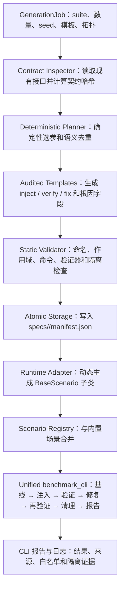

# Benchmark Generator Agent 设计与证据报告

## 1. 报告目的

本文说明 `benchmarks/generator/` 中 Benchmark Generator Agent 的设计思路、
工作流程、安全边界与测试能力，并依据当前代码、回归测试和已有 CLI 报告说明：

> 该智能体可以生成满足现有 `BaseScenario` 接口、具备健康验证、故障注入、
> 独立恢复验证和标准清理能力的 benchmark 场景。

本文是设计与证据审计，不是一次新的执行记录。编写本文时没有运行生成器、
没有生成新 suite、没有启动 Docker，也没有运行 benchmark 场景。

## 2. 设计目标与非目标

### 2.1 设计目标

1. 复用已有 benchmark 接口，而不是建立第二套执行框架。
2. 从少量经过审计的故障模板确定性扩展出大规模场景集。
3. 每个生成场景都具有完整的测试生命周期：健康基线、注入、故障确认、修复和独立验证。
4. 在写入和加载前执行严格校验，使不安全或不兼容的场景失败关闭。
5. 保留 suite、随机种子、语义指纹和接口契约哈希，使结果可追溯、可重现。
6. 通过拓扑分组和批次执行支持大规模 suite，同时保留统一 CLI 的日志、报告和隔离语义。

### 2.2 非目标

- 不允许模型自由生成任意宿主机 shell 命令。
- 不绕过 `benchmarks/benchmark_cli.py` 自建评分或报告系统。
- 不自动把新生成场景加入主榜；场景在真实验证前必须处于隔离状态。
- 不把标准 `get_fix_cmd()` 当作 AI 自主修复成绩。
- 不修改 `examples/`、`seedemu/` 或 benchmark 目录以外的源码。

## 3. 总体架构



设计的核心是“声明式规格 + 受审计模板 + 现有运行时适配器”。生成器只决定合法参数组合，
实际生命周期仍由现有 `BaseScenario` 和统一 CLI 执行。

## 4. 核心模块职责

| 模块 | 主要职责 | 关键设计 |
|---|---|---|
| `generator/models.py` | 定义生成任务、场景规格和 suite manifest | 冻结 dataclass、严格字段、schema/version、SHA-256 语义指纹 |
| `generator/contracts.py` | 审计现有 benchmark 接口 | 检查基类方法、CLI 参数、AI 响应字段等，并生成契约哈希 |
| `generator/templates.py` | 定义可选择的故障族 | 仅模板代码可以渲染注入、验证、清理命令与根因字段 |
| `generator/planner.py` | 批量规划场景 | master seed 确定性展开、跨 suite 指纹去重、最多 10,000 个场景 |
| `generator/validator.py` | 静态安全与兼容性门禁 | 校验命名、拓扑、模板、修复范围、禁止命令、验证器和指纹 |
| `generator/storage.py` | 持久化 suite | 仅写 `benchmarks/specs/`，临时文件 + `fsync` + `os.replace` 原子提交 |
| `generator/runtime.py` | 接入已有场景接口 | 延迟创建 `BaseScenario` 子类并实现四个必需方法 |
| `generator/agent.py` | 编排与 CLI | inventory、preview、generate、validate、batches、run-lifecycle |

集成点包括：

- `benchmarks/scenarios/__init__.py`：加载启用的 manifest，与内置场景合并并拒绝重名。
- `benchmarks/scenarios/base.py`：把 suite、指纹和契约哈希加入运行结果。
- `benchmarks/benchmark_cli.py`：执行统一生命周期、同拓扑复用、重试、日志和报告。
- `benchmarks/agents/observations.py`：为随机复杂拓扑增加只读 `iptables -S FORWARD` 可观测性。

## 5. 场景生成工作流程

### 阶段 1：契约盘点

`BenchmarkGeneratorAgent.inspect()` 调用 `inspect_contracts()`，检查当前 benchmark 的
基类方法、场景注册、CLI 参数、Manager、AI Agent 与观测接口。结果被哈希为
`contract_sha256` 并写入 manifest。

加载 suite 时会重新计算当前哈希；若接口发生漂移，`load_generated_scenarios()`
拒绝加载旧 suite。这样不会让基于旧接口生成的场景静默进入测试。

### 阶段 2：确定性规划

`plan_suite()` 将 `master_seed` 哈希为稳定整数，确定模板轮转顺序和每个候选参数。
同一个任务输入会得到相同 manifest。每个场景的语义指纹由以下内容计算：

```text
SHA256(template_id + topology + canonical_parameters)
```

规划器读取其他 suite 的 manifest 指纹，拒绝跨 suite 的语义重复。数量范围为
1–10,000；无法产生足够唯一场景时失败，而不是用重复场景补足数量。

### 阶段 3：模板渲染

模板同时产生以下不可分割的场景信息：

- 确定性参数；
- 故障注入命令；
- 独立验证命令；
- 幂等标准恢复命令；
- 验证器类型和期望值；
- 目标容器、故障资产、错误值、期望值；
- 拓扑、故障类别和难度。

当前受审计模板：

| 模板 | 拓扑 | 测试能力 |
|---|---|---|
| `bird_wrong_asn` | `B00_mini_internet` | 修改 BIRD ASN，验证协议/配置恢复 |
| `container_stopped` | `B00_mini_internet` | 停止目标容器，验证容器恢复运行 |
| `dns_nameserver` | `B00_mini_internet` | 写入不可达 DNS，验证名称解析恢复 |
| `ipv6_connected_route` | `B00_mini_internet` | 移除 IPv6 地址/直连路由，验证网络状态恢复 |
| `random_complex_transit_acl` | `RANDOM_COMPLEX_INTERNET` | 注入 FORWARD ACL，验证跨域连通性恢复 |

前四个是默认模板。随机复杂拓扑模板必须显式选择，不会意外进入普通生成任务。

### 阶段 4：静态门禁

`validate_scenario_spec()` 在场景写入或加载前检查：

1. 名称必须位于 `gen_` 命名空间并以稳定编号 `_01` 结尾。
2. 模板声明的拓扑和故障类别必须与规格一致。
3. 所有生成场景默认 `main_score_eligible=False`，并携带隔离原因。
4. 根因字段必须完整，诊断目标必须等于允许修改的容器范围。
5. 注入、验证和清理命令必须是非空单行命令并包含明确 Docker 目标。
6. 注入和清理命令不能越出 `repair_containers`。
7. 禁止 `docker rm`、`docker kill`、Compose、`sudo`、Docker socket、`curl`、`wget`
   和 `--privileged` 等高风险原语。
8. 重新计算语义指纹并与 manifest 比对，防止规格被修改后继续冒用旧指纹。
9. 空验证输出绝不能判定为健康。

### 阶段 5：原子写入

只有通过完整校验的 suite 才能写入：

```text
benchmarks/specs/<suite_id>/manifest.json
```

`suite_manifest_path()` 阻止路径逃逸；`write_manifest()` 默认拒绝覆盖已有 suite，
只有显式 `--force` 才允许替换。文件通过同目录临时文件、`fsync` 和原子
`os.replace` 提交，避免中断时留下半份 manifest。

### 阶段 6：运行时适配

`scenario_class_from_spec()` 将声明式规格动态编译成 `BaseScenario` 子类，提供现有规范
要求的四个核心接口：

```python
get_inject_cmd()
get_verify_cmd()
get_fix_cmd()
check_verified(output)
```

动态类同时携带 `fault_type`、`repair_containers`、结构化根因、收敛超时、suite ID、
语义指纹和契约哈希。对统一 CLI 而言，它与手写场景使用同一执行协议。

### 阶段 7：批量执行规划

`build_batches()` 先按拓扑分组，再按 1–500 个场景切分批次。`run-lifecycle` 逐批调用
现有 `benchmark_cli.py --validate-only`，每批生成独立报告。它支持：

- `--dry-run`：只展示批次；
- `--start-batch`：从指定批次恢复；
- `--reuse-running`：同拓扑批次复用已健康运行环境；
- 任一批次失败即停止后续批次。

该设计避免大规模 suite 为每个场景重复完整拓扑构建，同时不绕过 CLI 的清理和审计。

## 6. 为什么生成场景具有测试功能

一个“带测试功能”的 benchmark 场景不能只有故障命令。它必须能区分以下状态：

| 状态 | 执行内容 | 通过条件 |
|---|---|---|
| 健康基线 | 运行 `get_verify_cmd()` | `check_verified()` 返回真 |
| 故障注入 | 运行 `get_inject_cmd()` | 验证器由健康变为不健康 |
| 标准恢复 | 运行 `get_fix_cmd()` | 同一独立验证器重新返回真 |
| AI 修复 | 执行通过白名单的 `repair_commands` | 至少一条实际执行，且独立验证器返回真 |
| 场景结束 | 标准清理并重建拓扑 | 清理成功、隔离成功、拓扑未污染 |

生成器对上述能力的实现证据如下：

1. `generator/templates.py` 为每个模板同时渲染 inject、verify、fix 和 verifier，避免出现
   “能破坏但不能验证”或“能注入但不能恢复”的半成品。
2. `generator/runtime.py` 将这些字段映射到 `BaseScenario` 的正式接口，而不是测试替身。
3. `generator/validator.py` 明确拒绝空命令、空输出健康、越权容器和危险命令。
4. `BaseScenario` 与 `benchmark_cli.py` 负责基线、注入确认、修复验证、标准清理、
   拓扑重建和报告，因此生成场景继承已有的测试与隔离机制。
5. AI 的修复命令与标准 fix 分离；失败后的清理不会被计算为 Agent 修复成功。

特别地，随机 ACL 验证器使用边界安全的 `0% packet loss` 匹配逻辑，测试已证明
`100% packet loss` 不会因为包含子串 `0% packet loss` 而被误判为健康。

## 7. 代码级证明

`benchmarks/tests/test_benchmark_generator.py` 提供以下直接断言：

- 相同 seed 的 100 场景规划结果完全一致；
- 100 个场景名称和语义指纹均唯一；
- 默认任务覆盖四种 B00 模板；
- 100 个场景按批次完整分组，没有遗漏且不超过批次上限；
- 动态场景的 inject、verify、fix 与模板渲染结果逐项一致；
- 正确验证输出被接受，空输出被拒绝；
- 结构化类别、目标、资产、错误值和期望值可以得到完整根因评分；
- 错误指纹和逃出 `gen_` 命名空间的名称被拒绝；
- manifest 写入位置正确，重复写入必须显式 `force`；
- 超过 10,000 个场景的任务被拒绝；
- 瞬时基础设施错误最多重试三次，不会无限循环；
- 随机复杂 ACL 场景限定修复容器，并能正确区分 0% 与 100% 丢包。

其他回归测试覆盖盲测信息隔离、AI 命令安全、观测 schema、修复授权、shell 隔离、
报告审计和场景契约。此前的完整静态回归结果为：全部 benchmark Python 编译通过，
8 个测试文件分别独立执行通过，统一 CLI 可注册 46 个场景。

## 8. 已有运行报告证据

以下是已有统一 CLI 报告中的历史证据；本次撰写报告没有重新执行这些测试。

### 8.1 B00 无 AI 生命周期

报告：

```text
benchmarks/reports/GENERATOR_PILOT_LIFECYCLE_REUSE_20260809.md
```

结果：共测试 4 个生成场景，标准修复后的独立验证通过 4/4。四个场景分别覆盖容器停止、
DNS、IPv6 直连路由和 BIRD ASN 模板。这证明生成类可以通过统一 CLI 完成真实注入、
故障确认、恢复和复验，而不只是生成合法 JSON。

### 8.2 生成器批次执行

报告：

```text
benchmarks/reports/GENERATOR_B00_GENERATOR_PILOT_LIFECYCLE_BATCH_0019.md
```

结果：报告记录 `生成 Suite: b00_generator_pilot`，测试 1 个场景，修复验证通过 1/1。
这证明 `run-lifecycle` 的批次最终进入统一 CLI，并产生标准报告。

### 8.3 正式盲测链路与隔离

报告：

```text
benchmarks/reports/GENERATOR_PILOT_AI_BLIND_20260809.md
```

该次模型连续返回不完整或不符合 schema 的 JSON，因此没有提交可执行修复，Agent 修复成绩为
0/1。这不是成功修复证据，但报告证明了失败处理没有被标准 fix 掩盖：

- Agent 提交修复：0/1；
- Agent 修复验证：0/1；
- 场景后拓扑重建成功：1/1；
- 仍处于污染状态：0；
- 报告记录了 suite、语义指纹和契约哈希。

因此系统能够区分“模型输出失败”和“benchmark 基础设施/清理失败”，并在 AI 失败后保持隔离。

## 9. 当前 suite 与规模能力

现有 manifest：

```text
benchmarks/specs/b00_generator_pilot/manifest.json
benchmarks/specs/random_complex_generator_pilot/manifest.json
```

- B00 pilot：20 个场景，覆盖四种默认模板。
- Random Complex pilot：5 个 100+ 容器拓扑 ACL 场景。
- 两个 suite 均默认不参与主榜，需完成真实验证后另行晋级。
- 规划器的代码级上限为每次 10,000 个唯一场景。

100+ 容器 suite 已通过生成、静态校验、动态类适配和 CLI 注册。2026-08-11 的构建
验证进一步完成了 106/106 个镜像：CLI 现在只解析一次 Compose JSON，然后对每个 build
context 直接执行串行 `docker build`；若检测到缺失 parent snapshot 或 closed-pipe，只对
故障服务执行 `--no-cache` 重建。本次验证没有再出现 snapshot 错误。

该验证只证明镜像构建层已经恢复并具备可靠的串行路径；它没有启动 100+ 容器，也没有执行
健康基线、ACL 注入、标准恢复和场景后隔离。因此 Random Complex 的完整真实生命周期仍待
验证，不能解释为场景已经现场通过。

## 10. 安全与可信性设计

### 10.1 最小权限

每个规格显式声明 `repair_containers`。静态校验要求诊断目标与修改范围一致，且注入、
标准恢复命令不能引用范围外容器。AI 修复仍需经过 `BaseScenario` 的运行时白名单。

### 10.2 失败关闭

以下情况均拒绝加载或执行：

- 契约哈希漂移；
- manifest schema/version 不受支持；
- 名称或指纹重复；
- 指纹与内容不一致；
- 未知模板或参数；
- 主榜资格未隔离；
- 命令目标不明确、越权或包含禁止原语；
- 空输出可被验证器误判为健康。

### 10.3 可审计性

生成场景的运行结果携带 suite ID、场景指纹和契约哈希。统一 CLI 继续记录 prompt 模式、
问询上限、诊断命令、修复授权、实际执行、独立验证、标准清理、拓扑重建和污染状态。

### 10.4 可重复性

master seed、模板 ID、拓扑和参数决定场景内容；指纹与场景 seed 均来自稳定 SHA-256，
不依赖 Python 进程随机哈希。manifest 是复现实验的固定输入。

## 11. 建议的正式验收流程

以下为设计规定的后续验收顺序，不代表本文编写时执行了这些命令：

1. `inventory`：确认接口契约和模板清单。
2. `preview`：审查计划结果，不写文件。
3. `generate`：原子写入隔离 suite。
4. `validate`、Python 编译和 `benchmark_cli.py --list`：完成静态验收。
5. `run-lifecycle --dry-run`：审查拓扑分组、批次大小和恢复起点。
6. `--validate-only`：先验证健康 → 故障 → 标准恢复的无 AI 生命周期。
7. 重复无 AI 验证：确认幂等和无污染。
8. 默认 `--blind --repair-eval --max-turns 20`：进行正式 MIMO 自主修复评估。
9. 检查 CLI 报告、控制台日志、标准清理、拓扑重建和最终健康状态。
10. 只有通过真实生命周期和盲测审计后，才单独评审是否解除主榜隔离。

## 12. 结论

代码结构、回归断言和已有 B00 CLI 报告共同支持以下结论：

1. Generator Agent 生成的不是单纯数据样本，而是能够适配为正式 `BaseScenario` 的完整场景。
2. 每个场景同时具备故障注入、独立验证、标准恢复、根因字段和最小修复作用域。
3. 场景通过现有统一 CLI 完成测试、评分、清理、隔离和报告，不存在旁路执行框架。
4. B00 四种模板已有真实生命周期 4/4 通过的历史报告，批次入口也有 1/1 报告证据。
5. 大规模规划、确定性、唯一性、原子写入和安全边界已有代码级回归证明。
6. 100+ 容器随机复杂场景目前只有静态与注册证明，真实生命周期仍受 VM Docker
   parent snapshot 故障阻塞，不能声称已经现场通过。

综上，该智能体已经具备构建“带测试功能的 benchmark 场景”的完整设计与已验证实现；
其可信性来自受审计模板、严格门禁、现有 `BaseScenario` 生命周期和统一 CLI 证据链，
而不是依赖生成模型自行声明成功。
