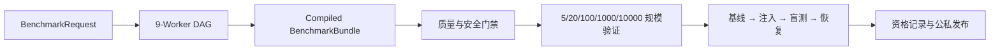

# Benchmark Generator 组会展示使用指南

本文面向现场展示者。它给出可以直接复制执行的命令、自动核验脚本，以及已经在
`zvanadium` VM 上得到的真实结果。展示重点不是“生成了若干 JSON”，而是证明同一份
声明式请求能够经过九类 Worker，形成带故障、测试、盲测策略、评分和发布边界的
benchmark，并完成无 AI 的真实 Docker 生命周期验证。

## 1. 一句话介绍

输入一个不含可执行代码的 `BenchmarkRequest v1`，生成器会确定性地完成：



九类 Worker 分别负责 topology、software、service、workload、fault、test、oracle、
scoring 和 safety review。它们通过带指纹的产物通信，不共享任意 shell 权限。

## 2. 展示前准备

登录 VM 并进入项目：

```bash
ssh -p 2222 zvanadium@192.168.56.101
cd /home/zvanadium/seed-emulator/benchmarks
```

确认版本和依赖：

```bash
git branch --show-current
git log -1 --oneline
python3 --version
docker version --format '{{.Server.Version}}'
python3 -m generator.bundle.cli --help
```

本指南验证时的代码基线是分支 `feature/benchmark-generator-agent`。展示脚本只在
`benchmarks/reports/` 下创建新结果；`plan` 和 `evidence` 模式不改变 Docker 状态，
`real` 模式只启动指定的应用拓扑，并在 `finally` 中执行 Compose 清理。
在当前 Snap Docker 环境中，脚本会让 Compose 继续使用 `/snap/bin/docker`，而生命周期内部
探针直接使用 `/snap/docker/current/bin/docker`，避免 Snap 包装器偶发的 transient-scope
启动失败。

## 3. 推荐的 8 分钟展示流程

### 3.1 第 1 分钟：展示可扩展清单

```bash
python3 -m generator.bundle.cli templates \
  | jq -r '.[] | [.template_id, (.packages | join(","))] | @tsv'

python3 -m generator.bundle.cli plugins \
  | jq -r '.[] | [.plugin_id, .kind, .version] | @tsv'
```

这里应指出：模板描述“软件如何安装、启动、产生工作负载和接受健康探针”，FaultDriver
描述“故障如何编译、注入、恢复和采集状态”。增加软件或故障不需要修改生成器主流程。

### 3.2 第 2 分钟：展示声明式请求

```bash
jq . generator/bundle/examples/production_application_request.json
```

关键字段：

| 字段 | 本例取值 | 含义 |
|---|---:|---|
| `applications` | nginx、bind9、postgresql | 需要部署和测试的应用模板 |
| `fault_count` | 3 | 自动选择三个有意义的故障 |
| `difficulty` | hard | 质量门禁要求的难度区间 |
| `scale` | 5 | 请求的实际场景规模 |
| `execute_lifecycle` | false | 快速展示不启动容器 |
| `publish` | false | 快速展示不产生正式发行版 |
| `seed` | 固定字符串 | 保证组合和指纹可复现 |

`BenchmarkRequest` 会拒绝未知字段、路径穿越、重复应用、非法规模及超出应用数的故障数。

### 3.3 第 3–4 分钟：现场快速生成

推荐使用自动核验脚本：

```bash
python3 tests/run_group_meeting_generator_demo.py --mode plan
```

它实际调用的生成器入口等价于：

```bash
python3 -m generator.bundle.cli generate \
  --request generator/bundle/examples/production_application_request.json \
  --workspace reports/group_meeting_demo/<UTC时间>/plan_run
```

脚本不仅运行生成器，还会断言：九个 Worker 全部完成、所有质量检查为真、五档规模检查
通过，并打印故障目标、场景签名和 bundle 指纹。任何断言失败都会以非零状态退出。

2026-08-15 组会准备时的真实快速运行结果：

```text
coordinator_result=complete
worker_count=9
quality_passed=true
scale_passed=true
qualification_status=not_requested
elapsed_seconds=0.06
max_rss_kb=25568
bundle_fingerprint=8d10336a5b891e8dcd379d2c8f8b37ec0c9e9261e93ba5edf56997af0a5eccbf
```

本次自动选择的组合是：

| 应用/目标 | FaultDriver | 预期破坏 | 必须保持 |
|---|---|---|---|
| BIND9 / `as64512h-host1-10.0.0.4` | `network.netem`，100% loss | DNS 可用性 | observer 可用性 |
| nginx / `as64512h-host0-10.0.0.3` | `container.stopped` | HTTP 可用性 | observer 可用性 |
| PostgreSQL / `as64512h-host2-10.0.0.5` | `container.stopped` | DB 可用性 | observer 可用性 |

质量结果为 `hard`、难度分数 `0.6633`；8 项门禁全部通过，包括注入可观测、恢复可验证、
根因期望唯一、保护目标可观测和公私数据隔离。这里的 5/20/100/1000/10000 均是
`plan_only_no_container_launch`，不能将它表述为 10,000 个容器已经部署。

### 3.4 第 5–6 分钟：核验已经保存的真实 Docker 证据

这条命令不会启动容器，只校验已提交的真实证据、回执 SHA-256 和发布权限：

```bash
python3 tests/run_group_meeting_generator_demo.py --mode evidence
```

展示时重点解释以下结果：

```text
qualification_status=qualified
qualification_level=formal
receipt_count=2
phases=active,baseline,recovery
blind_mode=true
ai_invoked=false
topology_tainted=false
release_version=1.0.0
public_mode=0o644
private_mode=0o600
```

真实证据位于：

```text
reports/PRODUCTION_APPLICATION_E2E_V2/summary.json
reports/PRODUCTION_APPLICATION_E2E_V2/lifecycle_round_01.json
reports/PRODUCTION_APPLICATION_E2E_V2/lifecycle_round_02.json
reports/PRODUCTION_APPLICATION_E2E_V2/qualification.json
reports/releases_public/production_application_pilot-1.0.0/
reports/releases_private/production_application_pilot-1.0.0/
```

已提交正式结果：

| 证据 | 实际值 |
|---|---|
| Bundle 指纹 | `40dcf703f31e94d4df95736a2dbb0f356f5b4be6da9554488218ab236d583d44` |
| 资格 SHA-256 | `8186906d4c1ade21f220ca798db96590f8d59c6cda4b0a54032963e67b513550` |
| Public SHA-256 | `7baa2341213ef1155ffd258dbb5a2ddece8942ee1de0ec31531de7455014f84c` |
| Private SHA-256 | `cfca503790ebf0f4098396863f4ca6a233e76356e1e93186076e3ae9cd055f7e` |
| Release 指纹 | `82bbd97e337de42424fb35f11c2f70a38a74b2c15b3001a8dcf35182196d4237` |

两个回执都证明：健康基线通过；故障期 nginx、DNS、PostgreSQL 如预期失效而 observer
保持正常；恢复后三个应用再次通过独立功能探针；没有调用 AI；拓扑未污染。

### 3.5 第 7 分钟：展示九类产物和盲测边界

对刚生成的 workspace 设置变量：

```bash
DEMO_RUN=$(find reports/group_meeting_demo -type f -name summary.json \
  -path '*/plan_run/*' -printf '%h\n' | sort | tail -1)
echo "$DEMO_RUN"

jq -r '.tasks[] | [.definition.agent_role, .status,
  .definition.output_artifact_id] | @tsv' "$DEMO_RUN/coordinator.json"

jq . "$DEMO_RUN/quality.json"
jq '.payload.faults' \
  "$DEMO_RUN/artifacts/production_application_pilot_faults.json"
jq . "$DEMO_RUN/artifacts/production_application_pilot_blind_policy.json"
```

Public bundle只包含解题者需要的拓扑目标、工作负载、测试与评分边界；故障细节、oracle 和
标准恢复信息留在权限为 `0600` 的 private bundle。正式资格要求至少两个独立回执。

### 3.6 第 8 分钟：展示持续验证边界

```bash
jq '.scale_evidence' reports/PRODUCTION_CI_WEEKLY.json
```

当前证据覆盖：5 节点真实完整生命周期、100 节点真实拓扑证据、1,000/10,000 节点
规划/性能/抽样验证。这个区分应主动说明，避免把规划验证误解为全量容器运行。

## 4. 可选：现场运行完整真实生命周期

只有会议留有约 5 分钟、Docker 空闲且已编译拓扑存在时才运行：

```bash
python3 tests/run_group_meeting_generator_demo.py --mode real
```

脚本执行的真实流程是：

1. 对 `generated/declarative/multi_agent_application_pilot/output/docker-compose.yml`
   执行 `docker compose up -d`；
2. 运行开启 `execute_lifecycle` 和 `publish` 的请求；
3. 连续执行两轮 baseline → injection → active probe → recovery；
4. 校验两个回执并生成 formal qualification；
5. 分离发布 public/private bundle；
6. 无论成功失败均执行 `docker compose down --remove-orphans`。

2026-08-15 使用本指南脚本完成的实际结果：

```text
elapsed_seconds=156.55
coordinator_result=complete
worker_count=9
quality_passed=true
scale_passed=true
qualification_status=qualified
release_version=1.0.0
bundle_fingerprint=a4fae29d1a444a9ba6ecf906d202ac9c9916b07a8286f05e1d90ddeae2bc1b90
```

若只想证明真实运行而不承担现场构建时间，使用上一节的 `--mode evidence` 最稳妥。

## 5. 如何修改请求生成自己的场景

复制 plan-only 请求，并确保使用新的 `request_id` 与 seed：

```bash
cp generator/bundle/examples/production_application_request.json \
  /tmp/my_benchmark_request.json
```

示例请求：

```json
{
  "schema_version": 1,
  "request_id": "group_demo_web_dns_db",
  "objective": "Generate a blind diagnosis and repair benchmark",
  "topology_id": "multi_agent_application_pilot",
  "applications": ["nginx", "bind9", "postgresql"],
  "seed": "group-demo-v1",
  "difficulty": "hard",
  "scale": 5,
  "fault_count": 3,
  "prepare_topology": false,
  "execute_lifecycle": false,
  "qualification_runs": 2,
  "publish": false,
  "resource_class": "small"
}
```

运行：

```bash
python3 -m generator.bundle.cli generate \
  --request /tmp/my_benchmark_request.json \
  --workspace reports/group_demo_web_dns_db
```

若要增加新应用，先通过 `--template-file` 注册 `ApplicationTemplate v1`；若要增加新的故障
语义，实现 `FaultDriver` 并注册插件。不要把任意安装或注入 shell 直接塞进请求文件。

## 6. 结果目录说明

```text
<workspace>/
├── request.json              # 规范化请求
├── tasks.json                # 九 Worker DAG
├── coordinator.json          # 尝试次数、状态和产物指纹
├── artifacts/                # 九类 Agent 产物
├── bundle_spec.json
├── compiled_bundle.json      # 编译后的完整 bundle
├── quality.json              # 难度、唯一性和安全门禁
├── scale_validation.json     # 五档规模验证
├── ci_matrix.json
├── lifecycle_round_01.json   # real 模式才有
├── lifecycle_round_02.json   # real 模式才有
├── qualification.json        # real 模式才有
└── summary.json              # 展示入口
```

每个关键对象均带 SHA-256 指纹；相同输入可核对 request、contract、scenario、quality、bundle
和 release 指纹。缓存按内容寻址，质量索引用场景签名拦截跨 benchmark 重复。

## 7. 常见问题与现场处理

**提示 workspace 已存在**：展示脚本故意拒绝覆盖证据。不要删除旧结果，省略 `--workspace`
即可自动创建新的 UTC 时间目录。

**Docker daemon 不可用**：改用 `--mode plan` 和 `--mode evidence`；两者足以展示生成与已验证
的真实运行结果。

**出现 `transient scope not created in 10s`**：这是 Snap Docker 包装器错误，不代表功能探针
失败。演示脚本已经为生命周期命令选择 Snap 包内的直接二进制；请使用脚本，不要用多层
PowerShell/SSH 命令替代它。

**真实运行被中断**：脚本会自动 Compose down。仍可显式执行精确清理：

```bash
docker compose \
  -f generated/declarative/multi_agent_application_pilot/output/docker-compose.yml \
  down --remove-orphans
```

**如何证明没有答案泄漏**：展示 blind-policy 产物、公私 bundle 的不同 SHA-256 与不同路径，
并指出生命周期回执中的 `blind_mode=true` 和 `ai_invoked=false`。

**生成器是否真实部署了 10,000 个容器**：没有。当前 10,000 节点是确定性规划、性能和抽样
验证；真实完整生命周期证据为 5 节点，真实拓扑级证据为 100 节点。

## 8. 展示结束后的确认

```bash
docker ps --format '{{.Names}}' \
  | grep -E 'multi_agent_application_pilot|as64512' || true

git status --short -- .
```

正常情况下没有演示拓扑容器。演示输出位于被 Git 忽略的 `reports/group_meeting_demo/`，不会
污染代码提交；已提交的正式 E2E 证据保持不变。
