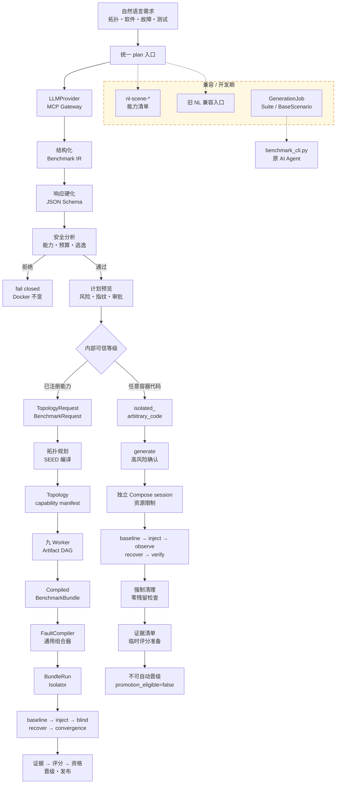
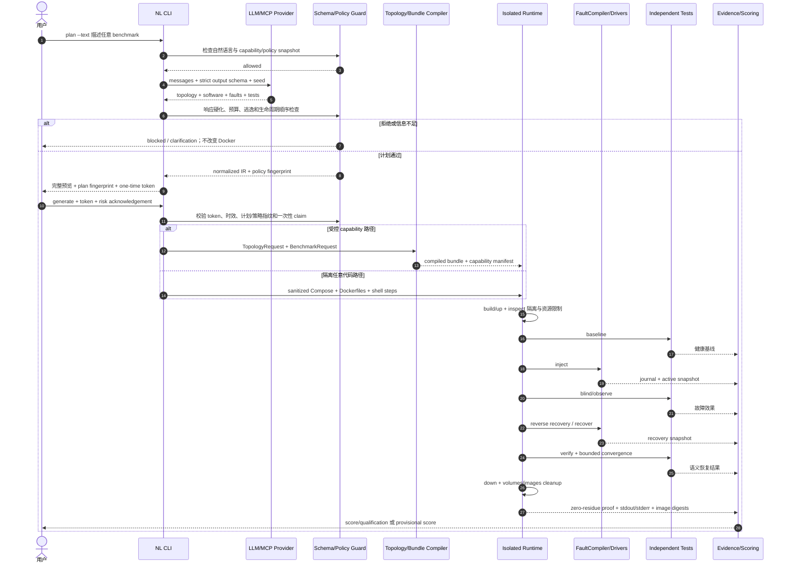

<!-- README_SYNC_REQUIRED -->

# Benchmark Generator

`generator/` 是从声明式或自然语言需求生成、部署、注入、验证和准备评分 benchmark 的核心实现。
当前推荐用户入口是统一自然语言工作流；受控 Bundle、声明式 Scene、Fault、Topology 和旧
Suite 路径继续作为内部层或兼容入口存在。

> [!IMPORTANT]
> **README_SYNC_REQUIRED（强制联级同步）**：修改 `generator/` 任意 `.py` 或声明式
> `.json` 时，必须更新同目录 `README.md`，并逐级更新每一份祖先 README 直到本文件。
> 若接口影响横向消费者，还要更新对应层 README。提交前运行
> `python3 tests/test_generator_readmes.py`；区间审计使用
> `GENERATOR_README_DIFF_BASE=<commit>`。禁止只更新叶子 README。

## 当前能力

- 统一 NL：一次描述生成拓扑、软件、故障、恢复和测试。
- Topology：AS/主机/router、tree/ring/mesh/random/explicit、ASN 与 IPv4/IPv6 分配、预算、连通性和 SEED/Compose 编译。
- Software：受控 `SoftwareSpec`/模板，以及隔离路径中的任意 Dockerfile 和场景文件。
- Fault：`FaultSpec v1`、Driver 插件、目标/影响/冲突分析、资源锁、依赖排序、指纹、journal、恢复和覆盖率选择。
- Bundle：九 Worker DAG、artifact 编译、安全审查、blind/no-AI 生命周期、评分、qualification、pilot、调度和发布边界。
- Isolation：独立构建上下文、Compose project、session label、service 运行时重绑定、子网重绑定和零残留清理。
- Scale：100 节点真实策略，以及 1,000/10,000 节点规划、性能与抽样验证；不能把规划结果描述为真实全量启动。

## 推荐工作流

### Generator 流程图



图中“响应硬化”包括单 JSON、大小、深度、重复键和 Schema 检查；“安全分析”包括
capability、资源预算、Compose、Dockerfile、容器内 Shell 和宿主逃逸检查。框内采用短标签，
完整接口名称和边界以本 README 后续章节为准。

### Generator 执行时序图



```text
用户自然语言
  → generator.nl.cli plan
  → LLM/MCP 严格结构化输出
  → Schema、响应硬化、Compose/Dockerfile/Shell、预算与逃逸检查
  → benchmark_plan.json + 完整预览 + 一次性审批
  → generator.nl.cli generate
  → isolated_arbitrary_code session
  → baseline → inject → observe → recover → verify
  → 强制清理、证据清单、评分准备
```

```bash
cd /home/zvanadium/seed-emulator/benchmarks
python3 -m generator.nl.cli plan --text "描述任意 benchmark"
python3 -m generator.nl.cli generate \
  --plan reports/nl_sessions/<session>/benchmark_plan.json \
  --approval-token '<one-time-token>' \
  --acknowledge-arbitrary-code
```

任意代码路径允许私有 Compose、Dockerfile 和**场景容器内** Shell，但禁止宿主挂载、Docker
Socket、privileged、host network/PID/IPC、设备、宿主端口和外部网络。成功后可生成
`scoring_preparation.json`，但固定 `promotion_eligible=false`，直到行为被提炼为受控 capability/driver。

## 受控生产 Bundle 路径

```text
BenchmarkRequest v1
  → Topology capability manifest
  → 九 Worker artifact DAG
  → Bundle compiler + blind/security review
  → FaultCompiler + 通用组合器
  → BundleRunIsolator
  → baseline → inject → blind probes → reverse recovery → convergence
  → evidence → score → qualification → optional promotion/publish
```

该路径最终生命周期强制 `blind_mode=true`、`ai_invoked=false`。LLM 只翻译需求，不参与执行期
自我评分。详见 `bundle/README.md`。

## 声明式 Scene 与兼容入口

- `nl-scene-plan/generate`：安全声明式拓扑桥接，交付 capability manifest，不执行 Docker。
- `nl-plan/generate`：旧的已知能力 Intent → BenchmarkRequest → Bundle 工作流。
- `nl-unsafe-plan/generate`：旧的隔离任意代码入口；行为由推荐 `plan/generate` 包装并保留兼容。
- `GenerationJob → SuiteManifest → BaseScenario`：开发期兼容工作流，供原
  `benchmark_cli.py` 和原 AI Agent 使用，后续计划移除。

## 目录职责

| 路径 | 当前职责 |
|---|---|
| `nl/` | Provider、MCP 接入、Intent/Scene/任意 IR、响应硬化、审批、统一入口与隔离执行 |
| `mcp/` | 多厂商单工具 MCP Contract、profile、client、gateway、fallback 和审计元数据 |
| `topology/` | TopologyRequest、规划、注册、编译、能力绑定、预检、inventory 和测试 |
| `faults/` | FaultSpec、Driver、编译、执行、恢复、journal、软件适配、覆盖率与规模验证 |
| `bundle/` | 九 Worker、artifact、Bundle 编译、隔离生命周期、质量、评分、资格、调度与发布 |
| `models.py` | 兼容 Suite/GenerationJob 严格模型 |
| `planner.py` / `templates.py` | 兼容 Suite 批量规划与模板 |
| `runtime.py` / `agent.py` | 动态 BaseScenario 和批量 benchmark CLI 执行适配 |
| `software.py` | 根层 SoftwareSpec 与软件能力清单 |
| `promotion.py` | 兼容场景晋级与 blind/no-AI 回执验证 |
| `contracts.py` | Generator 合同文件集合和指纹 |
| `storage.py` / `validator.py` | 原子存储、清单与请求验证 |

## 主要 CLI

```bash
python3 -m generator.nl.cli --help
python3 -m generator.mcp.gateway --help
python3 -m generator.topology.cli --help
python3 -m generator.faults.cli --help
python3 -m generator.bundle.cli --help
```

当前 NL 子命令：

```text
plan, generate,
nl-plan, nl-generate,
nl-scene-plan, nl-scene-generate,
nl-unsafe-plan, nl-unsafe-generate,
catalog
```

## 产物与证据

- `topology_specs/<id>/`：声明请求与确定性计划。
- `generated/declarative/<id>/`：Compose、拓扑 manifest 和 capability manifest。
- `reports/nl_sessions/<session>/`：Prompt、Provider、能力/策略快照、IR、审批和执行证据。
- Bundle workspace：artifacts、compiled bundle、fault plans/journals、lifecycle receipt、quality、score、qualification 和 isolation。
- `meeting_reports/`：本地组会证据归档，完全由 Git 忽略。

所有身份、计划、合同和证据使用规范化 SHA-256 指纹；审批 token 只在 plan stdout 显示一次，
仓库和报告不得保存 API Key 或有效 token。

## 全局不变量

1. LLM 输出永远是不可信数据，不能绕过 Schema、本地 capability、预算或执行策略。
2. plan-only 不改变 Docker；执行必须使用与计划指纹绑定的一次性审批。
3. 故障必须可观测、可恢复，并由独立 probe 验证；查询命令不能冒充修复。
4. 容器目标通过 service label 重绑定，不依赖 Compose 生成名称或顺序。
5. 清理失败、拓扑污染、非 blind 或执行期 AI 调用都会阻止正式资格。
6. arbitrary-code 可以执行和准备评分，但不能自动 qualification、promotion 或 publish。
7. 运行证据与规划/抽样证据必须明确区分。

## 验证

```bash
python3 -m compileall -q generator
python3 tests/test_generator_readmes.py
python3 tests/test_unified_natural_language_generator.py
python3 tests/test_unsafe_natural_language_generator.py
python3 tests/test_natural_language_scene_bridge.py
python3 tests/test_mcp_provider.py
python3 tests/test_topology_generator.py
python3 tests/test_fault_injection_platform.py
python3 tests/test_bundle_fault_profiles.py
python3 tests/test_bundle_isolation.py
python3 tests/test_multi_agent_bundle.py
git diff --check -- benchmarks/generator benchmarks/tests
```
