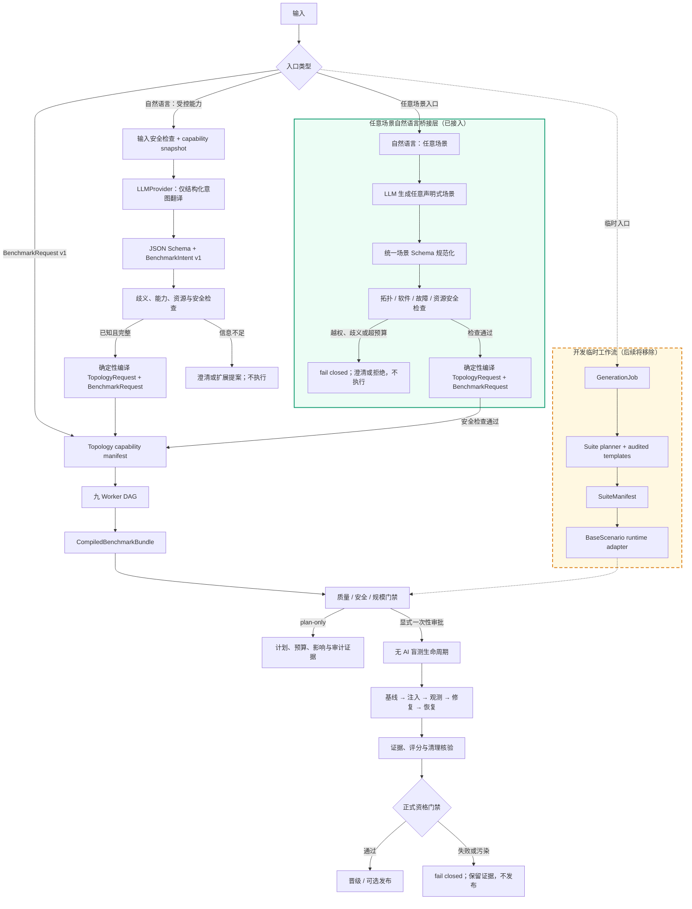

<!-- README_SYNC_REQUIRED -->

# Benchmark Generator

本目录实现 SEED Emulator benchmark 的确定性生成、声明式拓扑、故障平台、多 Agent
Bundle、质量门禁、晋级和生产调度。所有入口都必须保持可审计、可复现、可恢复，并且只在
`benchmarks/` 范围内产生受控状态。

本子树的 Agent 修改约束定义在 `AGENTS.md`；该文件对本目录及所有子目录生效。

> **强制同步规则（README_SYNC_REQUIRED）**：任何 Agent 修改本目录直属的 Python
> 代码时，必须在同一个变更中更新本 README。修改子目录代码时必须更新该子目录的
> README；若公共接口、CLI、数据流或跨层约束发生变化，还必须同步更新本 README。
> 完成前运行 `python3 tests/test_generator_readmes.py`。

## Generator 工作流程图



普通路径中 LLM 只负责把语言转换成受约束意图，确定性编译器和九 Worker 才生成场景；真实验证阶段保持
`ai_invoked=false`。任意场景自然语言桥接层会生成完整声明式场景，经过统一 Schema、拓扑、软件、故障、
资源和安全检查后，确定性解析应用放置（业务服务与受保护观测器互斥），再编译为
`TopologyRequest + BenchmarkRequest`；显式审批后注册、编译并验证真实 `Topology capability manifest`。
该 manifest 与 `BenchmarkRequest` 是桥接层的交付边界，后续九 Worker 作为独立生产阶段消费。当前
`nl-unsafe-*` Compose
隔离执行仍属于兼容实验模式，继续标记 `unsafe_generated=true`，不能晋级或发布；它不属于这条安全接入。
虚线框中的 `GenerationJob` 是开发期兼容工作流，仅用于现有 Suite/BaseScenario 迁移，后续将移除，
不属于 Generator 的长期生产架构。

## 目录结构

| 路径 | 职责 |
|---|---|
| `bundle/` | 九类 Worker、BenchmarkBundle 编译、生命周期、质量、评分、发布和调度 |
| `bundle/examples/` | 可直接运行的 `BenchmarkRequest v1` 示例 |
| `faults/` | `FaultSpec v1`、FaultDriver、编译、覆盖率、执行日志和恢复 |
| `topology/` | 声明式拓扑模型、规划、SEED 编译、能力清单和拓扑测试 |
| `topology/examples/` | 声明式拓扑请求示例 |
| `nl/` | 自然语言意图、LLMProvider、澄清、安全、审批和 NL CLI |

详细说明分别见各目录的 `README.md`。

## 两条生成路径

### Suite 场景生成路径

这条路径兼容现有 `BaseScenario` 和统一 benchmark CLI：

```text
GenerationJob
  → planner.py + templates.py
  → SuiteManifest
  → specs/<suite_id>/manifest.json
  → runtime.py 动态生成 BaseScenario 子类
  → benchmark_cli.py 执行
  → promotion.py 晋级
```

适合生成大量传统场景条目，并通过 `main_score_eligible` 与 `promotion.json` 控制是否进入
正式评分。

### 生产 Bundle 路径

这条路径用于多 Agent 协作生成完整 benchmark：

```text
BenchmarkRequest v1
  → topology capability manifest
  → 九类 Worker DAG
  → AgentArtifacts
  → CompiledBenchmarkBundle
  → 质量/安全/规模门禁
  → 无 AI 盲测生命周期
  → formal qualification
  → public/private release
```

入口为：

```bash
python3 -m generator.bundle.cli generate \
  --request generator/bundle/examples/production_application_request.json \
  --workspace reports/example_generation
```

### 自然语言入口

自然语言层只将用户需求转换为声明式对象，默认执行 plan-only；LLM 不拥有 Docker 或故障
执行权限：

```text
自然语言 → BenchmarkIntent v1 → 澄清/安全/能力检查
  → TopologyRequest + BenchmarkRequest → 九 Worker plan-only
  → 一次性审批 → 可选真实无 AI 生命周期
```

入口为：

```bash
python3 -m generator.nl.cli nl-plan \
  --text "生成一个包含 nginx 和 DNS 的 hard 场景，注入延迟和容器停止故障"
```

详见 `nl/README.md`。

NL 层内置 deterministic、通用 OpenAI-compatible 和 Xiaomi MiMo Provider；所有远程
Provider 都只负责结构化意图翻译，API Key 仅从环境变量读取，后续编译与生命周期不调用 AI。

## 根层模块

| 文件 | 作用 |
|---|---|
| `agent.py` | 大批量 suite 生成 Agent 的 CLI 与编排入口 |
| `contracts.py` | 对生成器接口文件做内容寻址，产生 contract SHA-256 |
| `models.py` | `GenerationJob`、`ScenarioSpec`、`SuiteManifest` 等严格模型 |
| `planner.py` | 根据 seed 和模板确定性选题，并跨 suite 做语义去重 |
| `templates.py` | 经审计的传统故障模板及参数/验证语义 |
| `software.py` | 通用软件安装、托管文件、能力和软件故障配置模型 |
| `validator.py` | suite 与场景的静态安全、兼容性和边界校验 |
| `storage.py` | 将 manifest 原子写入 `benchmarks/specs/` |
| `runtime.py` | 把 manifest 场景适配为现有 `BaseScenario` 运行时类 |
| `promotion.py` | 校验真实证据并生成 fail-closed 晋级记录 |

设计背景见：

- `DESIGN_REPORT.md`
- `MULTI_AGENT_BUNDLE_DESIGN.md`
- `PRODUCTION_GENERATOR_DESIGN.md`
- `GROUP_MEETING_DEMO_GUIDE.md`

## 输入与产物边界

| 类型 | 默认位置 | 是否应手工修改 |
|---|---|---|
| 拓扑请求 | `topology/examples/*.json` 或 `topology_specs/*/request.json` | 可以，需重新规划和验证 |
| 已注册拓扑计划 | `topology_specs/*/plan.json` | 不建议；应由 planner 生成 |
| 编译拓扑 | `generated/declarative/*/output/` | 不应；应重新编译 |
| Suite 清单 | `specs/*/manifest.json` | 不建议；应由 generator 生成 |
| Bundle workspace | `reports/<workspace>/` | 不应；属于执行证据 |
| 晋级记录 | `specs/*/promotion.json` | 不应；必须由 promotion 流程产生 |

## 全局不变量

- 声明文件不能携带任意宿主机 shell。
- seed、合同 SHA、拓扑和场景指纹必须能够追溯。
- 未通过安全、质量或资格门禁的场景不得进入正式发布。
- 盲测 public 数据不得包含故障注入、oracle、标准修复或 private 答案。
- 故障必须有独立 baseline、active 和 recovery 证据。
- 清理失败或拓扑污染必须 fail closed。
- 1,000/10,000 节点验证必须明确标记真实执行或 plan/sampled，不能混淆。

## 常用检查

从 `benchmarks/` 目录运行：

```bash
python3 -m compileall -q generator tests
python3 tests/test_generator_readmes.py
python3 tests/test_production_generator.py
python3 -m generator.bundle.cli --help
python3 -m generator.topology.cli --help
python3 -m generator.faults.cli --help
python3 -m generator.nl.cli --help
python3 tests/test_natural_language_generator.py
```

若在 CI 中检查某个提交区间的 README 同步情况：

```bash
GENERATOR_README_DIFF_BASE=<base-commit> \
  python3 tests/test_generator_readmes.py
```

## Isolated arbitrary scenario mode

`generator/nl/` also provides an explicitly unsafe-generated path for natural-language
requests that need arbitrary declarative Compose topology, Dockerfiles, and in-container
shell. `nl-unsafe-plan` is plan-only and displays the complete generated artifacts and
risk report. `nl-unsafe-generate` requires a separate one-time high-risk token plus
`--acknowledge-arbitrary-code`.

This mode remains bounded: private bridge networks only, generated build contexts only,
no host mounts/socket/ports/namespaces/privilege/devices, strict CPU/memory/PID/disk/
container/time budgets, session labels, runtime verification, evidence capture, and
forced label-scoped cleanup. Its artifacts always carry `unsafe_generated=true` and
are forbidden from qualification, promotion, and publication. See `nl/README.md` for
the full command and evidence contract.

## 修改检查表

1. 更新代码所在目录的 `README.md`。
2. 公共接口、CLI 或跨层流程变化时更新所有受影响的上级 README。
3. 更新对应示例、schema 和测试。
4. 运行相关单元测试、无 AI 生命周期和必要的规模验证。
5. 检查 `git diff --check -- benchmarks`，不得修改 `benchmarks/` 外文件。
