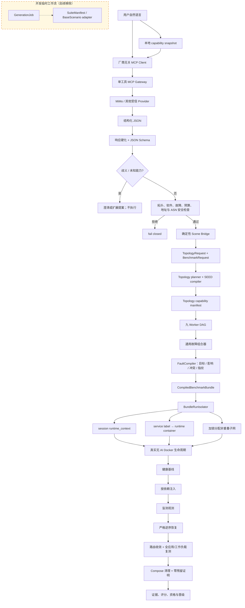
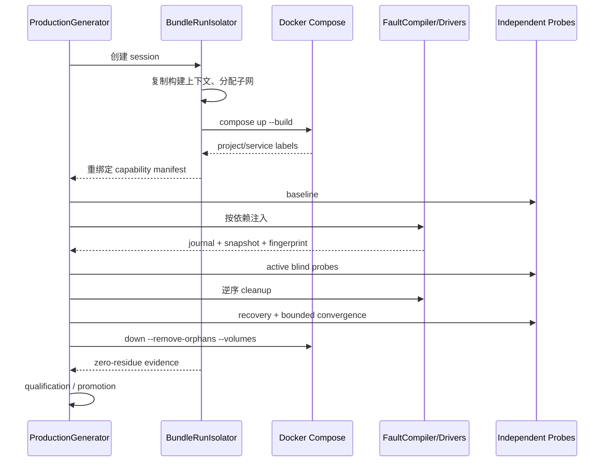

# Benchmark Generator 阶段成果与真实复现报告

报告时间：2026-08-26 02:02:40 CST

比较基线：`c62cc4944e11bf150fad2f10046c7bc8479a5f21`

功能提交：`7f2f03445c32474ce89cd4022af76abf7e33082e`

报告归档提交：当前 `HEAD`（运行 `git rev-parse HEAD` 获取最终哈希）

分支：`feature/benchmark-generator-agent`

生成器合同：`0d10f3361b6f3122896501f1f8037239b542d6c2011cb838fbc4b4931df833ea`

## 1. 汇报结论

相对于基准提交，Generator 已从“模板化场景生成”推进为以下闭环：

1. 用户可通过自然语言描述声明式任意拓扑、应用、资源和已注册故障。
2. 外部模型通过厂商无关 MCP Gateway 参与结构化翻译，不能获得 Docker 或 Shell 执行工具。
3. 外部 JSON 必须经过大小、编码、单对象、重复键、深度、JSON Schema、能力、预算、地址、ASN、应用/观测器隔离和 prompt-injection 检查。
4. 安全场景由确定性桥接器编译为 `TopologyRequest + BenchmarkRequest`，交付真实 `Topology capability manifest`。
5. Bundle 的九 Worker 只消费 capability；故障由通用组合器和 FaultCompiler 完成目标解析、影响分析、冲突检查、依赖排序与计划指纹。
6. 每次 Docker 生命周期拥有独立构建上下文、Compose project、运行时容器名和重绑定子网；容器目标通过稳定 service 标签发现。
7. 生命周期执行健康基线、注入、盲测、逆序恢复、路由收敛、应用/工作负载复测、清理和资格晋级，全程保持 `ai_invoked=false`。

本次汇报重新执行了 7 组真实 Docker 生命周期，共 14 次独立回放，全部 `qualified`；另执行了同一编译拓扑的双 Bundle 并行验证，两条均通过且最终 Docker 零残留。

## 2. 架构流程图



运行时序：



## 3. 基准提交后的全部提交与具体内容

| 提交 | 新内容 |
|---|---|
| `c64bb58f` | 在总流程图中把 `GenerationJob → SuiteManifest → BaseScenario` 标记为开发期兼容工作流，明确后续移除。 |
| `838a52f3` | 把长期目标改为“自然语言任意场景经过安全检查后进入 Topology capability manifest”，区分受控生产路径与临时路径。 |
| `bc1b5a1c` | 新增 `SceneSpec/SceneIntent` 严格模型、任意声明式拓扑 NL bridge、安全策略、确定性 TopologyRequest/BenchmarkRequest 编译与 `nl-scene-plan/nl-scene-generate`。 |
| `e43068fe` | 修复自动 scene session ID，使默认 CLI 会话满足审计身份白名单并可直接执行 plan。 |
| `40799f35` | 强化外部 Provider：限制 UTF-8/大小/深度、只接收单 JSON 对象、拒绝重复键和 tool call，执行本地 Draft 2020-12 Schema 校验，并只允许有限修复重试。 |
| `cb4b23b9` | 重复应用 placement 不再静默合并，而是进入澄清/扩展流程，保护应用与观测器隔离。 |
| `1697be7b` | 未显式声明预算时使用 `auto`，由本地确定性规划器计算资源；Provider 无权静默抬高预算。 |
| `abba8f7e` | 形成 MCP 化只读可行性报告和威胁分析。 |
| `ab87ea57` | 实现多厂商 MCP Contract、受信 profile、stdio client、单工具 Gateway、传输错误限定 fallback、审计元数据；完成真实 `mcp:mimo` 翻译。 |
| `7f2f0344` | 增加 capability-bound fault profiles、通用组合器、语义恢复/路由收敛、六类边界请求、Bundle session 隔离、service 运行时重绑定、子网重绑定和同拓扑并行资格验证。 |
| `HEAD`（本报告归档提交） | 新增按时间归档的组会报告、MiMo/MCP 原始证据、七类 Docker 生命周期、同拓扑并行证据、三份可复现 NL 拓扑规范以及矩阵复现/证据提取脚本。最终哈希以当前分支 `git rev-parse HEAD` 为准。 |

基准到功能提交共有 10 个功能提交，代码统计为 64 个文件、`6325 insertions / 143 deletions`；随后增加 1 个当前报告归档提交。完整功能文件清单见 `raw/changed_files.tsv`，提交清单见 `raw/commit_history.tsv`。

## 4. 外部 MiMo 经 MCP 翻译的真实结果

保留证据位于 `provider_evidence/demo_mimo_dns_6as_20260825/`。

- Provider：`mcp:mimo`
- MCP transport：`mcp_stdio`
- 模型：`mimo-v2.5-pro`
- 上游延迟：`8440 ms`
- Token：输入 `1871`、输出 `411`、总计 `2282`
- Schema 校验：1 次成功，`validation_failures=[]`
- 输出：6 AS、每 AS 2 主机、ring、bind9、受保护 observer、`dns.nameserver`
- 本地资源计算：20 容器、12 网络、1.2 CPU、1536 MiB
- 安全结果：`allowed=true`、`execution_authorized=false`、无 Shell/宿主/Docker 操作
- 审计指纹：`873f8d8f7722a7d675480fb2e780e5441203562cf0d9e65eb7b5fe3c6a03ab4f`

Provider 原始结构化响应片段：

```json
{
  "provider": "mcp:mimo",
  "model": "mimo-v2.5-pro",
  "validation_attempts": 1,
  "validation_failures": [],
  "output": {
    "fault_types": ["dns.nameserver"],
    "fault_count": 1,
    "topology": {
      "as_count": 6,
      "hosts_per_as": 2,
      "edge_policy": "ring",
      "budget_mode": "auto"
    }
  }
}
```

API Key 未写入仓库、日志或报告，只能通过 `MIMO_API_KEY` 环境变量提供。

## 5. 手动复现命令

以下命令均从 VM 的 `benchmarks/` 目录执行。

### 5.1 基础静态回归

```bash
cd /home/zvanadium/seed-emulator/benchmarks
python3 -m compileall -q generator tests
GENERATOR_README_DIFF_BASE=c62cc4944e11bf150fad2f10046c7bc8479a5f21 \
  python3 tests/test_generator_readmes.py
python3 tests/test_mcp_provider.py
python3 tests/test_natural_language_generator.py
python3 tests/test_natural_language_scene_bridge.py
python3 tests/test_bundle_isolation.py
python3 tests/test_bundle_fault_profiles.py
python3 tests/test_fault_injection_platform.py
python3 tests/test_topology_generator.py
python3 tests/test_multi_agent_bundle.py
python3 tests/test_production_generator.py
python3 benchmark_cli.py --list
```

真实输出摘要：

```text
compileall=passed
generator_readme_coverage=passed directories=9
generator_readme_sync=passed
MCP provider gateway tests: PASS
natural_language_generator_tests=passed
natural-language arbitrary scene bridge tests: PASS
bundle isolation tests passed
bundle fault profile tests passed
benchmark_cli_list=passed lines=72
```

完整输出：`raw/static_regression.log`。

### 5.2 默认 plan-only 自然语言场景

```bash
python3 -m generator.nl.cli nl-scene-plan \
  --provider deterministic \
  --seed meeting-demo-v1 \
  --session-id meeting_scene_plan_success_20260826 \
  --text "生成一个包含3个AS、每个AS有2台主机的环形拓扑，在一个节点部署nginx，在另一个节点部署bind9，注入dns.nameserver故障"
```

真实输出要点：

```text
status=ready
mode=plan_only_no_docker_state_change
topology_id=nlscene_7d3b8b3e4bc857ba
resource_estimate.containers=11
safety.allowed=true
execution_authorized=false
handoff_target=Topology capability manifest
```

当故障描述无法映射到已知插件时，真实输出为 `status=needs_clarification`，问题代码为 `missing_faults`，不会猜测或执行。对应原始输出分别见 `raw/nl_scene_plan_success.log` 和 `raw/nl_scene_plan.log`。报告中的一次性 token 已脱敏。

### 5.3 MiMo MCP 场景翻译

```bash
read -rsp 'MIMO API key: ' MIMO_API_KEY; echo
export MIMO_API_KEY
python3 -m generator.nl.cli nl-scene-plan \
  --provider mcp \
  --mcp-profile mimo \
  --seed demo-mimo-dns-6as-v1 \
  --session-id demo_mimo_dns_6as_manual \
  --text "生成一个包含6个AS、每个AS 2台主机的环形拓扑；在AS64512的host0部署bind9，在AS64517的host1部署受保护网络观测节点；设置一种DNS nameserver配置错误故障，故障总数为1，故障关系single，难度medium，资源预算自动计算"
unset MIMO_API_KEY
```

显式批准只使用本次输出的一次性 token：

```bash
python3 -m generator.nl.cli nl-scene-generate \
  --scene reports/nl_sessions/demo_mimo_dns_6as_manual/approved_scene.json \
  --approval-token '<本次命令返回的一次性 token>'
```

### 5.4 运行单个真实 Bundle 生命周期

以 MiMo 六 AS DNS 场景为例：

```bash
python3 -m generator.bundle.cli generate \
  --request meeting_reports/20260826_020240_CST/inputs/mimo_six_as_dns_request.json \
  --workspace meeting_reports/20260826_020240_CST/replay/mimo_six_as_dns
```

单个边界场景示例：

```bash
python3 -m generator.bundle.cli generate \
  --request generator/bundle/examples/boundary_validation/boundary_ipv6_bundle.json \
  --workspace meeting_reports/20260826_020240_CST/replay/ipv6
```

工作目录必须是尚不存在的新路径，因为证据目录禁止覆盖。

### 5.5 一键重跑七类生命周期矩阵

```bash
tests/run_meeting_lifecycle_matrix.sh \
  /home/zvanadium/seed-emulator/benchmarks/meeting_reports/<新的时间目录>
```

只复核已有证据、不启动 Docker：

```bash
tests/run_meeting_lifecycle_matrix.sh \
  /home/zvanadium/seed-emulator/benchmarks/meeting_reports/20260826_020240_CST \
  --verify-only
```

### 5.6 同拓扑双 Bundle 并行验证

```bash
tests/run_parallel_bundle_isolation_validation.sh \
  /home/zvanadium/seed-emulator/benchmarks/reports/<新的并行验证目录>
```

本次完整结果已复制到 `parallel_isolation/`。

## 6. 各方面真实 Docker 生命周期

| 方面 | 场景 / FaultDriver | 容器数 | 回放 | 结果 |
|---|---|---:|---:|---|
| NL→MCP→Topology→Bundle | MiMo 六 AS + `dns.nameserver` | 20 | 2 | qualified |
| IPv6 路由 | `network.ipv6.connected_route_removed` | 10 | 2 | qualified |
| 动态路由 | `routing.bird.ospf_wrong_area` | 10 | 2 | qualified |
| Docker 网络语义 | `docker.network.disconnected` | 10 | 2 | qualified |
| 声明式软件配置 | `software.config.replace` | 10 | 2 | qualified |
| 声明式可执行文件 | `software.executable.disabled` | 10 | 2 | qualified |
| 通用级联组合 | DNS → OSPF → software config | 10 | 2 | qualified |

所有 14 份回执均满足：

```text
passed=true
ai_invoked=false
convergence.passed=true
cleanup_failures=[]
qualification_status=qualified
isolation.cleanup_verified=true
isolation.runtime_context_removed=true
```

完整机器可读汇总见 `lifecycle_matrix_summary.json`，故障顺序、恢复顺序、期望值、错误值、测试退出码和输出摘录见 `raw/lifecycle_details.json`。

### 6.1 级联组合的真实顺序

```text
inject_order=0  dns.nameserver                 cleanup_order=2
inject_order=1  routing.bird.ospf_wrong_area   cleanup_order=1
inject_order=2  software.config.replace        cleanup_order=0
```

这证明组合器生成依赖链，执行器严格逆序恢复，而不是调用旧的专用 compound 分支。

### 6.2 同拓扑并行隔离

专用验证同时启动：

- `boundary_docker_network_bundle`
- `boundary_cascading_compound_bundle`

真实输出：

```text
compose_project=bndl-boundary-docker-network-bundle-30e41ec3fe
compose_project=bndl-boundary-cascading-compound-bundle-0b42ef4548
runtime_containers=8 / 8
qualified=true / true
cleanup_verified=true / true
zero_residue=true
```

两者容器集合不相交、重绑定子网集合不相交，并且都来自同一个 `bundle_boundary_validation` 编译拓扑。运行时通过 `com.docker.compose.service` 发现实际容器；容器内 peer hostname 使用短 service alias，避免长 project 名超过 DNS label 限制。

从两份 `isolation.json` 的 `running_at/finished_at` 计算，两个 session 的真实
Docker 运行区间重叠 `47.700138` 秒；这不是仅有进程启动时间重叠。

## 7. 安全性与可恢复性证明

- LLM/MCP 只能调用 `translate_benchmark_scene`，没有 Docker、Shell 或宿主工具。
- 未知字段、未知能力、重复 placement、预算不足、地址越界、观察器与业务重合均 fail closed。
- 外部 Provider 不能覆盖本地 capability snapshot、FaultDriver、资源预算或审批状态。
- plan-only 默认不改变 Docker，真实执行必须显式批准。
- FaultCompiler 在执行前生成目标、影响、资源锁、依赖图和计划指纹。
- 故障执行 journal 和 snapshot 支持崩溃恢复，恢复后必须通过稳定连续采样。
- session 子网在跨进程锁内分配，完整构建上下文中的 Compose/BIRD/启动脚本地址同步重写。
- 清理失败会让生产流水线失败，不能进入资格或发布。
- 真实生命周期保持 `ai_invoked=false`，证明最终验证不依赖 LLM 自我评分。

## 8. 报告目录索引

| 路径 | 内容 |
|---|---|
| `README.md` | 本次材料索引和快速入口 |
| `REPORT.md` | 本报告 |
| `raw/commit_history.tsv` | 基准之后提交历史 |
| `raw/changed_files.tsv` | 基准之后文件变化 |
| `raw/change_stat.txt` | 代码统计 |
| `raw/static_regression.log` | 静态和单元回归输出 |
| `raw/nl_scene_plan*.log` | NL 成功及澄清输出 |
| `raw/lifecycle_exit_codes.tsv` | 七类 Docker 命令退出码 |
| `raw/lifecycle_matrix_verification.log` | 汇总验证原始输出 |
| `raw/lifecycle_details.json` | 每类 fault/test 的精简证据 |
| `provider_evidence/` | MiMo MCP 请求、响应、Schema、安全和审计证据 |
| `nl_sessions/` | 本次本地 NL plan-only 会话 |
| `inputs/` | 可复现的 Bundle 请求 |
| `lifecycles/` | 七类完整 Bundle workspace |
| `parallel_isolation/` | 同拓扑双 Bundle 并行证据 |
| `lifecycle_matrix_summary.json` | 机器可读总结果 |

## 9. 已知边界

- 自然语言不能直接生成宿主 Shell、privileged、host network、Docker socket 或任意未注册 FaultDriver；这是安全边界，不是解析缺陷。
- 新软件或新故障能力仍需先增加本地 capability/profile/独立 oracle，外部模型只能提出扩展建议。
- 10,000 节点以规划、性能与抽样验证为主；本报告的 Docker 实跑规模为 10/20 容器，未把规模规划冒充 10,000 容器实跑。
- 正式 benchmark 的题目和评分设计不在本阶段；本阶段交付的是可持续生产、执行、验证和晋级 benchmark 的基础设施。

## 10. 最终核验

本报告提交前重新检查：合同指纹、README 同步、Python 编译、相关回归、七类资格回放、同拓扑并行隔离、敏感信息扫描、Git 范围和 Docker 零残留。原始工作树中不属于 Generator 的 `examples/` 改动和三份旧指南删除未被纳入功能提交，也未被覆盖。
