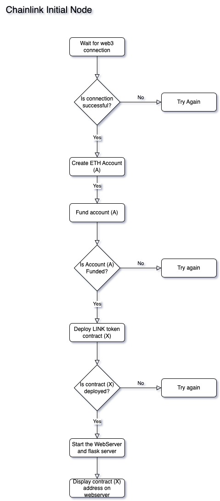
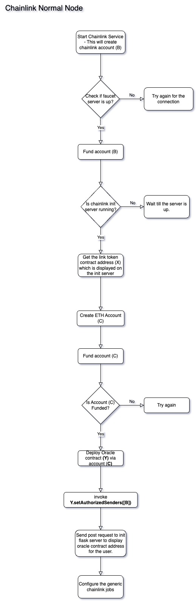
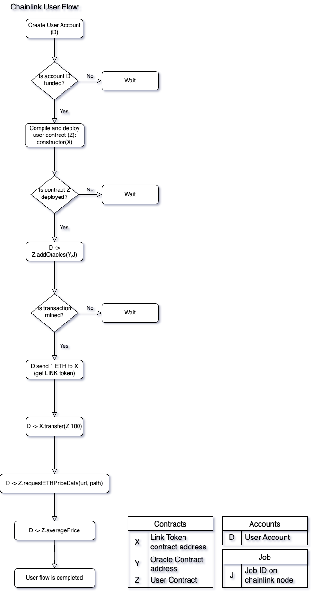

# Chainlink Service
This document will explain the technical implementation of the Chainlink Service. And also explain how the Chainlink works behind the scenes.

## Table of Contents
- [Chainlink Service](#chainlink-service)
  - [Table of Contents](#table-of-contents)
  - [Terms](#terms)
  - [Visualization](#visualization)
    - [Introduction](#introduction)
    - [Functionality](#functionality)
    - [Access](#access)
    - [Configuration](#configuration)
  - [Technical Implementation:](#technical-implementation)
    - [ChainlinkService](#chainlinkservice)
    - [ChainlinkInitializerServer](#chainlinkinitializerserver)
    - [ChainlinkServer](#chainlinkserver)
  - [Chainlink Service Architecture](#chainlink-service-architecture)
    - [Chainlink Initializer Node](#chainlink-initializer-node)
      - [Flow of Chainlink Initializer Node](#flow-of-chainlink-initializer-node)
    - [Chainlink Normal Node](#chainlink-normal-node)
      - [Flow of Chainlink Normal Node](#flow-of-chainlink-normal-node)
  - [Chainlink User Architecture](#chainlink-user-architecture)
    - [Chainlink User Flow](#chainlink-user-flow)
    - [User Contract](#user-contract)
  - [How Chainlink Works Behind the Scenes](#how-chainlink-works-behind-the-scenes)
    - [Why does the user contract need LINK tokens?](#why-does-the-user-contract-need-link-tokens)
    - [What happens when the Account D invokes Z.requestETHPriceData(url, path)?](#what-happens-when-the-account-d-invokes-zrequestethpricedataurl-path)
      - [Step 1: Initiating a request:](#step-1-initiating-a-request)
      - [Step 2: Preparing Chainlink Request:](#step-2-preparing-chainlink-request)
      - [Step 3: Sending the Request to the Oracle](#step-3-sending-the-request-to-the-oracle)
      - [Step 4: `_rawRequest`  Functionality](#step-4-_rawrequest--functionality)
      - [Step 5: Oracle Processing and Response](#step-5-oracle-processing-and-response)
      - [Step 6:  Data Handling](#step-6--data-handling)
      - [Step 7: Finalization](#step-7-finalization)
    - [What happens if the request is not fulfilled?](#what-happens-if-the-request-is-not-fulfilled)
    - [Handling Unfulfilled Requests](#handling-unfulfilled-requests)

## Terms
Accounts:
- **Account A (Initializer Node Account)** : Used by the Chainlink initializer node to deploy the LINK token contract.
- **Account B (Chainlink Account)**: Created by the Chainlink startup command for sending transactions to the Oracle contract.
- **Account C (Oracle Node Account)**: Used by the Chainlink normal node to deploy the Oracle contract.
- **Account D (User Interaction Account)**: The account through which a user interacts with the user contract.

Contracts:
- **Contract X (LINK Token Contract)**: The contract that handles LINK, the cryptocurrency used in the Chainlink network.
- **Contract Y (Oracle Contract)**: The contract deployed by Chainlink nodes that processes data queries and delivers responses.
- **Contract Z (User Contract)**: A contract that users interact with, which typically triggers Oracle requests.

Jobs:
- **Job J (Configured Job ID)**: The identifier for a specific job configured on a Chainlink node, which defines tasks that the node must perform.


## Visualization
### Introduction
Each Chainlink node is bundled with Chainlink Web UI, which is a user interface that allows users to interact with the Chainlink node.

### Functionality
- **Create and Manage Jobs**: Users can create new jobs and manage existing ones through the UI.
- **View Job Status**: It provides the ability to check the status of active and completed jobs.
- **Access Job Logs**: Users can access logs associated with each job to monitor performance and debug issues.

### Access
Enter the IP address of the Chainlink node followed by the port number 6688 in the address bar. Example: `http://[IP-ADDRESS]:6688`.

### Configuration
- The interface is secured with a default username and password which can be changed during the initial setup.
- **Default Credentials**:
  - **Username**: `seed@example.com`
  - **Password**: `blockchainemulator`

## Technical Implementation:

### ChainlinkService
1. **Dependencies**:
   - Requires `EthereumService` for operation. This dependency is marked as optional during initialization, allowing the emulator to proceed even if EthereumService is not installed.
2. **Server Creation**:
   - [ChainlinkServer](../../seedemu/services/ChainlinkService/ChainlinkServer.py): The [_createServer](../../seedemu/services/ChainlinkService/ChainlinkService.py#L22) function is responsible for creating the Chainlink server. It is the server that runs the Chainlink service.
   - [ChainlinkInitializerServer](../../seedemu/services/ChainlinkService/ChainlinkInitializerServer.py): The [_createInitializerServer](../../seedemu/services/ChainlinkService/ChainlinkService.py#L26) function is used to create the Chainlink initializer server. This server is responsible for deploying the LINK token contract and displaying the contract address to users
3. **Service Installation**:
   - [installInitializer](../../seedemu/services/ChainlinkService/ChainlinkService.py#L29): This method is responsible for managing the initializer server.
   - `install`: This method is responsible for managing the normal server.
   - [_doInstall](../../seedemu/services/ChainlinkService/ChainlinkService.py#L38): Overrides the installation method to ensure that server classes implement either install or installInitializer, but not both. This check prevents configuration conflicts and ensures clarity in server roles.

### ChainlinkInitializerServer
1. **Configuration**:
   - [installInitializer](../../seedemu/services/ChainlinkService/ChainlinkInitializerServer.py#L41): Handles the software installation, RPC configuration, deployment of contracts using web3, and the setup of a web server. It raises exceptions if necessary configurations like RPC URL or Faucet URL are not set.
2. **Server Configuration Methods**:
    - [setFaucetServerInfo](../../seedemu/services/ChainlinkService/ChainlinkInitializerServer.py#L81): Configures information about the faucet server including the virtual node name and port number.
    - [setDeploymentType](../../seedemu/services/ChainlinkService/ChainlinkInitializerServer.py#L73): Allows specification of the deployment strategy (default is 'web3').
    - [setRpcByUrl](../../seedemu/services/ChainlinkService/ChainlinkInitializerServer.py#L89): Sets the Ethereum RPC address directly by URL.
    - [setRpcByEthNodeName](../../seedemu/services/ChainlinkService/ChainlinkInitializerServer.py#L97): Configures the Ethereum RPC address by referencing another node's name within the emulator.
3. **Private Helper Methods**:
    - [__installInitSoftware](../../seedemu/services/ChainlinkService/ChainlinkInitializerServer.py#L64): Installs essential software on the node such as networking tools and Python packages required for running Chainlink.
    - [__deployThroughWeb3](../../seedemu/services/ChainlinkService/ChainlinkInitializerServer.py#L105): Deploys the LinkToken contract using web3 by setting up necessary files and commands on the node.
    - [__webServer](../../seedemu/services/ChainlinkService/ChainlinkInitializerServer.py#L116): Sets up a web server using nginx and Flask to expose Chainlink functionalities.
    - [__getIPbyEthNodeName](../../seedemu/services/ChainlinkService/ChainlinkInitializerServer.py#L129): Retrieves the IP address of a given node.

### ChainlinkServer
1. **Configuration**:
   - [install](../../seedemu/services/ChainlinkService/ChainlinkServer.py#L48): Coordinates the full installation process for the Chainlink node. It handles software installation, RPC configurations, initializes network connections, deploys contracts, and prepares operational scripts. Exception handling is integrated to ensure all necessary configurations are correctly set before proceeding.
2. **Server Configuration Methods**:
   - [setFaucetServerInfo](../../seedemu/services/ChainlinkService/ChainlinkServer.py#L173): Configures information about the faucet server including the virtual node name and port number.
   - [setUsernameAndPassword](../../seedemu/services/ChainlinkService/ChainlinkServer.py#L145): Sets the username and password for the Chainlink web interface.
   - [setRpcByUrl](../../seedemu/services/ChainlinkService/ChainlinkServer.py#L129): Sets the Ethereum RPC address directly by URL.
   - [setRpcByEthNodeName](../../seedemu/services/ChainlinkService/ChainlinkServer.py#L137): Configures the Ethereum RPC address by referencing another node's name within the emulator.
3. **Private Helper Methods**:
   - [__installSoftware](../../seedemu/services/ChainlinkService/ChainlinkServer.py#L81): Installs essential software on the node such as networking tools and Python packages required for running Chainlink.
   - [__setConfigurationFiles](../../seedemu/services/ChainlinkService/ChainlinkServer.py#L90): Configures the Chainlink node by setting up necessary files and commands on the node.
   - [__chainlinkStartCommands](../../seedemu/services/ChainlinkService/ChainlinkServer.py#L101): Prepares the commands to start the Chainlink node.
   - [__deploy_oracle_contract](../../seedemu/services/ChainlinkService/ChainlinkServer.py#L112): Deploys the Oracle contract using web3 by setting up necessary files and commands on the node.
   - [__validate_username](../../seedemu/services/ChainlinkService/ChainlinkServer.py#L160): Validates the username for the Chainlink web interface.
   - [__validate_password](../../seedemu/services/ChainlinkService/ChainlinkServer.py#L167): Validates the password for the Chainlink web interface.
   - [__getIPbyEthNodeName](../../seedemu/services/ChainlinkService/ChainlinkServer.py#L181): Retrieves the IP address of a given node.


## Chainlink Service Architecture
Chainlink service on the seed emulator is based on two types of server. One is the Chainlink initalizer server and the other is the Chainlink normal server. In the upcoming section, we will discuss how Chainlink service is setup on the seed emulator.

### Chainlink Initializer Node
Chainlink initializer server is used to deploy the LINK token contract, and there is also a webserver running from where the users will be able to get the contract address of the LINK token, and oracle contracts deployed by the chainlink normal server.

#### Flow of Chainlink Initializer Node

1. **Wait for Blockchain**:
   - The initializer node will wait for the blockchain network to be fully operational.

2. **Create New Web3 Account**:
   - Once the blockchain is ready, the initializer node will create a new web3 account, termed as **Initializer Node Account (A)**.

3. **Request Ether Transfer**:
   - It will then request the faucet service to transfer some ether to the newly created **Initializer Node Account (A)**.

4. **Deploy LINK Token Contract**:
   - After receiving the ether, **Account A** will deploy the **LINK Token Contract (X)**.

5. **Activate Web and Flask Servers**:
   - Following the deployment of the **LINK Token Contract**, the initializer node activates a web server and a Flask server. The LINK Token Contract's address will be displayed on the web server for user access. Additionally, the Flask server will handle post requests from Chainlink normal nodes, and also display the Oracle Contract's address for user utilization.

### Chainlink Normal Node
Chainlink normal server is used to deploy the oracle contracts. The oracle contracts are used to get the data from the external world and send it to the smart contracts. The oracle contracts are deployed by the Chainlink normal server and the oracle contract address is sent to the Chainlink initializer server.

#### Flow of Chainlink Normal Node

1. **Start Chainlink Services**: 
   - The Chainlink Normal Node initiates the Chainlink services, which includes creating a new Chainlink web3 account, known as the **Chainlink Node Account (B)**. This is done using the Chainlink startup command.
2. **Request Ether**:
   - The node requests the faucet service to transfer some ether to the newly created **Chainlink Node Account (B)**.
3. **Wait for LINK Token Contract Deployment**:
   - After sending the faucet request, the normal node waits for the **Initializer Node Account (A)** to deploy the **LINK Token Contract (X)** and retrieves the LINK token address from the web server.
4. **Create Oracle Node Account and Request Ether**:
   - Upon receiving the LINK token address (**X**), the normal node creates another new account, the **Oracle Node Account (C)**, and requests the faucet service to transfer some ether to **Account C**.
5. **Deploy Oracle Contract**:
   - After receiving the ether, the normal node uses **Account C** to deploy the **Oracle Contract (Y)**.
6. **Authorize Chainlink Node Account**:
   - Once the **Oracle Contract (Y)** is deployed, the normal node executes `Y.setAuthorizedSenders([B])` to authorize the **Chainlink Node Account (B)** to send data or transactions to the **Oracle Contract (Y)**.
7. **Send Post Request to Init node Flask Server**:
   - The normal node then sends a post request to the Flask server running on the initializer node, including the oracle contract address (**Y**).
8. **Configure Generic Jobs**:
   - Using the **Oracle Contract address (Y)**, the initializer node configures generic jobs for the Chainlink service.

## Chainlink User Architecture

### Chainlink User Flow


1. **Create User Account (D)**:
   - A user account is created to interact with the Chainlink network.

2. **Check Account Funding**:
   - Verify if **User Account (D)** is funded with ether. If not, wait until it is.

3. **Deploy User Contract (Z)**:
   - Compile and deploy the user contract, providing the constructor with the LINK Token Contract address (**X**).

4. **Add Oracles**:
   - Once the contract is deployed, call `Z.addOracles(Y,J)` to add the Oracle Contract address (**Y**) and the Job ID (**J**) to the user contract.

5. **Transaction Confirmation**:
   - Wait for the transaction to be mined and confirmed on the blockchain.

6. **Acquire LINK Tokens**:
   - **User Account (D)** sends 1 ETH to the LINK Token Contract address (**X**) to receive LINK tokens.

7. **Transfer LINK to User Contract**:
   - **User Account (D)** calls `X.transfer(Z,100)` to transfer 100 LINK tokens to the User Contract (**Z**).

8. **Request Ethereum Price Data**:
   - **User Account (D)** calls `Z.requestETHPriceData(url, path)` on the user contract to request the Ethereum price data from the external source: [CryptoCompare API](https://min-api.cryptocompare.com/data/pricemultifull?fsyms=ETH&tsyms=USD).

9. **Receive Data and Calculate Average**:
   - The service awaits responses from the oracles and calculates the average price of Ethereum.

10. **Display Results**:
    - Once the average price is calculated, the response count and average price are displayed on the console.

11. **Service Completion**:
    - After displaying the necessary information, the service will terminate.

### User Contract
Functions in the User Contract:

1. setChainlinkToken(X): This will set the below variable in `ChainlinkClient.sol` 
    
    ```jsx
    function _setChainlinkToken(address linkAddress) internal {
        s_link = LinkTokenInterface(linkAddress);
     }
    ```
    
2. addOracles(address oracle, jobId): This function is used to add the oracle contract/contracts(Y) in the user contract so that they can make request for the data
   ```jsx
   function addOracles(address[] memory _oracles, string memory _jobId) public onlyOwner {
        bytes32 jobIdBytes = stringToBytes32(_jobId);
        for (uint256 i = 0; i < _oracles.length; i++) {
            oracles.push(OracleData({
                oracle: _oracles[i],
                jobId: jobIdBytes,
                isActive: true,
                price: 0
            }));
        }
    }
    ```
3. requestETHPriceData(url, path): This function accepts two parameters url and path. Here, url is the api that we want to get the data from, and the path is the json path of the data we want to extract/decode. For example:
    
    ```jsx
    function requestETHPriceData(string memory url, string memory path) public onlyOwner {
        for (uint256 i = 0; i < oracles.length; i++) {
            if (oracles[i].isActive) {
                Chainlink.Request memory request = buildChainlinkRequest(
                    oracles[i].jobId,
                    address(this),
                    this.fulfill.selector
                );

                request.add("get", url);
                request.add("path", path);
                request.addInt("multiply", 100);

                bytes32 requestId = sendChainlinkRequestTo(oracles[i].oracle, request, ORACLE_PAYMENT);
                pendingRequests[requestId] = true;
            }
        }
    }
    ```
    
4. fulfill(): This is the callback function that is used by the Chainlink nodes to send the data back to the blockchain.
   ```jsx
   function fulfill(bytes32 _requestId, uint256 _price) public recordChainlinkFulfillment(_requestId) {
        require(pendingRequests[_requestId], "Request is not valid");
        pendingRequests[_requestId] = false;

        uint256 sumPrices = 0;
        uint256 activeOracles = 0;

        for (uint256 i = 0; i < oracles.length; i++) {
            if (oracles[i].oracle == msg.sender && oracles[i].isActive) {
                oracles[i].price = _price;
                break;
            }
        }

        for (uint256 i = 0; i < oracles.length; i++) {
            if (oracles[i].isActive && oracles[i].price > 0) {
                sumPrices += oracles[i].price;
                activeOracles++;
            }
        }

        if (activeOracles > 0) {
            averagePrice = sumPrices / activeOracles;
            responsesCount = activeOracles;
        }
    }
    ```

## How Chainlink Works Behind the Scenes

### Why does the user contract need LINK tokens?

- The user contracts require LINK token due the integration of the “`transferAndCall`” mechanism in the ChainlinkClient.sol so there is a seamless interaction between user contract and Chainlink oracles. Below is the code from `ChainlinkClient.sol` that is used by the user contract.

    ```jsx
    function _sendChainlinkRequestTo(
        address oracleAddress,
        Chainlink.Request memory req,
        uint256 payment
    ) internal returns (bytes32 requestId) {
        uint256 nonce = s_requestCount;
        s_requestCount = nonce + 1;
        bytes memory encodedRequest = abi.encodeWithSelector(
        ChainlinkRequestInterface.oracleRequest.selector,
        SENDER_OVERRIDE, // Sender value - overridden by onTokenTransfer by the requesting contracts address
        AMOUNT_OVERRIDE, // Amount value - overridden by onTokenTransfer by the actual amount of LINK sent
        req.id,
        address(this),
        req.callbackFunctionId,
        nonce,
        ORACLE_ARGS_VERSION,
        req.buf.buf
        );
        return _rawRequest(oracleAddress, nonce, payment, encodedRequest);
    }

    function _rawRequest(
        address oracleAddress,
        uint256 nonce,
        uint256 payment,
        bytes memory encodedRequest
    ) private returns (bytes32 requestId) {
        requestId = keccak256(abi.encodePacked(this, nonce));
        s_pendingRequests[requestId] = oracleAddress;
        emit ChainlinkRequested(requestId);
        require(s_link.transferAndCall(oracleAddress, payment, encodedRequest), "unable to transferAndCall to oracle");
        return requestId;
    }
    ```

This mechanism is used for Payment to oracle service:

- When a user contract needs to retrieve data from external source, it must compensate the oracle nodes that perform this services.
- The `transferAndCall` allows user contracts to transfer LINK tokens as payment to oracles in a single transaction.

### What happens when the Account D invokes Z.requestETHPriceData(url, path)?
When D.requestETHPriceData(url, path) is invoked, it initiates a process to retrieve Ethereum price data from the external sources using the Chainlink network. This process involves several steps:

#### Step 1: Initiating a request:

- Function call:  When D invokes `Z.requestETHPriceData(url, path)`, it iterates through a predefined list of active Chainlink oracles (`oracles` array). For each active oracle, the function prepares a new Chainlink request.

#### Step 2: Preparing Chainlink Request:

- Building the request: For each added oracle, a Chainlink request object is created by calling `buildChainlinkRequest` . This function is provided by `ChainlinkClient`  library and is used to construct a new request with a specific job ID, the address of the calling(`Z`) contract, and the function selector of the callback function( `this.fulfill.selector` ) where the oracle’s response will be sent.
- Adding request parameters: The request is configured with parameters necessary for the oracle to fetch the required data. In our example, this includes the `url` , `path` , and instruction to `multiply` the result (to adjust for decimal places).
- Oracle Payment: The request includes an oracle payment amount (`ORACLE_PAYMENT`), specifying how much LINK token the oracle will receive for fulfilling this request.

#### Step 3: Sending the Request to the Oracle

- Sending Request: he prepared request is sent to the specified oracle using `sendChainlinkRequestTo`. This function takes the oracle's address, the prepared request, and the payment amount as arguments. Internally, this function utilizes the `_rawRequest` functionality to handle the LINK token transfer and request transmission.(As explained in the above section)

#### Step 4: `_rawRequest`  Functionality

- Unique Request ID: `_rawRequest` generates a unique request ID for tracking and assigns it to the request. This ID is crucial for correlating requests with responses.
- Logging and Token transfer: The function logs the request and performs the `transferAndCall`  action on the LINK token contract, transferring the token to the oracle contract with the request data.
- Awaiting Fulfillment: The request ID is marked as pending, indicating that the request has been sent but not yet fulfilled.

#### Step 5: Oracle Processing and Response

- Oracle node processing: A chainlink node monitoring the blockchain, detects a new request, retrieves the Ethereum price data from the specified url, processes data according to the request parameters, and send the results to the oracle contract.
- Callback Invocation: The oracle contract then calls the `fulfill` function on the user contract, using the function selector provided in the original request. The `requestId`  is used to ensure the response corresponds to the correct request.

#### Step 6:  Data Handling

- The **`fulfill`** function, specified in the request, receives the data. This function is responsible for handling the incoming price data, such as updating state variables or triggering other contract logic based on the received data.

#### Step 7: Finalization

- Completion: Once the `fulfill`  function successfully processes the data, the request is considered fulfilled. And `recordChainlinkFulfillment`  which removes the request id from the pending request.
    
    ```python
    modifier recordChainlinkFulfillment(bytes32 requestId) {
        require(msg.sender == s_pendingRequests[requestId], "Source must be the oracle of the request");
        delete s_pendingRequests[requestId];
        emit ChainlinkFulfilled(requestId);
        _;
      }
    ```
    

### What happens if the request is not fulfilled?

When a request is made and LINK tokens are transferred to the oracle or the oracle contract, the tokens are considered payment for the service of retrieving and providing the requested data. If the request is not fulfilled:

- Standard behavior: Typically, the tokens remain with the oracle as payment for attempting the service, even if the data was not successfully returned.
- Refund Mechanism: Some oracle contracts or services might have a refund mechanism for cases where requests cannot be fulfilled, though this is less common and would need to be explicitly coded into the oracle contract.

### Handling Unfulfilled Requests

- The `ChainlinkClient` contract includes features that allow for the cancellation of requests under certain conditions. For instance, the `_cancelChainlinkRequest` function can be used to cancel a request.

    ```jsx
    function _cancelChainlinkRequest(
        bytes32 requestId,
        uint256 payment,
        bytes4 callbackFunc,
        uint256 expiration
    ) internal {
        OperatorInterface requested = OperatorInterface(s_pendingRequests[requestId]);
        delete s_pendingRequests[requestId];
        emit ChainlinkCancelled(requestId);
        requested.cancelOracleRequest(requestId, payment, callbackFunc, expiration);
    }
    ```