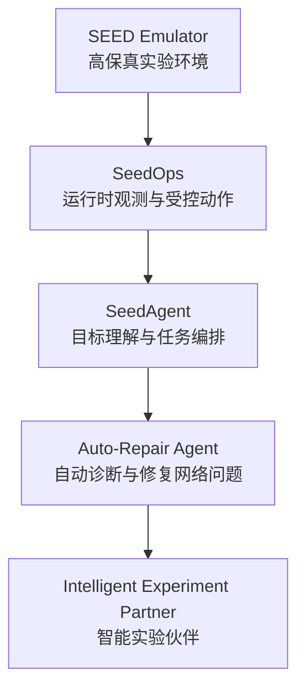
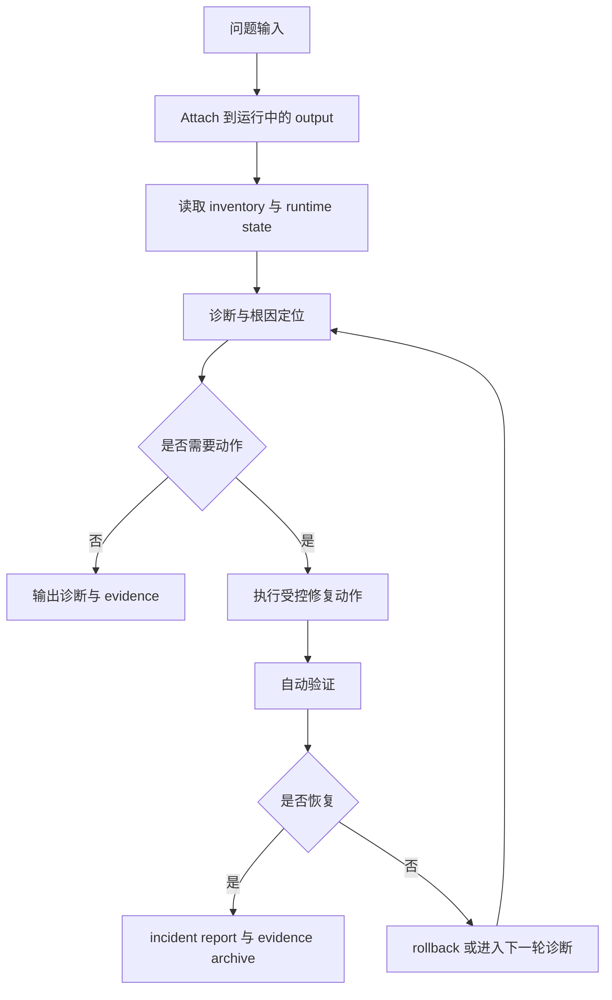

# SEED 智能体路线：从运行时能力到智能实验伙伴

SEED 智能体路线的核心目标，是把高保真的网络实验环境推进成一个能够被智能体持续理解、操作、验证和维护的系统。它不是在现有仿真器外面简单包一层对话接口，也不是做一个只会生成脚本的工具，而是希望让智能体真正进入运行中的实验环境，围绕实验运行本身形成闭环能力：读状态、找问题、做动作、验结果、留证据。

这条路线之所以成立，不是因为我们先有了一个很大的概念，而是因为现在已经有了一个真实的技术基础。SEED Emulator 提供了运行中的网络实验环境，SeedOps 提供了运行时 attach、观测、受控动作与 evidence 归档能力，SeedAgent 提供了目标理解、任务编排、策略门、确认门和执行总结能力。也就是说，我们现在面对的不是一个抽象的 AI 愿景，而是一套已经开始闭合的 `SEED Emulator + SeedOps + SeedAgent` 运行时体系。接下来的工作，不是从零发明一个智能体，而是沿着这套真实体系，把智能体能力收束、稳定并扩展出来。

在这一整体路线里，最适合作为第一个代表性例子的，是“自动修复网络问题的智能体”。原因并不复杂。第一，它足够具体，天然就是一个闭环任务：环境中出现异常，智能体 attach 到运行时环境，收集状态，定位根因，执行受控修复动作，验证恢复结果，并输出 incident report。第二，它能够最大化体现我们当前已有的能力，因为 attach、inventory、routing 检查、日志检查、service 检查、policy gate、rollback、verification 和 evidence archive 在这个例子里都会被串起来。第三，它又不是一个孤立的小功能。围绕自动修复网络问题做出来的能力，后续可以自然扩展到故障恢复、服务联通排障、路由安全演练、自动实验执行和科研实验过程编排。所以，它既是一个现实可落地的起点，也是一个能够通往更大方向的切口。

如果从系统角度来理解，这个智能体真正要做的事情，并不是“回答一个网络问题”，而是在运行中的网络实验系统里完成一次可监督、可验证、可留痕的修复闭环。它的输入不是一段空泛的自然语言，而是一个具体问题，例如某节点无法访问某服务、某个 BGP 邻居掉线、某段路径联通性中断、服务本身正常但路由不可达。它的第一步不是直接给出修复命令，而是先 attach 到目标 output，判断环境是否真的运行起来了，当前有哪些节点、角色、服务和路由关系，当前网络规模多大，哪些工具可用，哪些动作是允许的。只有在这一步做稳之后，后面的诊断和修复才是有意义的，否则就会退化成“对着容器试命令”。

自动修复网络问题的智能体，本质上应该由四类能力构成。第一类是运行时感知能力，它负责建立一个可信的运行时世界模型，让智能体知道自己当前面对的是什么系统。第二类是诊断推理能力，它负责把现象收缩成可检验的根因假设，例如区分问题究竟出在联通性、服务本身、本地路由、BGP 邻居还是更高层策略。第三类是受控执行能力，它负责把诊断结论转化成风险明确、结构化、可记录、可回滚的动作，而不是让模型随意生成 shell 命令。第四类是验证与报告能力，它负责在动作之后自动重跑关键检查，判断修复是否真正生效，并把整个过程沉淀为结构化 incident report 与证据归档。这四类能力共同决定了这个系统到底是一个研究平台，还是一次性的演示工具。

从当前状态看，这条路线并不是纸面上的设想，而是已经具备了相当明确的现实基础。现在的体系已经支持 attach 到真实运行中的 SEED output，意味着智能体面对的不是静态配置，而是真实运行的路由状态、服务状态、日志异常和实验规模。现在的体系也已经支持 inventory 读取、节点角色识别、BGP / route / logs / service 状态检查、selector 范围控制和 evidence 文件导出，这意味着智能体已经能够围绕运行时事实建立诊断，而不是靠 prompt 想象。更重要的是，当前体系已经开始具备受控动作与验证机制，例如 fault injection 与恢复流程、高风险动作确认门、rollback 机制基础和 post-check / evidence output。这些能力单独看似乎只是一些“工具能力”，但组织在一起，就构成了自动修复智能体最关键的现实支点。

因此，SEED 智能体路线最合理的发展方式，不是一下子追求一个“什么都能做”的通用 agent，而是沿着自动修复网络问题这个例子逐步把运行时智能体做扎实。第一阶段，应当先把运行时诊断智能体做好，重点是稳定 attach、稳定 inventory 感知、稳定 routing / logs / service 诊断，以及稳定输出结构化 diagnosis report。这一阶段的目标不是修，而是先把“看准”做扎实。第二阶段，再开放低风险自动修复动作，例如重启服务、重载守护进程、恢复局部异常状态，并把诊断-修复-验证的闭环真正跑通，把结果沉淀为 incident report。这一阶段的重点是把“修对”做出来。第三阶段，再逐步引入更高风险、更复杂的恢复能力，包括风险分层、HITL 确认门、rollback 完整机制以及更复杂网络变更的受控执行，把“修得稳、修得可控”做出来。第四阶段，再从这个 repair agent 自然生长为更完整的智能实验伙伴，把能力扩展到故障恢复、服务联通排障、路由安全演练、自动实验执行与结果验证，最终形成一套真正面向网络实验运行时环境的智能体体系。

如果要用一句更凝练的话概括这条路线，可以表述为：SEED 智能体路线不是单纯让模型调用工具，而是把高保真的网络实验环境、结构化运行时操作平面、策略约束与验证机制组织成一个可监督的智能闭环。它的价值，在于让智能体真正进入运行时系统，基于事实而不是猜测开展诊断和动作，并把执行结果沉淀成可验证、可复现、可审计的实验证据。

下面两张图分别对应这条路线的总体结构，以及“自动修复网络问题”这一具体例子的闭环结构。后续可以直接将生成的图片替换到相应位置。

## 图 1：总体路线图

> 图像占位：一张白底、16:9、学术风格的总图，展示从 `SEED Emulator -> SeedOps -> SeedAgent -> Auto-Repair Agent -> Intelligent Experiment Partner` 的连续演进关系。



## 图 2：自动修复网络问题闭环图

> 图像占位：一张白底、16:9、学术风格的场景图，展示智能体 attach 到运行中的 SEED 网络，对网络故障完成观测、诊断、修复、验证和 incident report 归档的闭环。



下面两段提示词可直接用于后续生图。

## 图 1 生图提示词

```text
Create a white-background, 16:9, proposal-grade scientific concept figure for a networking research project. The theme is the evolution from a high-fidelity network emulator into an intelligent experiment platform. The composition should show five large conceptual stages: SEED Emulator as the running experimental substrate, SeedOps as the runtime observation and controlled action plane, SeedAgent as the orchestration and policy layer, Auto-Repair Agent as the first concrete intelligent capability, and Intelligent Experiment Partner as the larger long-term vision. The figure should emphasize continuity: the future intelligent system grows naturally out of the current Agent-MCP-Ops stack. Visual style should be elegant, technically serious, white background, strong whitespace, blue-gray structure, muted teal flow, subtle gold accents for evidence and assurance, and no dashboard or product UI feeling.
```

## 图 2 生图提示词

```text
Create a high-end scientific figure on a pure white background, 16:9, showing a concrete example of an intelligent agent inside the SEED Emulator: automatic diagnosis and repair of a network problem in a running experimental environment. Show a live network experiment with routers, services, paths, and one visible fault. The agent should attach to runtime state, inspect routing and service conditions, identify the fault domain, apply a bounded repair action, verify recovery, and produce an incident report with evidence. The tone should combine realism and vision: this is a practical runtime capability built on a real emulator, and also the first step toward a larger intelligent experiment platform. Avoid dashboards, terminal screenshots, and engineering clutter. Use refined academic typography, white background, blue-gray and muted teal palette, subtle gold accents, and a top-tier systems-paper style.
```

归根结底，SEED 智能体路线真正要建立的，不是一个“看起来聪明”的功能展示，而是一种面向运行时实验环境的智能闭环：智能体进入真实系统、基于事实开展诊断、在边界内执行动作、自动验证结果，并把全过程沉淀为可复现、可审计的实验证据。以自动修复网络问题作为第一个具体例子，这条路线既有现实可行性，也有足够大的延展空间。它既能够建立当前项目的公信力，也能够自然承接未来更完整的智能实验伙伴愿景。
