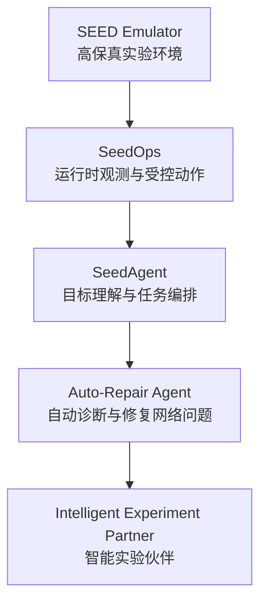
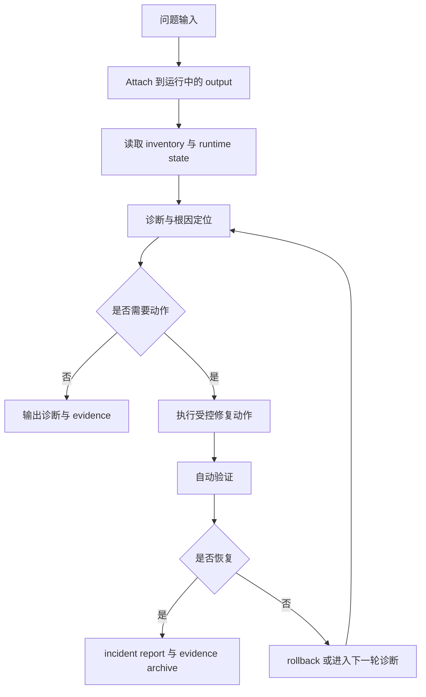

# SEED 智能体路线：从自动修复到智能实验伙伴

## 核心定位

SEED 智能体路线的目标，是在高保真的网络实验环境之上，发展出一类面向**运行时实验系统**的智能体能力。

这类智能体不是简单的脚本生成器，也不是只会调用若干工具的对话系统，而是能够进入真实运行中的网络实验环境，理解运行时状态，组织诊断与操作，验证结果，并沉淀结构化证据的智能实验伙伴。

它所服务的不只是单次演示，而是一个更长期的方向：

- 让网络实验环境具备运行时智能
- 让实验过程具备更强的自动化与可监督性
- 让研究者从“手工操作实验”逐步过渡到“与智能体协同开展实验”

---

# 一、为什么这个方向重要

传统网络实验平台的强项在于：

- 能构建复杂拓扑
- 能运行真实协议与服务
- 能复现故障、攻击与实验场景

但它们通常仍然依赖大量人工工作去完成：

- 环境观察
- 状态判断
- 故障定位
- 修复操作
- 结果验证
- 实验记录

这正是智能体最有价值的切入点。

智能体的意义不在于替代所有人工判断，而在于把原本分散、重复、依赖经验的实验运行工作，组织成一个更清晰、更可监督、更可复现的闭环。

对于 SEED 而言，这个方向尤其自然，因为 SEED 同时具备：

- 高保真的拓扑与配置语义
- 编译后的运行时 output
- 真实运行中的容器网络环境
- 路由、服务、日志、抓包、故障、攻击等多层信号

这使得 SEED 不仅适合做“实验构建平台”，也非常适合发展成“可被智能体持续操作的实验平台”。

---

# 二、当前路线建立在什么基础之上

SEED 智能体路线并不是从零开始构想，而是建立在一个已经具备雏形的 `Agent + MCP + Ops` 闭环上。

## 1. SEED Emulator：实验基底

SEED 提供运行中的网络实验环境，包括：

- 拓扑结构与配置语义
- 编译后的 output 与容器运行态
- 路由协议与服务行为
- 可注入的故障、扰动与攻击场景

它是整个智能体路线的实验世界和运行对象。

## 2. SeedOps：运行时观测与受控动作平面

SeedOps 提供的是一个运行时操作面，它把复杂的实验环境整理成智能体可以稳定使用的结构化接口，支持：

- attach 到已有 output
- 读取 workspace inventory
- selector 范围控制
- BGP / 路由 / 日志 / 服务状态检查
- playbook / job / artifact 流程
- 受控动作、证据留存与验证输出

SeedOps 的意义在于，它让“运行时观测”和“运行时动作”都具备了边界、结构和可记录性。

## 3. SeedAgent：目标理解与编排层

SeedAgent 提供的是智能编排能力，主要包括：

- 自然语言目标理解
- 任务化与会话化流程
- 风险分层与 policy profile
- 高风险动作的确认门
- 执行后 summary 与 evidence 输出

这使得系统不再只是“有人手工调工具”，而开始具备了“目标驱动、受边界约束、能够形成完整闭环”的智能体雏形。

因此，SEED 智能体路线当前的核心不是一个孤立模型，而是这样一个真实可落地的闭环：

```text
研究者目标 -> SeedAgent -> SeedOps -> 运行中的 SEED 网络 -> 验证/证据 -> 结构化结果
```

---

# 三、最合适的第一个具体例子：自动修复网络问题

在更宏观的愿景之下，最具代表性的第一个落地方向是：

> **自动修复网络问题的智能体**

这是一个非常适合作为对外宣传、对内推进和后续扩展的具体例子。

## 为什么选择它

### 1. 它天然构成一个完整闭环

一个网络故障从发生到恢复，本身就包含一个非常清晰的智能体流程：

- 感知当前状态
- 诊断问题根因
- 执行受控修复动作
- 验证修复是否成功
- 沉淀结构化 incident report

### 2. 它能最大化体现现有体系的价值

这个例子可以把当前 `SEED Emulator + SeedOps + SeedAgent` 的核心价值全部串起来：

- 运行时 attach
- inventory 感知
- routing / logs / service 检查
- policy gating
- rollback
- verification
- evidence archive

### 3. 它既具体，又能够自然扩展

自动修复网络问题并不是一个狭窄的功能点，而是一个切口。

围绕它建立的能力，后续自然可以扩展到：

- 故障恢复
- 服务联通排障
- 路由安全演练
- 自动实验执行
- 科研实验过程编排

因此，它既适合作为第一阶段的代表性目标，也能够承接更长远的智能实验伙伴路线。

---

# 四、这个智能体要解决的具体问题

自动修复网络问题的智能体，面向的是一个非常具体的任务场景：

- 某节点无法访问某服务
- BGP 邻居异常掉线
- 路由状态异常导致联通性中断
- 服务正常运行但路径不可达
- 某项网络故障修复后仍需自动验证恢复

它的工作不是简单地“给出建议”，而是要形成一个完整的运行时闭环：

1. attach 到正在运行的实验环境
2. 获取结构化 runtime state
3. 判断故障域与可能根因
4. 在边界内执行修复动作
5. 自动验证恢复结果
6. 输出结构化 incident report

也就是说，这个智能体的真正目标不是“会诊断”，而是：

> **在运行中的网络实验系统里，完成一次可监督、可验证、可留痕的修复闭环。**

---

# 五、自动修复智能体的能力结构

围绕这个例子，可以把智能体能力分成四层。

## 1. 运行时感知层

这一层负责建立一个可信的运行时世界模型。

它需要回答：

- 当前 attach 到哪个 output
- 当前 runtime 是否存在且处于可操作状态
- 当前有哪些节点、角色、服务与连接关系
- 当前网络规模与可用操作面是什么
- 当前异常表现出现在哪一层

这一层的重点不是“做决定”，而是把事实看清楚。

## 2. 诊断推理层

这一层负责把现象收束成可检验的根因假设。

对于一个故障问题，智能体需要逐步缩小故障域，例如：

- 是 reachability 问题还是服务问题
- 是单跳问题、本地路由问题，还是 BGP / 策略问题
- 是节点局部异常还是路径级异常
- 当前证据是否足以进入修复阶段

它不是一次性生成答案，而是一个基于证据不断收缩问题空间的推理过程。

## 3. 受控执行层

这一层负责把诊断结论转成受边界约束的动作。

动作应当具备：

- 结构化表达
- 风险等级
- 可审计性
- 可回滚性

在这一层，智能体的价值不在于“会不会写命令”，而在于能否把动作放进一个可控制、可验证、可恢复的框架里。

## 4. 验证与报告层

这一层负责闭合整个任务。

智能体不能以“我觉得修好了”作为结束条件，而必须：

- 重跑关键检查
- 判断修复是否真正生效
- 生成结构化 incident report
- 留下 evidence 与 artifact

这一层决定了系统是否具有研究价值和平台价值。

---

# 六、当前已经具备的真实能力

这条路线不是从概念出发，而是建立在当前真实可用能力之上。

围绕现有 Agent-MCP-Ops 栈，已经具备了三类关键能力。

## 1. 运行时 attach 与状态进入

系统已经支持 attach 到真实运行中的 SEED output。

这意味着智能体面对的不是静态配置，而是：

- 真实运行的路由状态
- 真实运行的服务状态
- 真实的日志与异常
- 真实的实验规模与节点集合

这是整个路线最关键的现实基础。

## 2. 结构化观测与诊断基础

当前体系已经具备支持诊断的核心能力，包括：

- inventory 读取
- 节点角色识别
- BGP / route / logs / service 状态检查
- selector 范围控制
- evidence 文件导出

这使得智能体能够在运行时事实上建立初步判断，而不是依赖空泛猜测。

## 3. 受控动作与验证机制

当前体系已经具备受控动作与验证的基础框架，包括：

- fault injection 与恢复流程
- 高风险动作确认门
- rollback 机制基础
- post-check 与 evidence output

这意味着自动修复网络问题并不是一个与现有工作脱节的新方向，而是当前能力最自然的收束和强化。

---

# 七、后续发展的主线

沿着“自动修复网络问题”这个切口，SEED 智能体路线可以形成一个非常清晰的发展主线。

## 第一阶段：运行时诊断智能体

重点建设：

- 稳定 attach
- 稳定 inventory 感知
- 稳定 routing / logs / service 诊断
- 结构化 diagnosis report

这一阶段的重点是把“看准”做扎实。

## 第二阶段：低风险自动修复智能体

重点建设：

- 引入低风险修复动作
- 形成诊断-修复-验证闭环
- 把修复过程沉淀为 incident report

这一阶段的重点是把“修对”做出来。

## 第三阶段：带策略门的复杂修复与恢复能力

重点建设：

- 风险分层
- HITL 确认门
- rollback 完整机制
- 高风险网络变更的受控执行

这一阶段的重点是把“修得稳、修得可控”做出来。

## 第四阶段：从 repair agent 到智能实验伙伴

重点建设：

- 自动故障恢复
- 服务联通排障
- 路由安全演练
- 自动实验执行与结果验证
- 研究过程中的智能协作

这一阶段的重点，是让整个系统从一个“能修网络问题的 agent”，生长为一个“面向网络实验运行时的智能实验伙伴”。

---

# 八、对外表述

## 简短版

SEED 智能体路线的目标，是让网络实验环境具备运行时智能。基于 SEED Emulator、SeedOps 和 SeedAgent，我们正在发展一类面向运行时实验系统的智能体能力，使其能够进入真实运行中的网络实验环境，完成状态感知、问题诊断、受控操作、结果验证与证据归档。以自动修复网络问题为切入口，这条路线将逐步扩展到故障恢复、服务排障、路由安全与科研实验执行等更广泛场景。

## 强调技术专业性的版本

这条路线的核心，不是单纯让模型调用工具，而是把高保真的网络实验环境、结构化运行时操作平面、策略约束与验证机制组织成一个可监督的智能闭环。其价值在于让智能体真正进入运行时系统，基于事实而非猜测开展诊断与动作，并把执行结果沉淀成可验证、可复现、可审计的实验证据。

## 强调吸引力的版本

我们希望让 SEED 不只是一个“能运行网络实验”的系统，而是逐步成长为一个“能与研究者协同工作的智能实验平台”。在这个平台上，智能体不仅理解网络实验的结构，也能够参与实验运行过程本身：看状态、找问题、做修复、验结果、留证据。自动修复网络问题只是第一个最具体的例子，而智能实验伙伴才是更大的方向。

---

# 九、可直接用于材料与 PPT 的提纲

## 标题

**SEED 智能体路线：从自动修复到智能实验伙伴**

## 提纲

### 1. 大方向

- 让 SEED 从实验平台走向智能实验平台
- 让网络实验环境具备运行时智能

### 2. 当前基础

- SEED Emulator：运行中的实验环境
- SeedOps：运行时观测与受控动作平面
- SeedAgent：目标理解、任务编排、策略门与总结输出

### 3. 第一个最具体的例子

- 自动修复网络问题的智能体
- attach、感知、诊断、修复、验证、报告的完整闭环

### 4. 当前已经具备的能力

- attach 到 live runtime
- inventory / routing / logs / service 检查
- 受控动作与验证基础
- 高风险动作确认门与 evidence 留存

### 5. 后续发展方向

- 运行时诊断智能体
- 低风险自动修复智能体
- 带策略门的复杂恢复能力
- 智能实验伙伴体系

---

# 十、Mermaid 图

## 1. 整体路线图



## 2. 自动修复闭环图



---

# 十一、生图提示词

## 提示词 1：总体路线图

```text
Create a white-background, 16:9, proposal-grade scientific concept figure for a networking research project. The theme is the evolution from a high-fidelity network emulator into an intelligent experiment platform. The composition should show five large conceptual stages: SEED Emulator as the running experimental substrate, SeedOps as the runtime observation and controlled action plane, SeedAgent as the orchestration and policy layer, Auto-Repair Agent as the first concrete intelligent capability, and Intelligent Experiment Partner as the larger long-term vision. The figure should emphasize continuity: the future intelligent system grows naturally out of the current Agent-MCP-Ops stack. Visual style should be elegant, technically serious, white background, strong whitespace, blue-gray structure, muted teal flow, subtle gold accents for evidence and assurance, and no dashboard or product UI feeling.
```

## 提示词 2：自动修复网络问题场景图

```text
Create a high-end scientific figure on a pure white background, 16:9, showing a concrete example of an intelligent agent inside the SEED Emulator: automatic diagnosis and repair of a network problem in a running experimental environment. Show a live network experiment with routers, services, paths, and one visible fault. The agent should attach to runtime state, inspect routing and service conditions, identify the fault domain, apply a bounded repair action, verify recovery, and produce an incident report with evidence. The tone should combine realism and vision: this is a practical runtime capability built on a real emulator, and also the first step toward a larger intelligent experiment platform. Avoid dashboards, terminal screenshots, and engineering clutter. Use refined academic typography, white background, blue-gray and muted teal palette, subtle gold accents, and a top-tier systems-paper style.
```
