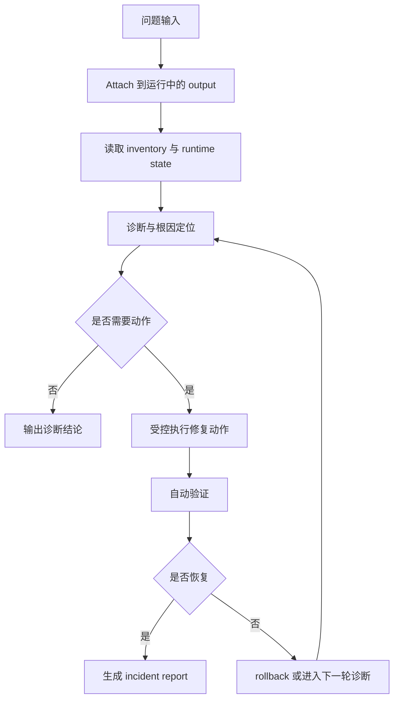

# 如何开发一个自动修复网络问题的智能体

## 判断

老师拿到的 `an_Example` 方向是合理的，尤其是把智能体开发拆成“感知、推理、执行、验证”四个阶段，这和我们现在已经做出来的 `Agent + MCP + Ops` 闭环是吻合的。

但如果我们要把它变成一份后续可以用于宣传、推进和分工的文案，就不能停留在泛化表述上，而必须围绕我们现在已经真实具备的系统能力来写清楚三件事：

1. **我们现在已经有什么**
2. **基于这些能力，一个“自动修复网络问题”的智能体可以怎么具体落地**
3. **下一步应该补什么，才能从“可运行”走向“更完整”**

所以，下面这份版本不再抽象地讨论“AI 如何诊断网络”，而是直接围绕我们现在的 `SEED Emulator + SeedOps + SeedAgent` 体系，写一个真实、具体、可推进的例子：

> **一个能够在 SEED 运行时环境中自动诊断并修复网络问题的智能体。**

---

# 1. 这个智能体是建立在什么基础上的

我们不是从零开始构想一个智能体，而是已经有了一个比较完整的底座。

## 1.1 仿真底座：SEED Emulator

SEED 提供的不是静态拓扑图，而是一个可以真正运行起来的网络实验环境。它有：

- 拓扑与配置语义
- 编译后的 output 目录
- 运行中的容器与服务
- 路由、服务、日志、抓包、故障、攻击等多层信息

这意味着智能体不是对着一段文本做想象，而是可以面对一个真实的运行中实验系统。

## 1.2 运行时操作面：SeedOps

SeedOps 是执行面。它的价值不是“给 AI 多几个工具”，而是把运行时环境整理成一个可以被安全使用的操作平面。

它现在已经能够支持一类很关键的能力：

- attach 到已有 output
- 读取 workspace inventory
- 按 selector 选择节点范围
- 做 BGP/日志/运行态检查
- 跑 playbook / job / artifact 流程
- 做受控的 fault injection、路由动作、证据归档

也就是说，SeedOps 已经把“观测”和“受控动作”的基础接口准备出来了。

## 1.3 智能编排层：SeedAgent

SeedAgent 是编排面。它现在已经不只是一个问答层，而是开始具备：

- 自然语言目标转计划
- policy profile / 风险分层
- HITL 确认门
- 任务化会话
- 执行后 evidence / summary 输出

这意味着我们已经不是“只有工具，没有 agent”，也不是“只有 agent，没有运行时”。

我们已经有了一个真实的闭环雏形：

```text
用户目标 -> SeedAgent -> SeedOps -> 运行中的 SEED 网络 -> 验证/证据 -> 返回结论
```

---

# 2. 我们现在已经能做什么

如果老师后续要宣传，最重要的一点是要说清楚：

> 这个工作不是停留在设想层面，而是已经具备了明确的运行时能力。

围绕当前系统，智能体已经具备以下三类基础能力。

## 2.1 已经能 attach 到运行中的实验环境

这件事非常关键。

很多所谓网络智能体其实只是在生成脚本，或者只能从头搭建实验；而我们的工作已经把重点放在“attach 到已经运行中的 SEED output，再进行后续操作”。

这使得智能体面对的是：

- 真实运行的路由会话
- 真实运行的服务状态
- 真实日志与运行时异常
- 真实规模的节点集合

这一步决定了我们的 agent 是“运行时 agent”，不是“离线生成 agent”。

## 2.2 已经能做结构化观测与诊断

现在这套体系已经能支撑智能体去做：

- inventory 刷新
- 节点与角色识别
- BGP summary 检查
- 路由/日志/服务状态读取
- 证据文件导出

这意味着智能体已经不只是“拿一句 prompt 瞎猜根因”，而是能够基于运行时信息建立初步判断。

## 2.3 已经能做受控动作与验证

在受控场景下，当前体系已经能够支持：

- 故障注入与恢复
- 路由安全类演练
- 服务联通问题排查
- 高风险动作的确认门
- rollback 与 post-check

这说明我们离“自动修复网络问题”并不远。严格说，我们已经具备了这个能力的基础执行框架，只是还需要把它收束成一个更专门、更稳定、更面向单一目标的 repair agent。

---

# 3. 为什么“自动修复网络问题”是最好的具体例子

如果要选一个例子来展开，自动修复网络问题是当前最合适的。

## 3.1 它足够具体

它不是抽象地说“让智能体理解网络”，而是可以落在一个非常清楚的流程上：

- 用户报告问题
- 智能体 attach 到运行时环境
- 智能体收集状态
- 智能体定位故障域
- 智能体执行一个受控修复动作
- 智能体验证恢复情况
- 智能体生成 incident report

## 3.2 它能最大化利用我们已有系统

这个例子几乎把我们当前 `Agent + MCP + Ops` 的所有关键价值都串起来了：

- attach
- inventory
- selectors
- logs
- routing state
- policy gates
- rollback
- evidence

也就是说，这不是另起炉灶，而是最自然地把现有工作组织成一个更完整的叙事。

## 3.3 它非常适合宣传和扩展

自动修复网络问题本身就容易被理解，也容易展示成一个有说服力的例子。

更重要的是，它不是孤立功能，而是一个“母场景”。

一旦这个例子跑通，后面自然可以扩展到：

- 故障恢复
- 服务排障
- 路由安全演练
- 科研实验自动执行

所以它是一个切口，而不是一个终点。

---

# 4. 如果围绕这个例子来做，智能体应该长成什么样

这里不能再泛泛说“会看、会想、会做”，而应该直接写成一个面向 SEED 运行时的真实闭环。

## 4.1 输入是什么

这个智能体的输入不是一张空白需求单，而是一个非常具体的问题描述，例如：

- “AS150 内部某节点无法访问外部 Web 服务。”
- “BGP 邻居已经掉线，帮我定位原因并恢复。”
- “邮件服务不通，帮我判断是路由问题还是服务问题。”

同时，它还应该拿到：

- attach 目标，也就是具体的 `output` 目录
- 当前运行时环境的 inventory
- 当前允许的 policy profile

## 4.2 它第一步做什么

第一步不是修，而是 attach 和感知。

它必须先知道：

- 当前实验环境是否真的运行起来了
- 当前有哪些节点和服务
- 哪些节点是 Router / BorderRouter / Host / Service
- 当前拓扑规模是小还是大
- 当前有哪些只读工具和写工具可用

如果这一步没有做稳，后面的修复只会变成“对着容器乱试命令”。

## 4.3 它如何定位问题

定位问题的关键不是“让 LLM 自由发挥”，而是让它按照一个收缩式问题定位流程工作。

例如，对于“某节点无法访问某服务”，它应该优先回答下面这些问题：

1. 是 reachability 问题，还是服务本身没起来？
2. 是单跳接口问题，还是路由问题？
3. 路由问题是本地路由、BGP 邻居、还是更上层策略问题？
4. 是否已经有足够证据做修复，还是还需要更多观测？

也就是说，这里真正要构建的是：

> 一个基于运行时证据不断缩小故障域的诊断器。

## 4.4 它如何执行修复

修复动作不能是“让模型随便生成 shell 命令”。

真正合理的做法应该是把修复动作限定在几类受控执行面里，例如：

- 重启进程或服务
- 重载配置
- 清理局部异常状态
- 恢复有限的网络规则
- 在更高风险场景中，进入确认门后再执行变更

也就是说，修复动作必须满足：

- 可结构化表达
- 可做风险分级
- 可记录
- 可回滚

## 4.5 它如何判断自己有没有修好

修复后的判断不能靠主观描述。

它必须自动重跑最初失败的检查，例如：

- ping
- traceroute
- BGP session state
- 服务响应
- 日志健康状态

只有这些结果真正恢复了，任务才算完成。

## 4.6 它最后输出什么

它的最终产物不应该只是聊天回复，而应该是一份结构化 incident report，包括：

- 初始症状
- 诊断步骤
- 关键证据
- 根因判断
- 执行动作
- 是否 rollback
- 最终验证结果
- 残留问题与建议

这份东西才是真正适合后续宣传、复盘和评测的成果形态。

---

# 5. 围绕现有系统，建议的研发路线

如果接下来真的要做这件事，最合理的路线不是一步到位，而是围绕现有能力逐步收口。

## 第一阶段：做一个 Read-Only Observer Agent

这一阶段不追求修复，只追求诊断站得住。

重点是：

- attach 稳不稳
- inventory 读得准不准
- BGP / route / logs / service checks 选得对不对
- 根因报告和 evidence 是否一致

这一步其实就是把我们现有“可观测能力”做成一个真正可用的运行时诊断智能体。

## 第二阶段：开放低风险自动修复

在诊断稳定后，加入低风险动作，例如：

- restart service
- reload daemon
- 恢复局部配置状态

这一阶段的目标不是炫技，而是形成第一个真正闭环：

`诊断 -> 修复 -> 验证 -> 报告`

## 第三阶段：加入高风险动作与策略门

当低风险修复稳定之后，再逐步把：

- 路由变更
- 故障恢复
- 更复杂的实验状态恢复

纳入智能体能力范围。

但这一阶段必须和：

- 风险分层
- HITL 确认门
- rollback
- evidence archive

一起推进。

## 第四阶段：从 repair agent 扩展到 general experiment agent

当“自动修复网络问题”这个例子做扎实后，它自然可以扩展成更大的框架：

- 自动故障恢复
- 服务联通排障
- 路由安全演练
- 科研实验执行

这时对外宣传就可以从“一个能修网络问题的 agent”，升级成“一个面向网络实验运行时的智能体框架”。

---

# 6. 对外宣传时最适合的表述

如果老师要做宣讲，建议不要说：

- 我们做了一个 AI 运维助手
- 我们做了一个会调用工具的大模型

更适合的说法是：

> 我们正在基于 SEED Emulator 构建一类面向网络实验运行时的智能体系统。
> 这类智能体能够 attach 到已经运行中的实验网络，
> 基于结构化运行时状态进行观测与诊断，
> 在策略边界内执行受控动作，
> 自动验证效果，
> 并沉淀完整证据与 incident report。
> 以自动修复网络问题为切入口，
> 我们希望逐步形成一种可监督、可回放、可扩展的网络实验智能体方法论。

这段话的好处是：

- 符合事实
- 不夸大
- 能讲清楚我们和一般 AI 工具调用项目的差异
- 也给未来扩展留下了空间

---

# 7. 建议直接采用的简短提纲

如果老师只是要一个“后续让 AI 去展开”的提纲，那么最适合的是下面这个版本。

## 提纲

### 1. 为什么要做这个智能体

- SEED 已经具备高保真的运行时实验环境
- 现在最值得推进的不是离线生成，而是运行时智能操作
- 自动修复网络问题是最具体、最可验证、最适合建立公信力的切入口

### 2. 这个智能体建立在什么基础上

- SEED Emulator 提供真实运行中的网络实验环境
- SeedOps 提供运行时观测与受控动作接口
- SeedAgent 提供目标理解、任务编排、策略门、证据输出能力

### 3. 这个智能体的核心闭环是什么

- attach 到运行中的 output
- 感知 runtime state
- 定位故障域
- 在边界内执行修复动作
- 自动验证恢复结果
- 输出结构化 incident report

### 4. 现在已经能做到什么

- attach 到 live runtime
- inventory / routing / logs / service 状态检查
- 任务化执行与证据留存
- 高风险动作确认门
- rollback 与 verification 基础能力

### 5. 下一步具体补什么

- 做稳定的只读诊断 agent
- 开放低风险自动修复动作
- 完善风险分层、回滚与 incident report
- 建立面向 repair agent 的评测基线

### 6. 最终希望形成什么

- 从自动修复网络问题出发
- 逐步扩展到故障恢复、服务排障、路由安全、科研实验等更广泛场景
- 形成一套面向 SEED 运行时环境的智能体方法与平台能力

---

# 8. 配图建议

## 8.1 Mermaid 图：当前体系与目标体系的关系


## 8.2 Mermaid 图：自动修复闭环



## 8.3 生图提示词 1：现有体系到 repair agent 的演进图

```text
Create a white-background, 16:9, proposal-grade scientific architecture figure. The subject is the evolution from the current SEED intelligent operation stack into a dedicated network auto-repair agent. Show four large conceptual blocks: SEED Emulator as the running experimental substrate, SeedOps as the runtime observation and controlled action plane, SeedAgent as the orchestration and policy layer, and on top of them a concrete Auto-Repair Network Agent specialized for diagnosis, bounded remediation, verification, and incident reporting. The figure should communicate continuity: this is not a new standalone AI product, but a focused capability grown out of the existing Agent-MCP-Ops stack. Use refined academic composition, white background, blue-gray macro structure, muted teal flow, and subtle gold accents for assurance and evidence. No dashboards, no terminal screenshots, no product UI.
```

## 8.4 生图提示词 2：自动修复场景图

```text
Create a high-quality scientific concept figure on a pure white background, 16:9, for a proposal about an autonomous agent that repairs network problems inside the SEED Emulator. Show one concrete scene: a running experimental network in SEED has a reachability fault, the agent attaches to the live runtime, inspects routing and service state, identifies the fault domain, applies a bounded fix, verifies recovery, and produces an incident report with evidence. The emphasis should be practical and realistic: this is a supervised closed-loop network repair workflow built on a real emulator runtime, not a generic AI assistant. Use elegant typography, strong whitespace, blue-gray and muted teal palette, subtle evidence-oriented gold accents, and a top-tier systems-paper style.
```

---

# 9. 最终建议

如果要按老师那句话来回应，最合适的说法是：

> 这份 AI 建议的总体方向是合理的，和我们昨天讨论的闭环也一致；但如果要真正作为后续开展 Agent 工作的蓝图，我们建议把它收束到我们现在已经具备的 `SEED Emulator + SeedOps + SeedAgent` 体系上来写，围绕一个最具体、最可信的例子，也就是“自动修复网络问题的智能体”，明确写清楚现在已经能做的事、基于现有能力怎么落地、以及下一步需要补什么。这样既符合事实，也更适合宣传和推进。

这才是一份既能对外讲、又能对内做的文案。
