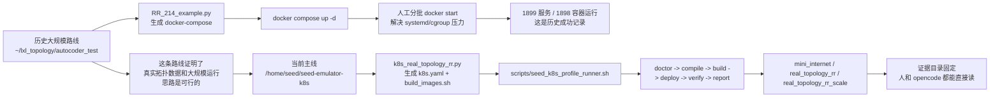
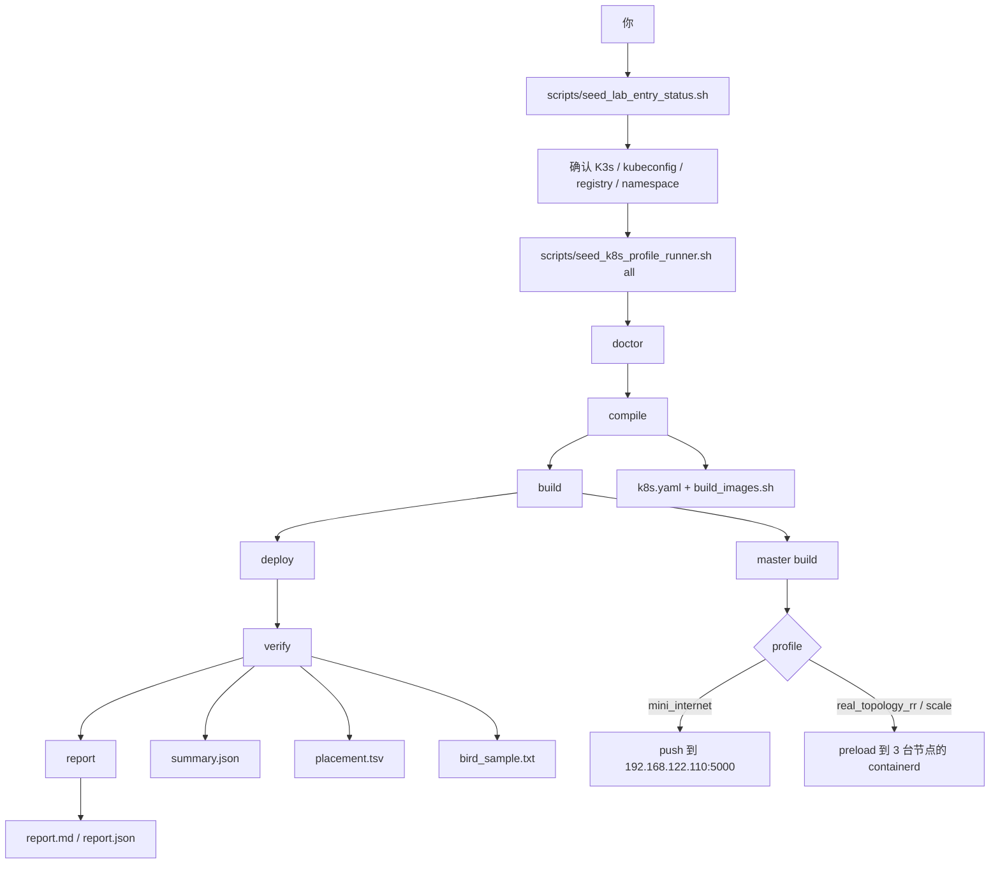

# 给学长的一份直白说明：SEED 大规模网络现在到底怎么跑、改了什么、为什么这样改

最后更新：`2026-03-08 10:45 UTC`

这份文档是专门给“想快速弄明白这套东西现在到底是什么状态、接下来该怎么用、以后该怎么继续改”的人写的。

我尽量不用绕的说法，只回答最实际的问题：

1. 现在真正该用哪个仓库。
2. 之前 Docker Compose 那条大规模路线是什么。
3. 学长以前改过哪些核心源码，它们的用意是什么。
4. 我们现在到底保留了什么、改了什么、为什么不把某些实验值直接设成默认。
5. 现在要怎么跑 `mini_internet`、怎么跑真实拓扑、怎么盯着看、怎么人工进容器看。
6. 如果以后又忘了，怎么自己查，或者怎么让 opencode/AI 帮你查。

如果你现在只想立刻开始，不想先读完整篇，那就先记住下面 3 件事：

```bash
cd /home/seed/seed-emulator-k8s
scripts/seed_lab_entry_status.sh
scripts/seed_k8s_profile_runner.sh <profile> all
```

这里 `<profile>` 目前就记 3 个：

- `mini_internet`
- `real_topology_rr`
- `real_topology_rr_scale`

---

## 0. 先说“怎么自己查”，别再靠聊天记忆

以后如果忘了，不要先去翻聊天记录，先按这个顺序查。

### 第一步：先看这份文档

这份文档的位置：

- `docs/runbooks/seed_lab_senior_plain_handoff_20260308.md`

它负责讲清楚全貌。

### 第二步：看当前环境是不是真的活着

运行：

```bash
cd /home/seed/seed-emulator-k8s
scripts/seed_lab_entry_status.sh
```

它会把当前环境快照写到：

- `output/assistant_entry/latest/summary.json`
- `output/assistant_entry/latest/summary.md`

这一步最重要，因为它会直接告诉你：

- 当前 K3s 节点是不是 Ready
- 当前默认 profile / namespace 是什么
- registry 是谁
- 当前容器基础镜像是什么
- 现在这台机器到底是在看哪个仓库

### 第三步：看某次运行的证据目录

统一看这里：

- `output/profile_runs/<profile>/latest/`

里面最重要的几个文件是：

- `validation/summary.json`
- `validation/diagnostics.json`
- `validation/placement.tsv`
- `validation/bird_sample.txt`
- `report/report.md`
- `report/report.json`
- `runner.log`

### 第四步：如果要问 opencode / AI，先让它读这些固定文件

我们这套仓库本来就给 opencode 留了专门位置，不用再从零解释：

- 代理定义：`.opencode/agents/seed-lab.md`
- 常用命令：`.opencode/commands/seed-lab-home.md`
- 其他命令：`.opencode/commands/seed-lab-*.md`
- 技能说明：`.opencode/skills/seed-lab-*/SKILL.md`

如果你喜欢自然语言，不喜欢 slash command，也完全没问题。你直接这么对 opencode 说就行：

> 先读 `docs/runbooks/seed_lab_senior_plain_handoff_20260308.md`，再读 `output/assistant_entry/latest/summary.json`，然后只告诉我 3 件事：当前状态、最关键证据、下一步该跑哪条命令。

如果是某个 profile 跑挂了，就这么问：

> 先读 `output/profile_runs/real_topology_rr_scale/latest/validation/diagnostics.json` 和 `output/profile_runs/real_topology_rr_scale/latest/report/report.json`，不要讲概念，只告诉我：失败在哪一步、第一证据文件、下一步一条命令。

也就是说，**先读证据，再回答**，这是这套体系现在最重要的使用习惯。

---

## 1. 一张图先看懂：历史路线和当前路线到底是什么关系



这张图的意思其实很简单：

- 历史路线没有被否定。
- 历史路线提供了**真实拓扑数据、分批启动经验、大规模参数调优思路**。
- 但当前主线已经不建议继续把“大规模运行”绑死在 Docker Compose 上。
- 现在推荐的正式入口已经换成 **K3s + KVM + profile + validate + report** 这一条线。

---

## 2. 当前真正应该用哪个仓库

当前机器上你会看到多个 `seed-emulator` 目录，但真正用于 **K3s/K8s 多节点运行** 的仓库是：

- `/home/seed/seed-emulator-k8s`

另外两个目录的定位是：

- `/home/seed/seed-emulator`：学长以前做实验性深改的目录，很多重要思路来自这里
- `/home/seed/seed-emulator1211`：更早的快照，更多是历史参考，不建议作为现在继续改的基线

这里最容易出问题的地方就是：

- 人会以为自己在看“同一个仓库的不同分支”
- 实际上现在是**不同目录、不同状态、不同用途**

所以现在只要记一句话：

> 要改当前 K3s 跑法，就改 `/home/seed/seed-emulator-k8s`。

如果只是回看学长以前的想法，再去看：

- `/home/seed/seed-emulator`

---

## 3. 当前真实环境是什么，不要猜

截至 `2026-03-08`，当前机器上确认到的事实是：

### 宿主机

- 系统：`Ubuntu 24.04.3 LTS`

### 当前 3 台 K3s/KVM 节点

- `seed-k3s-master`：`192.168.122.110`
- `seed-k3s-worker1`：`192.168.122.111`
- `seed-k3s-worker2`：`192.168.122.112`

它们的系统都是：

- `Ubuntu 22.04.5 LTS`

当前资源也确认过：

- master：`4 CPU / 6 GiB`
- worker1：`2 CPU / 4 GiB`
- worker2：`2 CPU / 4 GiB`

### 当前 kubeconfig

- `output/kubeconfigs/seedemu-k3s.yaml`

### 当前真实二层网卡

- 3 台节点默认路由网卡都是 `ens2`

### 当前容器基础镜像

- 当前主线仓库默认还是：`ubuntu:20.04`

### 学长旧实验仓的容器基础镜像

- `/home/seed/seed-emulator` 里已经改到了：`ubuntu:24.04`

### 当前 registry

- `192.168.122.110:5000`

这句话非常重要：

> `192.168.122.110` 就是 `seed-k3s-master`。

所以以后如果再看到 build 或 push 报错里出现 `192.168.122.110:5000`，不要觉得它是个“神秘外部地址”，它就是当前 master 节点上的本地 registry。

---

## 4. 历史 Docker Compose 大规模路线，到底做成了什么

这条线在：

- `~/lxl_topology/autocoder_test`

最关键的历史脚本是：

- `~/lxl_topology/autocoder_test/RR_214_example.py`

历史成功记录也已经留在：

- `~/lxl_topology/autocoder_test/deployment_record/SUMMARY.md`
- `~/lxl_topology/autocoder_test/deployment_record/logs/deployment.log`

从老记录里，能确认这些事实：

- 部署日期：`2026-03-05`
- 服务数：`1899`
- 运行中容器：`1898`
- 已退出容器：`1`
- 总耗时：约 `1 小时 45 分钟`
- 关键经验：**不能一口气硬起所有容器，必须分批启动**

当时那条线的核心价值，不只是“跑起来了”，更重要的是它帮我们回答了两个问题：

### 第一，它证明真实拓扑数据本身没问题

也就是说：

- `RR_214_example.py`
- 更大的真实拓扑数据
- 大规模 AS / IX / Router 的组合方式

这些思路本身是能生成、能运行、能看到大网络行为的。

### 第二，它积累了大规模运行经验

例如：

- build 不能太莽
- start 不能太莽
- 要分批、要控并发
- systemd / cgroup 压力会是瓶颈

这些经验现在没有丢，而是被转移到了 K3s 主线里，只不过不再用 `docker compose + 手工 start` 的方式体现。

---

## 5. 学长以前到底改了什么，这些改动本身在讲什么

这部分我尽量说人话。

### 5.1 他以前改的，不是“乱改”，而是在解决大规模真实问题

从 `/home/seed/seed-emulator` 的源码看，学长当时主要在做 5 类事情。

### A. iBGP 不再只想要 full-mesh，而是想引入 RR 和 cluster

这部分主要落在：

- `/home/seed/seed-emulator/seedemu/core/Node.py`
- `/home/seed/seed-emulator/seedemu/core/AutonomousSystem.py`
- `/home/seed/seed-emulator/seedemu/layers/Ibgp.py`

它想解决的问题其实很明确：

- 当 AS 很大时，full-mesh iBGP 会变得很重
- 所以要引入 RR（Route Reflector）
- 而且不是只想要“一个 RR 标记”这么简单，还想有 cluster 的概念

所以当时他加了这些思路：

- `makeRouteReflector()`：某个 router 被标成 RR
- `joinBgpCluster(cluster_id)`：某个 router 属于哪个 BGP cluster
- `createCluster()`：AS 里显式建 cluster
- `_aggregateBgpClusters()`：把 RR / client 按 cluster 聚合起来
- 在 BIRD 配置里写 `rr client;` 和 `rr cluster id ...;`

这背后的本意很清楚：

> 不想让 iBGP 还是“一张大平面网”，而是想让它开始像大规模真实网络那样分层组织。

### B. 想控制“哪些路由导回 Linux 内核”

这部分主要落在：

- `/home/seed/seed-emulator/seedemu/layers/Routing.py`

这里能看到一个明显思路：

- 不希望所有东西都无脑 export 到 kernel
- 更倾向只把 `RTS_DEVICE` 和 `RTS_OSPF` 这类必要来源导回去

这件事在大规模仿真里是有意义的，因为它本质上是在控制：

- Linux 内核路由表里到底进什么
- 什么东西只留在 BIRD 里
- 什么东西要回写到系统层

说白一点，这不是“为了好看”，而是在试图减轻大规模运行时的系统压力和无用同步。

### C. 想把 OSPF 调成更偏“大规模慢时序”的样子

这部分主要落在：

- `/home/seed/seed-emulator/seedemu/layers/Ospf.py`

当时的思路大概是：

- `tick 3`
- 接口 `hello 30`
- 很长的 dead 时间
- point-to-point + retransmit 调整

这背后的出发点也是合理的：

> 当网络规模大、链路多、邻居多时，不想让 OSPF 太激进，希望它更“慢一点、稳一点”。

### D. 把 `bird` 自动启动给注释掉了

这部分主要落在：

- `/home/seed/seed-emulator/seedemu/layers/Routing.py`

你之前问过一个问题：

> 我以前改的脚本里好像没有自动启动 bird，你是不是自己加了？

这件事现在已经完全确认了：

- 在旧仓 `/home/seed/seed-emulator` 里，`bird -d` 的自动启动确实被注释掉了
- 所以你以前“默认不启动 bird”的记忆是对的

### E. 容器基础镜像已经往 `24.04` 走了

这部分在旧仓也能直接看到：

- `/home/seed/seed-emulator/docker_images/seedemu-base/Dockerfile`

那里已经是：

- `FROM ubuntu:24.04`

这说明学长当时不仅是在调协议逻辑，也在顺手往更新的系统基线迁移。

---

## 6. 我们现在怎么处理这些旧改动：不是否定，而是“收进主线，但不把实验值硬塞成默认值”

这是整个整理里最关键的一句话：

> 学长以前的思路没有被丢掉，但也没有原封不动直接覆盖当前默认行为。

原因很简单：

- 现在我们不是只追求“某次大实验勉强跑起来”
- 我们要的是一条**可复现、可维护、可迁移到多物理机**的主线

所以现在的处理方式是：

### 6.1 RR / cluster 思路：保留，而且正式变成主线能力

现在主线里，RR 能力已经放回来了，而且不是零散补丁，而是明确 API：

- `Router.makeRouteReflector(True)`
- `Router.joinBgpCluster(cluster_id)`
- `AutonomousSystem.createCluster(cluster_id)`
- `Ibgp.setReflectionMode("simple" | "clustered")`

但这里有一个重要变化：

#### 现在分两档

- `simple`：默认安全档
- `clustered`：显式大规模实验档

这是什么意思？

- 如果你只是跑 `mini_internet` 或 `real_topology_rr` baseline
  - 默认仍然走简单、稳的模式
- 如果你明确要跑 scale 档
  - 才启用 `clustered`

这样做的原因不是保守，而是为了避免：

- 学长以前的实验性组织方式，直接把现在的小规模回归也拖复杂
- 以后每次调试都分不清到底是“业务错了”还是“cluster 语义又出事了”

### 6.2 “只导出 device / ospf 到 kernel”的思路：保留，但变成显式 knob

现在主线里，这个能力变成了：

- `Routing.setKernelExportMode("default" | "device_ospf_only")`

这就是在说：

- 默认不乱动原来的安全行为
- 需要大规模实验时，再显式切到 `device_ospf_only`

这一步很关键，因为这属于**对系统行为有影响的改动**，不能再靠“直接改模板”来偷偷生效。

### 6.3 OSPF 慢时序：保留，但现在不把它设成当前 214 实验环境的默认值

这一点是我们这次整理里最需要讲清楚的地方。

我们确实保留了：

- `Ospf.setTimingProfile("default" | "large_scale")`

也就是说，学长以前那组更慢的 OSPF 设定，并没有被删掉。

但是，为什么现在 `real_topology_rr_scale` 默认不是 `large_scale`，而是 `default`？

因为我们已经拿当前这套 3 节点 K3s+KVM 实验环境做过验证，结果是：

- 在 `SEED_TOPOLOGY_SIZE=214`
- `SEED_OSPF_TIMING_PROFILE=large_scale`
- `real_topology_rr_scale`

这个组合下，出现过明显问题：

- OSPF 邻接起不来或卡在 `Init/ExStart`
- BGP 还停在 `Connect`

这不是猜的，是我们当场看过容器里的 `birdc`。

对应失败记录也留着：

- `output/profile_runs/real_topology_rr_scale/20260308_095233/validation/summary.json`
- `output/profile_runs/real_topology_rr_scale/20260308_095233/validation/bird_sample.txt`

那次失败记录里，`bird_sample.txt` 里可以直接看到：

- `Ibgp_to_rr_r2 ... Connect`

所以我们现在的做法是：

- 把 `large_scale` 保留为**显式实验开关**
- 但当前默认先用 `default`

这不是否定学长的思路，而是把“实验档位”和“稳定默认档位”分开。

### 6.4 `bird` 自动启动：恢复成当前主线默认开启

这里必须说清楚，因为这是最容易让人困惑的一点。

旧仓里：

- `bird -d` 自动启动被注释掉了

当前 K3s 主线里：

- `bird` 自动启动是开的

为什么要这样改？

原因非常实际：

- 当前 K3s 路线是用 Pod / Deployment 去跑
- 现在的 validate 脚本只负责检查协议状态
- 它们不应该承担“顺手把 bird 再启动一下”的责任

换句话说：

> 当前主线假设“容器起来时，协议进程也应该自己起来”。

这才符合现在 K8s 的运行模型。

所以现在这件事的分工已经很清楚：

- **编译产物 / 容器启动脚本**：负责启动 `bird`
- **validate 脚本**：负责 `birdc show protocols` 去检查它是不是已经起来、是不是已经 Established

### 6.5 容器基础镜像 `24.04`：承认这是下一步，但现在不直接默认切换

旧仓已经走到了 `ubuntu:24.04`，这件事我们是认可的。

但是这次没有把当前主线默认镜像直接切到 `24.04`，原因也很简单：

- 这会影响基础镜像、Dockerfile、已有镜像标签、构建缓存
- 它本身就是一件独立迁移工作
- 不应该和“先把 K3s+KVM 主线跑稳”混在一起做

所以现在的策略是：

- 先把 `mini_internet` / `real_topology_rr` / `real_topology_rr_scale` 三条主线跑稳
- 容器基础镜像升级到 `24.04` 单独作为下一阶段做

这比“为了追新把所有事情一起改掉”要稳得多。

---

## 7. 我们这次除了核心源码，还额外补了哪些外围能力

学长以前更多是在“网络逻辑和实验逻辑”上动刀。

这次我们额外做的，是把外围运行链也补齐了。也就是所谓“非核心源码层”的东西。

这些东西的意义很简单：

> 不是让功能更多，而是让任何人不用靠记忆，也不用靠 AI 猜，就知道该怎么跑、怎么判断、怎么定位问题。

### 7.1 新增了 K8s 版真实拓扑示例

现在真实拓扑的正式入口是：

- `examples/kubernetes/k8s_real_topology_rr.py`

它做的事情是：

- 读取外部真实拓扑数据
- 生成 K8s 的 `k8s.yaml`
- 生成 `build_images.sh`
- 支持 RR / clustered / routing / ospf 这些配置项

也就是说：

- 以前 `RR_214_example.py` 更偏 Docker Compose 世界
- 现在 `k8s_real_topology_rr.py` 是 K3s 世界的正式落点

### 7.2 新增了 profile

现在最重要的 profile 有 3 个：

- `mini_internet`
- `real_topology_rr`
- `real_topology_rr_scale`

这 3 个 profile 的定位很明确：

- `mini_internet`：小规模回归基线
- `real_topology_rr`：真实拓扑 baseline
- `real_topology_rr_scale`：真实拓扑 scale 实验档

### 7.3 新增了强校验 validate 脚本

现在不是“kubectl apply 成功就算成功”，而是要继续做：

- 节点数是否对
- pod 数是否对
- 是否分布到多个节点
- `birdc show protocols` 里是不是至少已经有 `Established`

这条链路现在主要由：

- `scripts/validate_k3s_real_topology_multinode.sh`
- `scripts/validate_k3s_mini_internet_multinode.sh`

负责。

### 7.4 新增了 entry status / report / failure map

也就是说，现在任何一次运行不是只看终端，而是固定落这些东西：

- 当前环境快照：`scripts/seed_lab_entry_status.sh`
- 统一报告：`scripts/seedlab_report_from_artifacts.sh`
- 固定失败码：`configs/seed_failure_action_map.yaml`

这样以后再出事，第一句话不是“我记得上次好像是这样”，而是：

- 看 `diagnostics.json`
- 看 `report.json`
- 看 `summary.json`

### 7.5 Build 方式也更可控了

现在 `KubernetesCompiler` 生成的 `build_images.sh` 已经能控制：

- `SEED_DOCKER_BUILDKIT`
- `SEED_BUILD_PARALLELISM`

并且真实拓扑 profile 现在默认已经改成：

- 在 master 上 build
- 然后 preload 到 master/worker 的 containerd

这一步很重要，因为它绕开了“每次都强依赖 registry push”这件事。

也正因为如此：

- `mini_internet` 默认还是 registry push 路线
- `real_topology_rr` / `real_topology_rr_scale` 默认变成 preload 路线

这两条路径现在是明确分开的，不再混淆。

---

## 8. 一张图看懂：现在这套 K3s 主线到底怎么运行



这张图要表达的意思是：

- 现在不是随手拼命令了
- 现在整个生命周期已经有固定顺序
- 最终产物也有固定位置

所以以后如果学长要自己跑、自己查、自己让 opencode 帮忙，都是围绕这张图走，不要再回到“这次试试这个命令、下次试试那个命令”的状态。

---

## 9. 现在到底跑得怎么样：给结论，不绕弯子

截至现在，当前机器上已经确认这 3 条链路都能给出成功证据。

### 9.1 `mini_internet`

最新通过记录：

- `output/profile_runs/mini_internet/20260308_082105/validation/summary.json`

当前结论：

- BGP 通过
- 连通性通过
- 恢复验证通过
- 当前这次运行用了 `2` 个节点

它的意义是：

- 用于日常快速回归
- 最适合先判断“整条 K3s 主线是不是活着”

### 9.2 `real_topology_rr`

最新通过记录：

- `output/profile_runs/real_topology_rr/20260308_080803/validation/summary.json`

当前结论：

- `expected_nodes=214`
- `nodes_used=3`
- `bgp_passed=true`
- `connectivity_passed=true`
- `recovery_passed=true`

它的意义是：

- 当前真实拓扑 baseline 已经稳定
- 这就是“真实拓扑 K3s 多节点版”的正式演示入口

### 9.3 `real_topology_rr_scale`

最新通过记录：

- `output/profile_runs/real_topology_rr_scale/20260308_100706/validation/summary.json`

关键证据：

- `output/profile_runs/real_topology_rr_scale/20260308_100706/validation/counts.json`
- `output/profile_runs/real_topology_rr_scale/20260308_100706/validation/placement.tsv`
- `output/profile_runs/real_topology_rr_scale/20260308_100706/validation/bird_sample.txt`

当前结论：

- `expected_nodes=214`
- `deployments=214`
- `running_pods=214`
- `nodes_used=3`
- `bgp_passed=true`

它的意义是：

- 学长的大规模思路不是停留在“代码里留着”，而是已经在 K3s 主线里真正跑起来了
- 只是我们把它整理成了**显式 scale 档位**，不再污染 baseline 默认值

---

## 10. 现在应该怎么跑：给最少、最直接的命令

### 10.1 先统一准备环境

```bash
cd /home/seed/seed-emulator-k8s
source "$HOME/miniconda3/etc/profile.d/conda.sh"
conda activate seedemu-k8s-py310
source scripts/env_seedemu.sh
export KUBECONFIG=output/kubeconfigs/seedemu-k3s.yaml
```

### 10.2 先看环境

```bash
scripts/seed_lab_entry_status.sh
```

### 10.3 跑小规模基线

```bash
scripts/seed_k8s_profile_runner.sh mini_internet all
```

### 10.4 跑真实拓扑 baseline

```bash
export SEED_REAL_TOPOLOGY_DIR="$HOME/lxl_topology/autocoder_test"
export SEED_TOPOLOGY_SIZE=214
scripts/seed_k8s_profile_runner.sh real_topology_rr all
```

### 10.5 跑真实拓扑 scale

```bash
export SEED_REAL_TOPOLOGY_DIR="$HOME/lxl_topology/autocoder_test"
export SEED_TOPOLOGY_SIZE=214
scripts/seed_k8s_profile_runner.sh real_topology_rr_scale all
```

如果以后要做更大的 `1897`，不要改脚本结构，只改规模参数和底层资源。

---

## 11. 跑的时候怎么盯，别等它挂了才回头看

### 最直接的方法：盯 runner.log

例如：

```bash
tail -f output/profile_runs/real_topology_rr_scale/latest/runner.log
```

### 第二种方法：直接看 pod 分布和状态

```bash
export NS=seedemu-k3s-real-topo-scale
kubectl --kubeconfig output/kubeconfigs/seedemu-k3s.yaml -n "$NS" get pods -o wide
kubectl --kubeconfig output/kubeconfigs/seedemu-k3s.yaml -n "$NS" get deploy -o wide
kubectl --kubeconfig output/kubeconfigs/seedemu-k3s.yaml -n "$NS" get events --sort-by=.lastTimestamp | tail -n 40
```

如果跑的是 baseline，就把 namespace 换成：

- `seedemu-k3s-real-topo`

如果跑的是 mini，就换成：

- `seedemu-k3s-mini-mn`

### 第三种方法：直接看最后证据

最实用的就是这三个：

- `validation/summary.json`
- `validation/placement.tsv`
- `validation/bird_sample.txt`

只要这三个看对了，基本就知道这次是不是成了。

---

## 12. 想人工进容器看，怎么做

### K3s 路线

先找一个 pod：

```bash
kubectl --kubeconfig output/kubeconfigs/seedemu-k3s.yaml -n seedemu-k3s-real-topo-scale get pods -o wide
```

进容器：

```bash
kubectl --kubeconfig output/kubeconfigs/seedemu-k3s.yaml -n seedemu-k3s-real-topo-scale exec -it <pod> -- bash
```

进去以后最常看的就是：

```bash
birdc show protocols
birdc show ospf neighbors
birdc show route count
ip a
ip r
```

### 历史 Docker Compose 路线

历史那条线还是这样看：

```bash
cd ~/lxl_topology/autocoder_test
docker ps
docker logs <container>
docker exec -it <container> bash
```

也就是说：

- Compose 世界是 `docker exec`
- K3s 世界是 `kubectl exec`

这件事本身没什么神秘的，只是入口不同。

---

## 13. 如果以后学长还想继续改，应该从哪里下手

### 13.1 如果要改“核心源码层”

也就是 seedemu 自己的行为逻辑，主要看这些文件：

- `seedemu/core/Node.py`
- `seedemu/core/AutonomousSystem.py`
- `seedemu/layers/Ibgp.py`
- `seedemu/layers/Routing.py`
- `seedemu/layers/Ospf.py`

这部分适合做的事：

- RR 语义
- clustered 行为
- kernel export 策略
- OSPF timing profile

### 13.2 如果要改“外围运行层”

也就是 K3s 怎么编译、怎么部署、怎么验证，主要看：

- `seedemu/compiler/Kubernetes.py`
- `examples/kubernetes/k8s_real_topology_rr.py`
- `configs/seed_k8s_profiles.yaml`
- `scripts/seed_k8s_profile_runner.sh`
- `scripts/validate_k3s_real_topology_multinode.sh`

### 13.3 如果只想改文档和交付方式

看这些：

- `docs/runbooks/seed_lab_senior_plain_handoff_20260308.md`
- `docs/runbooks/seed_lab_evidence_first_operator_guide.md`
- `docs/runbooks/20260305_k3s_kvm_multinode_real_topology_rr.md`
- `docs/k3s_runtime_architecture.md`

---

## 14. 如果学长想顺着 git 看，这次整理是怎么切的

这次没有把所有东西糊成一个大 commit，而是按 4 层切了：

1. `3a43994a` `core: add rr and scale routing knobs`
2. `7143f179` `k8s: add real topology rr runtime flow`
3. `94cf02a2` `tooling: improve evidence-first status and reports`
4. `efe8238b` `docs: document k3s baseline, scale and replay flow`

这 4 个 commit 的意思也很直白：

- 先把核心语义层整理干净
- 再把 K3s 运行层接上
- 再把 status / report 补齐
- 最后补文档

所以以后如果学长要 review，也建议按这个顺序看，而不是直接从 docs 或脚本开始倒推。

---

## 15. 最后给一个最平实的结论

如果用一句话总结当前状态，就是：

> 学长以前在 Docker Compose 时代做的大规模真实拓扑思路，我们已经理解了，也已经吸收进当前 K3s+KVM 主线了；但我们没有把那些实验值直接硬塞成默认，而是把它们整理成 baseline 和 scale 两档，让现在这条线既能稳定复现，也能继续往更大规模、多物理机扩展。

更具体一点说：

- 历史 Compose 路线仍然有价值，它证明了大规模真实拓扑能跑，也留下了分批启动经验。
- 当前正式主线已经切到 K3s+KVM。
- `mini_internet` 负责小规模回归。
- `real_topology_rr` 负责真实拓扑 baseline。
- `real_topology_rr_scale` 负责吸收学长大规模思路后的 scale 档。
- 当前这 3 条都已经有成功证据。
- 现在最该养成的习惯不是“记命令”，而是：
  - 先看 `seed_lab_entry_status`
  - 再看 `output/profile_runs/<profile>/latest`
  - 再让 opencode 先读证据再回答

如果以后再问“现在到底怎么跑”，你就先打开这份文档：

- `docs/runbooks/seed_lab_senior_plain_handoff_20260308.md`

它就是给学长的总入口。
