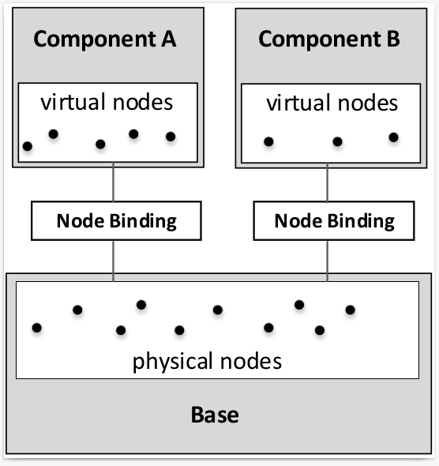

# User Manual: Component


- [Introduction]()
- [A simple component](#simple-component)
- [A complex component (DNS)](#complex-component)
- [Binding and filter](#binding-filter)


<a id="introduction"></a>
## Introduction  

One thing that makes
the Internet interesting (for both research and education)
is the applications (or services) running on top of it.
Some of these services only involves standalone servers,
such as Web server, DHCP server, and email server.
It is quite easy to deploy this kind of services inside the
emulator. However, many useful services have their
own infrastructure consisting of a large number of
servers, such as DNS, Blockchain,
Darknet, Botnet, Content Delivery Network (CDN), etc.
Setting up such an infrastructure is non-trivial,
because it involves configuring many nodes and
their relationships.


When building a service for the emulator, whether it
is a standalone service or a service infrastructure, we
would like this service to be independent from the
underlying Internet. This way, a service is portable,
and can be deployed in different Internet emulators.

We use a layered design. There are two types of layers
in the SEED emulator: the base layer and the service layer.
The base layer consists of hosts, networks, and routing.
At this layer, each node corresponds to a "physical" entity (container).
Each service layer consists of a service (or a service infrastructure).
Nodes at the service layer are virtual nodes, not physical ones.
Basically, a node is represented by a symbolic name. All the configuration
and setup on a service node will simply use that name.

The service layer will never reference any physical node
at the base layer; therefore it can be built independently
from the base layer. We call each service a *component*.
To deploy a service on top of a base layer,
we bind the virtual nodes at the service layer
to the physical nodes at the base layer, just like plugging
a chip (service) onto a circuit board (base).





<a id="simple-component"></a>
## A Simple Component

We use a very simple example (web) to show how to add a 
component to the emulator. First we create a component,
and then add two nodes to it. These nodes are virtual
nodes, i.e., they are not mapped to any container yet; they 
are simply names. 

```python
# Create a component, and then add a node to it
web = WebService()
web.install('webnode0')
web.install('webnode1')
```

To add a component to the emulator, we need to map 
each of the virtual node to a physical node. This process is called
*binding*. Once a virtual node is bound to a physical node (i.e., a
container), all the configuration made to the virtual node will be 
applied to the physical node. There are many ways to bind 
a virtual node to a physical node. The following example
binds the virtual node `webnode0` to the physical node 
named `node0` in AS-150; it also binds the virtual node
`webnode1` to any node in AS-151. 
For more details on binding, see [this section](#binding). 


```python
# Bind virtual node to physical node 
emu.addBinding(Binding('webnode0', filter = Filter(nodeName = 'node0', asn = 150)))
emu.addBinding(Binding('webnode1', filter = Filter(asn = 151)))
```

If multiple candidates match the filter, which one is selected depends on
the `action` parameter:
  - `Action.RANDOM` (default): selects a random node from the list
  - `Action.FIRST`: uses the first node from the list
  - `Action.LAST`: uses the last node from the list
  - `Action.NEW`: create a new node for the binding

Here is an example:

```python
emu.addBinding(Binding('webnode1', filter = Filter(asn = 151), action = Action.NEW))
```

After binding a virtual node to a physical node, if you would like to 
give the physical node a more meaningful name (for the visualization purpose),
you can set its display name.

```python
emu.getBindingFor('webnode0').setDisplayName('Web Server 0')
emu.getBindingFor('webnode1').setDisplayName('Web Server 1')
```


<a id="complex-component"></a>
## A Complex Component (DNS) 

The previous web component are quite simple, because the nodes
in this component are independent. The DNS component is more complicated, as
it involves many nodes with dependency. 
The example [B01-dns-component](../../examples/B01-dns-component/) shows how to 
build such a component, and the example 
[B02-mini-internet-with-dns](../../examples/B02-mini-internet-with-dns/) shows
how to bind the component to a pre-built emulator. 


The goal of a DNS component is to set up the DNS infrastructure,
including configuring the zone files for
each domain hosted in this infrastructure.
Each DNS server inside this component is a virtual node.
In the following code snippet, we show how we create a DNS infrastructure.
The `dns.install(name)` will create a node using
`name` if such a node does not exist.
We can then install zones on these virtual nodes, and configure their zone files.
These nodes are virtual nodes; they are just names,
and they do not bind to any existing physical node in the emulator.
This makes the component portable.


```python
dns = DomainNameService()
dns.install('root-a').addZone('.').setMaster()
dns.install('root-b').addZone('.')
dns.install('com').addZone('com.')
dns.install('ns-example').addZone('example.com.')
dns.getZone('example.com.').addRecord('www A 5.5.5.5')
```


<a id="binding-filter"></a>
## Binding and Filter

To bind a virtual node to a physical node, we add a binding for this 
virtual node. The constructor of the `Binding` class is the following: 


```python
def __init__(self, source, action = Action.RANDOM, filter = Filter()):
```

- `source` is a regex string to match virtual node names. For example, if we
  want to match all virtual nodes starting with "web," we can use `"web.*"`.

- `action` is the action to take after a list of candidates is selected by the
  filter. It has the following options:
  - `RANDOM` (default): selects a random node from the list
  - `FIRST`: uses the first node from the list
  - `LAST`: uses the last node from the list
  - `NEW`: create a new node 

- `filter` points to a filter object, which consists of rules for the binding.
  It defaults to an empty filter without any rule, i.e., 
  all physical nodes without binding are potential candidates.


The constructor of a filter is the following: 

```python
def __init__(
    self, asn: int = None, nodeName: str = None, ip: str = None,
    prefix: str = None, custom: Callable[[str, Node], bool] = None,
    allowBound: bool = False
)
```

All these parameters are constraints. If more than one constraint is set, 
a physical node must meet all the constraints to become a candidate. 

- `asn`: only the physical nodes from the specified AS will be selected.

- `nodeName`: specify the name of the physical node.
  Note that physical nodes from different ASes can have the same name. 

- `ip`: specify the IP address of the physical node.

- `prefix`: specify the network prefix of the physical node. 
  Note that the prefix does not have to match the exact prefix
  attached to the interface of the physical node; as long as the IP address on
  the interface falls into the range of the given prefix, the physical node
  will be selected.

- `custom`: allow one to use a custom function to select nodes. The function
  should take two parameters, the first is a string, the virtual node name, and
  the second is a Node object, the physical node. Then function should then
  return `True` if a node should be selected, or `False` otherwise.

- `allowBound`: allow the physical nodes that are already selected by other binding
  to be selected again.

