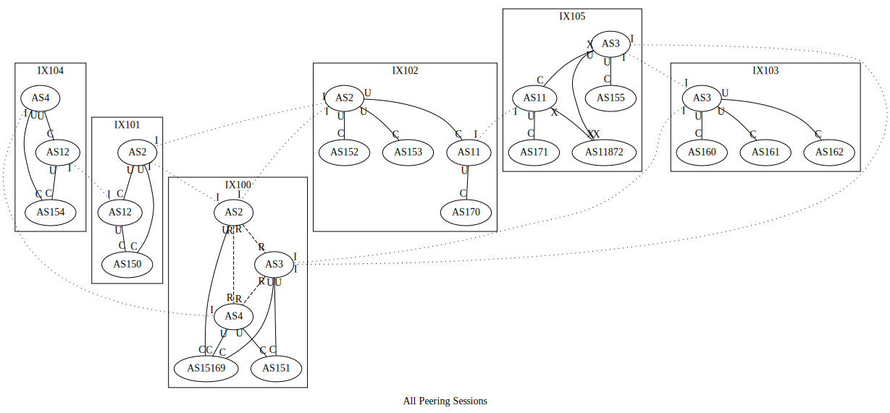

# Mini Internet

This is one of the more sophisticated examples. We combine what we have used from previous examples and build a larger emulation. This document assumes the reader has some idea of what each layer does; it will be better to go through the other examples before proceeding with this one. In this example, we will set up the followings:

- Three tier-1 transit providers: AS2, AS3, and AS4 (they do not buy transit from anyone, and they peer with each other), 
- Two tier-2 transit provider: AS11 (it buys transit from AS2 and AS3) and AS12 (it buys transit from AS2 and AS4),
- Some content provider and service ASes:
    - AS150: web server, recursive DNS resolver,
    - AS151: web server,
    - AS152: web server,
    - AS153: recursive DNS resolver,
    - AS154: reverse DNS (`in-addr.arpa.`),
    - AS155: Cymru IP ASN origin service,
    - AS160: root DNS,
    - AS161: `.com`, `.net` and `.arpa` TLD DNS,
    - AS162: `as150.net`, `as151.net` and `as152.net` DNS,
    - AS171 & AS172: end-user ASes for OpenVPN access,
    - AS15169 (Google): "Google" recursive DNS resolver, announces the `8.8.8.0/24` prefix, to host the resolver on `8.8.8.8`, and,
    - AS11872 (Syracuse University): real-world AS (announces the prefixes announced by AS11872 in the real-world, and route it to the real-world). 
- Six internet exchanges (100-105), and
- DNSSEC for `as150.net`, `as151.net` and `as152.net`.

The topology is rather complex; here's the Graphviz output of the `Bgp` layer:



Each edge indicates a BGP session. 

- Regular lines indicate regular BGP sessions.
- Dashed lines indicate MLPA (Multi-Lateral Peering Agreement) peering, or route-server peering sessions.
- Dotted lines indicate internal peering sessions (IBGP).

The heads and tails of edges are labeled with one of the following labels:

- `C` means this end is the customer end of a provider-customer transit session.
- `U` means this end is the upstream (i.e., the provider) end of a provider-customer transit session.
- `P` means the session is a regular peering session.
- `R` means the session is an MLPA (Multi-Lateral Peering Agreement) peering, or route-server peering sessions. It is functionally the same as the `P` sessions.
- `X` means the session has an unspecified role; this will be explained later.
- `I` means the session is internal (IBGP). Note that a session between IBGP peers does not necessarily mean there's a physical connection between the internal routers. The nature of IBGP requires full mesh connections to exchange routing information. (route reflector can be used to get rid of the full mesh, but the `Ibgp` layer uses full-mesh).

Route export filters for different sessions are different:

- For provider-customer transit sessions, the `C` end will only export its own prefixes and its' customers' prefixes; the `U` end will export everything (routes from other customers, peers, upstreams).
- For peer sessions (`P`), both sides export only their own prefixes and their' customers' prefixes.
- For unspecified sessions (`X`), both sides export all routes (routes from other customers, peers, upstreams) to each other.
- For internal sessions (`I`), both sides export all routes (routes from other customers, peers, upstreams) to each other.

## Create helpers

We will be creating multiple AS with similar properties and internal topology. We can create a few helper functions to create those AS with similar properties.

### Real-world AS creator

```python
def make_real_as(asn: int, exchange: int, exchange_ip: str):
    real_as = base.createAutonomousSystem(asn)
    real_router = real.createRealWorldRouter(real_as)

    real_router.joinNetwork('ix{}'.format(exchange), exchange_ip)
```

The real-world AS helper creates a real-world AS in the emulator. It works by utilizing the `Reality` layer. 

It first creates an AS with the `createAutonomousSystem` call of the base layer. It then adds a real-world router to the AS with the `createRealWorldRouter` call of the real-world layer. Last, it connects the real-world router to an internet exchange with the `joinNetwork` call of the node class. Since real-world ASN can be outside the 2~254 range, we override the auto address assignment by manually assigning an address when joining the network.

### Service AS creator

```python
def make_service_as(sim: Emulator, asn: int, services: List[Service], exchange: int):
    service_as = base.createAutonomousSystem(asn)
    router = service_as.createRouter('router0')
    net = service_as.createNetwork('net0')
    routing.addDirect(asn, 'net0')
    router.joinNetwork('net0')
    router.joinNetwork('ix{}'.format(exchange))

    for service in services:
        name = 's_{}'.format(service.getName().lower())
        server = service_as.createHost(name)
        server.joinNetwork('net0')
        vnodename = 'as{}_{}'.format(asn, name)

        service.install(vnodename)
        sim.addBinding(Binding(vnodename, filter = Filter(asn = asn, nodeName = name)))
```

The service AS helper creates AS that hosts the given list of services. It:

- create an AS with the `createAutonomousSystem` call of the base layer,
- create a router with the `createRouter` call of the AS object,
- create a network with the `createNetwork` call of the AS object,
mark the created network as a direct network with the `addDirect` call of the routing layer, so the router will load the network into FIB (forwarding information base) and send it to BGP peers,
- connect the router to the created network and internet exchange, with `joinNetwork` call of the node class, and
- loop through the given services list, create one host node with `createHost` call of the AS object, connect the host node to the network created earlier, and host the given service on the node.

### DNS AS creator

```python
def make_dns_as(sim: Emulator, asn: int, zones: List[str], exchange: int):
    dns_as = base.createAutonomousSystem(asn)

    router = dns_as.createRouter('router0')

    net = dns_as.createNetwork('net0')

    routing.addDirect(asn, 'net0')

    router.joinNetwork('net0')

    router.joinNetwork('ix{}'.format(exchange))

    for zone in zones:
        name = 's_{}dns'.format(zone.replace('.','_'))

        server = dns_as.createHost(name)

        server.joinNetwork('net0')

        vnodename = 'as{}_{}'.format(asn, name)

        dns.install(vnodename).addZone(zone)
        sim.addBinding(Binding(vnodename, filter = Filter(asn = asn, nodeName = name)))
```

The DNS AS helper creates AS that hosts the given list of DNS zones. It:

- create an AS with the `createAutonomousSystem` call of the base layer,
- create a router with the `createRouter` call of the AS object,
- create a network with the `createNetwork` call of the AS object,
mark the created network as a direct network with the `addDirect` call of the routing layer, so the router will load the network into FIB (forwarding information base) and send it to BGP peers,
- connect the router to the created network and internet exchange, with `joinNetwork` call of the node class, and
- loop through the given zones list, create one host node with `createHost` call of the AS object, connect the host node to the network created earlier, and host the given zone on the node.

### User AS creator

```python
def make_user_as(sim: Emulator, asn: int, exchange: str):
    user_as = base.createAutonomousSystem(asn)

    router = user_as.createRouter('router0')

    lgnode = user_as.createHost('looking_glass')

    vnodename = 'lg{}'.format(asn)

    # lg server itself needs to be install on a host node
    lgserver = lg.install(vnodename)

    # and attach to a router; a lg server can be attached to mutiple routers
    lgserver.attach('router0')
    
    # bind service node to physical node
    sim.addBinding(Binding(vnodename, filter = Filter(asn = asn, nodeName = 'looking_glass')))

    net = user_as.createNetwork('net0')

    routing.addDirect(asn, 'net0')

    real.enableRealWorldAccess(user_as, 'net0')

    router.joinNetwork('net0')
    router.joinNetwork('ix{}'.format(exchange))

    lgnode.joinNetwork('net0')
```

The user AS helper creates a real-world accessible AS in the emulator. It works by utilizing the `Reality` layer. It:

- create an AS with the `createAutonomousSystem` call of the base layer,
- create a router with the `createRouter` call of the AS object,
- create a network with the `createNetwork` call of the AS object,
mark the created network as a direct network with the `addDirect` call of the routing layer, so the router will load the network into FIB (forwarding information base) and send it to BGP peers,
- host a BGP looking glass for the router,
- connect the router to the created network and internet exchange, with `joinNetwork` call of the node class, and
- enale real-world access using the `enableRealWorldAccess` call of the real-world layer; it creates a real-world accessible OpenVPN and allow users to connect to the emulation directly.

### Transit AS creator

```python
def make_transit_as(asn: int, exchanges: List[int], intra_ix_links: List[Tuple[int, int]]):
    transit_as = base.createAutonomousSystem(asn)

    routers: Dict[int, Router] = {}

    for ix in exchanges:
        routers[ix] = transit_as.createRouter('r{}'.format(ix))
        routers[ix].joinNetwork('ix{}'.format(ix))

    for (a, b) in intra_ix_links:
        name = 'net_{}_{}'.format(a, b)

        net = transit_as.createNetwork(name)

        routing.addDirect(asn, name)

        routers[a].joinNetwork(name)
        routers[b].joinNetwork(name)
```

The transit AS creator builds transit providers. It:

- create an AS with the `createAutonomousSystem` call of the base layer,
- for each PoP (point of presence), create a router in the internet exchange with the `createRouter` call of the AS object, join the exchange with the `joinNetwork` of the node object, and save the exchange ID and router object pair in the dictionary, and
- for each intra-exchange links, create a network for the link with the `createNetwork` call of the AS object, mark it as direct with `addDirect` call of the routing layer, so the router will load the network into FIB (forwarding information base) and send it to BGP peers, and have the two linked routers join the network with the `joinNetwork` call of the node object. Note that the `addDirect` call isn't strictly necessary since even if the transit provider's internal network is not in the DFZ (default-free zone), the routing will still work, just that we won't be able to traceroute to the transit provider's network.

This is all we needed to create transit providers since we will add OSPF and IBGP layer to the emulation, which will handle the internal routing automatically. 

## Create internet exchanges

After creating the helper functions, we can start to build the actual emulation. The first logical thing to do is to create the internet exchanges:

```python
base.createInternetExchange(100)
base.createInternetExchange(101)
base.createInternetExchange(102)
base.createInternetExchange(103)
base.createInternetExchange(104)
base.createInternetExchange(105)
```

Not much to say about this; just call `createInternetExchange` to create new internet exchanges.

## Create transit providers

Then, we can start creating transit providers. 

### Tier 1 transit providers

Let's first create the tier-1 transit providers. The definition of transit provider tier is somewhat ad-hoc; here, we assume tier-1 transit providers to be providers that don't need to purchase any transit from other providers to reach the entire internet. In other words, tier-1 transit providers can reach the entire internet with only peering. 

```python
make_transit_as(2, [100, 101, 102], [
    (100, 101),
    (101, 102),
    (102, 100)
])

make_transit_as(3, [100, 103, 105], [
    (100, 103),
    (103, 105),
    (105, 100)
])

make_transit_as(4, [100, 104], [
    (100, 104)
])
```

We create the transit providers with the helpers we defined. For example, here, AS2 has three PoP, at IX100, IX101, and IX102. It has three links, connecting the PoPs at IX100 and IX101, IX101 and IX101, and IX102 and IX100. Note that we don't actually need to connect all PoPs together. As long as there exists a path from any given PoP to other PoPs, the internal routing will work.

### Tier 2 transit providers

For tier-2 providers, we define it to be transit providers that need to purchase transit from other providers to be able to reach the entire internet. 

```python
make_transit_as(11, [102, 105], [
    (102, 105)
])

make_transit_as(12, [101, 104], [
    (101, 104)
])
```

### About provider tiers

At this point, we can't tell which AS is in which tier yet. The tier of a provider is merely decided by how many customers they have and if other tier-1 ISP wants to peer with them. Later we will see that AS2, AS3, and AS4 can each reach part of the internet, but not each other's customers, so a regular peering between the three AS will allow all of them to reach the entire internet. For AS11 and AS12, they have too few customers and don't have access to peering to all three tier-one ASes, so they can only purchase a full-table transit from tier-1 providers. 

If AS11 and AS12 joined enough exchanges that they can peer with all tier-1 providers (and given that the tier-1s would like to peer with them), they can become tier-1 too. This is how it works in the real world, too. In the real world, however, even if you have joined enough exchanges and you can peer with all tier-1 ISPs, most of the time, the tier-1s will only send you routes local to that area, so you still don't have the full table, and you are still not tier-1.

## Create real-world ASes

```python
make_real_as(11872, 105, '10.105.0.250') 
```

Not much to say here; the above created a real-world AS, AS11872, put it in IX105 with the address `10.105.0.250`. It will announce the blocks announced by AS11872 in the real-world and route them to the real-world.

## Create service ASes

```python
make_service_as(sim, 150, [web, ldns], 101)
make_service_as(sim, 151, [web], 100)
make_service_as(sim, 152, [web], 102)
make_service_as(sim, 153, [ldns], 102)
```

Now, with the service helper, create some AS to host some services. 

## Create DNS infrastructure

Now, let's proceed to build the DNS infrastructure. DNS infrastructure is required for both the reverse DNS and Cymru IP origin service, as well as other zones we are going to host in the emulation.

### Root and TLD NS

The first step will be to create the root DNS and the TLD DNS. This can be done with the helper we created eariler:

```python
make_dns_as(sim, 160, ['.'], 103)
make_dns_as(sim, 161, ['net.', 'com.', 'arpa.'], 103)
```

The above created two ASes, AS160 and AS161. Both are in IX103. AS160 will be hosting the root zone, and AS161 will be hosting the `.net`, `.com` and `.arpa` TLD zones.

### Other NS

Now, host zome other zones.

#### Adding records

Before hosting zones, we can first create the zones and add some records to them.

```python
dns.getZone('as150.net.').addRecord('@ A 10.150.0.71')
dns.getZone('as151.net.').addRecord('@ A 10.151.0.71')
dns.getZone('as152.net.').addRecord('@ A 10.152.0.71')
```

Note that the `getZone` call automatically creates the zones if they don't exist. The above creates three new zones and points them to their corresponding web server nodes.

#### Hosting zones

After creating the zones, we still need to host it somewhere. This can be done with the same helper we used eariler:

```python
make_dns_as(162, ['as150.net.', 'as151.net.', 'as152.net.'], 103)
```

The call above hosts all three zones on AS162.

#### Hosting the Cymru IP origin service and reverse DNS service

```python
make_dns_as(sim, 154, ['in-addr.arpa.'], 104)
make_dns_as(sim, 155, ['cymru.com.'], 105)
```

`ReverseDomainNameService` and `CymruIpOriginService` create two zones: the reverse DNS (`in-addr.arpa`) and the Cymru IP origin service. They will make the traceroute looks prettier in the emulation. 

## Create user AS

Now, let's create some user AS so users can join the emulator with their real computer. This is not strictly necessary; we can always just attach to the containers, and they will be already in the simulated internet.

```python
make_user_as(sim, 170, 102)
make_user_as(sim, 171, 105)
```

The helper calls above create two user ASes, AS170 and AS171, in IX102 and IX105.

## Configure DNSSEC

Now, optionally, we can enable DNSSEC for the three zones. Enabling DNSSEC is simply enable DNSSEC on the entire chain:

```python
dnssec.enableOn('.')
dnssec.enableOn('net.')
dnssec.enableOn('as150.net.')
dnssec.enableOn('as151.net.')
dnssec.enableOn('as152.net.')
```

## Becoming Google: Hosting the 8.8.8.8 DNS

Now, let's host a public recursive DNS for the emulator, so the host nodes and the users can resolve zones in our self-hosted DNS infrastructure. Let's host Google's public DNS, 8.8.8.8.

First, create Google's AS:

```python
google = base.createAutonomousSystem(15169)
```

Then, we need to create a network with the `8.8.8.0/24` prefix:

```python
google_dns_net = google.createNetwork('google_dns_net', '8.8.8.0/24')
```

Then, create a host node for the recursive DNS service:

```python
google_dns = google.createHost('google_dns')
```

Then, have it join the network we created earlier, manually set its address to `8.8.8.8`:

```python
google_dns.joinNetwork('google_dns_net', '8.8.8.8')
```

Now, install the service:

```python
ldns.install('google_dns')
sim.addBinding(Binding('google_dns', filter = Filter(asn = 15169)))
```

Mark the network as direct, so it will get into FIB and be sent to BGP peers:

```python
routing.addDirect(15169, 'google_dns_net')
```

Last, create a router, have it join the host network and the internet exchange:

```python
google_router = google.createRouter('router0')

google_router.joinNetwork('google_dns_net')
google_router.joinNetwork('ix100', '10.100.0.250')
```

## Configure peerings

At this point, we have done creating all ASes. We can now start configuring the peerings. This is also where the tiers of transit providers get decided.

### RS peerings

First, the tier-1s peer with each other over the route servers:

```python
ebgp.addRsPeer(100, 2)
ebgp.addRsPeer(101, 2)
ebgp.addRsPeer(102, 2)

ebgp.addRsPeer(100, 3)
ebgp.addRsPeer(103, 3)
ebgp.addRsPeer(105, 3)

ebgp.addRsPeer(100, 4)
ebgp.addRsPeer(104, 4)
```

### Private peering and transits

Next, we configure the private BGP sessions. For each session, we need to set its peering relationship. The peering relationship can be one of the followings:

- `PeerRelationship.Provider`: The first ASN is considered as the upstream provider of the second ASN. The first ASN will export all routes to the second ASN, and the second ASN will only export its customers' and its own prefixes to the first ASN.
- `PeerRelationship.Peer`: The two ASNs are considered as peers. Both sides will only export their customers and their own prefixes.
- `PeerRelationship.Unfiltered`: Make both sides export all routes to each other.

```python
ebgp.addPrivatePeering(102, 2, 11, PeerRelationship.Provider)
ebgp.addPrivatePeering(105, 3, 11, PeerRelationship.Provider)

ebgp.addPrivatePeering(101, 2, 12, PeerRelationship.Provider)
ebgp.addPrivatePeering(104, 4, 12, PeerRelationship.Provider)

ebgp.addPrivatePeering(101, 2, 150, PeerRelationship.Provider)
ebgp.addPrivatePeering(101, 12, 150, PeerRelationship.Provider)

ebgp.addPrivatePeering(100, 3, 151, PeerRelationship.Provider)
ebgp.addPrivatePeering(100, 4, 151, PeerRelationship.Provider)

ebgp.addPrivatePeering(102, 2, 152, PeerRelationship.Provider)

ebgp.addPrivatePeering(102, 2, 153, PeerRelationship.Provider)

ebgp.addPrivatePeering(104, 4, 154, PeerRelationship.Provider)
ebgp.addPrivatePeering(104, 12, 154, PeerRelationship.Provider)

ebgp.addPrivatePeering(105, 3, 155, PeerRelationship.Provider)

ebgp.addPrivatePeering(103, 3, 160, PeerRelationship.Provider)

ebgp.addPrivatePeering(103, 3, 161, PeerRelationship.Provider)
ebgp.addPrivatePeering(103, 3, 162, PeerRelationship.Provider)

ebgp.addPrivatePeering(102, 11, 170, PeerRelationship.Provider)

ebgp.addPrivatePeering(105, 11, 171, PeerRelationship.Provider)

ebgp.addPrivatePeering(105, 3, 11872, PeerRelationship.Unfiltered)
ebgp.addPrivatePeering(105, 11, 11872, PeerRelationship.Unfiltered)

ebgp.addPrivatePeering(100, 2, 15169, PeerRelationship.Provider)
ebgp.addPrivatePeering(100, 3, 15169, PeerRelationship.Provider)
ebgp.addPrivatePeering(100, 4, 15169, PeerRelationship.Provider)
```

Note that the session with the real-world AS, AS11872, is set to `PeerRelationship.Unfiltered`. This is because the prefixes imported from the real world is only a route; they are not `Network` objects in the emulation. The way the BGP layer generates route filter is by collecting the `Network` objects in each AS, so it won't see the real-world prefixes, and thus we need to make the session unfiltered.

## Configure nameserver for host nodes

We want all host nodes in the emulation to use the `8.8.8.8` DNS; this can be done by iterating through all nodes in the emulation and add a start command, `echo "nameserver 8.8.8.8" > /etc/resolv.conf`, to all host nodes. We don't use `addBuildCommand` / `appendFile` / `setFile` here, as the `/etc/resolv.conf` is generated by the container itself when start. All three command above runs at build time, so the changes they made will be overridden.

We created a simple "hook" to take care of changing the name server:

```python
sim.addHook(ResolvConfHook(['8.8.8.8']))
```

## Render the emulation 

```python
sim.addLayer(base)
sim.addLayer(routing)
sim.addLayer(ebgp)
sim.addLayer(ibgp)
sim.addLayer(ospf)
sim.addLayer(real)
sim.addLayer(web)
sim.addLayer(dns)
sim.addLayer(ldns)
sim.addLayer(dnssec)
sim.addLayer(cymru)
sim.addLayer(rdns)
sim.addLayer(lg)

sim.render()
```

The rendering process is where all the actual "things" happen. Softwares are added to the nodes, routing tables and protocols are configured, and BGP peers are configured.

## Compile the emulation

After rendering the layers, all the nodes and networks are created. They are still stored as internal data structures; to create something we can run, we need to "compile" the emulation to other formats. 

In this example, we will use docker on a single host to run the emulation, so we use the `Docker` compiler. Since the topology is rather complex, it will be helpful to have some graphical representations. Thus, we added the Graphviz compiler to dump graphs to the `_graphs` subfolder.

```python
sim.compile(Docker(), './mini-internet')
sim.compile(Graphviz(), './mini-internet/_graphs')
```