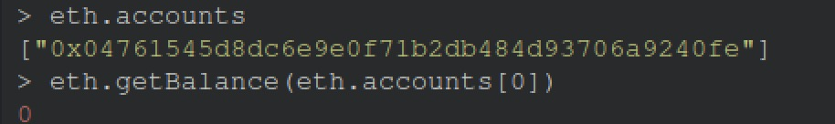
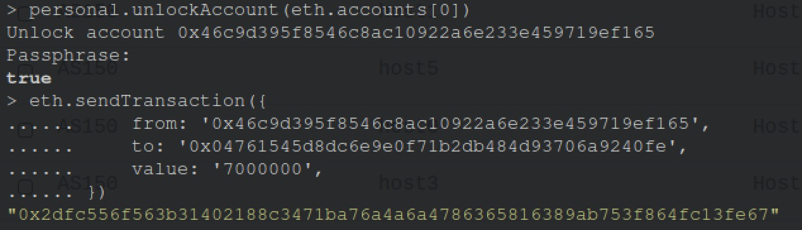
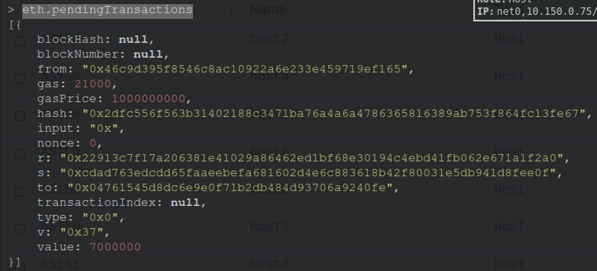
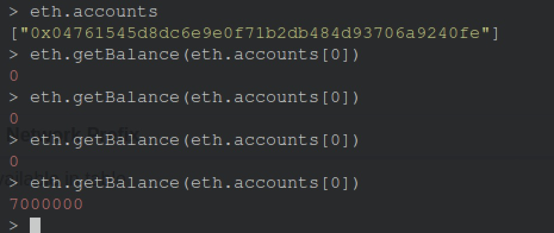

# Private Ethereum Network Example

## Step 1

Run `18-base-component.py`, in order to reuse a base component. In this base component, there are 7 AS, which are `AS150, AS151, AS152, AS153, AS154, AS160, AS161`. Each of AS has 1 hosts. All of hosts are able to connect each other.

## Step 2

Run `18-eth-private-network.py`, it would generate the project folder. Here are some explaination about the code:

Firstly, we need to load our base component, so we have:

```python3
sim = Emulator()
eth = EthereumService()

sim.load('base-component.bin')
```

Then we can install our ETH nodes. In here, I installed 4 nodes in our ETH network, you can install any number of nodes that you want.

```python3
# create eth node
e1 = eth.install("eth1")
e2 = eth.install("eth2")
e3 = eth.install("eth3")
e4 = eth.install("eth4")
```

Basically, after running all contianers, these ETH nodes will automatically peer each other, so don't worry that you don't know how to set it up properly.

You may optionally set nodes as boot nodes:

```python3
# optionally, set boot nodes.
e1.setBootNode(True)
e2.setBootNode(True)
```

Note the step above is optional. If you do not set any node as boot node, all nodes in the emulation will be each other's boot nodes, which may impact performance if you have a large number of nodes.

To let other nodes know the enode URL of the current node, the boot node hosts a text file with a simple HTTP server containing the URL. By default, it runs on port `8088`. If you have run some other services on the node on that port, you change change the bootnode http server port with `setBootNodeHttpPort`:

```python3
# optionally, set boot node http server port
e1.setBootNodeHttpPort(8081)
```

The step above is optional and put here for demonstration only.

Next, we would add bindings for these nodes:

```python3
# add bindings
sim.addBinding(Binding('eth1', filter = Filter(asn = 150)))
sim.addBinding(Binding('eth2', filter = Filter(asn = 151)))
sim.addBinding(Binding('eth3', filter = Filter(asn = 152)))
sim.addBinding(Binding('eth4', filter = Filter(asn = 153)))
```

In this example, we've installed 4 nodes in AS150, AS151, AS152, AS153. Just make sure that these AS are connectable, because these ETH nodes need to communicate with each other.

Lastly, add Ethereum layer into our emulator, and then render it.

```python3
sim.addLayer(eth)
sim.render()

sim.compile(Docker(), './eth-private-network')
```

After compiling, we can see the `eth-private-network` folder has been created.

## Step 3

Then go to `eth-private-network` folder, build and run all container by running `docker-compose build && docker-compose up`. After all containers running. You would see logs in docker console.

Now, let's attach any of ETH nodes container. Inside of container, we can attach to our ETH process console by running the following commands:

```
$ geth attach
```

**Update Jun/19/21**: Just type `geth attach` to get to the console. No need to set the `datadir` path anymore.

If everything goes smoothly, you would see a ETH console.

## Step 4: Check peering status

In ETH console, let's check if all of nodes join to our Ethereum network. We can type ```admin.peers``` to check peering status. Here is a picture.


## Step 5: Start a Miner process

Now, let's try to mine a block. Firsly, in ETH console, we can print out the balance of our ETH account. Type the following command:

```javascript
eth.getBalance(eth.accounts[0])
```

By default, the balance would be 0. Here is the picture:


Now, let's start our mine, type command: `miner.start(1)`, It will start a mining thread. We can check out the logs of docker to see if our miner process success or not:

```
$ docker logs -f as150h-host0-10.150.0.71 2>&1 | grep -C 10 mine
```

Just make sure the container name that launched miner is correct. Then you would see the mining logs like this:


After mining for a couple of minutes. We can stop mining by running command ```miner.stop()``` in the ETH console. Next, we can check the balance of account again, we would see the balance has changed, which is a bouns for mining a valid block.


As we can see, there are `128000000000000000000` ETH currency in our default account right now, which means we has mined successfully.

> Notice: The reason why we can easily mine a valid block is that when we built our ETH network, we have set the difficulty to 0 in initial step. That means we don't need higher hashrate to mine, just for educational purpose. But along with the successful mined block increasing. The difficulty also will be increased, so it would more and more difficult for mining.


## Make a Transaction

Now, let's try to make our first transaction in our private network. Firstly, we created 10 ETH nodes, and start all the containers. In each of ETH node, we started miner with 20 threads (run ```miner.start(20)```). After approx 10 minutes, in the first miner, we have many money in the account.


Next, let's attach another any of ETH node, and check out the balance of its account, we will see it's zero.



Right now we have two accounts. `0x46c9d395f8546c8ac10922a6e233e459719ef165` has 30000000000000000000 ETH balance, and `0x04761545d8dc6e9e0f71b2db484d93706a9240fe` has `0`.

Next, let's try to create a transaction to send 7000000 ETH to the second account. In the first account console, we have to unlock the account, otherwise we cannot send any transactions without unlocking. Type `personal.unlockAccount(eth.accounts[0])` to unlock it. It would prompt a password requirement. By default, the password is `admin`. Then we can use API `eth.sendTransaction()` to create a transaction.



As we can see, there are couple of parameters we have to provide, `from` is the address of first account, `to` is the address of second account that we want to send to. After enter the command, we will get a block hash that represents this transaction. We can use API `eth.getTransaction(hash)` to check out the status of this transaction or either using `eth.pendingTransactions` to list all pending transactions. Here is the picture.



After a while, we check the pending list again, we would see it's empty, which means the transaction has completed. Now, we can go to second account and check the balance again, we will see the balance changed.



As we can see, the second account has received the `7000000` ETH from the first account. That means we finished a transaction in our ETH network.

**Note**: after sending transaction, we need to make sure the miner has started, otherwise, this transaction will always be pending status. 

## Performance test

- ETH service is a pretty heavy service, if you want to run more than 20 ETH nodes, you might need to make sure that memory size is sufficient. Here are some performance test on my VM.
	- My VM setting: 4096MB memory and 2 core CPU.
	- When I close other processes in VM (like browser, editor.), 20 ETH nodes can be run in my VM, but the VM became slower, cannot even switch the window.
	- I’ve tried to adjust my VM’s memory. 25 ETH nodes can be running, but my VM is still very slow.
	- Approx memory for every single ETH node: 200MB.
- Some suggestion to optimize the service.
	- Find a light version of geth (ETH client software) on the Internet, instead of using full feature version. Because we just need to simulate the mining process.
	- From configuration perspective to reduce the memory usage, for example, turn off full sync mode, turn off log printing, turn off web3 interface etc.
