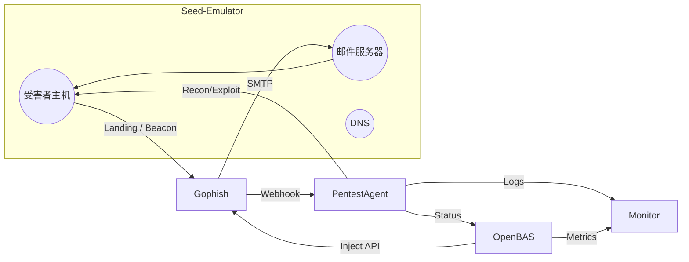

# 57 号综合安全评估实验架构设计

本文件汇总“特色协同演练”的整体拓扑、组件职责与数据流，供教师和学生在 Seed-Emulator 环境中复现完整攻防场景。

## 1. 架构分层

1. **基础设施层**
  - 复用 29 / 29-1 / 30 / 31 邮件实验生成的 ASN、路由、邮件服务器、受害主机。
    - 通过 `seed_network_overlay.yaml` 引入红队 (`hnode_4257_redteam`)、蓝队 (`hnode_4257_blueteam`) 与监控 (`hnode_4257_monitor`) 节点。
    - Seed 邮件栈的统一端口：SMTP 2525/2526/2527，Submission 5870/5871/5872，IMAP 1430/1431/1432，IMAPS 9930/9931/9932，Webmail 8000。

2. **攻击执行层**
  - **Gophish**：向 Seed 邮件域投递钓鱼邮件；落地页捕获凭据或执行脚本。
  - **PentestAgent**：Recon → Planning → Execution 三阶段自动化渗透，利用 Seed 靶标暴露的服务。

3. **演练指挥层**
  - **OpenBAS**：编排“特色协同演练”场景，触发 Gophish 活动、PentestAgent 阶段任务，并汇总结果指标。
  - **集成控制台** (`web_interface.py`)：统一展示容器健康、外部工具详情、拓扑与文档。

4. **数据分析层**
  - 可选部署 ELK / Prometheus，将 Seed 邮件日志、Gophish 活动记录、PentestAgent 输出、OpenBAS 指标集中展示。

## 2. 数据流概要

- **攻击链触发流程**
  1. OpenBAS “特色协同演练”场景调用 Gophish API，生成钓鱼活动与落地页。
  2. Seed 邮件受害者收到并点击邮件，向 Gophish 落地页发送凭据或执行载荷。
  3. Gophish Webhook 通知 PentestAgent，PentestAgent 针对受害主机执行 Recon/Exploit。
  4. PentestAgent 将执行状态回传 OpenBAS，同时写入共享 `../data/logs` 目录供控制台与监控读取。

- **监控回路**
  - 控制台通过 `integration_config.json` 定义的健康检查实时获取容器状态、HTTP/TCP 可用性。
  - 提取 Gophish `/api/campaigns`、PentestAgent `data/planning/*.json`、OpenBAS `/api/scenarios` 构成仪表盘。
  - 可选：借助 Filebeat 或 Fluentd，将上述数据同步进 ELK，形成跨实验的日志闭环。

## 3. 与 42 号实验的关系

- 42 号实验中的 `simulation_framework` 全部下线；调度由 OpenBAS、执行由 PentestAgent、钓鱼由 Gophish 完成。
- 42 号实验的日志采集脚本改为监听真实工具 Webhook，或读取真实执行日志写入 Seed 监控链路。
- 42 号实验的 Web 控制台被替换为当前的 Flask 仪表盘，同时保留原有 UI 结构，便于教学平滑迁移。

## 4. TODO 列表

- [ ] 引入统一事件总线（如 NATS / RabbitMQ）整合 Gophish、PentestAgent、OpenBAS Webhook
- [ ] 编写 PentestAgent 针对 Seed 靶标的 Recon / Exploit 插件与资产指纹模块
- [ ] 在 OpenBAS 中标准化“特色协同演练”模板，纳入 Seed 官方实验清单
- [ ] 评估并实现监控堆栈（ELK / Prometheus）中指标、日志的自动化接入脚本

## 5. 参考

- [Seed-Emulator 官方文档](https://seedsecuritylabs.org/)
- [Gophish 官方手册](http://getgophish.com/documentation)
- [PentestAgent README](https://github.com/nbshenxm/pentest-agent)
- [OpenBAS 文档](https://docs.openbas.io/)
