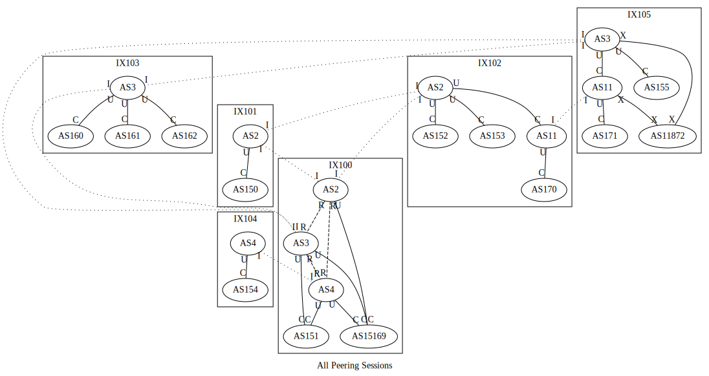

# Mini Internet

This is one of the more sophisticated examples; here, we combine what we have used from previous examples and build a larger simulation. This document assumes the reader has some idea of what each layer does; it will be better to go through the other examples before proceeding with this one. In this example, we will set up:

- Three tier-1 transit providers: AS2, AS3, and AS4 (buy transit from no one, peer with each other), 
- two tier-2 transit provider: AS11 (buy transit from AS2 and AS3) and AS12 (buy transit from AS2 and AS4),
- some content provider and service ASes:
    - AS150: web server, recursive DNS resolver,
    - AS151: web server,
    - AS152: web server,
    - AS153: recursive DNS resolver,
    - AS154: reverse DNS (`in-addr.arpa.`),
    - AS155: Cymru IP ASN origin service,
    - AS160: root DNS,
    - AS161: `.com`, `.net` and `.arpa` TLD DNS,
    - AS162: `as150.net`, `as151.net` and `as152.net` DNS,
    - AS171 & AS172: end-user ASes for OpenVPN access,
    - AS15169 (Google): "Google" recursive DNS resolver, announces the `8.8.8.0/24` prefix, to host the resolver on `8.8.8.8`, and,
    - AS11872 (Syracuse University): real-world AS (announces the prefixes announced by AS11872 in the real-world, and route it to the real-world). 
- six internet exchanges (100-105), and
- DNSSEC for `as150.net`, `as151.net` and `as152.net`.

The topology is rather complex; here's the Graphviz output of the `Bgp` layer:



Each edge indicates a BGP session. 

- Regular lines indicate regular BGP sessions.
- Dashed lines indicate MLPA (Multi-Lateral Peering Agreement) peering, or route-server peering sessions.
- Dotted lines indicate internal peering sessions (IBGP).

The heads and tails of edges are labeled with one of the following labels:

- `C` means this end is the customer end of a provider-customer transit session.
- `U` means this end is the upstream (i.e., the provider) end of a provider-customer transit session.
- `P` means the session is a regular peering session.
- `R` means the session is an MLPA (Multi-Lateral Peering Agreement) peering, or route-server peering sessions. It is functionally the same as the `P` sessions.
- `X` means the session has an unspecified role; this will be explained later.

Route export filters for different sessions are different:

- For provider-customer transit sessions, the `C` end will only export its own prefixes and its' customers' prefixes; the `U` end will export everything (routes from other customers, peers, upstreams).
- For peer sessions (`P`), both sides export only their own prefixes and their' customers' prefixes.
- For unspecified sessions (`X`), both sides export all routes (routes from other customers, peers, upstreams) to each other.

## Create helpers

We will be creating multiple AS with similar properties and internal topology. We can create a few helper functions to create those AS with similar properties.

### Real-world AS creator

```python
def make_real_as(asn: int, exchange: int, exchange_ip: str):
    real_as = base.createAutonomousSystem(asn)
    real_router = real.createRealWorldRouter(real_as)

    real_router.joinNetworkByName('ix{}'.format(exchange), exchange_ip)
```

The real-world AS helper creates a real-world AS in the simulator. It works by utilizing the `Reality` layer. 

We first create an AS with the `createAutonomousSystem` call of the base layer. We then add a real-world router to the AS with the `createRealWorldRouter` call of the real-world layer. Last, we connect the real-world router to an internet exchange with the `joinNetworkByName` call of the node class. Since real-world ASN can be outside the 2~254 range, we override the auto address assignment by manually assigning an address when joining the network.

### Service AS creator

```python
def make_service_as(asn: int, services: List[Service], exchange: int):
    service_as = base.createAutonomousSystem(asn)

    router = service_as.createRouter('router0')

    net = service_as.createNetwork('net0')

    routing.addDirect(net)

    router.joinNetwork(net)

    router.joinNetworkByName('ix{}'.format(exchange))

    for service in services:
        server = service_as.createHost('s_{}'.format(service.getName().lower()))

        server.joinNetwork(net)

        service.installOn(server)
```

### DNS AS creator

```python
def make_dns_as(asn: int, zones: List[str], exchange: int):
    dns_as = base.createAutonomousSystem(asn)

    router = dns_as.createRouter('router0')

    net = dns_as.createNetwork('net0')

    routing.addDirect(net)

    router.joinNetwork(net)

    router.joinNetworkByName('ix{}'.format(exchange))

    for zone in zones:
        server = dns_as.createHost('s_{}dns'.format(zone.replace('.','_')))

        server.joinNetwork(net)

        dns.hostZoneOn(zone, server)
```

### User AS creator

```python
def make_user_as(asn: int, exchange: str):
    user_as = base.createAutonomousSystem(asn)

    router = user_as.createRouter('router0')

    net = user_as.createNetwork('net0')

    routing.addDirect(net)

    real.enableRealWorldAccess(net)

    router.joinNetwork(net)
    router.joinNetworkByName('ix{}'.format(exchange))
```

### Transit AS creator

```python
def make_transit_as(asn: int, exchanges: List[int], intra_ix_links: List[Tuple[int, int]]):
    transit_as = base.createAutonomousSystem(asn)

    routers: Dict[int, Router] = {}

    for ix in exchanges:
        routers[ix] = transit_as.createRouter('r{}'.format(ix))
        routers[ix].joinNetworkByName('ix{}'.format(ix))

    for (a, b) in intra_ix_links:
        net = transit_as.createNetwork('net_{}_{}'.format(a, b))

        routing.addDirect(net)

        routers[a].joinNetwork(net)
        routers[b].joinNetwork(net)
```

## Create internet exchanges

```python
base.createInternetExchange(100)
base.createInternetExchange(101)
base.createInternetExchange(102)
base.createInternetExchange(103)
base.createInternetExchange(104)
base.createInternetExchange(105)
```

## Create transit providers

### Tier 1 transit providers

```python
make_transit_as(2, [100, 101, 102], [
    (100, 101),
    (101, 102),
    (102, 100)
])

make_transit_as(3, [100, 103, 105], [
    (100, 103),
    (103, 105),
    (105, 100)
])

make_transit_as(4, [100, 104], [
    (100, 104)
])
```

### Tier 2 transit providers

```python
make_transit_as(11, [102, 105], [
    (102, 105)
])

make_transit_as(12, [101, 104], [
    (101, 104)
])
```

## Create real-world ASes

```python
make_real_as(11872, 105, '10.105.0.250') 
```

## Create service ASes

```python
make_service_as(150, [web, ldns], 101)
make_service_as(151, [web], 100)
make_service_as(152, [web], 102)
make_service_as(153, [ldns], 102)
make_service_as(154, [rdns], 104)
make_service_as(155, [cymru], 105)
```

## Create DNS infrastructure

### Root and TLD NS

```python
make_dns_as(160, ['.'], 103)
make_dns_as(161, ['net.', 'com.', 'arpa.'], 103)
```

### Other NS

#### Adding records

```python
dns.getZone('as150.net.').addRecord('@ A 10.150.0.71')
dns.getZone('as151.net.').addRecord('@ A 10.151.0.71')
dns.getZone('as152.net.').addRecord('@ A 10.152.0.71')
```

#### Hosting zones

```python
make_dns_as(162, ['as150.net.', 'as151.net.', 'as152.net.'], 103)
```

## Create user AS

```python
make_user_as(170, 102)
make_user_as(171, 105)
```

## Configure DNSSEC

```python
dnssec.enableOn('.')
dnssec.enableOn('net.')
dnssec.enableOn('as150.net.')
dnssec.enableOn('as151.net.')
dnssec.enableOn('as152.net.')
```

## Becoming Google: Hosting the 8.8.8.8 DNS

```python
google = base.createAutonomousSystem(15169)

google_dns_net = google.createNetwork('google_dns_net', '8.8.8.0/24')

google_dns = google.createHost('google_dns')

google_dns.joinNetwork(google_dns_net, '8.8.8.8')

ldns.installOn(google_dns)

routing.addDirect(google_dns_net)

google_router = google.createRouter('router0')

google_router.joinNetwork(google_dns_net)
google_router.joinNetworkByName('ix100', '10.100.0.250')
```

## Configure peerings

### RS peerings

```python
ebgp.addRsPeer(100, 2)
ebgp.addRsPeer(101, 2)
ebgp.addRsPeer(102, 2)

ebgp.addRsPeer(100, 3)
ebgp.addRsPeer(103, 3)
ebgp.addRsPeer(105, 3)

ebgp.addRsPeer(100, 4)
ebgp.addRsPeer(104, 4)
```

### Private peering and transits

```python
ebgp.addPrivatePeering(102, 2, 11, PeerRelationship.Provider)
ebgp.addPrivatePeering(105, 3, 11, PeerRelationship.Provider)

ebgp.addPrivatePeering(101, 2, 12, PeerRelationship.Provider)
ebgp.addPrivatePeering(104, 4, 12, PeerRelationship.Provider)

ebgp.addPrivatePeering(101, 2, 150, PeerRelationship.Provider)
ebgp.addPrivatePeering(101, 12, 150, PeerRelationship.Provider)

ebgp.addPrivatePeering(100, 3, 151, PeerRelationship.Provider)
ebgp.addPrivatePeering(100, 4, 151, PeerRelationship.Provider)

ebgp.addPrivatePeering(102, 2, 152, PeerRelationship.Provider)

ebgp.addPrivatePeering(102, 2, 153, PeerRelationship.Provider)

ebgp.addPrivatePeering(104, 4, 154, PeerRelationship.Provider)
ebgp.addPrivatePeering(104, 12, 154, PeerRelationship.Provider)

ebgp.addPrivatePeering(105, 3, 155, PeerRelationship.Provider)

ebgp.addPrivatePeering(103, 3, 160, PeerRelationship.Provider)

ebgp.addPrivatePeering(103, 3, 161, PeerRelationship.Provider)
ebgp.addPrivatePeering(103, 3, 162, PeerRelationship.Provider)

ebgp.addPrivatePeering(102, 11, 170, PeerRelationship.Provider)

ebgp.addPrivatePeering(105, 11, 171, PeerRelationship.Provider)

ebgp.addPrivatePeering(105, 3, 11872, PeerRelationship.Unfiltered)
ebgp.addPrivatePeering(105, 11, 11872, PeerRelationship.Unfiltered)

ebgp.addPrivatePeering(100, 2, 15169, PeerRelationship.Provider)
ebgp.addPrivatePeering(100, 3, 15169, PeerRelationship.Provider)
ebgp.addPrivatePeering(100, 4, 15169, PeerRelationship.Provider)
```

## Configure nameserver for host nodes

```python
reg = Registry()
for ((scope, type, name), object) in reg.getAll().items():
    if type != 'hnode': continue
    host: Node = object
    host.addStartCommand('echo "nameserver 8.8.8.8" > /etc/resolv.conf')
```

## Rendrer the simulation 

```python
rendrer.addLayer(base)
rendrer.addLayer(routing)
rendrer.addLayer(ebgp)
rendrer.addLayer(ibgp)
rendrer.addLayer(ospf)
rendrer.addLayer(real)
rendrer.addLayer(web)
rendrer.addLayer(dns)
rendrer.addLayer(ldns)
rendrer.addLayer(dnssec)
rendrer.addLayer(cymru)
rendrer.addLayer(rdns)

rendrer.render()
```

## Compile the simulation

```python
docker_compiler.compile('./mini-internet')
graphviz.compile('./mini-internet/_graphs')
```

## Remarks