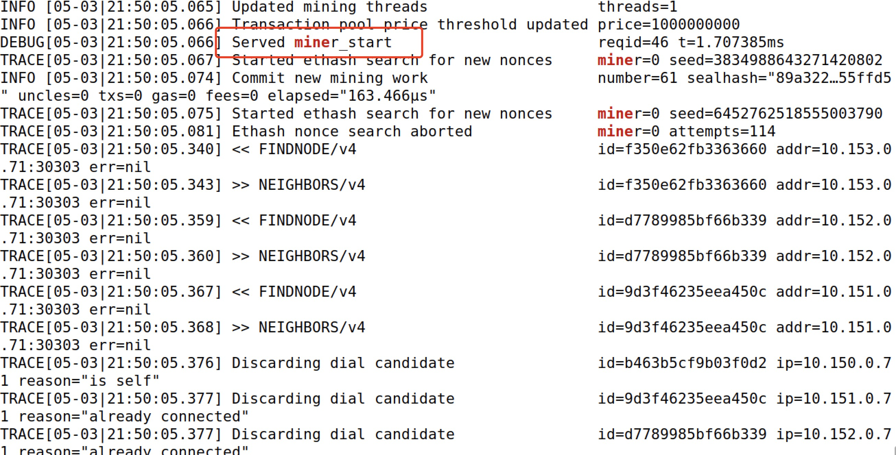
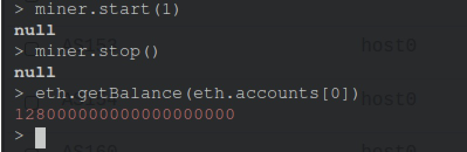

# Private Ethereum Network Example

## Step 1

Run `18-base-component.py`, in order to reuse a base component. In this base component, there are 7 AS, which are `AS150,AS151,AS152,AS153,AS154,AS160,AS161`. Each of AS has 1 hosts. All of hosts are able to connect each other.

## Step 2

Run `18-eth-private-network.py`, it would generate the project folder. Here are some explaination about the code:

Firstly, we need to load our base component, so we have:

```python3
sim = Simulator()
eth = EthereumService()

sim.load('base-component.bin')
```

Then we can install our ETH nodes. In here, I installed 4 nodes in our ETH network, you can install any number of nodes that you want.

```python3
#Create eth node
eth.install("eth1")
eth.install("eth2")
eth.install("eth3")
eth.install("eth4")
```

Basically, after running all contianers, these ETH nodes will automatically peer each other, so don't worry that you don't know how to set it up properly. Next, we would add bindings for these nodes:

```python3
#Add bindings
sim.addBinding(Binding('eth1', filter = Filter(asn = 150)))
sim.addBinding(Binding('eth2', filter = Filter(asn = 151)))
sim.addBinding(Binding('eth3', filter = Filter(asn = 152)))
sim.addBinding(Binding('eth4', filter = Filter(asn = 153)))
```

In this example, we've installed 4 nodes in AS150, AS151, AS152, AS153. Just make sure that these AS are connectable, because these ETH nodes need to communicate with each other.

Lastly, add Ethereum layer into our emulator, and then render it.

```python3
sim.addLayer(eth)
sim.render()

sim.compile(Docker(), './eth-private-network')
```

After compiling, we can see the `eth-private-network` folder has been created.

## Step 3

Then go to `eth-private-network` folder, build and run all container by running `docker-compose build && docker-compose up`. After all containers running. You would see logs in docker console.

Now, let's attach any of ETH nodes container. Inside of container, we can attach to our ETH process console by running the following commands:

```geth attach /tmp/eth*/geth.ipc```

> Notice: In every ETH nodes, the data folder would be a slightly different, but all folder name will start with ```/tmp/eth```. Every node has a unique number that ends with the folder name.

If everything goes smoothly, you would see a ETH console.

## Step 4: Check peering status

In ETH console, let's check if all of nodes join to our Ethereum network. We can type ```admin.peers``` to check peering status. Here is a picture.


## Step 5: Start a Miner process

Now, let's try to mine a block. Firsly, in ETH console, we can print out the balance of our ETH account. Type the following command:

```eth.getBalance(eth.accounts[0])```

By default, the balance would be 0. Here is the picture:


Now, let's start our mine, type command: ```miner.start(1)```, It will start a mining thread. We can check out the logs of docker to see if our miner process success or not:

```docker logs -f as150h-host0-10.150.0.71 2>&1 | grep -C 10 mine```

Just make sure the container name that launched miner is correct. Then you would see the mining logs like this:



After mining for a couple of minutes. We can stop mining by running command ```miner.stop()``` in the ETH console. Next, we can check the balance of account again, we would see the balance has changed, which is a bouns for mining a valid block.



As we can see, there are ```128000000000000000000``` ETH currency in our default account right now, which means we has mined successfully.

> Notice: The reason why we can easily mine a valid block is that when we built our ETH network, we have set the difficulty to 0 in initial step. That means we don't need higher hashrate to mine, just for educational purpose. But along with the successful mined block increasing. The difficulty also will be increased, so it would more and more difficult for mining.