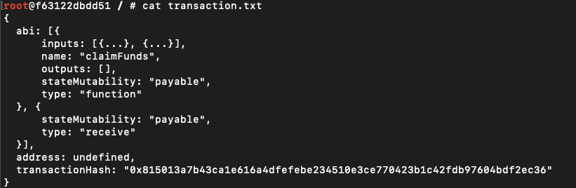
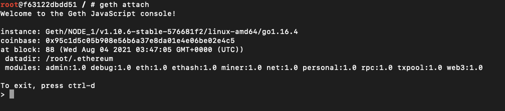
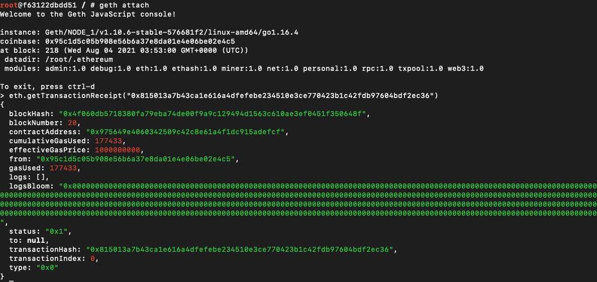
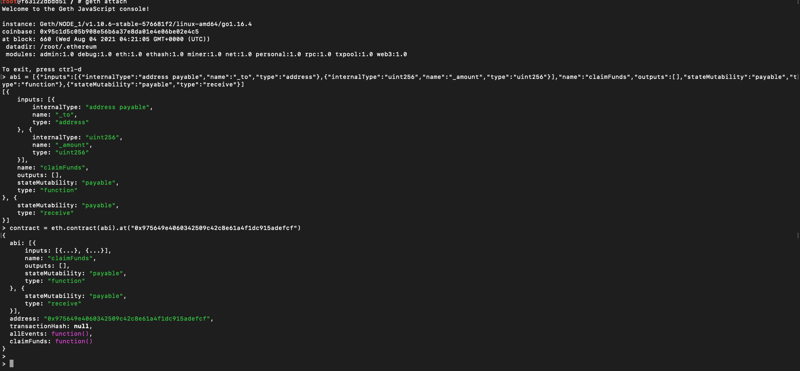
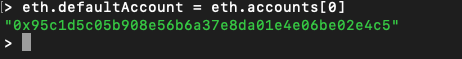
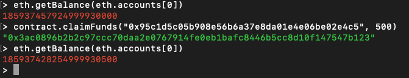

## Advance Ethereum API's
- we have created a set of API's which perform certain operation's when Miner nodes are launched these api perform certain ethereum operations.

API's 
	Before Calling any api we need to create a Object of EthereumConsoleManager which attaches the commands to the respective Ethereum miner nodes.
	The Object can be created by 
	```
	esm = EthereumConsoleManager()
	```
	Now using the EthereumConsoleManager object we can call certain API which perform certain tasks.
	Note: These API's can only be called after the Emulator's render process is complete.

## 1: Create new account:

- In here we have exposed an API which creates an new account in the specified miner nodes.
- By default when we launch a new miner node it gets created with a new account. 
		
		eth = EthereumService()
		e2 = eth.install("eth2")
		esm.createNewAccountInNode(e2, eth)
		
	where e2 representes the 2nd miner node in which I want to create a new Account.
	
##2: Start Miner Node:

- In here we have exposed an API which starts miner in specfic nodes or all miner nodes.
- If we dont call this API. By default the miner nodes after launch they stay idle instead of mining.
		
		eth = EthereumService()
		e1 = eth.install("eth1")
		e2 = eth.install("eth2")
		esm.startMinerInAllNodes(eth) // to start in all node (e1 and e2)
		esm.startMinerInNode(e2, eth) // to start Miner node in e2

##3: Deploy Smart Contract:

- In here we have exposed an API which deploys an smart Contract into the Ethereum blockchain.
- The deployment takes some time (approx 10-15 min) beacuse deploying an contract requires ethers and as soon as we launch a miner node our account does not have ethers as a result we need to mine before deploying the contract.
- By default if we are using our custom API minimum ethers required to deploy a smart contract is 1000000 ethers so that miners can pick the smart contract on as it has higher returns and it is always deducted from the first account of the miner (further development can be made to make the api configurable). 
- inroder for the api to work we need to install Solidity with a version above 0.8.0 Install can be found [here](https://docs.soliditylang.org/en/v0.8.0/installing-solidity.html#linux-packages)

		eth = EthereumService()
		e1 = eth.install("eth1")
		esm.deploySmartContractOn(e1, eth, "./examples/18-eth-private-network/dummy.sol") // here dummy.sol representes the path to the solidity file which is our smart contract.
	
	Once the contract gets deployed onto the network a transaction.txt file gets generated with hash of the contract. This file can be found in the miner node for example in our case it will be node e1.

	Once The Contract is Deployed we can perform certain task on them with the Geth console.
	By default we have supplied a dummy.sol file which acts as a bank account ( such as storing ethers and transferring the ethers from contract to any specfied account).

### Now in order to send ethers from one account to the smart contract (all the commands gets executed in the ethereum console except step 1).

- Step-1: Get the Transcations hash of the Contract by reading the transaction.txt file from smart contract deployed node.


- Step-2: launch the ethereum console of any Miner node and perform the following command.
	 
		geth attach 
	 
	This command connects us to the ethereum network and gives us a Go-ethereum console


- Step-3: Now we need to get the smart contract address so that we can perform the transcations ( here we can consider the smart constract is like the bank account address), here we supply the transcation hash to ethereum network which will give us the address of the contract
	
		eth.getTransactionReceipt("<Contract-hash>") 
	


- Step-4: Now we send some ethers from our account to smart contract. This needs to be done in 2 commands which goes as below 
	
		personal.unlockAccount(eth.accounts[0], "admin") //which opens the account to perform the transactions.
		eth.sendTransaction ({ from: "<From-account-number>", to: "Smart-contract-address", value: "<ethers-you-want-to-transfer" })
	
	As we see below the number of ethers transferred has reduced the balance of the account.


### Now in order to send ethers from smart contract to specfic account.(all the commands gets executed in the ethereum console)
	
- Step-1: In here if we need to call smart Contract specfic api we need to re-create the Contract object so that we can perform certain task or call the api's of the smart contract.

		abi = <contents-of-the-abi-file-generated>
		contract = eth.contract(abi).at("<contract-address")
	.abi file can be found inside examples/18-eth-private-network


- Step-2: As a ethereum miner node we can have many accounts as a result when an account recives ethers miner need to specify the default account 

		eth.defaultAccount = eth.accounts[0]


	
- Step-3: now we need to unlock our account so that it can recives the ethers from the smartContract
	
		personal.unlockAccount(eth.accounts[0], "admin") //which opens the account to perform the transactions.
	

	
- Step-4: now we call the smart contract api which transfers the ethers from smart contract to specfic accounts
	
		contract.claimFunds('<account-address-to-which-the-amount-is-transferred>', 500)
	


