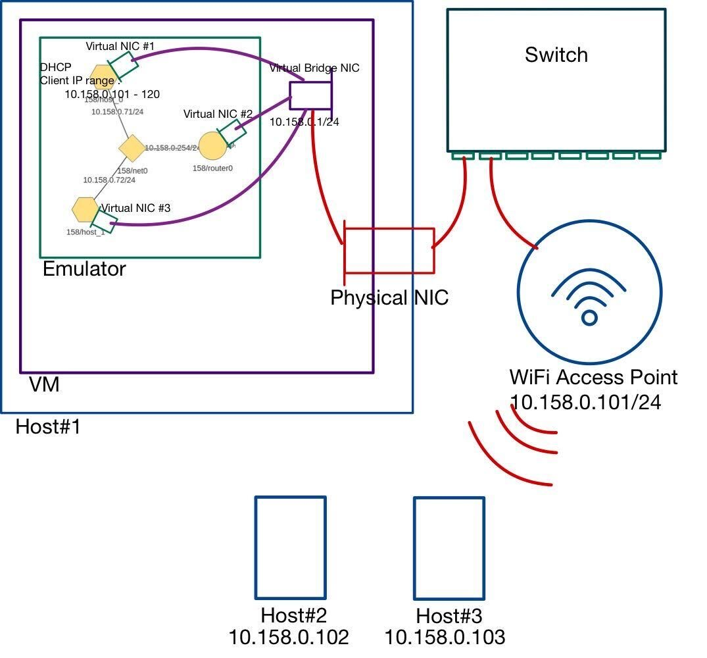
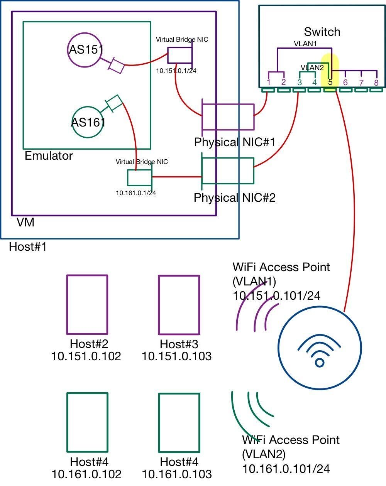
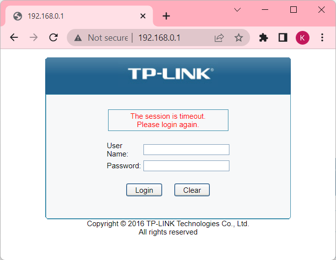
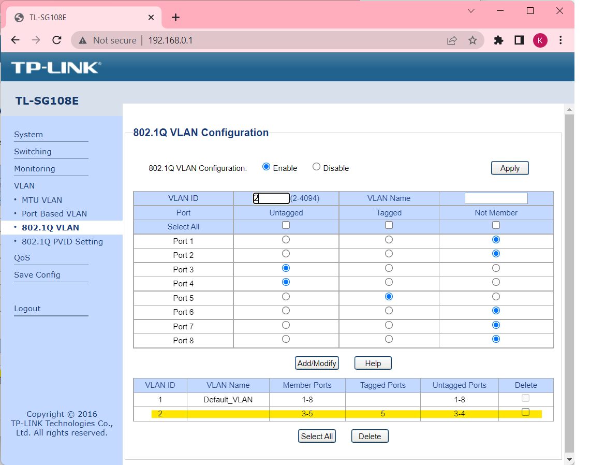

# BYOI;Bring Your Own Internet 
In this example, we show how the SEED Emulator to emulate the
Internet Service Provider that provides the Internet service 
to home (such as Spectrum). The scenario is described in the 
diagram as below.


## Tables

### [1. Connecting Emulator to WiFi](#connecting-emulator-to-wifi)
#### [1.1 Single WiFi Access Point](#1-single-wifi-access-point)
#### [1.2 Multiple WiFi Access Points](#2-multiple-wifi-access-points)
### [2. Distributed Emulators(switch verstion)](#distributed-emulation-switch-version)

## Connecting Emulator to WiFi
### (1) Single WiFi Access Point


- **Environment Requirements**
  - OS : Ubuntu 20.04
  - USB to Ethernet Adapter (Optional); It is needed when Ubuntu running on a virtual machine.
  - WiFi Access Point 
    - Model : UniFi AP-AC-Lite
  - Switch
    - Model : TL-SG108E
  - 2 Ethernet cables

**Step 1) Deploy a dhcp server**
```
# Create a DHCP server (virtual node).
dhcp = DHCPService()

# Default DhcpIpRange : x.x.x.101 ~ x.x.x.120
# Set DhcpIpRange : x.x.x.125 ~ x.x.x.140
dhcp.install('dhcp-01').setIpRange(125, 140)

# Customize the display name (for visualization purpose)
emu.getVirtualNode('dhcp-01').setDisplayName('DHCP Server')

# Create new host in AS-151, use it to host the DHCP server.
# We can also host it on an existing node.
as151 = base.getAutonomousSystem(151)
as151.createHost('dhcp-server').joinNetwork('net0')
```

**Step 2) Make the VM to use the physical NI directly (VirtualBox)**

The Host's network interface which is bridged to the docker's bridge interface should be a physical one. When this project is set on a virtual machine environment, an usb to ethernet adapter is needed. When you bridge a virtual network interface created by virtual machine to the docker's bridge interface, the bridge between the virtual network interface and host's interface will be disconnected, which leads the link between the switch and the host to be disconnected. For this reason, when you run this project on a virtual machine, use an usb to ethernet adapter and make the virtual machine to use the physical ehthernet adapter directly.

Please go through these steps to make the ethernet usb attach to the virtual machine on Virtualbox. 

- Install VirtualBox Extension Pack ; Without Extension Pack, VirtualBox only support USB 1.1
  -  Download Extension Pack (https://www.virtualbox.org/wiki/Downloads)
  -  Install Extension 
     -  *File -> Preferences -> Extensions -> Add New Packages -> Select the Package download from above*
- Set VM to use USB 3.0 Controller
  - *VM -> Settings -> USB -> select USB 3.0*
- Set VM to use the USB to Ethernet Adapter


**Step 3) Bridge Physical NIC to the Virtual Bridge NIC**

Once the Host's network interface is bridged to the docker's bridge interface, DHCP server inside the emulator will assign the ip to the Wifi Accesspoint. Once you connect to the Wifi from the Phyisical Devices, the devices can connect (ping or visit webpages) to the hosts inside the emulators. 

- Find name of Physical NIC
  - You can get the interface name through `ip -br addr | grep -vE 'veth|br'` command.
This command will show you network interfaces name without `veth` or `br`.


- Bidge Physical NIC to the Virtual Bridge NIC; Use bridge.sh script

    ```
    usage: ./bridge.sh -i {interface} -a {ASN}
    ```

    In this example, the physical interface name that I use is `enx00e04cadd82a`. And the ASN that I use is 151 as I installed the dhcp server at asn-151.
    So the command will be as below.

    ` ./bridge.sh -i enx00e04cadd82a -a 151`

**Step 4) Link Physical NIC and WiFi Access Point to the Switch**


### (2) Multiple WiFi Access Points


- **Environment Requirements**
  - OS : Ubuntu 20.04
  - USB to Ethernet Adapter (Optional); It is needed when Ubuntu running on a virtual machine.
  - WiFi Access Point 
    - Model : UniFi AP-AC-Lite
  - Switch
    - Model : TL-SG108E
  - 3 Ethernet cables

**Step 1) Switch VLAN settings**

    VLAN Settings
    - VLAN1 : port# 1,2,5,6,7,8
    - VLAN2 : port# 3,4,5
    - Port #5 : trunk port

  
1. Connect PC to Switch
2. Assign static ip 192.168.0.2 to the PC
3. Visit http://192.168.0.1 which is managment site that the switch hosts
   - ID : admin
   - Password : admin

4. Configure 802.1Q VLAN

5. Configure 802.1Q PVID


**Step 2) WiFi Accesspoint settings**
1. Access to the management page 
   - refer : https://dl.ui.com/guides/UniFi/UniFi_Controller_V5_UG.pdf 

2. Configure VLAN : *Settings -> Networks -> create*


3. Configure Access Point #1 using vlan1(default) : *Settings -> WiFi -> New WiFi*


1. Configure Access Point #2 using vlan2 : *Settings -> WiFi -> New WiFi*


**Step 3) Deploy DHCP servers**

In this example, as151 and as161 are used to provide Internet service 
to the Physical World. Therefore, DHCP service need to be installed 
in as151 and as161.

Refer to Step 1) from the previous example

**Step 4) Connect two physical network cards to the VM**

Refer to Step 2) from the previous example

**Step 5) Bridge Physical NIC to the Virtual Bridge NIC**

Refer to Step 3) from the previous example.

**Step 6) Link Physical NIC and WiFi AccessPoint to the Switch**
 
## Distributed Emulation (Switch Version)
  Distributed Emulation allows students to join the emulation by connecting 
their emulators together. In this example the emulator inside the Host#1 
exposes Internet Exchange 100 and 101. And Host#2 and Host#3 bridge to
ix100 and ix101 respectively. In order to make the emulator 
inside the Host#2 bridge to the Host#1 emulator's ix100, Host#2 also 
need to expose its ix100. Similarly, Host#2 emulator need to expose its 
ix101 to bridge to the Host#1 emulator. 

  Once Host#1 and #2 are bridged using the techniques learned from the preivous
examples, Subnet 10.100.0.0/24 from Host#1 and Host#2 are share the same LAN 
through the switch. Further configuration is needed in order to make whole nodes
from each emulators connect, which is BGP peering settings. 


Please refer this for further information about Peer Relationship: 
https://github.com/wonkr/seed-emulator/blob/development/docs/user_manual/bgp_peering.md 


- **Environment Requirements**
  - OS : Ubuntu 20.04
  - 4 USB to Ethernet Adapters
  - Switch
    - Model : TL-SG108E
  - 4 Ethernet cables

**BGP Peering**
||Host#1|Host#2|Host#3|
|ix100|AS2, AS3|AS5, AS6||
|ix101|AS2, AS4||AS7, AS8|

BGP Peering may differ depending on the business relationship. In this example, 
AS2 and AS5 has Provider-Customer relation and AS3 and AS6 has Peer-Peer relation.

**Peer Host#1 and Host#2**

If AS2 and AS5 peered with Provider and Customer relation, AS5 can connect
to the whole prefixes from Host1. But AS2 only can connect to the downstream of AS5.
AS2 cannot ping to the nodes that use AS6. As AS3 and AS6 peered with peer
to peer relation, only downstream of AS3 from Host1 can connect to the downstream
of AS6 from Host2.

Peer-1) AS2 - AS5 : Provider - Customer

- Add protocol to /etc/bird/bird.conf at *10.100.0.2* & Run birdc configure
```
protocol bgp c_as5 {
  ipv4 {
      table t_bgp;
      import filter {
          bgp_large_community.add(CUSTOMER_COMM);
          bgp_local_pref = 30;
          accept;
      };
      export all;
      next hop self;
  };
  local 10.100.0.2 as 2;
  neighbor 10.100.0.5 as 5;
}
```

- Add protocol to /etc/bird/bird.conf at *10.100.0.5* & Run birdc configure

```
protocol bgp u_as2 {
    ipv4 {
        table t_bgp;
        import filter {
            bgp_large_community.add(PROVIDER_COMM);
            bgp_local_pref = 10;
            accept;
        };
        export where bgp_large_community ~ [LOCAL_COMM, CUSTOMER_COMM];
        next hop self;
    };
    local 10.100.0.5 as 5;
    neighbor 10.100.0.2 as 2;
}
```

Peer-2) AS3 - AS6 : Peer - Peer
- Add protocol to /etc/bird/bird.conf at *10.100.0.3* & Run birdc configure
```
protocol bgp p_as6 {
  ipv4 {
    table t_bgp;
    import filter {
        bgp_large_community.add(PEER_COMM);
        bgp_local_pref = 20;
        accept;
    };
    export where bgp_large_community ~ [LOCAL_COMM, CUSTOMER_COMM];
    next hop self;
    };

  local 10.100.0.3 as 3;
  neighbor 10.100.0.6 as 6;
}
```

- Add protocol to /etc/bird/bird.conf at *10.100.0.6* & Run birdc configure

```
protocol bgp p_as3 {
    ipv4 {
      table t_bgp;
      import filter {
          bgp_large_community.add(PEER_COMM);
          bgp_local_pref = 20;
          accept;
      };
      export where bgp_large_community ~ [LOCAL_COMM, CUSTOMER_COMM];
      next hop self;
    };

    local 10.100.0.6 as 6;
    neighbor 10.100.0.3 as 3;
}
```


