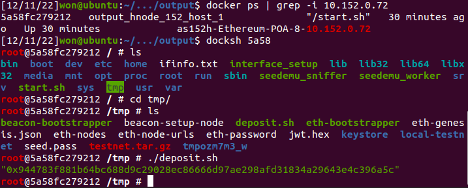

# Ethereum PoS - The Merge

In this example, we show how the SEED Emulator to emulate
The Merge that is an upgrade to proof-of-stake.
In the real world, consensus transition occurs from proof-of-work
to proof-of-stake. However, in the emulation, we starts the
blockchain with proof-of-authority and then transits to proof-of-stake.
With proof-of-authority, we can allocate a balance to specific accounts
and we do not need to wait for miner to accumulate enough Ethereum to
stake for proof-of-stake consensus.


## Table of contents

### [1. Emulate The Merge](#1-emulate-the-merge)

#### [1.1 Internet Emulator Base](#11-internet-emulator-base)

#### [1.2 Creating Ethereum POA Node](#12-creating-ethereum-poa-node)

#### [1.3 Enable POS](#13-enable-pos)

#### [1.4 Creating Beacon Setup Node](#14-creating-beacon-setup-node)

#### [1.5 Add Validator](#15-add-validator)

### [2. Introduction to PoS](#2-introduction-to-pos)

#### [2.1 Ethereum Upgrades](#21-ethereum-upgrades)

### [3. Understanding How Beaconchain Conducts PoS Mechanism](#3-understanding-pos-implementation-in-ethereum)

#### [3.1 Beacon Chain](#31-beacon-chain)

#### [3.2 Time Period](#32-time-period)

#### [3.3 Staking and Validator Activation](#33-staking-and-validator-activation)

#### [3.4 The Roles of Validators](#34-the-roles-of-validators)

#### [3.5 Gasper](#35-gasper)

# 1. Emulate `The Merge`

## 1.1 Internet Emulator Base

In this example, we emulate the internet with 10 stub ASes.

ASes : [150, 151, 152, 153, 154, 160, 161, 162, 163, 164]

Each stub AS has 3 hosts, and the emulator has 30 hosts in total

For example, the ips of 3 hosts in each AS 150 and AS 151 will be assigned as below

- 10.150.0.71
- 10.150.0.72
- 10.150.0.73
- 10.151.0.71
- 10.151.0.72
- 10.151.0.73

## 1.2 Creating Ethereum POA Node

We create the Ethereum POA nodes at the Ethereum layer.

```python
eth = EthereumService()
asns = [150, 151, 152, 153, 154, 160, 161, 162, 163, 164]

for asn in asns:
    for id in range(hosts_total):
        # Create POA Ethereum nodes
        e:EthereumServer = eth.install("eth{}".format(i)).setConsensusMechanism(ConsensusMechanism.POA)
        # Create Docker Container Label named 'Ethereum-POS-i'
        e.appendClassName('Ethereum-POS-{}'.format(i))
        # unlock execution layer(Geth) accounts to enable sign & send transaction via http api.
        e.unlockAccounts()
        # enable Geth to communicate with geth node via http
        e.enableGethHttp()
```

## 1.3 Enable POS

To make a consensus transition from POA to POS, we need to
set a node to enable POS. When enable POS, we can set `terminal_total_difficulty`, which is the value to designate when the Merge is happen. In POA, difficulty is tend to increase by 2 for every one block. And in this example, a block
is sealed for every 15 seconds. If we set `terminal_total_difficulty` to 20,
the Ethereum blockchain will keep POA for approximately 150sec (20/2\*15) and then conduct the Merge to change the consensus mechanism to POS.
The reason why we keep POA for a while is we have deploy a `deposit contract` to stake for validators before the switch to POS.

```python
e.enablePoS(terminal_total_difficulty=20)
```

## 1.4 Creating Beacon Setup Node

In order to run Ethereum PoS, you need to run not only the mainnet (execution layer) but also the beacon chain (consensus layer). In this example, we use Geth software
to run execution layer and Lighthouse to run consensus layer.
To run a beacon node, config information is needed.  
Like we set genesis.yaml when running Geth, genesis configurations is needed when running Lighthouse. A Beacon Setup Node take care of configuration files which is needed to run Beacon Node. The following code shows how to create beacon setup node.
The Beacon Setup Node is essential to run POS.

```python
e.enablePoS(terminal_total_difficulty=20)
e.setBeaconSetupNode()
```

The role of a Beacon Setup Node

- generate config files for beaconchain
- create validator keys
- deposit for validators that is enabled at the point of Genesis.
- distributes all those data to the other nodes.

A Beacon Setup Node does not run any ethereum node. It's only role is to generate
and distribute data for beacon nodes. To deposit for validators, it makes an api request to the Geth node and send transactions. By default, it will connect to one of node that runs the bootnode.

# 1.5 Add Validator

There are 2 ways to add validator in this emulator

- Enable validator at genesis
- Enable validator at running

We can specifies which validators will be activated from the genesis state as well.
This way is to enable validator at genesis.
But once the beaconchain is initiated, there is no way to add validators in genesis configurations.
To be a validator, we need to stake 32 Ethereum and wait until the validator is activated.
The activation requires a specific amount of time to get the validator's stake information
from the execution layer, verify the data, and wait until the validator to be activated.
We emulate this by enable validator at running.

```python
e.enablePOSValidatorAtGenesis()
e.enablePOSValidatorAtRunning(is_manual=False)
e.enablePOSValidatorAtRunning(is_manual=True)
```

If we use the method: `enablePOSValidatorAtRunning()` with parameter `is_manual=False`,
A new validator will be added automatically once the emulator runs.
However, if `is_manual` is set to `True`, we need to run deposit.sh script by manual.
All other tasks will be executed but deposit action. It will create a validator key and
run validator node with lighthouse. But it will not be activated until we stake 32 Ethereum
by executing the `deposit.sh` script under `/tmp` folder. The following example shows how to
run the `deposit.sh`.



# 2. Introduction to PoS

A consensus mechanism is a system that blockchains use to validate the authenticity of transactions and maintain the security of the underlying blockchain. As one of the features of the blockchain, anyone can participate in maintaining block, which is called mining in proof-of-work and is called validating in proof-of-stake. However, the open membership can cause a security issue such as Sybil attacks. To prevent this attack and make the blockchain system more reliable, a participant should show some effort.

In proof-of-work consensus protocol, a participant needs to show computational efforts, which consumes a lot of energy. To mine a block, a miner should calculate the hash that satisfies a particular condition and do it faster than any other miners. And this consensus requires a computer with high performance and the waste of power was severe. The competitors in the world runs countless machines and consumes a lot of electricity to mine one block. Only one miner per one block can get rewards and the efforts from the other miners can only produce a waste of the power. This tremendous dissipation can cause the problem in eco system. That is why Ethereum has changed its consensus protocol to proof-of-stake from proof-of-work recently.

In proof-of-stake consensus protocol, a participant should stake a promised amount of money to be involved in maintaining blockchains. By staking some amount of money, a staker holds qualification to generate a block. The power dissipation problem is solved as only one staker (called validator instead of miner in proof-of-stake) will validate (called mine in proof-of-stake) a block and link it to the blockchain at each time. There is no unnecessary power consumption anymore.

## 2.1 Ethereum Upgrades

(ref: https://ethereum.org/en/upgrades/merge/)

The upgrades in Ethereum consists of 3 phases. The first phase is to introduce “the beacon chain” which is a consensus engine of proof-of-stake. The beacon chain will replace the proof-of-work consensus engine in the existing mainnet blockchain. That is why the beacon chain is called consensus layer and the mainnet is called execution layer after the merge. The “merge” is the second phase in the upgrades. The merge represents a merge of the two separate chain: mainnet (execution layer) and beacon chain (consensus layer). After the merge, mining process inside the mainnet will stop permanently and the validating system based on proof-of-stake protocol will replace the proof-of-work. The third phase is “Sharding”, which improves Ethereum’s scalability and capacity.

In this example, we will focus on how the new Ethereum implement the new consensus: proof-of-stake. Thus, this mainly covers how beacon chain manages the validators list and how it produce a block according to the proof-of-stake in detail.

# 3. Understanding How Beaconchain Conducts PoS Mechanism

## 3.1 Beacon Chain

In proof-of-stake, the biggest difference from the proof-of-work is that there is a necessity of maintaining validators. That role is conducted by the beacon chain. The beacon chain was launched on December 1, 2020. Before the merge, the beacon chain was a separate chain from the mainnet and it only conducted and coordinated the network of Ethereum stakers. It did not process transactions of handle smart contract interactions. It only acted as a type of ledger that manage a list of validators. The beacon chain consists of a beacon node and a validator node. The beacon node as a non-validator node, it communicates other beacon nodes and communicates with the node of the execution layer. And the validator node participate in producing and maintaining the blocks by validating and attesting blocks. When the validator node generates some data regarding the block producing, it will send it to the beacon node and the beacon node will disseminate that information which can be generated block or attestation on the new block to peered beacon nodes and convey it to the execution lay via the connected execution layer node. When a person wants to run a validator node, he/she needs to run 3 nodes( execution layer node, beacon node, and validator node) in total.

## 3.2 Time Period


(source : https://ethos.dev/beacon-chain )

- 1 Epoch = 32 Slots
- 1 Slot = 12 seconds

To understand the following describe, we need to mention the important glossary regarding a time. Unlike proof-of-work, only one validator will work on producing a block at a time. To determine which validator will produce a block during how long period, the beacon chain has a concept of “Epoch” and “Slot”. 1 Epoch consists of 32 slots and 1 slot represents 12 seconds. To sum it up, 1 Epoch takes approximately 6.4 minutes.

## 3.3. Staking and Validator Activation

To activate a validator, a validator needs to deposit 32 ETH first. Where should the validator send a 32 ETH? Where should the validator register the validator key? Although the list of validators is maintained in the beacon chain, the proof that a validator stakes 32 ETH is maintained inside the deposit contract in the mainnet which is also called execution layer. (You can find the actual code of the deposit contract in this link : https://etherscan.io/address/0x00000000219ab540356cbb839cbe05303d7705fa#code ).

A validator needs two keys. One key is a wallet address key which is used in the execution layer. That account should hold more than 32 Ethereum. And the validator also needs a validator key which is used in the consensus layer. This key follows the spec of “BLS Digital Signature Key”. The specs of those two keys are completely different and their uses are also different. The validator key is used to generate, attest, validate a block in proof-of-stake consensus system.

Only the validator key with 32 Ethereum stakes can conduct those works. To stake 32 Ethereum, a validator should send 32 Ethereum to the deposit contract with the information of the validator key using the wallet key in the execution layer. Then the 32 Ethereum is staked in the deposit contract. Then, the validator also need to run validator node with that validator key. As the beacon chain can retrieve the data of the deposit contract in mainnet through http apis, it can recognize which validator key has staked 32 Ethereum from the running validator nodes.


(source : https://notes.ethereum.org/7CFxjwMgQSWOHIxLgJP2Bw)

Once the beacon chain recognizes the deposit, the validator is added to the queue and waits for the validator activation. After the activation process, the validator becomes to join in validating and attesting a block. Waiting for the beacon chain to recognize the execution layer block containing g the deposit takes generally 4 to 7.4 hours. This time is decided by the value of “ETH1_FOLLOW_DISTANCE” and “ETH1_VOTING_PERIOD” (We need to keep in mind those variables as we will modify that value later when emulating the Ethereum pos blockchain.). And every 4 validators in the queue will be activated per one epoch. The activation of 4 validators takes generally 6.4 minutes.

## 3.4. The Roles of Validators

- Validator
  - Proposer : proposes a block
  - Attester : attests a block
  - Committee : a group of attester
    - min : 128 validators
    - max : 2,048 validators

The proposer is pseudo-randomly selected to build a block. One proposer is selected per one slot. At every epoch, validators are evenly divided across slots and then subdivided into committees of appropriate size. All the validators from that slot attest to the Beacon Chain head, which is the most recent block of the beacon chain. A shuffling algorithm scales up or down the number of committees per slot to get at least 128 validators per committee. Each slot can have at most 64 committees. The following variables represents the values related to the committee size.

- MAX_COMMITTEES_PER_SLOT : 64
- TARGET_COMMITTEE_SIZE : 128
- MAX_VALIDATORS_PER_COMMITTEE : 2,048

At every epoch, all the validators will participate in attestations. The count of validators is about 4,000,000, which is same value with the calculation of 32(slots)*64(committees)*2,048(validators per committee) = 4,194,304.

## 3.5. Gasper

The consensus method in Ethereum PoS is called Gasper. Gasper is combination of 2 different consensus methods. The first consensus is LMD GHOST (latest message-driven greedy heaviest observed sub-tree) that is a variation of longest chain model. It is one of a fork choice algorithm. And the second consensus is Casper FFG which is a pBFT (Practical Byzantine Fault Tolerance). It decides the blockchain from which block is justified and finalized.

An attester casts for two votes. One is for the LMD GHOST vote and the other one is for the FFG vote. A LMD GHOST vote is to attest to the block they think is the latest block which should be the block that the block proposer proposed. It determines the head of the Beacon Chain.

And the Casper FFG vote is a vote for the checkpoint in its current epoch called target and includes a prior checkpoint called source. “Checkpoint” is a block in the first slot of an epoch and if there is no such block, then the checkpoint is the preceding most recent block.


(source : https://ethos.dev/beacon-chain)

- FFG vote of Validators at Epoch N
  - Validators at Epoch 1 :
    - source – Genesis block
    - target – slot 64
  - Validators at Epoch 2 :
    - source – slot 64
    - target – slot 64
  - Validators at Epoch 3 :
    - source – slot 64,
    - target – slot 180


A new block is proposed at slot 96, which starts the current Epoch and ends Epoch 2.
The Beacon Chain checks whether the first Block from Epoch 2 has garnered Attestations from 2/3 of the Validators. If so, the Block at Slot 64 and the preceding blocks in Epoch 1 are justified.
If 64 is justified, the previously justified Block at Slot 32 and all preceding blocks get finalized.
