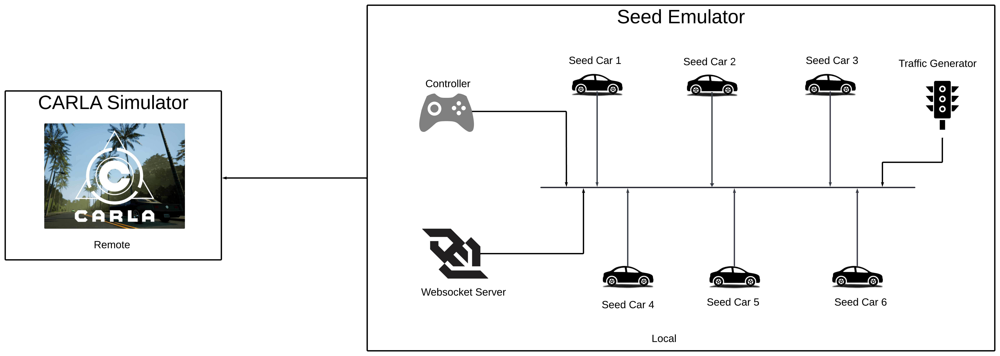
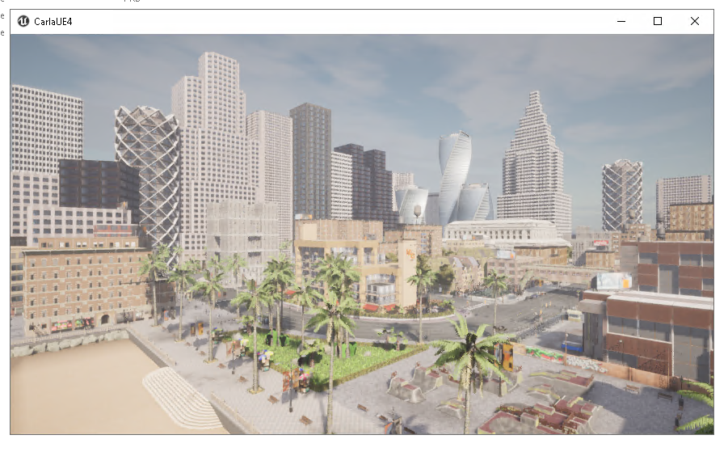
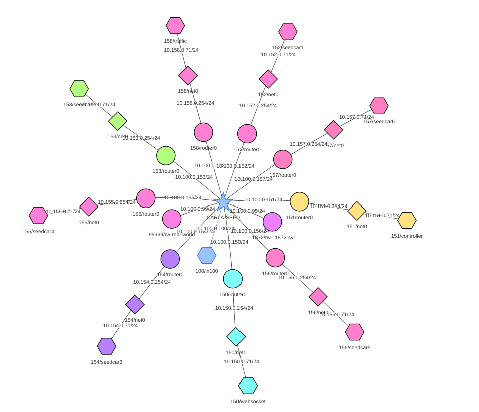

# CARLA-SEED Example
This manual provides comprehensive guidance on setting up, operating, and optimizing Carla-Seed, ensuring you efficiently leverage both simulation and emulation.The developer manual can be found [here](carla_seed.md)
## Table of Contents
- [CARLA-SEED Example](#carla-seed-example)
  - [Table of Contents](#table-of-contents)
  - [Introduction](#introduction)
  - [What is CARLA Simulator](#what-is-carla-simulator)
  - [Key Components of CARLA Simulator](#key-components-of-carla-simulator)
  - [CARLA Simulator + SEED Emulator](#carla-simulator--seed-emulator)
	  - [Integration Architecture](#integration-architecture)
	  - [Integration Features](#integration-features)
	  - [CARLA Simulator Installation](#carla-simulator-installation)
		  - [System Requirements](#system-requirements-for-carla-server)
		  - [Windows Installation](#windows-installation)
		  - [Linux Installation](#linux-installation)
	  - [SEED Emulator Installation](#seed-emulator-installation)
	  - [SEED Emulator Container Terminology](#seed-emulator-container-terminology)
	  - [Post-Installation Testing ](#post-installation-testing)
		  - [Testing Carlaviz and Internet Map](testing-carlaviz-and-internet-map-integration)
		  - [Validating Vehicle Spawn and Web Socket Server](#validating-vehicle-spawn-and-web-socket-server)
	  - [Installation Troubleshooting](#installation-troubleshooting)
	  - [Usage](#usage)
	  - [Demo](#demo)
	  - [Troubleshooting](#troubleshooting)
		  - [Common Issues](#common-issues)
		  - [Debugging Tips](#debugging-tips)
	  - [FAQ's](#faqs)
	  - [Appendix](#appendix)

## Introduction 
The CARLA-SEED example showcases an advanced simulation environment where users can orchestrate the movements of multiple autonomous vehicles within separate containers. This setup enables precise location settings for each car, offering a detailed visual display of their distribution and movement in a simulated space. The system is designed for users to extract specific data points for individual vehicles, enhancing analysis and research in autonomous vehicle technologies.

**Requirements**: To utilize this project, a powerful computational setup is needed. This includes containerization support and high-end graphics rendering capabilities, along with sufficient CPU and memory to manage and visualize several cars in real-time effectively.
## What is CARLA Simulator
CARLA Simulator is an open-source platform designed specifically for the development and testing of autonomous driving systems. It uses Unreal Engine, known for its powerful rendering capabilities, to create highly realistic urban environments. This allows researchers and developers to simulate and analyze various scenarios that autonomous vehicles might encounter.

For detailed documentation, please refer to the CARLA documentation [here]( https://carla.readthedocs.io/en/latest/start_introduction/)
## Key Components of CARLA Simulator
The architecture of CARLA is based on a client-server model.

### CARLA Server/World
In the CARLA Simulator setup, the server handles all the core tasks necessary for the simulation. This includes rendering the sensors, computing the physics to ensure realistic interactions within the simulated world, and updating the state of the world and its various actors. Given the demand for high-quality, realistic outputs, the server ideally runs on a dedicated GPU. This setup is particularly important as it helps in efficiently managing intensive tasks, thereby enhancing the fidelity and responsiveness of the simulation.
### CARLA Client
CARLA clients represent the entities interacting with the simulation environment. These clients can be autonomous vehicles, Python programs, or any other entities controlling the logic of actors within the scene and setting world conditions. Leveraging the CARLA API, available in Python or C++, these clients communicate with the server to influence the simulation.

For detailed documentation, please refer to the CARLA documentation [here](https://carla.readthedocs.io/en/latest/foundations/#world-and-client)
### CARLAVIZ 
Carlaviz is a plugin designed for visualizing CARLA simulations within a web browser, offering a window with basic representations of the scene that updates actors on-the-fly. It supports visualization of sensor data and allows drawing additional elements like text and polylines in the scene. Carlaviz supports Linux and Windows, with specific CARLA versions, and benefits from Docker for easier deployment.

For detailed usage, please refer to the CARLAVIZ documentation [here](https://github.com/mjxu96/carlaviz).
## CARLA Simulator + SEED Emulator 
### Integration Architecture



1. **CARLA Simulator**: Hosted on a **Remote GPU Server** to run the vehicle simulation environment.
2. **SEED Emulator**: Running on a local machine with a total of nine containers:
    - One container operates as the **Web Socket Server**, facilitating real-time communication.
    - Another serves as the **Controller**, connected to both the Web Socket Server and the remote CARLA server, managing simulation commands.
    - Six containers, designated as **Seed Cars 1-6**, simulate autonomous vehicles within the CARLA environment and receive instructions from the Web Socket Server.
    - One container is dedicated to **Traffic Generation**, creating realistic traffic scenarios within the simulation.
3. **Visualization Tools**: Two additional background containers support visualization:
    - **Carlaviz**: Provides visualization for the CARLA simulation.
    - **SEED Internet Map**: Offers a visual mapping interface for the SEED Emulator.
### CARLA Simulator Installation
#### System Requirements for CARLA Server
- **Operating Systems:** Windows, Linux
- **CPU:** Quad-core Intel or AMD, 2.5 GHz or faster
- **RAM (Memory):** 
	- Minimum: 16 GB 
	- Recommended: 32 GB for optimal performance
- **GPU:**
    - Minimum: 6 GB RAM
    - Recommended: 8 GB RAM for optimal performance
    - Note: Dedicated GPU strongly recommended for machine learning
- **Disk Space:** 20 GB free space
- **Python:** Version 3.7.10 supported on both Windows and Linux
- **Pip:** Version 20.3 or higher
- **Network:** TCP ports 2000, 2001 and 2002 must be open
#### Windows Installation
1. **Visit the CARLA GitHub Page:**
    - Access the CARLA GitHub repository to find the latest releases and information. [CARLA GitHub Page](https://github.com/carla-simulator/carla/blob/master/Docs/download.md).
2. **Download the Windows Version:**
    - Look for the latest CARLA package for Windows and proceed to download it.
3. **Unzip the Downloaded Package**
    - After downloading, extract the contents of the CARLA package.
4. **Install  important pip3 packages:**
    - Open Command Prompt as an administrator.
    - Run the command to install Pygame and NumPy.
		```cmd 
		pip3 install --user pygame numpy	
		```
    - Additionally, install CARLA python package run this command.
	    ```cmd
		pip3 install carla
		```
5. **Navigate to CARLA Root Directory:**
    - Use the Command Prompt to move to the directory where CARLA was extracted.
		```cmd
		cd path\to\carla\root		
		```
6. **Launch CARLA:**
    - Run the command `CarlaUE4.exe` to start CARLA.
#### Linux Installation
1. **Visit the CARLA GitHub Page:**
    - Access the CARLA GitHub repository to find the latest releases and information. [CARLA GitHub Page](https://github.com/carla-simulator/carla/blob/master/Docs/download.md).
2. **Download the Linux Version:**
    - Look for the latest CARLA package for Linux and proceed to download it. 
3. **Download and Unzip:**
    - Utilize `tar` to extract the contents of the CARLA package.
    ```shell
	tar -xvzf CARLA_PACKAGE_NAME.tar.gz
	```
4. **Install important pip3 packages:**
    - In Terminal, install Pygame and NumPy, and then the CARLA Python package.
    ```shell
	pip3 install --user pygame numpy 
	pip3 install carla
	```
5. **Navigate to CARLA Root Directory:**
    - Change directory to where you extracted CARLA.
	```shell
	cd path/to/carla/root
	```
6. **Launch CARLA:**
    - Run the command `./CarlaUE4.sh` to start CARLA.



Upon launching CARLA, a window showcasing a cityscape in spectator mode appears; navigate using the mouse and WASD keys, with the right mouse button for directional control, as the server awaits client connections for interactive simulation.
### SEED Emulator Installation
1. **Install the Necessary Software**
    - Install `docker`, `docker-compose`, and `python3` to ensure all required tools for running the emulator are available.
2. **Set Up the Environment Variable**
    - Add the project folder to the `PYTHONPATH` environment variable by executing `source development.env` in the project's root directory.
3. **Configure CARLA-SEED Environment Settings**
    - Update environment variables in the `carla.py`with necessary parameters such as:
	    - CARLA server IP (`CARLA_IP`) and port (`CARLA_PORT`)
	    - Role names and camera settings for vehicles (`ROLE_NAME_1` to `ROLE_NAME_6`, `CAMERA_1` to `CAMERA_6`)
		- Configure agent behavior for vehicles (`AGENT_TYPE`, `AGENT_BEHAVIOR`)
	    - Traffic simulation settings (`TRAFFIC_VEHICLES_NO`, `TRAFFIC_WALKERS_NO`)
	    - Carlaviz configurations (`CARLAVIZ_LOGFILE_NAME`, `CARLAVIZ_RETRY_SECONDS`, `CARLAVIZ_EGO_VEHICLE_NAME=car1`)
> [!WARNING]
> Enabling cameras on all vehicles (`CAMERA_1` to `CAMERA_6`) can significantly increase bandwidth usage, as the data is transmitted from a remote server. This may affect the simulation's responsiveness and could potentially lead to more frequent collisions.
4. **Build the Emulation**:
	- Navigate to the project directory , typically something like `examples/C10-carla-seed/`.
	- Execute the script to build the emulation environment: `python3 ./carla.py`.
	- This process generates necessary container files in the `output/` folder.
5. **Check CARLA Server**:
    - Before starting the emulator, ensure the CARLA server is actively running and accessible.
    - This is crucial as the emulation relies on a connection to the CARLA server for vehicle simulation and control.
6. **Run SEED Emulator**
    - Navigate to the emulator directory with `cd output/`, build, and start the emulator using `docker-compose build && docker-compose up`.
    - Allow some time for initialization, especially for routers and network configurations to stabilize.
### SEED Emulator Container Terminology
- **Web Socket Server**: `150/websocket` - Manages Web Socket services for real-time communication.
- **Controller**: `151/controller` - Handles control logic for simulations. 
- **Seed Car 1**: `152/seedcar1` - Represents the first autonomous vehicle in the simulation.
- **Seed Car 2**: `153/seedcar2` - Represents the second autonomous vehicle.
- **Seed Car 3**: `154/seedcar3` - Represents the third autonomous vehicle.
- **Seed Car 4**: `155/seedcar4` - Represents the fourth autonomous vehicle.
- **Seed Car 5**: `156/seedcar5` - Represents the fifth autonomous vehicle.
- **Seed Car 6**: `157/seedcar6` - Represents the sixth autonomous vehicle.
- **Traffic Generator**: `158/traffic` - Generates traffic scenarios within the simulation.
- **Private Network:** `11872/rw-11872-syr` - Allow network to access Syracuse University
- **Real World Network:** `99999/rw-real-world` - Allow network to access Internet

### Post-Installation Testing 
After installing CARLA Simulator, SEED Emulator, and setting up Carlaviz along with the Internet Map feature, it's crucial to ensure everything is functioning correctly. This section will guide you through the testing process to verify the operational status of these components.
#### Testing Carlaviz and Internet Map
1. **Verify Carlaviz is Running:**
    - After launching Carlaviz, open a web browser and visit `http://localhost:8080`. You should see a visualization interface of CARLA’s environment. If this page loads successfully, Carlaviz is running correctly.
	
2. **Check Internet Map on SEED Emulator:**
    - Similarly, to check if the Internet Map feature of the SEED Emulator is working, navigate to `http://localhost:8090` in your web browser. This should load the Internet Map dashboard if the emulator is correctly set up and running.
3. **Ensure Proper Communication:**
    - Both Carlaviz and the Internet Map should display real-time data from the CARLA simulation. Initial absence of vehicles or scenarios is normal until the next step is completed.
#### Validating Vehicle Spawn and Web Socket Server:
1. **Wait for Initialization:**
    - After starting the SEED Emulator, allow up to one minute for initial setups to complete and for it to begin communicating with CARLA.
2. **Observe Vehicle Spawn and Traffic Generation:**
    - Within the CARLA environment (the spectator view window that appeared upon running `./CarlaUE4.sh`), observe for vehicle spawn. The process might take a moment after the emulator starts.
3. **Check Carlaviz Visualization:**
    - Refresh the Carlaviz page (`http://localhost:8080`) and check for the visualization of spawned vehicles and any ongoing scenarios. Movement and interaction should reflect real-time simulation data.
4. **Web Socket Server Check**: 
	- Verify the Web Socket server's functionality on `150/host_0` at `WEBSOCKET_IP:6789` by accessing it via the SEED Emulator's Internet Map dashboard.
### Installation Troubleshooting
- **No Vehicles in CARLA or Carlaviz:** Ensure that the SEED Emulator is running without errors. Check the terminal or command prompt for error messages. Revisit the `docker-compose.yml` file for any configuration issues.
- **Dashboard/Visualization Not Loading:** Verify the server ports are not in use by another application and firewall settings allow traffic on ports 8080 and 8090.
- **Scenario Not Progressing:** Check the connection between the SEED Emulator and CARLA. The emulator should properly configure scenario based on its script, which then should be visible in CARLA and Carlaviz.
### Usage 
1. **Launching the Simulation:**
	Ensure that both the SEED Emulator and the CARLA simulation are up and running. Verify the connection between them to ensure data can be transferred seamlessly.
2. **Access the Controller Container:**
	Navigate to the controller container where the interaction scripts are located:
	- `controller.py`
	- `config.py`
3. **Understanding `controller.py`:**
	This script is essential for sending commands and retrieving information from the simulated vehicles:
	- **Send Locations**: It can broadcast location updates to all vehicles simultaneously or target individual vehicles.
	- **Get Vehicle Info**: Retrieves data such as speed, throttle position, brake status, model, and real-time GPS coordinates.
	- **List Vehicles**: Lists all active vehicles in the simulation that start with the prefix "seed."
	- **`controller.py`Options:**
		- **WebSocket IP (`--w_ip`)**: Utilizes this IP address to connect to the WebSocket server; defaults to "localhost".
		- **WebSocket Port (`--w_port`)**: Uses this port number to connect to the WebSocket server; defaults to 6789.
		- **CARLA Server IP (`--c_ip`)**: Utilizes this IP address to connect to the CARLA server; typically set to "localhost".
		- **CARLA Server Port (`--c_port`)**: Uses this port number to connect to the CARLA server; defaults to 2000.
		- **Location (`--location`)**: Allows setting a predefined destination for vehicle navigation such as Townhall, Museum, etc.
		- **Identifier (`--id`)**: Targets a specific vehicle by its identifier or 'all' to apply commands to all vehicles.
		- **List Vehicles (`--list`)**: Lists all car role names currently in the simulation and then exits.
		- **Car Info (`--c_info`)**: Retrieves detailed information about a specific car based on its role name.
4. **Understanding `config.py`:**
	 This script enables the user to modify various simulation settings, impacting how the virtual environment and its elements behave during simulations.
	- **`config.py` Options:** 
		- **Host (`--host`)**: Utilizes this IP address to connect to the CARLA server; typically set to "localhost".
		- **Port (`--port`)**: Uses this port number to connect to the CARLA server; defaults to 2000.
		- **Default Settings (`--default`)**: Apply default settings for the simulation.
		- **Map Management (`--map`, `--reload-map`)**: Load or reload specific maps; use `--list` to view available maps.
		- **Simulation Parameters (`--delta-seconds`, `--fps`)**: Set fixed simulation intervals or frame rates.
		- **Rendering Options (`--rendering`, `--no-rendering`)**: Enable or disable rendering.
		- **Synchronous Mode (`--no-sync`)**: Toggle synchronous mode.
		- **Weather Conditions (`--weather`)**: Change the weather settings; use `--list` to see available presets.
		- **Inspect Mode (`--inspect`)**: Inspect the simulation environment.
		- **Listing Options (`--list`, `--list-blueprints`)**: List simulation options or available vehicle blueprints.
5. **Execute Commands:**
	1. **List Vehicles with Prefix 'seed'**:
	```shell
	python3.7 /controller/controller.py --w_ip websocket --c_ip CARLA_IP --list
	 ```  
	2. **Send Location to All Vehicles:**    
	```shell
	python3.7 /controller/controller.py --w_ip websocket --c_ip CARLA_IP --location Hotel --id all
	```
	3. **Send Location to Specific Vehicle**:
	```shell
	python3.7 /controller/controller.py --w_ip websocket --c_ip CARLA_IP --location Hotel --id seedcar1
    ```
	4. **Get Real-time Information for Specific Vehicle**:
	```shell
	python3.7 /controller/controller.py --w_ip websocket --c_ip CARLA_IP --c_info seedcar1
    ```
	5. **Inspect the CARLA Simulator**:
	```shell
	python3.7 /controller/config.py --host CARLA_IP --inspect
	```
6. **Monitoring and Visualization:** Continuously observe vehicle behaviors and dynamics using Carlaviz at `http://localhost:8080`. This real-time visualization provides insight into vehicle movements and interactions within the CARLA simulation, aiding in the evaluation of simulation performance and the effectiveness of applied settings or commands.
### Demo
[](http://www.youtube.com/watch?v=R1E40U-jeL0 "CARLA-SEED")
### Troubleshooting
#### Common Issues
- **Collision Problems in Seed Cars**: If collisions occur with Seed Cars, stop the script by terminating the process (`kill <PID>`), then restart with the specific car command:
- Replace `CARLA_IP`, `ROLE_NAME`, and `CAMERA` with the appropriate values.
```shell
python3.7 -u /automatic_control/headless_automatic_control.py --ws_ip=websocket --host=CARLA_IP --r_name=ROLE_NAME --cam=CAMERA -l > /seed_ROLE_NAME.log 2>&1
```
- **Collision Problems in Traffic Generator Vehicles**: Similarly, halt the traffic script with `kill <PID>`, and restart with:
- Ensure to substitute `CARLA_IP`, `TRAFFIC_VEHICLES_NO`, and `TRAFFIC_WALKERS_NO` with the respective variable values.
```shell
python3.7 -u /traffic/generate_traffic.py --host CARLA_IP -n TRAFFIC_VEHICLES_NO -w TRAFFIC_WALKERS_NO --asynch --safe --respawn
```
For detailed configurations and troubleshooting, refer to the developer manual [here](carla_seed.md).
- **Carlaviz Connection Issues**: If Carlaviz cannot connect to the CARLA server for visualization, first stop the SEED Emulator. Then, restart the CARLA server to re-establish the connection. After restarting the CARLA server, retry connecting Carlaviz to ensure the visualization links properly. This process can help reset the network connections and clear any temporary conflicts that may be preventing Carlaviz from accessing the CARLA server data.
- **Persistent Sensor Data Issue**: Each time you use `docker-compose down` in the SEED Emulator, consider restarting the CARLA server as well. This is recommended because stopping the Docker containers without restarting the CARLA server might leave residual sensor data from previous simulations, which could lead to unexpected collisions in new sessions. Restarting the CARLA server clears old simulation states, although this step is optional and should be performed based on your specific needs for a fresh simulation environment.
#### Debugging Tips 
- **Logs Inspection**: Regularly review the logs produced by both the CARLA simulator and the SEED Emulator for any error messages that might indicate what issues are occurring. Each component and container within the SEED Emulator logs its activity, which can be crucial for troubleshooting:
	- **Web Socket**: Logs are stored in `/carla_webserver.log`.
	- **Seed Cars [1-6]**: Each car generates its own log in `/seed_car[1-6].log` within its respective container.
	- **Traffic Generator**: Traffic activity is logged in `/traffic.log`.
	- **CARLAVIZ**: Visualization logs can be found in `/carlaviz.log`, and additional output might also be visible directly on the terminal.
	- **SEED Emulator**: General output and error messages are displayed directly on the terminal.
### FAQ's
1. **Are the CARLA server, Seed Cars, and traffic generators running in synchronous or asynchronous mode?**
	The CARLA server, seed cars, and traffic generators are set to operate in asynchronous mode. This configuration allows each component to run independently without waiting for frame synchronization, providing greater flexibility and enhancing the real-time responsiveness of the simulation environment.
2. **What is the impact of running the CARLA server and SEED Emulator on different networks?**
	Running the CARLA server on localhost ensures optimal bandwidth and smooth integration with the SEED Emulator. Using a private network may introduce some lag, and this lag can increase significantly on a public network, especially if cameras are enabled on all vehicles.
3. **What should I do if I experience connectivity issues with the CARLA server and SEED Emulator?** 
	If connectivity issues arise, it's advisable to restart the CARLA server and restart the SEED Emulator from scratch. This can help reset the network connections and clear any session-specific conflicts that may be causing the problems.
4. **How can I follow a specific car in Carlaviz visualization?**
	To focus on a specific car in Carlaviz during the simulation, set the 'ego vehicle' parameters in the `.env` file accordingly. Specify the role name of the car you want to follow under the `CARLAVIZ_EGO_VEHICLE_NAME` parameter to ensure that Carlaviz tracks and displays this vehicle prominently in the visualization.
5. **What should I do if there are frequent collisions among vehicles in the simulation?** 
	To reduce collisions, manage camera settings by enabling the camera manager for one car and disabling cameras on other vehicles. This reduces computational demands and potential lag, enhancing simulation stability.
### Appendix

To leverage machine learning models for training within the CARLA simulation environment, users should explore the "agents" folder. This folder contains scripts that enable vehicles to navigate the simulation world autonomously, either by following random routes or driving to specified destinations while complying with traffic rules and responding to dynamic obstacles.

Read More: https://carla.readthedocs.io/en/latest/adv_agents/