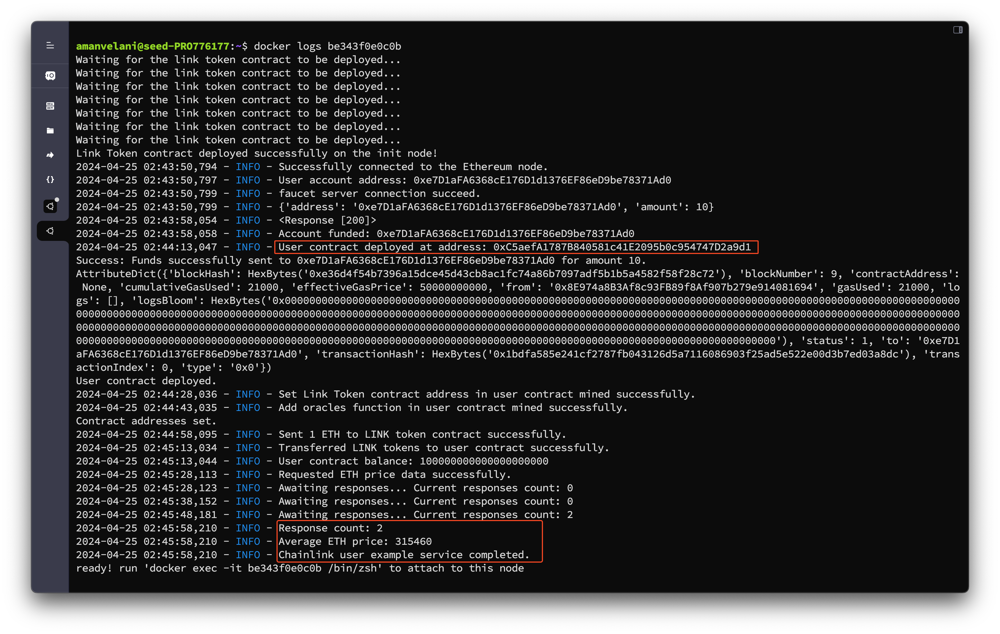
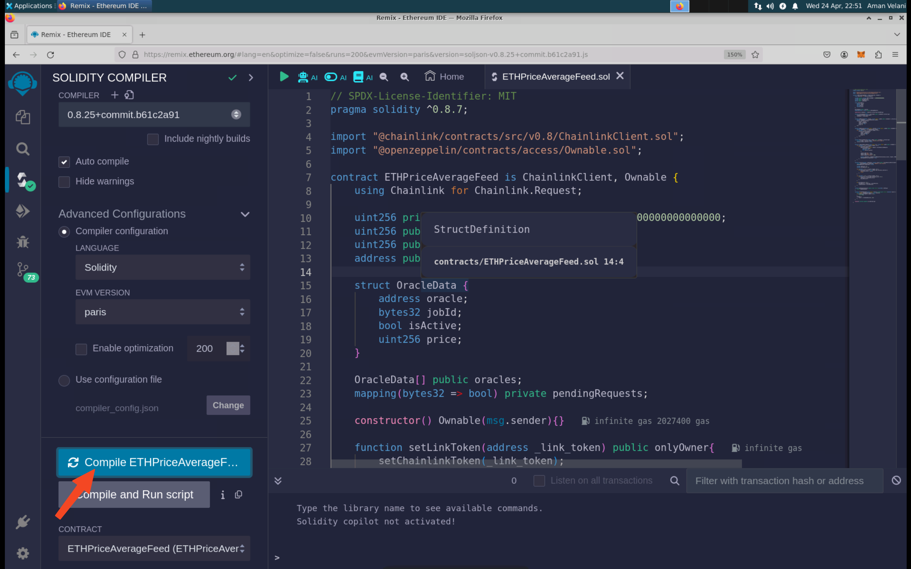

# Chainlink User Service
The Chainlink User Service is an automated example that demonstrates how to interact with the Chainlink service. First let's take a look how to build the emulation for the Chainlink User Service:

## Table of Contents
- [Chainlink User Service](#chainlink-user-service)
  - [Table of Contents](#table-of-contents)
  - [Building the Chainlink User Service](#building-the-chainlink-user-service)
    - [Interacting with the User contract using Remix](#interacting-with-the-user-contract-using-remix)
    - [Interacting with the User contract using the Python script](#interacting-with-the-user-contract-using-the-python-script)

## Building the Chainlink User Service
1. Create an instance of the Chainlink User Service:
    ```python
    chainlink_user = ChainlinkUserService()
    ```
2. Setup the User Service
   ```python
    cnode = 'chainlink_user'
    c_user = chainlink_user.install(cnode)
    c_user.setRPCbyEthNodeName('eth2')
    c_user.setFaucetServerInfo(vnode = 'faucet', port = 80)
    c_user.setChainlinkServiceInfo(init_node_name='chainlink_init_server', number_of_normal_servers=2)
    emu.getVirtualNode(cnode).setDisplayName('Chainlink-User')
    emu.addBinding(Binding(cnode, filter = Filter(asn=153, nodeName='host_2')))
    ```
    In the above code, we are assigning the server instance chainlink_user.install(cnode) to c_user, specifying the virtual node cnode named 'chainlink_user'.

    The following essential functions are used to set up the Chainlink user server:
    - `setRPCbyEthNodeName('eth2')`: This function configures the Ethereum RPC address for the Chainlink user server. The function requires the node name of the Ethereum node to which the Chainlink user server will use to interact with the blockchain.
    - `setFaucetServerInfo(vnode = 'faucet', port = 80)`: This function sets up the faucet server information for the Chainlink user server. The faucet server is used to fund the Chainlink user server with ETH tokens. The function requires the virtual node name of the faucet server and the port number.
    - `setChainlinkServiceInfo(init_node_name='chainlink_init_server', number_of_normal_servers=2)`: This function sets the Chainlink service information for the Chainlink user server. The function requires the node name of the Chainlink initializer server and the number of Chainlink normal servers. This information is necessary for the Chainlink user server to get the LINK token contract address and the oracle contract addresses.

    Finally, a network binding is established for the Chainlink user server to a host node identified by ASN and node name 'host_2'.

3. Add the Chainlink User Service layer to the emulation:
    ```python
    emu.addLayer(chainlink_user)
    ```

## Flow of the Chainlink User Service
This example demonstrates how to interact with the Chainlink service using a [user contract](./contracts/user_contract.sol). The user contract is deployed on the Chainlink user server. The user contract interacts with the Chainlink service to get the latest price of an asset. The user contract uses the LINK token contract address and the oracle contract addresses to interact with the Chainlink service. The user contract is funded with LINK tokens using the faucet server. The user contract sends a request to the Chainlink service to get the latest price of an asset. The Chainlink service sends the response to the user contract. The user contract then processes the response and displays the latest price of the asset.

1. Wait for the chainlink init server to be up. Get LINK token contract address and oracle contract addresses from the Chainlink init server
2. Create a web3 account and deploy the user contract
3. Fund the user account using the faucet server
4. Deploy the user contract
5. Set the LINK token contract address and oracle contract addresses in the user contract
6. Send 1ETH to the LINK token contract to fund the user account with LINK tokens
7. Transfer LINK token to the user contract
8. Call the main function in the user contract

## Interating with the User contract deployed by the Chainlink User Service
The User contract can be found in the contracts folder: [user_contract.sol](./contracts/user_contract.sol)

### Checking the logs of the Chainlink User Service
The Chainlink User Service will work as the flow described above. You can check the logs of the Chainlink User Service to see the progress of the Chainlink User Service. You can use the following command to check the logs of the Chainlink User Service:
```bash
docker ps | grep Chainlink
```
You will see the container ID of the Chainlink User Service. You can use the following command to check the logs of the Chainlink User Service:
```bash
docker logs <CONTAINER ID>
```
At the end of the logs, you will see the contract address of the user contract deployed by the Chainlink User Service. And also you will see the latest ETH price. Here is the example output:


You can use the contract address to interact with the user contract using Remix or any other Ethereum development tool as described below.

### Interacting with the User contract using Remix
After the Chainlink User Service is done running, you can interact with the [user contract](./contracts/user_contract.sol) deployed by the Chainlink User Service. To get the User contract address, you can check the logs of the Chainlink User Service. And another way is to do the following steps:
1. Execute the following command to get the container ID of the Chainlink User Service:
    ```bash
    docker ps | grep Chainlink-User
    ```
2. Execute the following command to get the bash shell of the Chainlink User Service:
    ```bash
    docker exec -it <CONTAINER ID> /bin/bash
    ```
3. After the Chainlink User Service deployes the user contract, you can find the contract address inside the container. You can use the following command to get the contract address:
    ```bash
    cat ./info/user_contract.json
    ```
4. Now you can interact with the user contract using Remix or any other Ethereum development tool.
   - Compile the user contract
    
   - Go to the Deploy and Run Transactions tab
   - In the Environment dropdown, select MetaMask
   - In the Account dropdown, select the account you want to use to interact with the user contract
    
   - In the At Address field, enter the contract address
    
   - Click the At Address button
   - You can now interact with the user contract
    

### Interacting with the User contract using the Python script
You can also run the python script to interact with the user contract. The python script can be found: [test-chainlink-user-service.py](./test-chainlink-user-service.py). Using the above steps, you can get the contract address which will be used in the python script. You will need to change the rpc_url, faucet_url and user_contract_address in the python script according to the configuration to interact with the user contract. Then the python script using the following command:
```bash
python3 test-chainlink-user-service.py
```
The python script will interact with the user contract and display the latest price of the asset. Here is the example output:
```bash
2024-04-25 11:45:58,043 - INFO - Checking current ETH price in user contract
2024-04-25 11:45:58,049 - INFO - Current ETH price in user contract: 315075
2024-04-25 11:45:58,049 - INFO - Initiating a new request for ETH price data
2024-04-25 11:45:58,049 - INFO - API for ETH price: https://min-api.cryptocompare.com/data/pricemultifull?fsyms=ETH&tsyms=USD
2024-04-25 11:45:58,049 - INFO - Path for extracting price: RAW,ETH,USD,PRICE
2024-04-25 11:45:58,062 - INFO - Sent transaction for ETH price data request. Hash: 0x8cabcb43db6a39805e51c065248342d7804dbd8705928732eb7aa20ef21effc7
2024-04-25 11:46:13,042 - INFO - Status of Transaction receipt for ETH price data request: 1
2024-04-25 11:46:13,042 - INFO - Request for ETH price data successful
2024-04-25 11:46:13,042 - INFO - Sleeping for 60 seconds to allow oracles to respond
2024-04-25 11:47:13,124 - INFO - Checking ETH price
2024-04-25 11:47:13,131 - INFO - Responses received from oracles
2024-04-25 11:47:13,141 - INFO - Responses count: 2
2024-04-25 11:47:13,141 - INFO - Updated ETH price: 314862
```