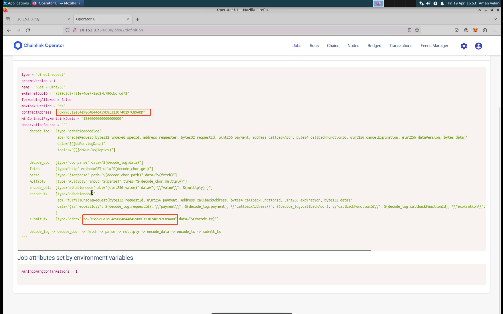

# Building the Chainlink Service

This README provides a step-by-step guide to build the Chainlink service on the SEED emulator.

## Table of Contents
- [Building the Chainlink Service](#building-the-chainlink-service)
  - [Table of Contents](#table-of-contents)
  - [Building the Emulation](#building-the-emulation)
  - [Interacting with the Chainlink Normal Server](#interacting-with-the-chainlink-normal-server)
  - [Interacting with the Chainlink Initializer Server](#interacting-with-the-chainlink-initializer-server)


## Building the Emulation
1. Create an instance of the emulator:
    ```python
    emu = Emulator()
    ```
2. Load the modified blockchain layer:
We are using a slighly modified version of the blockchain with hybrid internet layer. The blockchain layer also includes the faucet server which is essential for the chainlink service. Please refer to the steps [here](README.md) to build the blockchain layer with the hybrid internet layer. Once you have built the blockchain layer, you can load the blockchain layer using the following command:
    ```python
    emu.load('./blockchain-poa.bin')
    ```
3. Initialize the Chainlink Service:
    ```python
    chainlink = ChainlinkService()
    ```
4. Initialize the Chainlink Initializer Server:
    ```python
      cnode = 'chainlink_init_server'
      c_init = chainlink.installInitializer(cnode)
      c_init.setFaucetServerInfo(vnode = 'faucet', port = 80)
      c_init.setRpcByEthNodeName('eth2')
      service_name = 'Chainlink-Init'
      emu.getVirtualNode(cnode).setDisplayName(service_name)
      emu.addBinding(Binding(cnode, filter = Filter(asn=164, nodeName='host_2')))
    ```
    In the above code, we are assigning the server instance chainlink.installInitializer(cnode) to c_init, specifying the virtual node cnode named 'chainlink_init_server'. 
    
    The following essential functions are used to set up the Chainlink initializer server:
    - `setFaucetServerInfo(vnode = 'faucet', port = 80)`: This function sets up the faucet server information for the Chainlink initializer server. The faucet server is used to fund the Chainlink server with ETH tokens. The function requires the virtual node name of the faucet server and the port number.
    - `setRpcByEthNodeName('eth2')`: This function configures the Ethereum RPC address for the Chainlink initializer server. The function requires the node name of the Ethereum node to which the Chainlink initializer server  will use to interact with the blockchain.
    
    Additionaly, these are the API functions that are avilable for configuration:
    - `setRpcByUrl("<RPC_URL>")`: This function should only be used if the user is sure about the RPC URL. The function requires the RPC URL of the Ethereum node to which will be used by the Chainlink initializer server to connect to the Ethereum node.

    Finally, a network binding is established for the Chainlink initializer server to a host node identified by ASN and node name 'host_2'.

5. Initialize the Chainlink Server:
   ```python
    i = 0
    c_asns  = [150, 151]
    # Create Chainlink normal servers
    for asn in c_asns:
        cnode = 'chainlink_server_{}'.format(i)
        c_normal = chainlink.install(cnode)
        c_normal.setRpcByEthNodeName('eth{}'.format(i))
        c_normal.setInitNodeIP("chainlink_init_server")
        c_normal.setFaucetServerInfo(vnode = 'faucet', port = 80)
        service_name = 'Chainlink-{}'.format(i)
        emu.getVirtualNode(cnode).setDisplayName(service_name)
        emu.addBinding(Binding(cnode, filter = Filter(asn=asn, nodeName='host_2')))
        i = i + 1
    ```
    In the above code, we are creating multiple chainlink server nodes each associated with different autonoumous system (ASNs). For each server we are assigning the server instance chainlink.install(cnode) to c_normal, specifying the virtual node cnode named 'chainlink_server_{}'.format(i). 
    
    The following essential functions are used to set up the Chainlink server:
    - `setRpcByEthNodeName('eth{}'.format(i))`: This function configures the Ethereum RPC address for the Chainlink server. The function requires the node name of the Ethereum node to which the Chainlink server will be listening through the websocket and interacting with the blockchain.
    - `setInitNodeIP("chainlink_init_server")`: This function sets the IP address of the Chainlink initializer server. This is necessary for the Chainlink server to get the LINK token address and send the deployed oracle contract address to be displayed on the Chainlink Init server.
    - `setFaucetServerInfo(vnode = 'faucet', port = 80)`: This function sets up the faucet server information for the Chainlink server. The faucet server is used to fund the Chainlink server with ETH tokens. The function requires the virtual node name of the faucet server and the port number.

    Additionaly, these are the API functions that are avilable for configuration:
    - `setUsernameAndPassword(username = '<username>', password = '<password>')`: This function sets the username and password for the Chainlink server. The default username is 'seed@seed.com' and the default password is 'Seed@emulator123'. The username must be a valid email address and password must be between 16 to 50 characters.

    Finally, a network binding is established for each Chainlink server to a host node identified by ASN and node name 'host_2'.

6. Once you have completed the installation and configuration the Chainlink initializer and Chainlink node, you can add the Chainlink Service layer to the emulation.
    ```python
    emu.addLayer(chainlink)
    ```
7. Now, we can render and compile the emulation:
    ```python
    OUTPUTDIR = './output'
    emu.render()
    docker = Docker(internetMapEnabled=True, internetMapPort=8081, etherViewEnabled=True, platform=Platform.AMD64)
    emu.compile(docker, OUTPUTDIR, override = True)
    ```
    Here we have enabled the etherView, this displays the Ethereum transactions on the emulator. The internetMap is enabled to view the network topology of the emulated network. The platform is set to AMD64. The compiled emulation is stored in the directory 'emulator_20'. If you want to use a ARM platform, you can set the platform to `Platform.ARM64`.
10. Finally, run the emulation script using the following command:
    ```python
    python3 blochain-poa-chainlink.py
    ```

## Running the Emulation
Within the output directory, a docker-compose.yml file is generated. Run the following command to start the emulation:
```bash
./output$ docker-compose build
./output$ docker-compose up
```

## Interacting with the Chainlink Initializer Server
The Chainlink Initializer server is used to deploy the LINK token contract and display the deployed oracle contract address. You can access the Chainlink Initializer server by navigating to `http://<host_ip>:80` in your web browser. The Chainlink Initializer server displays the deployed oracle contract address and the LINK token contract address. This information is useful for building and deploying solidity contracts and deploying jobs.

### How to know if the Chainlink Initializer Server is running?
You can check if the Chainlink Initializer server is running by navigating to `http://<host_ip>:80` in your web browser. If the Chainlink Initializer server is running, you will see the deployed oracle contract address and the LINK token contract address. Additionaly, you can check logs of the Chainlink Initializer server by running the following command:
```bash
docker ps | grep Chainlink-Init
docker logs <CONTAINER ID>
```
The web server will display the deployed oracle contract address as it is deployed on the Ethereum blockchain by the chainlink normal node.

Here is the sample output of the Chainlink Initializer server:


## Interacting with the Chainlink Normal Server
There are two ways to interact with the Chainlink service:
1. Chainlink UI: You can access the Chainlink UI by navigating to `http://<host_ip>:6688` in your web browser. The Chainlink UI allows you to create and manage Chainlink jobs. It is also useful to check the status of connection with the Ethereum node.
2. Chainlink CLI: You can interact with the Chainlink service using the Chainlink CLI. The Chainlink CLI is a command-line tool that allows you to interact with the Chainlink node. You can use the CLI to create and manage Chainlink jobs, check the status of the Chainlink node, and more. The Chainlink CLI can be accessed by running the following command:
    ```bash
    docker exec -it <CONTAINER ID> /bin/bash
    chainlink admin login
    ```

### How to know if the Chainlink Normal Server is running?
You can check if the Chainlink Normal server is running by navigating to `http://<host_ip>:6688` in your web browser. If the Chainlink Normal server is running, you will see the Chainlink UI. Additionaly, you can check logs of the Chainlink Normal server by running the following command:
```bash
docker ps | grep Chainlink
docker logs <CONTAINER ID>
```
Here is the screenshots of the Chainlink UI and how to interact with the Chainlink UI:
1. Chainlink UI Login Page:

This is the login page of the Chainlink UI. You can login using the username and password you have set during the configuration of the Chainlink server.
2. Chainlink UI Dashboard:

This is the dashboard of the Chainlink UI. You can create and manage Chainlink jobs, check the status of the Chainlink node, and more. It will show the ETH address of the account created during chainlink start command which should be funded with 5 ETH tokens.
3. Chainlink UI Nodes:

This is the nodes page of the Chainlink UI. You can check the status of the Chainlink node, add new nodes, and more.
4. Chainlink UI Jobs:

- This is the jobs page of the Chainlink UI. You can create and manage Chainlink jobs. The Chainlink jobs are used to fetch data from external APIs and send it to the Ethereum blockchain.

- Click on one of the jobs and then go to definition of that job. Here you will see the contract address of the oracle contract deployed on the Ethereum blockchain. This can be used by the user to create new jobs. Another way is to use the Chainlink Init Node webserver to get the contract address and then call the getAuthorizedSenders function to get the chainlink node address which can be used to create new jobs on that oracle contract as chainlink node and oracle contract have 1-1 relationship. 

