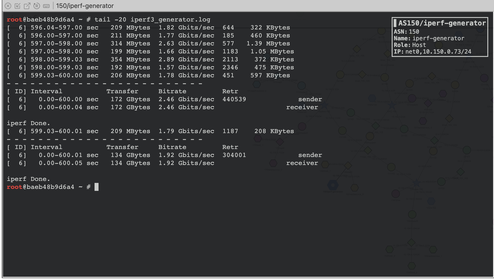
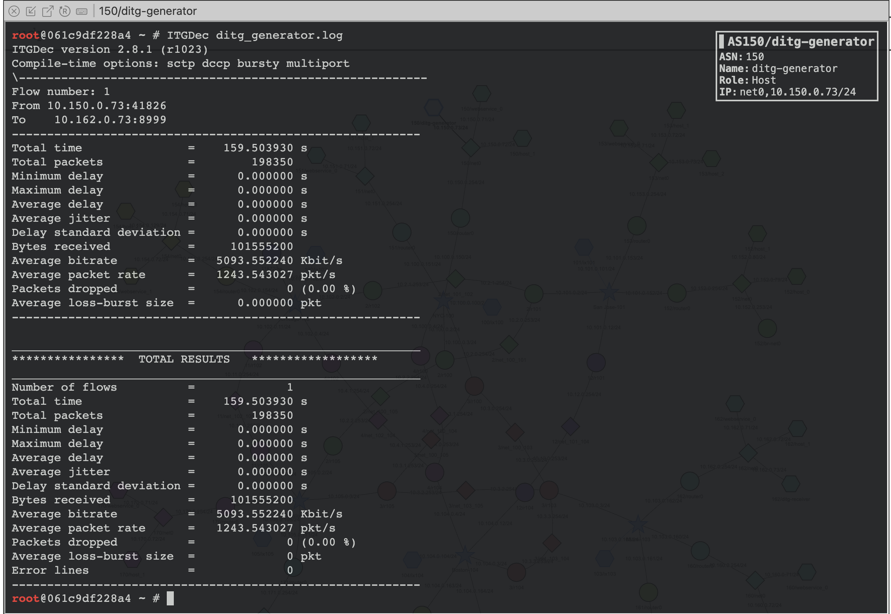
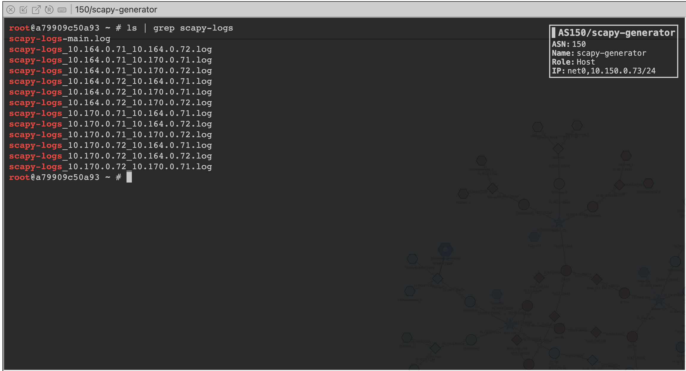
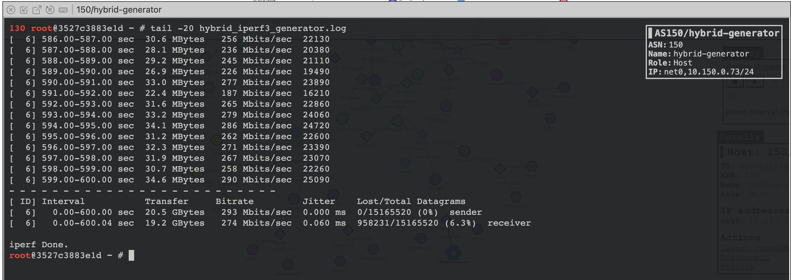

# Traffic Generation Service

This example demonstrates how to use the Traffic Generation Service to generate internet traffic among multiple hosts.

## Traffic Service

The `TrafficService` provides `install` method to install the Traffic Generator or Traffic Receiver application on a host and configure the traffic generation process.
The `install` method takes the following parameters:

- `vnode`: The name of the virtual node where the traffic service application will be installed. The `vnode` parameter is used to configure the custom domain name for the underlying host.
- `service_type`: The type of the traffic service application to be installed.

  Following `service_type` are supported:

    - `IPERF_GENERATOR`: Iperf Traffic Generator
    - `IPERF_RECEIVER`: Iperf Traffic Receiver
    - `DITG_GENERATOR`: DITG Traffic Generator
    - `DITG_RECEIVER`: DITG Traffic Receiver
    - `SCAPY_GENERATOR`: Scapy Traffic Generator
    - `HYBRID_GENERATOR`: Hybrid Traffic Generator
    - `HYBRID_RECEIVER`: Hybrid Traffic Receiver

- `kwargs`: The keyword arguments to be passed to the traffic service application.

  You can pass the following keyword arguments.

    - `log_file`: The log file where the traffic generation logs will be stored. Default is `/root/traffic.log`.
    - `protocol`: The protocol to be used for traffic generation. Default is `TCP`.
    - `duration`: The duration of the traffic generation process. Default is `300`.
    - `rate`: The rate of the traffic generation process. Default is `5000`.
    - `auto_start`: Start the traffic generator script automatically. Default is `True`.
    - `extra_options`: The extra options to be used for the traffic generation process. The `extra_options` parameter value depends on the type of traffic generator being used.

## Example

The following example demonstrates how to install Traffic Service on a host and configure the traffic generation process.

## Load the Mini-Internet Component

```
emu.load('../../B00-mini-internet/base-component.bin')
```

## Install Traffic Generator and Receiver

```python
traffic_service = TrafficService()
traffic_service.install('iperf-receiver', TrafficServiceType.IPERF_RECEIVER, log_file='/root/iperf3_receiver.log')
traffic_service.install(
    "iperf-generator",
    TrafficServiceType.IPERF_GENERATOR,
    log_file="/root/iperf3_generator.log",
    protocol="TCP",
    duration=600,
    rate=0,
    extra_options="--debug",
).addReceivers(hosts=["iperf-receiver-1", "iperf-receiver-2"])
```

## Create necessary hosts for the traffic generator and receiver

```python
as150 = base.getAutonomousSystem(150)
as150.createHost("iperf-generator").joinNetwork("net0")
as162 = base.getAutonomousSystem(162)
as162.createHost("iperf-receiver").joinNetwork("net0")
```

## Bind the Traffic Generator and Receiver to the Hosts

```python
emu.addBinding(
    Binding("iperf-generator", filter=Filter(asn=150, nodeName="iperf-generator"))
)
emu.addBinding(
    Binding("iperf-receiver", filter=Filter(asn=162, nodeName="iperf-receiver"))
)
```

## Add TrafficService to the Emulation

```python
emu.addLayer(traffic_service)
```


There are 4 examples in this directory:

### 0-iperf-traffic-generator

Demonstrates how to install and configure the iperf3 Traffic Generator. iPerf3 is a tool for active measurements of the maximum achievable bandwidth on IP networks. It supports tuning of various parameters related to timing, buffers, and protocols (TCP, UDP, SCTP with IPv4 and IPv6). For more information, see [iPerf3](https://iperf.fr/iperf-doc.php) documentation.

We can visualize the live traffic generation using the seed emulators' web interface by filtering the traffic with appropriate filters. In our example, iperf traffic generator generats `TCP` traffic. So, we can filter the traffic using the `TCP` filter. Following is the screen recording of the live traffic generation using the seed emulator's web interface.

[](https://www.youtube.com/watch?v=tWijqx3WJfQ)

The traffic generation logs will be stored in the log file you specify when installing the traffic generator. In this example, the logs are in `/root/iperf3_generator.log` file. Following is the screenshot of the iPerf3 traffic generation logs.



### 1-ditg-traffic-generator

Demonstrates how to install and configure the D-ITG (Distributed Internet Traffic Generator). D-ITG is a tool capable to produce traffic at packet level accurately replicating appropriate stochastic processes for both IDT (Inter Departure Time) and PS (Packet Size) random variables (exponential, uniform, cauchy, normal, pareto, etc.). D-ITG supports both IPv4 and IPv6 traffic generation and it is capable to 
generate traffic at network, transport, and application layer. For more information, see [D-ITG](https://allstar.jhuapl.edu/repo/p1/amd64/d-itg/doc/d-itg-manual.pdf) manual.


We can visualize the live traffic generation using the seed emulators' web interface by filtering the traffic with appropriate filters. In our example, D-ITG traffic generator generats `UDP` traffic. So, we can filter the traffic using the `UDP` filter. Following is the screen recording of the live traffic generation using the seed emulator's web interface.

[](https://www.youtube.com/watch?v=CeNgkmx8LJo)

The traffic generation logs will be stored in the log file you specify when installing the traffic generator. In this example, the logs are in `/root/ditg_generator.log` file. Following is the screenshot of the D-ITG traffic generation logs. To view the logs, you need to decode the logs using `ITGDec` utility command which is provided by the D-ITG tool.



### 2-scapy-traffic-generator

Demonstrates how to install and configure the Scapy Traffic Generator. Scapy is a Python program that enables the user to send, sniff, dissect and forge network packets. This capability allows construction of tools that can probe, scan or attack networks. We can use Scapy to generate custom packets and send them to the network.

For more information, see [Scapy](https://scapy.readthedocs.io/en/latest/) documentation.

We can visualize the live traffic generation using the seed emulators' web interface by filtering the traffic with appropriate filters. In our example, Scapy traffic generator generats `ICMP` traffic. So, we can filter the traffic using the `ICMP` filter. Following is the screen recording of the live traffic generation using the seed emulator's web interface.

[](https://www.youtube.com/watch?v=c_SLp4QUgJY)

The traffic generation logs will be stored in the log file you specify when installing the traffic generator. For Scapy Generator, there will be one log file for each pair of hosts in the given network. In this example, the prefix of the logs files is `/root/scapy-logs*` . Following are the screenshots of the scapy traffic generation logs.




### 3-hybrid-traffic-generator

Demonstrates how to install and configure the Hybrid Traffic Generator. It demostrates how we can combine multiple traffic generators into one application. The Hybrid Traffic Generator is a combination of the iPerf3 and D-ITG Traffic Generators. It allows the user to generate traffic using both of the two traffic generators.


We can visualize the live traffic generation using the seed emulators' web interface by filtering the traffic with appropriate filters. In our example, Hybrid traffic generator generats both `TCP` and `UDP` traffic. So, we can filter the traffic using the `TCP` and `UDP` filters. Following is the screen recording of the live traffic generation using the seed emulator's web interface.


[](https://www.youtube.com/watch?v=IrKjQs6IRd8)

For Hybrid Generator, the logs are in `/root/hybrid_iperf3_generator.log` and `/root/hybrid_ditg_generator.log` files. Following is the screenshot of the hybrid traffic generation logs.



