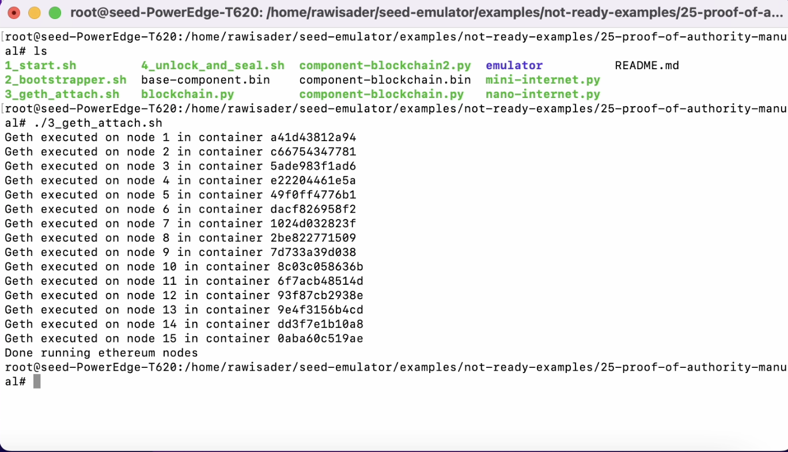
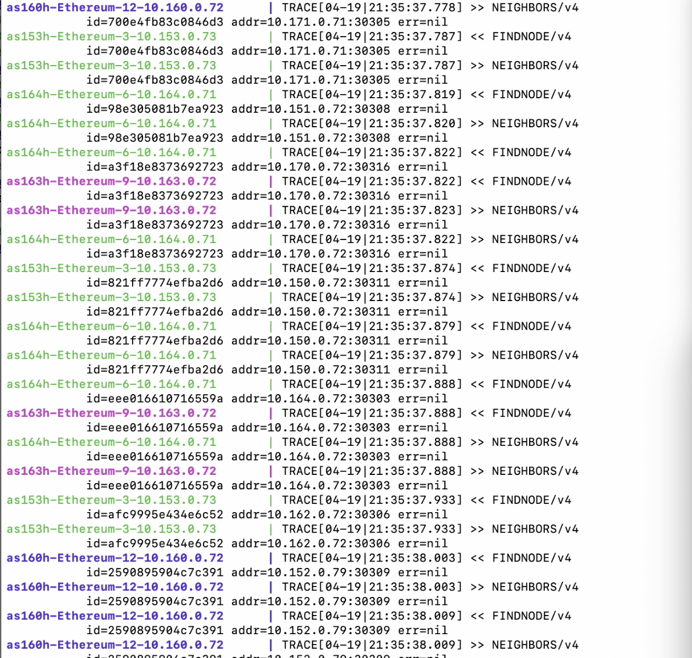

## Features
- Manual execution
- Selecting a consensus mechanism
- Creating prefunded accounts

## Manual exection part 1
- The feature was added to understand the underlying logic of the blockchain emulator
- Like any other blockchain example, start by running `mini-internet.py`. You should find in your directory a `base-component.bin`
- After that, you need to update your `component-blockchain.py`
- At the top of the `component-blockchain.py`, you can find the python statements which creates a new instance of the `EthereumService`
- This constructor takes as one of its parameters the `manual` flag.
- This flag has a default value of `False`, so if it is not explicitely set as `True` as the constructor parameter, the blockchain execution will be automated by us.
- The file should look something like the picture below

## Selecting a consensus mechanism
- We provide two APIs to select the consensus mechanism: `setBaseConsensusMechanism` and `setBaseConsensusMechanism`
- The former API is a method of the EthereumService class
- It is called in the following way: `eth.setBaseConsensusMechanism(<consensus>)`
- The `<consensus>` parameter can as of know be one of two values: `ConsensusMechanism.POA` or `ConsensusMechanism.POW`. This is because we only support the `Proof of authority (clique)` and the `Proof of work`.
- The `setBaseConsensusMechanism` API is applied on all the ethereum nodes unless we set a different consensus on a certain node using the `setConsensusMechanism`.
- To apply a certain consensus to a virtual node, we would do it in this way: `e = e.install("eth"); e.setConsensusMechanism(<consensus>)`

## Port Forwarding
- We currently open two ports on the containers when our `geth` command runs on the containers
- Port 8545 which is the default HTTP port. This one is used to connect the Remix IDE to our emulator and for the jsonrpc request done to fetch the signers of a certain block for our visualization.
- Remix can only connect to an http endpoint which is a Web3 provider, and the jsonrcp request needs to be an http post request.
- Port 8546 which is the default WS port. This one is used for the visualization as event subscriptions are only supported when connected using websockets

## Creating prefunded accounts

## component-blockchain.py output
- After configuring your network, the output of this file should should be similar to the picture below

## Building the example
- At this point we should run the `blockchain.py` file which will generate an `emulator` folder
- Go to the folder and run `dcbuild` and `dcup`
- You will know that the emulator is ready when you see an output similar to the picture below

## Manual execution part 2
- At this point, it is only the emulator that is running. We need to run the bash scripts on our host machine to trigger the blockchain execution
- We provide 3 bash scripts: `2_bootstrapper.sh`, `3_geth_attach.sh`, `4_unlock_and_seal.sh`
- You need to run these files sequentially
- `2_bootstrapper.sh` makes sure all containers have the bootnodes urls inside a file called `eth-node-urls`
- Once you run this file, you should see an output similar to the picture below

- `3_geth_attach.sh` runs the `geth` command to run the ethereum nodes on each container
- It is only after you run the `geth` command on the containers that the blockchain network starts running
- Once you run this file, you shoud see an output similar to the picture below

- You should also see the following output on the same terminal you used the `dcup` command

- `4_unlock_and_seal.sh` unlocks the ethereum accounts inside the containers and runs the miner/sealer
- Once you run this file, you should see an output similar to the picture below

## Proof of authority Keywords
- Signers/sealers/validators/authorized users: These represent the same people who sign blocks and transactions

## Proof of authrority introduction

- Consensus mechanisms are used to validate the authenticity of transactions and maintain the security of the underlying blockchain. In Proof of work, miners need to provide the solution to a hashing problem called the nonce, and get a hash that meets certain requirements. This is the proof that the miner did the required work and spent/used the necessary resources to do so. In Proof of authority, Transactions and blocks are validated by approved accounts, known as validators. These validators need to have a clean reputation to be added to the list of authorized user, and any malicious action they conduct results in them being kicked out of this list.
- POA, was implemented as a solution and replacement for the proof of work consensus mechanism. This scheme is based on the idea that blocks may only be minted by trusted signers. Every block (or header) that a client sees can be matched against the list of trusted signers.

## Challenge
- The challenge and the bulk of the work is to maintain a list of authorized signers that can change in time alwhile using PoW as a base

## Approach
- This algorithm makes use of the PoW base by redefining certain block headers and making use of obsolete ones that are not meaningful in the PoA context
- These fields are the extraData, the miner, the nonce, the difficulty, and more.

## Extended field: extradata
- Initially 32 bytes in PoW
- Extended with 65 bytes in PoA
- It is composed of 3 parts now: vanity bytes/list of sealers/sealers signature
- The block sealer’s signature is added to the third part of the extradata field instead of updating the "miner" field
- It is filled with 0s in the genesis

## Obsolete fields

- The Miner field is obsolete for obvious reasons; there are no miners in PoA
- The Nonce is obsolete as there is no solving to be done in PoA
- During regular blocks, both fields would be set to zero
- If a signer wishes to do a change to the list of authorized signers, he will cast a vote by: 
    - Setting the miner property as his target
    - Setting the nonce property to 0x00...0 or 0xff...f to either vote in or vote out his target
- All the sealers can now have the update list of authorized users at any point of time by going through all the votes.

## Epoch block
- Default epoch length is 30000 blocks
- Every epoch transition acts as a checkpoint containing the current signers
    - Block contains no votes
    - Block contains the list of current authorities
    - All non-settled votes are discarded
- This allows to fully define the genesis and the list of initial sealers
- This allows users to go to the nearest checkpoint instead of going to the genesis block to figure out what the current list of signers is.

## In-turn vs out-turn validator
- Time is transformed into discrete steps in the proof of authority consensus mechanism
- A step length, in unix time, is decided on at the start e.g. 5 unix time
- The current time, in unix, keeps increasing and we calculate the current step by dividing the current time with the step length e.g. `current time: 100, step length 5, current step: 100/5 = 20`
- All sealers are allowed to vote at anytime, but each sealer has a time in which he is the prefered one, hence the name "inturn" validator.
- Every sealer can figure out if he is an inturn validator or not by using the following formula: `index = s % n` where s is the current step and n is the number of authorized users at the current time.
- Assuming we are at step 1 and we have a total of 5 sealers, then validator[1%5] is considered to be inturn
- This follows a round robin approach

## Block authorization
- As mentioned above, all sealers are allowed to sign at anytime even if they are outturn ones.
- This is because we might have offline inturn validator and the blockchain needs to make sure to maintain the block throughput
- A block is minted every 15s when using proof of authority. This is defined by a constant called `BLOCK_PERIOD`
- For an Inturn validator, the next block should be added at `parent + BLOCK_PERIDO`
- Inturn validators should wait for this exact moment to sign a block and propagate it
- Outturn validators will add another small delay in order to prioritize inturn validators. 
- For an outturn validator, in case the inturn validator does not do his job properly, the next block will be added at `parent + BLOCK_PERIOD + rand(number_of_signers * 500ms)`

## Difficulty
- The difficulty is also an obsolete concept in proof of authority
- When signing a block, an inturn validator will set the difficulty to 2 while an outturn validator will set his to 1
- In case of any chain fork, the network wants to prioritize a chain which is mainly constructed by inturn validators

## Some rules
- For a vote to pass, we need to have the majority of signers that approve on it
- There is not penalty for invalid votes for the simplicity of the algorithm
- If a signer votes the same target in or out in three different blocks, this vote is only taken into account once

