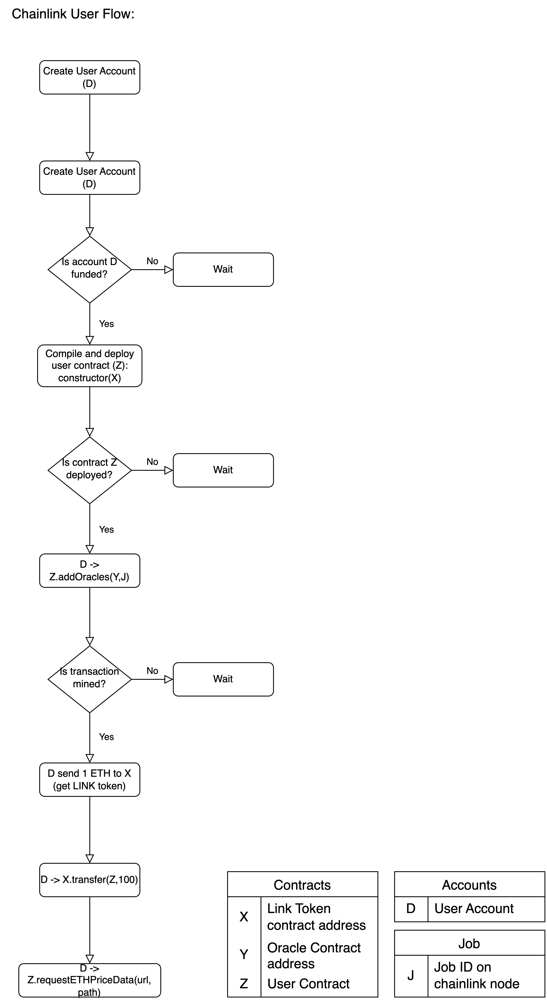

# Table of Contents
[What is Chainlink?](#chainlink)

[Chainlink Initializer Node](#chainlink-initializer-node)

[Chainlink Normal Node](#chainlink-normal-node)

[Chainlink User Flow](#chainlink-user-flow)


## Terms
Accounts:
- A : For chainlink initializer node to deploy link token contract
- B : Created by chainlink statup command to send transactions to oracle contract
- C : For chainlink normal node to deploy oracle contract
- D : User account to interact with the user contract

Contracts:
- X :   LINK token contract
- Y :   Oracle contract
- Z :   User contract

Jobs:
- J : Job ID of the configured job on the chainlink node

## Chainlink

### What is Chainlink?
Chainlink is a decentralized oracle network that provides a critical service to the blockchain ecosystem. It securely and reliable connects smart contracts to external data sources, APIs, off-chain computation.


## Chainlink Service
Chainlink service on the seed emulator is based on two types of server. One is the Chainlink initalizer server and the other is the Chainlink normal server. In the upcoming section, we will discuss how Chainlink service is setup on the seed emulator.

### Chainlink Initializer Node
Chainlink initializer server is used to deploy the LINK token contract, and there is also a webserver running from where the users will be able to get the contract address of the LINK token, and oracle contracts deployed by the chainlink normal server.

### Flow of Chainlink Initializer Node

1. The initializer node will wait for the blockchain to be ready.
2. Once the blockchain is ready, the initializer node will create a new web3 account (A).
3. Then it will request the faucet service to transfer some ether to the newly created account (A).
4. After receiving the ether, the initializer node will deploy the LINK token contract (X).
5. Once the LINK token contract is deployed, the initializer node will start a web server and a flask server. The LINK token address will be displayed on the web server for the users to use. The flask server will be used by Chainlink normal nodes to send a post request with the oracle contract address. This will be also displayed on the web server so the users can use it.

### Code for Chainlink Initializer Node
```python
chainlink = ChainlinkService()
cnode = 'chainlink_init_server'
# Install the Chainlink initializer service
c_init = chainlink.installInitializer(cnode)
# Set the faucet URL or node name
c_init.setFaucetUrl(vnode="faucet", port=3000)
# Set the RPC to connect to the blockchain
c_init.setRPCbyEthNodeName('eth2')
service_name = 'Chainlink-Init'
emu.getVirtualNode(cnode).setDisplayName(service_name)
# Bind the Chainlink initializer service to an asn
emu.addBinding(Binding(cnode, filter = Filter(asn=164, nodeName='host_2')))
```

### Chainlink Normal Node
Chainlink normal server is used to deploy the oracle contracts. The oracle contracts are used to get the data from the external world and send it to the smart contracts. The oracle contracts are deployed by the Chainlink normal server and the oracle contract address is sent to the Chainlink initializer server.

### Flow of Chainlink Normal Node

1. The normal node will will start the chainlink servies which will create a new chainlink web3 account (B).
2. Then it will request the faucet service to transfer some ether to the newly created account (B).
3. After sending the faucet request the normal node will wait for the initializer node to deploy the LINK token contract, and from the web server it will get the LINK token address (X).
4. Once the LINK token address (X) is received, the normal node will create a new account (C), request faucet service to transfer some ether to the newly created account (C).
5. After receiving the ether, the normal node will deploy the oracle contract (Y).
6. Once the oracle contract is deployed, the normal node will invoke Y.setAuthorizedSenders([B]) to authorize the chainlink created account (B) to send data/transaction to the oracle contract (Y).
7. After this is done, the normal node will send a post request to the flask server running on the initializer node with the oracle contract address (Y).
8. Then using the oracle contract address (Y) the initializer node will configure generic jobs for the chainlink service.

### Code for Chainlink Normal Node
```python
# Install the Chainlink normal service
c_normal = chainlink.install(cnode)
# Set the RPC to connect to the blockchain
c_normal.setRPCbyEthNodeName('eth{}'.format(i))
c_normal.setInitNodeIP("chainlink_init_server")
# Set the faucet URL or node name
c_normal.setFaucetUrl(vnode="faucet", port=3000)
emu.getVirtualNode(cnode).setDisplayName(service_name)
emu.addBinding(Binding(cnode, filter = Filter(asn=asn, nodeName='host_2')))
```

## Chainlink User Flow

### User Contract:

```solidity
// SPDX-License-Identifier: MIT
pragma solidity ^0.8.7;

import "@chainlink/contracts/src/v0.8/ChainlinkClient.sol";
import "@openzeppelin/contracts/access/Ownable.sol";

contract ETHPriceAverageFeed is ChainlinkClient, Ownable {
    using Chainlink for Chainlink.Request;

    uint256 private constant ORACLE_PAYMENT = 1360000000000000000;
    uint256 public averagePrice;
    uint256 public responsesCount;
    address public linkToken;

    struct OracleData {
        address oracle;
        bytes32 jobId;
        bool isActive;
        uint256 price;
    }

    OracleData[] public oracles;
    mapping(bytes32 => bool) private pendingRequests;
    
    constructor() Ownable(msg.sender){}

    function setLinkToken(address _link_token) public onlyOwner{
        setChainlinkToken(_link_token);  
        linkToken = _link_token;  
    }

    function addOracle(address _oracle, string memory _jobId) public onlyOwner {
        bytes32 jobIdBytes = stringToBytes32(_jobId);
        oracles.push(OracleData({
            oracle: _oracle,
            jobId: jobIdBytes,
            isActive: true,
            price: 0
        }));
    }

    function addOracles(address[] memory _oracles, string memory _jobId) public onlyOwner {
        bytes32 jobIdBytes = stringToBytes32(_jobId);
        for (uint256 i = 0; i < _oracles.length; i++) {
            oracles.push(OracleData({
                oracle: _oracles[i],
                jobId: jobIdBytes,
                isActive: true,
                price: 0
            }));
        }
    }

    function deactivateOracle(uint256 _index) public onlyOwner {
        require(_index < oracles.length, "Invalid oracle index");
        oracles[_index].isActive = false;
    }

    function requestETHPriceData(string memory url, string memory path) public onlyOwner {
        for (uint256 i = 0; i < oracles.length; i++) {
            if (oracles[i].isActive) {
                Chainlink.Request memory request = buildChainlinkRequest(
                    oracles[i].jobId,
                    address(this),
                    this.fulfill.selector
                );

                request.add("get", url);
                request.add("path", path);
                request.addInt("multiply", 100);

                bytes32 requestId = sendChainlinkRequestTo(oracles[i].oracle, request, ORACLE_PAYMENT);
                pendingRequests[requestId] = true;
            }
        }
    }

    function fulfill(bytes32 _requestId, uint256 _price) public recordChainlinkFulfillment(_requestId) {
        require(pendingRequests[_requestId], "Request is not valid");
        pendingRequests[_requestId] = false;

        uint256 sumPrices = 0;
        uint256 activeOracles = 0;

        for (uint256 i = 0; i < oracles.length; i++) {
            if (oracles[i].oracle == msg.sender && oracles[i].isActive) {
                oracles[i].price = _price;
                break;
            }
        }

        for (uint256 i = 0; i < oracles.length; i++) {
            if (oracles[i].isActive && oracles[i].price > 0) {
                sumPrices += oracles[i].price;
                activeOracles++;
            }
        }

        if (activeOracles > 0) {
            averagePrice = sumPrices / activeOracles;
            responsesCount = activeOracles;
        }
    }

    function getResponsesCount() public view returns (uint256) {
        return responsesCount;
    }

    function stringToBytes32(string memory source) private pure returns (bytes32 result) {
        bytes memory tempEmptyStringTest = bytes(source);
        if (tempEmptyStringTest.length == 0) {
            return 0x0;
        }
        assembly {
            result := mload(add(source, 32))
        }
    }

    receive() external payable {}
}
```

Functions:

1. setChainlinkToken(X): This will set the below variable in `ChainlinkClient.sol` 
    
    ```python
    function _setChainlinkToken(address linkAddress) internal {
        s_link = LinkTokenInterface(linkAddress);
     }
    ```
    
2. addOracles(address oracle, jobId): This function is used to add the oracle contract/contracts(Y) in the user contract so that they can make request for the data
3. requestETHPriceData(url, path): This function accepts two parameters url and path. Here, url is the api that we want to get the data from, and the path is the json path of the data we want to extract/decode. For example:
    
    ```jsx
    url = "https://min-api.cryptocompare.com/data/pricemultifull?fsyms=ETH&tsyms=USD"
    path = "RAW,ETH,USD,PRICE"
    ```
    
4. fulfill(): This is the callback function that is used by the Chainlink nodes to send the data back to the blockchain.

## Why does the user contract require LINK Token?

The user contracts require LINK token due the integration of the “`transferAndCall`” mechanism in the ChainlinkClient.sol so there is a seamless interaction between user contract and Chainlink oracles. Below is the code from `ChainlinkClient.sol` that is used by the user contract.

```python
function _sendChainlinkRequestTo(
    address oracleAddress,
    Chainlink.Request memory req,
    uint256 payment
  ) internal returns (bytes32 requestId) {
    uint256 nonce = s_requestCount;
    s_requestCount = nonce + 1;
    bytes memory encodedRequest = abi.encodeWithSelector(
      ChainlinkRequestInterface.oracleRequest.selector,
      SENDER_OVERRIDE, // Sender value - overridden by onTokenTransfer by the requesting contract's address
      AMOUNT_OVERRIDE, // Amount value - overridden by onTokenTransfer by the actual amount of LINK sent
      req.id,
      address(this),
      req.callbackFunctionId,
      nonce,
      ORACLE_ARGS_VERSION,
      req.buf.buf
    );
    return _rawRequest(oracleAddress, nonce, payment, encodedRequest);
  }

function _rawRequest(
    address oracleAddress,
    uint256 nonce,
    uint256 payment,
    bytes memory encodedRequest
  ) private returns (bytes32 requestId) {
    requestId = keccak256(abi.encodePacked(this, nonce));
    s_pendingRequests[requestId] = oracleAddress;
    emit ChainlinkRequested(requestId);
    require(s_link.transferAndCall(oracleAddress, payment, encodedRequest), "unable to transferAndCall to oracle");
    return requestId;
  }
```

This mechanism is used for Payment to oracle service:

- When a user contract needs to retrieve data from external source, it must compensate the oracle nodes that perform this services.
- The `transferAndCall` allows user contracts to transfer LINK tokens as payment to oracles in a single transaction.

### What happens when the D.requestETHPriceData(url, path) is invoked? (Behind the scenes)

When D.requestETHPriceData(url, path) is invoked, it initiates a process to retrieve Ethereum price data from the external sources using the Chainlink network. This process involves several steps:

### Step 1: Initiating a request:

- Function call:  When `D.requestETHPriceData(url, path)` is called, it iterates through a predefined list of active Chainlink oracles (`oracles` array). For each active oracle, the function prepares a new Chainlink request.

### Step 2: Preparing Chainlink Request:

- Building the request: For each added oracle, a Chainlink request object is created by calling `buildChainlinkRequest` . This function is provided by `ChainlinkClient`  library and is used to construct a new request with a specific job ID, the address of the calling(`Z`) contract, and the function selector of the callback function( `this.fulfill.selector` ) where the oracle’s response will be sent.
- Adding request parameters: The request is configured with parameters necessary for the oracle to fetch the required data. In our example, this includes the `url` , `path` , and instruction to `multiply` the result (to adjust for decimal places).
- Oracle Payment: The request includes an oracle payment amount (`ORACLE_PAYMENT`), specifying how much LINK token the oracle will receive for fulfilling this request.

### Step 3: Sending the Request to the Oracle

- Sending Request: he prepared request is sent to the specified oracle using `sendChainlinkRequestTo`. This function takes the oracle's address, the prepared request, and the payment amount as arguments. Internally, this function utilizes the `_rawRequest` functionality to handle the LINK token transfer and request transmission.(As explained in the above section)

### Step 4: `_rawRequest`  Functionality

- Unique Request ID: `_rawRequest` generates a unique request ID for tracking and assigns it to the request. This ID is crucial for correlating requests with responses.
- Logging and Token transfer: The function logs the request and performs the `transferAndCall`  action on the LINK token contract, transferring the token to the oracle contract with the request data.
- Awaiting Fulfillment: The request ID is marked as pending, indicating that the request has been sent but not yet fulfilled.

### Step 5: Oracle Processing and Response

- Oracle node processing: A chainlink node monitoring the blockchain, detects a new request, retrieves the Ethereum price data from the specified url, processes data according to the request parameters, and send the results to the oracle contract.
- Callback Invocation: The oracle contract then calls the `fulfill` function on the user contract, using the function selector provided in the original request. The `requestId`  is used to ensure the response corresponds to the correct request.

### Step 6:  Data Handling

- The **`fulfill`** function, specified in the request, receives the data. This function is responsible for handling the incoming price data, such as updating state variables or triggering other contract logic based on the received data.

### Step 7: Finalization

- Completion: Once the `fulfill`  function successfully processes the data, the request is considered fulfilled. And `recordChainlinkFulfillment`  which removes the request id from the pending request.
    
    ```python
    modifier recordChainlinkFulfillment(bytes32 requestId) {
        require(msg.sender == s_pendingRequests[requestId], "Source must be the oracle of the request");
        delete s_pendingRequests[requestId];
        emit ChainlinkFulfilled(requestId);
        _;
      }
    ```
    

### What happens if the request is not fulfilled?

When a request is made and LINK tokens are transferred to the oracle or the oracle contract, the tokens are considered payment for the service of retrieving and providing the requested data. If the request is not fulfilled:

- Standard behavior: Typically, the tokens remain with the oracle as payment for attempting the service, even if the data was not successfully returned.
- Refund Mechanism: Some oracle contracts or services might have a refund mechanism for cases where requests cannot be fulfilled, though this is less common and would need to be explicitly coded into the oracle contract.

### Handling Unfulfilled Requests

The `ChainlinkClient` contract includes features that allow for the cancellation of requests under certain conditions. For instance, the `_cancelChainlinkRequest` ****function can be used to cancel a request.

```jsx
function _cancelChainlinkRequest(
    bytes32 requestId,
    uint256 payment,
    bytes4 callbackFunc,
    uint256 expiration
  ) internal {
    OperatorInterface requested = OperatorInterface(s_pendingRequests[requestId]);
    delete s_pendingRequests[requestId];
    emit ChainlinkCancelled(requestId);
    requested.cancelOracleRequest(requestId, payment, callbackFunc, expiration);
  }
```

### User Flow:

D → Z.function() means D invokes Z.function().



### Emulator Setup
First setup the chainlink init server and chainlink normal servers.
```python
# Create an instance of the ChainlinkUserService
chainlink_user = ChainlinkUserService()
# Install the chainlink user service
c_user = chainlink_user.install(cnode)
# Set the RPC to connect to the blockchain
c_user.setRPCbyEthNodeName('eth2')
# Set the faucet by node name and port
c_user.setFaucetServerInfo(vnode = 'faucet', port = 80)
# Give information about the chainlink initializer server and the number of normal servers
c_user.setChainlinkServiceInfo(init_node_name='chainlink_init_server', numeber_of_normal_servers=2)
# Set Display Name
emu.getVirtualNode(cnode).setDisplayName('Chainlink-User')
# Bind the Chainlink user service to an asn
emu.addBinding(Binding(cnode, filter = Filter(asn=153, nodeName='host_2')))
```

This service will work as described in the user flow above. After the setup, the user account(D) will call the requestETHPriceData function in the user contract(Z) to get the data from this external source [url](https://min-api.cryptocompare.com/data/pricemultifull?fsyms=ETH&tsyms=USD). Then the service will wait for responses from the oracles and calculate the average price of the Ethereum. Atlast, the response count and the average price will be displayed on the console. After that the service will exit. 


