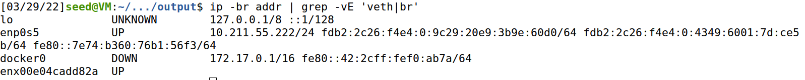

# BYOI;Bring Your Own Internet 
In this example, we show how the SEED Emulator to emulate the
Internet Service Provider that provides the Internet service 
to home (such as Spectrum). The scenario is described in the 
diagram as below.


## Environment Requirements
- OS : Ubuntu 20.04
- USB to Ethernet Adapter (Optional); It is needed when Ubuntu running on a virtual machine.

## Physical Devices Installation Example


## Step 1) Deploy a dhcp server
```
# Create a DHCP server (virtual node).
dhcp = DHCPService()

# Default DhcpIpRange : x.x.x.101 ~ x.x.x.120
# Set DhcpIpRange : x.x.x.125 ~ x.x.x.140
dhcp.install('dhcp-01').setIpRange(125, 140)

# Customize the display name (for visualization purpose)
emu.getVirtualNode('dhcp-01').setDisplayName('DHCP Server')

# Create new host in AS-151, use it to host the DHCP server.
# We can also host it on an existing node.
as151 = base.getAutonomousSystem(151)
as151.createHost('dhcp-server').joinNetwork('net0')
```

## Step 2) Add a Host’s physical interface to the bridge

Once the Host's network interface is bridged to the docker's bridge interface, DHCP server inside the emulator will assign the ip to the Wifi Accesspoint. Once you connect to the Wifi from the Phyisical Devices, the devices can connect (ping or visit webpages) to the hosts inside the emulators. 

The Host's network interface which is bridged to the docker's bridge interface should be a physical one. When this project is set on a virtual machine environment, an usb to ethernet adapter is needed. When you bridge a virtual network interface created by virtual machine to the docker's bridge interface, the bridge between the virtual network interface and host's interface will be disconnected, which leads the link between the switch and the host to be disconnected. For this reason, when you run this project on a virtual machine, use an usb to ethernet adapter and make the virtual machine to use the physical ehthernet adapter directly.

Please refer to this documentation, to make attach the ethernet usb to the virtual machine on Virtualbox. 

https://www.thewindowsclub.com/virtualbox-failed-to-attach-the-usb-device-to-the-virtual-machine 


### Run bridge.sh

```
usage: ./bridge.sh -i {interface} -a {ASN}
```

You can get the interface name through `ip -br addr | grep -vE 'veth|br'` command.
This command will show you network interfaces name without `veth` or `br`.



In this example, the physical interface name that I use is `enx00e04cadd82a`. And the ASN that I use is 151 as I installed the dhcp server at asn-151.
So the command will be as below.

` ./bridge.sh -i enx00e04cadd82a -a 151`


