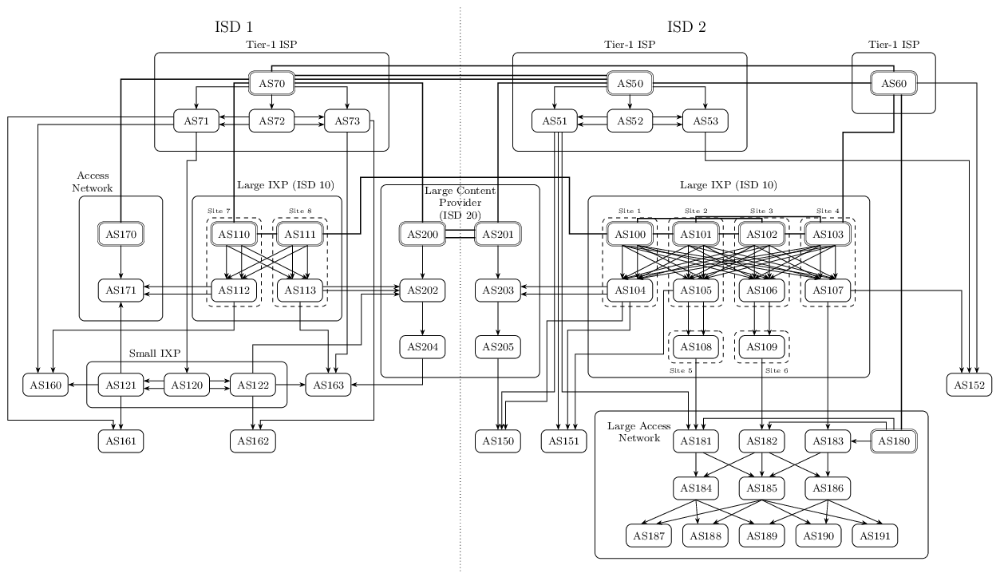

SCION Internet Topology
=======================
Two topology examples showing a possible transition from a BGP-based to a
SCION-based Internet.

BGP Topology
------------
A "flattened" Internet topology with Tier-1 ISPs providing transit and three
IXes providing shortcuts between the other ASes including access networks and a
large content provider.


Lines with arrowheads indicate paid transit connections, dashed lines are used
for settlement-free peering. The three IXes are not ASes themselves, the are
transparent on the network layer. All IX participants are connected to a route
server in each IX enabling full multilateral peering.

### Running the Topology

```bash
./bgp-internet.py
cd bgp
docker-compose build
docker-compose up -d
```

SCION Topology
--------------
A relatively large pure SCION Internet topology created by promoting IXPs in the
BGP topology to ASes and exposing the internal structure of BGP ASes by
partitioning them into many SCION ASes. The topology is roughly divided
in two large Internet regions that are represented by ISD 1 and ISD 2.
Additional ISDs exist for large multi-region ASes that can be expected to run
their own ISD. All ASes contain a single internal network and a single control
service and border router. The following graph gives an overview of the AS-level
topology:



SCION core ASes have double outlines, the other ASes are non-core ASes. Thick
lines represent core links, links with arrowheads are transit links. There are
no peering links. The topology consists of Tier-1 ASes, IXPs, a large content
provider and access networks of different sizes.

### Running the Topology

```bash
./scion-internet.py
cd scion
docker-compose build
docker compose up -d # use docker compose v2 (no hyphen)
```

### Implementation Notes

- Everything is in ISD 1 until AS multi-homing is implemented.
- IX networks are used for internal links within IXPs and large ASes that
  consists of many SCION ASes to limit the number of Docker networks that have
  to be created.
- Cross-connections are mainly used for core and transit links between the large
  ASes.
