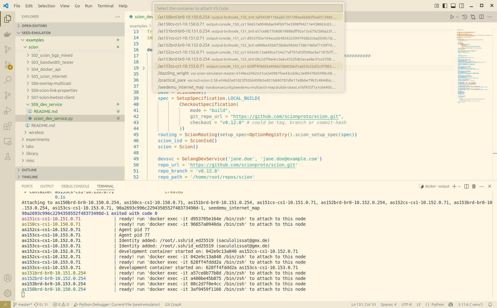
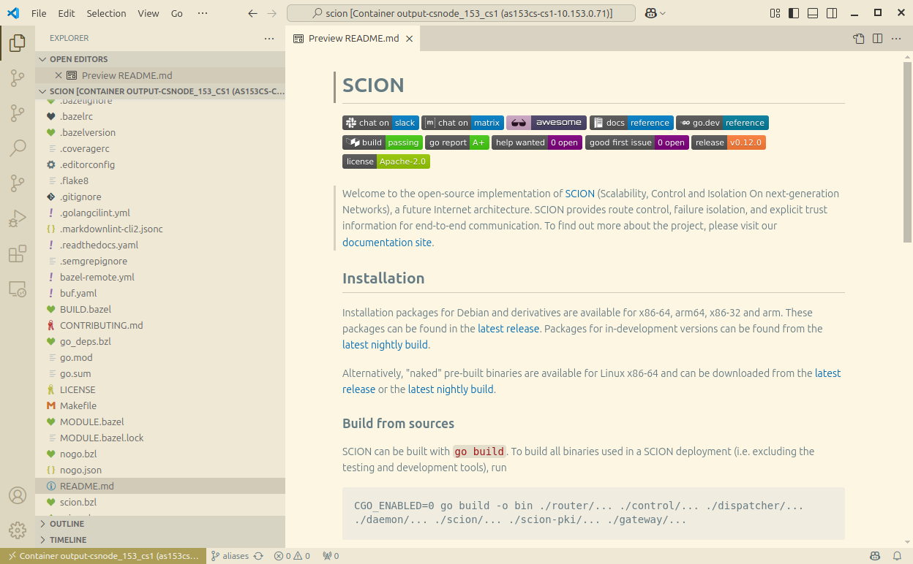

# Networking Application Development in SEED


The DevelopmentService prepares a node for [Remote Development with VSCode](https://code.visualstudio.com/docs/remote/remote-overview).
It installs the VSCode Remote Server on the Node during the docker image build, which allows to ssh into the running container later i.e. to debug software.

As of now the primary anticipated use of the seed-emulator has been the deployment of fully developed applications into an emulated szenario i.e. to observe its behaviour.

The DevService adapts the emulators primary paradigm of deploying fully develped applications into an emulated szenario,
 to meet the need of developing i.e. P2P software to maturity in a distributed environment.

The DevService allows for each individual node that it is installed on, to specify one or more Git repositories that shall be checked out
(along with the desired filesystem path and branch) as well as the VSCode Extensions required for the projects software stack
(i.e. golang.Go for the SCION-proto implementation which is written in Go)
The DevService takes care to install the entirety of build and analysis tools that are needed for a given programming language at docker image build time (for Go this being i.e. the compiler, language server gopls, debugger delve) so that no annoying time delay arises once the emulator is running and you want to attach to a container.
Any specified Git repositories are checked out on its own separate docker volume, for the changes to persist between runs of the simulator in case one forgets to push.

Software development requires a 'real Internet' connection of the container be it to git push/pull or fetch project dependencies for a build (i.e. go get, cargo build etc. )
 This is achieved by promoting the nodes default gateway ( router node ) in the simulation into a 'RealWorldRouter' (which has access to the `000_svc` service network)
Use of a separate service network inhibits 'short-circuiting' the simulated network topology (i.e. any crosstalk past the intended network topo among nodes)


### Usage
This example is meant to showcase how SEED can be made into a testbed for development of features for SCION.
This is mainly achieved by two steps:
- deploy your custom SCION stack inside the simulation
  This is achieved by setting the `SetupSpecification` option on the `ScionRouting`layer and
  make it point to the specific repo checkout you want to use.
  As a consequence a named docker volume containing the binary distributables is mounted into every node in the simulation
  under the `/bin/scion` path.

- install a GolangDevelopmentServer on every node in the emulation
  This turns every simulation node into a Golang development environment (with go, git, delve, gopls, vscode-server),
  by mounting a bunch of docker volumes into each container containing the installation.
  (they'll even share the module/build cache)
   For each repo that you check out a named docker volume will be generated that accommodates the code and is shared between all nodes.
   If you now set up your project build-task to output the distributables into `/bin/scion`, you just need to restart the simulation docker containers,
   to run and test a SCION stack with your latest changes in place.
   Moreover changes done to the code in one container, are visible to all others (if checkout mode is `AccessMode.shared` ),
    so it doesn't matter on which of the nodes you trigger a recompile. The changes will take effect on all simulation nodes.


```
    spec = SetupSpecification.LOCAL_BUILD(
            CheckoutSpecification(
                mode = "build",
                git_repo_url = "https://github.com/johndoe/scion.git", # your SCION fork
                checkout = "v0.12.0" # could be tag, branch or commit-hash
            ))
    routing = ScionRouting(setup_spec=OptionRegistry().scion_setup_spec(spec))
```


```
    devsvc = GolangDevService('jane.doe', 'jane.doe@example.com')
    repo_url = 'https://github.com/scionproto/scion.git'
    repo_branch = 'v0.12.0'
    repo_path = '/home/root/repos/scion'

    svc = devsvc.install(f'dev_152_cs1')
    svc.checkoutRepo(repo_url, repo_path, repo_branch, AccessMode.shared)
    emu.addBinding(Binding(f'dev_152_cs1', filter=Filter(nodeName=as152_cs1.getName(), asn=152)))

    svc3 = devsvc.install(f'dev_153_cs1')
    svc3.checkoutRepo(repo_url, repo_path, repo_branch, AccessMode.shared)
    emu.addBinding(Binding(f'dev_153_cs1', filter=Filter(nodeName=as153_cs1.getName(), asn=153)))

```


To do any development you first have to bring up the simulation `docker compose up` and then attach to one of the containers with DevServer installation
(i.e. from within VSCode IDE via the [RemoteDevelopment Extension](https://marketplace.visualstudio.com/items?itemName=ms-vscode-remote.vscode-remote-extensionpack) ).
You can attach to multiple nodes at the same time and i.e. send a packet from the integrated terminal in one window,
 and hit a breakpoint set in the border router of any on-path AS once the packet eventually arrives there and step through to see if its correctly processed the way you intended.

 


 