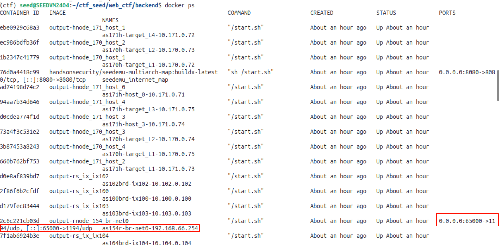
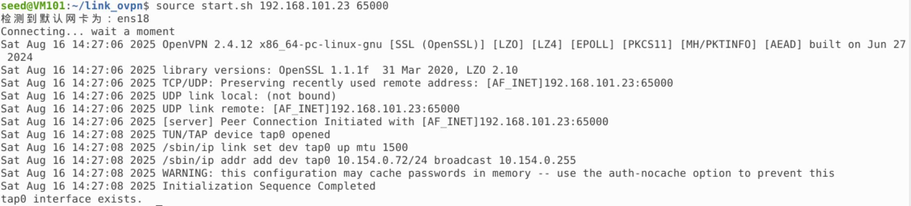
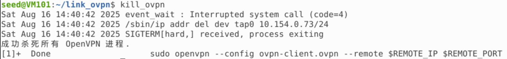

## OpenVPN Connection to Emulator Internal Network

### Prerequisites

1. The virtual machine cannot run the emulator, otherwise there will be IP conflicts (local container and server container), so clean up the emulator network before proceeding
2. It's best not to have global proxy (recommend turning off global proxy)

### Connect to OpenVPN

1. `source start.sh $server_ip $port`

- Where server_ip is the host IP, port needs to be checked through the dockps command, the port corresponding to port 1194 is the port, for example, the figure below shows 65000:

2. Wait five seconds for connection, "tap0 interface exists" indicates successful connection

3. Use `ip -4 -br ad` to check, where the IP after tap is the node IP in the emulator network (i.e., attacker IP), you can also try to `ping` other nodes in the emulator network, success indicates you have connected to the network

### Disconnect OpenVPN

- `kill_ovpn` to close the connection

