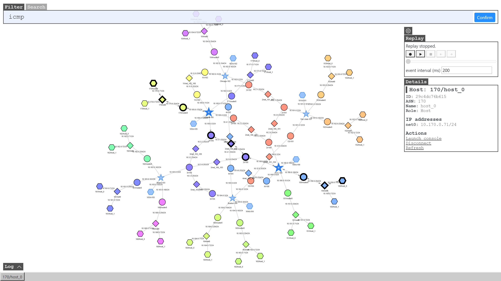
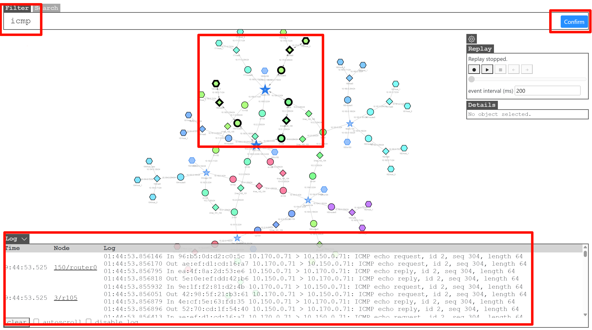
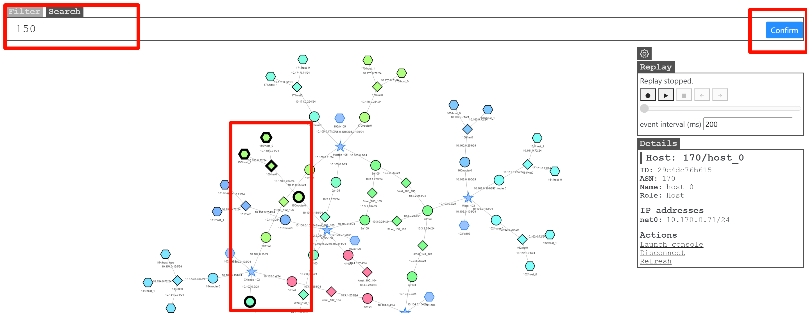
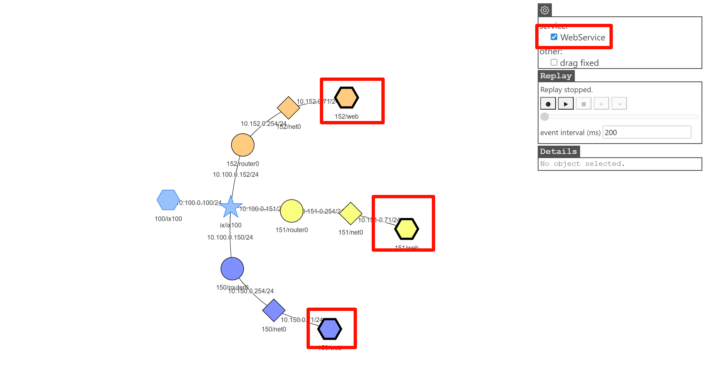
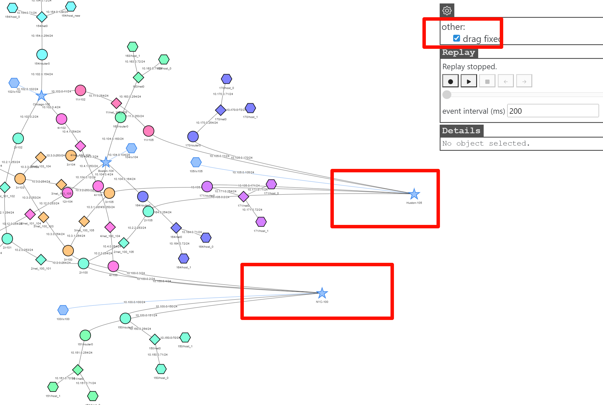
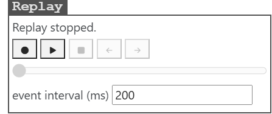
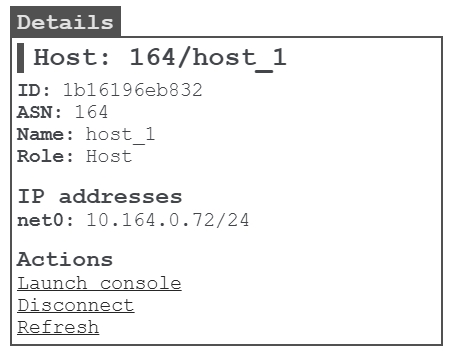
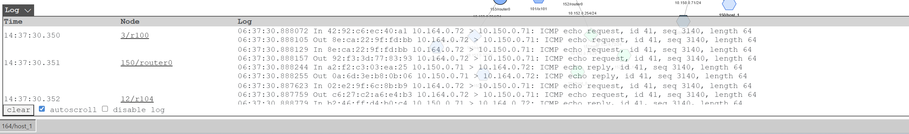

## map.html

The network topology diagram illustrates the interconnection relationships between nodes and networks, along with auxiliary features including filtering, search, settings, replay, and logging capabilities.

- [filter](#filter)
- [search](#search)
- [setting](#setting)
  - [service](#service)
  - [drag fixed](#drag-fixed)
- [replay](#replay)
- [operate the container](#operate-the-container)
- [data packet log echo](#data-packet-log-echo)

### filter

Configure packet capture filtering conditions - this serves as the primary functionality.
Input parameters will be utilized as tcpdump parameters to set packet capture and filtering conditions. 

1. Input valid packet capture conditions
2. When the cursor is positioned in the "Filter" input field, press the "Enter" key or click the "Submit" button to submit data and initiate packet capture 
3. Nodes capturing data packets will flash visually 
4. Specific packet contents will be displayed in the Packet Log Echo section

### search

Search for nodes and networks that meet the conditions, such as ip, name, label, etc. The found nodes will be highlighted. The operation method is similar to that of `filter`.

### setting

#### service

There may be simulators containing various "Services". To better display them, this function is provided.

When there is an emulator containing "service", the "service" option will appear in the "setting". Check the specific service, and the border of the corresponding emulator in the "map" will be highlighted (the color is random, and the color of the same type of "service" is the same). Uncheck it to restore the original style.

As shown in the figure, when "WebService" is selected, the border of this type of container is highlighted.

#### drag fixed

Determines whether the topology diagram remains in its current position after being dragged with the mouse.

Checked: Diagram maintains its position after dragging

Unchecked: Diagram does not maintain position after dragging

### replay

To better document and display packet transmission on the map interface, the `Replay` function is provided.  This feature recreates recorded packet transmission processes at specified display rates and supports fast-forward and rewind functionality.

- `Dot` button: start recording
- `Triangle` button: Start/Pause replay
- `Square` button: Stop replay
- `Left` arrow button: Step backward
- `Right` arrow button: Step forward
- `Event interval`: Adjust replay rate

### operate the container

Clicking "Start Console" opens the container terminal, allowing direct access to container operations without executing Docker commands, providing a more convenient user experience.

For security reasons, the environment variable "console" is provided. When it is "false", access to the console is prohibited. please refer to [example/internet/B07_internet_map_unable_console](../../../examples/internet/B07_internet_map_unable_console/README.md)

### data packet log echo

All captured packets matching the "Filter" conditions will be displayed in the "Log" section, facilitating detailed inspection of packet contents. This section can be collapsed when not needed.

Note on the map:

- try not to click on any nodes or start packet capture on the map until the emulation is fully started (i.e., all containers are created).