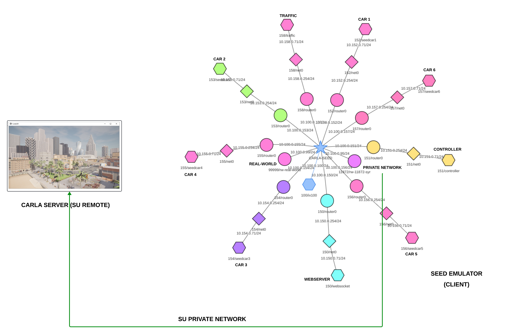
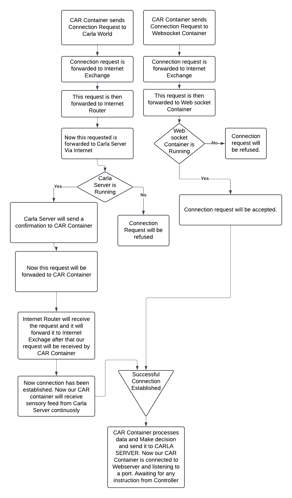
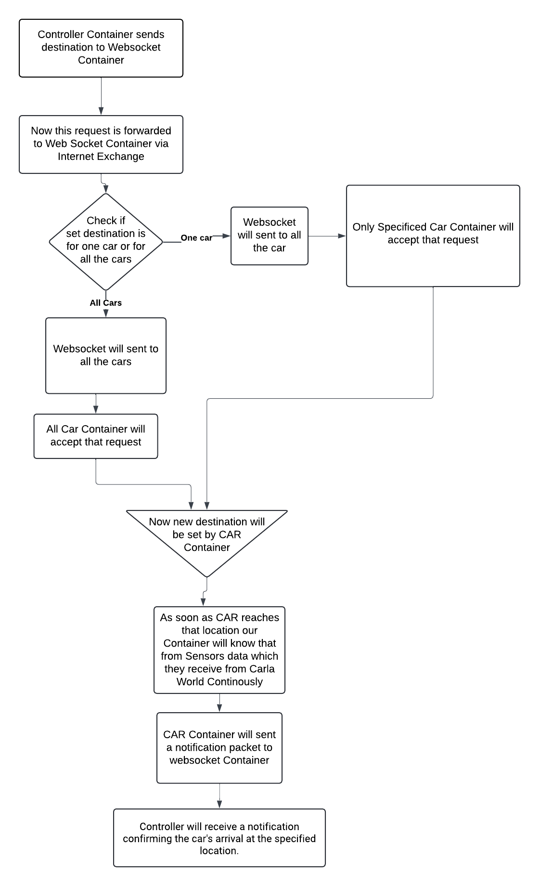

# CARLA-SEED 
The Developer Manual offers detailed insights into project architecture, technical implementation, visualization, and future developments.
## Table of Contents
- [CARLA-SEED](#carla-seed)
  - [Table of Contents](#table-of-contents)
  - [Core Concepts](#core-concepts)
  - [Project Architecture](#project-architecture)
	  - [Base components of Architecture](#base-components-of-architecture)
      - [How CARLA-SEED Works Behind the Scenes](#how-carla-seed-works-behind-the-scenes)
	  - [How User Set Destination to Vehicles](#how-user-set-destination-to-vehicles)
  - [Technical Implementation](#technical-implementation)
	  - [controller](#controller-program)
	  -  [web server](#web-server-program)
	  - [config](#config-program)
	  - [generate_traffic](#traffic-generator-program)
	  - [carlaviz](#carlaviz)
	  - [headless_automatic_control](#headless-automatic-control-program)
  - [Future Work](#future-work)
## Core concepts
### World and client
The 'world' is the central element of the server that holds the simulation's state, and clients connect to it using the IP address (default: localhost) and port (default: 2000) to interact or modify the simulation.

Read More: https://carla.readthedocs.io/en/latest/core_concepts/#1st-world-and-client
### Traffic Manager
The Traffic Manager in CARLA Simulator acts as a built-in system that governs vehicles not involved in learning, orchestrating realistic behaviors to emulate urban environments accurately.

Read More: https://carla.readthedocs.io/en/latest/ts_traffic_simulation_overview/#traffic-manager
### Synchronous and asynchronous mode
In this mode, the client and server operate in lockstep, with the server waiting for the client to process each simulation step before proceeding to the next. This ensures determinism and precise control over the simulation but can lead to slower overall execution.

Read More : https://carla.readthedocs.io/en/latest/foundations/#synchronous-and-asynchronous-mode
### Sensors
In CARLA, sensors are vital for vehicles to gather information about their surroundings. These specialized actors, attached to vehicles, capture data such as camera images, radar readings, and lidar scans, aiding in simulation and analysis tasks.

Read More: https://carla.readthedocs.io/en/latest/core_concepts/#4th-sensors-and-data
## Project Architecture

### Base components of Architecture
1. **Car Containers (seedcar1/152 to seedcar6/157):**
Each car container runs an instance of `automatic.control.py`, with six distinct containers handling separate cars in the simulation. They're designed for minimal CPU usage and are identified as Host-152 through Host-157 in the architecture
2. **Web Socket Container (websocket/150):**
This container acts as a dedicated communication hub, enabling real-time interactions between the Controller and the Car containers. It uses WebSocket protocol to facilitate bidirectional messaging.
3. **Controller (controller/151)**
The Controller orchestrates the simulation by setting car locations, fetching data, and issuing commands to the Car containers. It's the administrative center of the simulation, interacting with the cars through the WebSocket container.
4. **Internet Router (99999/real-world):**
This router represents the gateway for all the containers to connect with the wider internet, allowing data to flow between the CARLA server and the SEED emulator, effectively bridging the simulation with the client machine.
5. **Traffic Manager(traffic-158):**
The Traffic Manager generates both vehicle and pedestrian traffic, creating a comprehensive and lively urban simulation environment.
6. **CARLA Server:**
 Running remotely, the CARLA server is the simulation engine powered by Unreal Engine, creating high-fidelity visual and physical simulations of driving environments. It connects to the SEED emulator via the internet.
 7. **Client Machine:**
Located elsewhere, this machine serves as the user's point of access to the simulation.
8. **SEED Emulator Internet Map:**
The SEED Emulator acts like a virtual traffic system, simulating the network that connects all the cars in the simulation. It makes sure that messages and data travel between the cars and the controllers just like they would over real-world internet connections. It's a key part of the setup that lets the cars "talk" to each other and to the main control center.
9. **CarlaViz Container**:
Although not depicted in the diagram, the CarlaViz container is an integral part of the Docker network. It offers a live visual feed of the simulation, enabling users to graphically track and analyze the movements and interactions of the vehicles within the CARLA Server environment. Its connectivity to the same network ensures seamless integration with the simulation data flow.
### How CARLA-SEED Works Behind the Scenes

1. **Initial Connection Requests**:
    - The car container initiates two separate connection requests:
        - One request is sent to the CARLA world.
        - Another request is sent to the WebSocket container.
2. **Routing of Requests**:
    - Both requests are relayed through the Internet Exchange.
    - The CARLA world request proceeds to the Internet Router and then to the CARLA Server.
    - The WebSocket request is directed straight to the WebSocket Container.
3. **Response from CARLA Server**:
    - If the CARLA Server is operational, it accepts the connection from the car container.
    - A confirmation is sent back to the car container via the Internet Router, establishing a continuous sensory data feed.
4. **Response from WebSocket Container**:
    - If the WebSocket Container is not operational, the connection request is refused.
    - If it is operational, the connection is accepted.
5. **Post-Connection Processing**:
    - Once successfully connected, the car container processes the sensory data received from the CARLA Server.
    - Based on this data, the car container makes decisions and sends these decisions back to the CARLA Server for actions to be taken.
6. **Connection to Web Server**:
    - Simultaneously, the car container connects to a webserver.
    - It listens on a specified port for any incoming instructions from the Controller.
7. **Final Setup**:
    - The initialization process is completed, and the car container is now ready for interactive simulation, awaiting further instructions or tasks.
### How User Set Destination to Vehicles

1. **Destination Request Initiation**:
    - The Controller Container starts the process by sending a destination request to the WebSocket Container.
2. **Request Routing**:
    - The destination request is routed through the Internet Exchange to the WebSocket Container.
3. **Destination Check by WebSocket Container**:
    - The WebSocket Container checks the destination request to determine if it is meant for a specific car or all cars:
        - If the request is for one specific car, the WebSocket sends the information directly to that car.
        - If the request is for all cars, the WebSocket broadcasts the destination to every car container.
4. **Destination Setting by Cars**:
    - The targeted car or cars receive the destination request and set the new destination accordingly.
5. **Destination Reach Notification**:
    - As a car reaches the new destination, it sends a notification back through the WebSocket Container.
6. **Confirmation to Controller**:
    - The Controller Container receives a notification confirming the car's arrival at the specified destination.
## Technical Implementation
### Controller Program
#### Command Line Arguments
1. **WebSocket IP (--w_ip)**
	- **Default**: `localhost`
	- **Purpose**: Specifies the IP address of the WebSocket server.
	- **Usage Example**:
	```shell
		--w_ip 192.168.1.1 
	```
2. **WebSocket Port (--w_port)**
	- **Default**: `6789`
	- **Purpose**: Specifies the port number on which the WebSocket server is listening.
	- **Usage Example**: 
	```shell
	    -- w_port 6789
    ```
3. **CARLA Server IP (--c_ip)** 
	- **Default**: `"localhost"`
	- **Purpose**: Specifies the IP address of the CARLA server.
	- **Usage Example**:
	```shell
		--c_ip 192.168.1.2
	```
4. **CARLA Server Port (--c_port)**
	- **Default**: `2000`
	- **Purpose**: Specifies the port number on which the CARLA server is listening.
	- **Usage Example**:  
		```shell
			--c_port 2000
		```
5. **Location (--location)**
	- **Default**: `"Townhall"`
	- **Purpose**: Specifies a predefined location name to set as the destination for the vehicle(s).
	- **Predefined Options**: `"Townhall"`, `"Museum"`, `"Hotel"`, `"Basketballcourt"`, `"Skateboardpark"`
	- **Usage Example**:
	    ```shell
			--location Museum
		```
6. **Vehicle Identifier (--id)** 
	- **Default**: `"all"`
	- **Purpose**: Specifies the identifier for the vehicle to which the location will be sent or `"all"` to send to all vehicles.
	- **Usage Example**:
	    ```shell
			--id seedcar1
		```
7. **List Cars (--list)** 
	- **Purpose**: When this flag is used, the script will list all vehicle role names and exit.
	- **Usage Example**:
	    ```shell
			--list
		```
8. **Car Info (--c_info)** 
	- **Purpose**: Retrieves detailed information for a specific car based on its role name.
	- **Usage Example**:
	    ```shell
			--c_info seedcar1
		```
#### Destination Management
**Setting and Broadcasting Destinations**: The script provides functionality to set a destination for a specific vehicle or all vehicles, which is crucial for tests involving navigation and route planning. The destination is sent via WebSocket, ensuring that it reaches all relevant clients connected to the server.

```python
	async def set_destination(location_name, id="all")
```
**Define Destination Data**:
```python
	destination = {"type": "set_destination", "location_name": location_name, "car_id": id}
 ```
**Purpose**: Constructs a JSON object containing the type of request, the destination location, and the car ID, preparing it for transmission. <br />
**Establish Web Socket Connection:** 
```python
	async with websockets.connect(WEBSOCKET_URI) as websocket
```
**Purpose**: Opens a WebSocket connection using the previously constructed URI, enabling real-time data transfer. <br />
**Send Destination Data**:
```python
	await websocket.send(json.dumps(destination))
```
**Purpose**: Sends the JSON-encoded destination data over the WebSocket connection to the server, which then communicates it to the designated vehicle(s).
#### Notification Handling
**Listening for Status Updates**: 
This function listens for notifications such as 'destination reached', allowing the script to handle real-time updates about vehicle states which are essential for monitoring the progress of navigation tasks.

```python
	async def receive_notifications()
```
**Receiving Messages:**
```python
	message = await websocket.recv()
```
**Purpose**: Suspends the function to wait for and receive a message from the WebSocket server. <br />
**Checking Mechanism:**
```python 
	if data['type'] == 'destination_reached'
```
**Purpose**: Checks if the received message indicates that a vehicle has reached its designated destination, triggering specific actions based on this event. <br />
**Parsing JSON Message:** 
```python
	data = json.loads(message)
```
**Purpose**: Converts the received JSON string into a Python dictionary for easy data manipulation.
#### Asynchronous Execution 
**Asynchronous Functions**
```python 
	async def set_destination(location_name, id="all")
	async def receive_notifications()
	async def get_vehicle_info(role_name)
```
**Purpose**: Marks the function as a coroutine, enabling it to perform non-blocking operations and efficiently manage asynchronous tasks like network communication and data processing. <br />
**Running Asynchronous Tasks**
``` python
	if __name__ == "__main__":  asyncio.get_event_loop().run_until_complete(set_destination(location_name,args.id)) 
	asyncio.get_event_loop().run_until_complete(receive_notifications())
```
**Purpose**: This section manages the execution of asynchronous tasks when the script runs directly. `run_until_complete` is used to initiate and run the tasks to completion. It orchestrates the start, execution, and orderly conclusion of asynchronous operations, ensuring that they complete before the script exits.
#### Predefined Locations and Navigation
```python
	locations = {"Townhall": (112.705, 9.616, 0.605), 
		"Museum": (-115.36235046386719, 11.285353660583496, 1.249739170074463),
		"Hotel": (-3.092482805252075, -67.59429931640625, 0.872872531414032),
		"Basketballcourt": (-40.11349105834961, 109.1531982421875, 0.16197647154331207),
		"Skateboardpark": (-89.92167663574219, 131.5748748779297, 1.4565911293029785)}
	```
**Purpose**: Maps predefined location names to their coordinates within the CARLA environment, facilitating easy setting of destinations for vehicles. This feature supports simulations that require vehicles to navigate to specific points.
#### Construct Web Socket URL
```python
	WEBSOCKET_URI = f"ws://{args.w_ip}:{args.w_port}"
```
**Purpose**: Build the URI needed to connect to the WebSocket using command-line-provided IP and port.
#### Get Vehicle Roles Function
```python
	def get_vehicle_roles():
```
**Purpose**: Fetch and display the roles and IDs of all vehicles present in the simulation, useful for targeting commands. <br />
**Creating a CARLA Client**
```python
	client = carla.Client(args.c_ip, args.c_port)
```
**Purpose**: Initializes a connection to the CARLA server using the provided IP address and port number, setting up the client to interact with the simulation environment. <br />
**Getting the World**
```python 
	world = client.get_world()
```
**Purpose**: Retrieves the world from the CARLA server which contains all the dynamic elements, like vehicles and sensors, facilitating access to further simulation data. <br />
**Filtering Vehicle Actors:**
```python 
	vehicle_actors = world.get_actors().filter('vehicle.*')
```
**Purpose**: Retrieves all actors from the simulation that match the vehicle pattern, ensuring the function focuses only on vehicle entities for role extraction. <br />
**Iterating and Printing Vehicle Roles:**
```python 
	for vehicle in vehicle_actors:     
		role_name = vehicle.attributes.get('role_name', 'Unknown')     
			if role_name.startswith('seed'):         
				print(f"Vehicle {vehicle.id} with role: {role_name}")
```
**Purpose**: Iterates through each vehicle actor, extracts the role name attribute, and prints it. The filtering condition checks if the role name starts with 'seed', allowing for specific output customization or filtering based on predefined conditions.
#### Get Vehicle Info Function
```python
	async def get_vehicle_info(role_name):
```
 **Purpose**: Obtain and print detailed data about a specific vehicle based on its role name, including real-time location and movement parameters. <br />
**Retrieving and Calculating Vehicle Speed:**
```python
	speed_kmh = 3.6 * math.sqrt(velocity.x**2 + velocity.y**2 + velocity.z**2)
```
**Purpose**: Calculates the speed of the vehicle in kilometers per hour from its velocity vector, providing a crucial metric for assessing vehicle performance in real-time.
### Web server Program
This server is set up to dynamically accept Web Socket connections, manage messages related to vehicle destinations and updates, and maintain a list of connected clients to facilitate message broadcasting.
#### Command Line Arguments
1. **Web Socket Server IP (--ws_ip)** 
	- **Default**: `localhost`
	- **Purpose**: Specifies the IP address where the Web Socket server will listen for incoming connections.
	- **Usage Example**:
	```shell
		--ws_ip 192.168.1.1
	```
2. **Web Socket Server Port (--ws_port)** 
	- **Default**: `6789`
	- **Purpose**: Defines the port number on which the Web Socket server will accept connections.
	- **Usage Example**:
	```shell
		--ws_port 6789
	```
#### Handle Client Connections
```python
	async def handle_client(websocket, path)
```
**Purpose**: Manages Web Socket connections in an asynchronous manner, handling each client in a separate coroutine which allows for concurrent operations without blocking <br />
**Connected Clients Management**
```python
	connected_clients = set()
```
**Purpose**: Maintains a set of active client connections to manage broadcasting messages effectively. <br />
**Connection Tracking**
```python
	connected_clients.add(websocket)
```
**Purpose**: This line is crucial as it adds the newly connected Web Socket client to the `connected_clients` set. This action is essential for managing and maintaining a record of all active client connections. <br />
**Message Handling Loop**
```python 
	async for message in websocket:     
		data = json.loads(message)
```
**Purpose**: Continuously listens for incoming messages from clients, decoding JSON messages for further processing. <br />
**Message Processing**
```python
	if data["type"] == "set_destination":`
```
**Purpose**: Handles specific types of messages (e.g., setting a vehicle's destination), and then broadcasts these messages to other connected clients, ensuring all clients are updated about relevant actions. <br />
**Broadcasting Messages**
```python
	tasks = [client.send(message) for client in connected_clients if client != websocket] 
	await asyncio.wait(tasks)
```
**Purpose**: Sends messages to all connected clients except the sender, facilitating functionality like live updates and synchronization among multiple clients.
#### Server Initialization
```python
	start_server = websockets.serve(handle_client, args.w_ip, args.w_port)
```
**Purpose**: Initializes the WebSocket server, binding it to the specified IP address and port, ready to accept client connections.
#### Infinite Server Run
```python
	asyncio.get_event_loop().run_forever()
```
**Purpose**: Keeps the server running indefinitely, handling incoming connections and data continuously until manually interrupted, typically by a user with Ctrl+C.
### Config Program
`Config.py` is a configuration script for the CARLA simulation server, enabling detailed customization of network settings, environmental conditions, and simulation parameters via a command-line interface. This tool allows users to tailor the simulation environment to specific research and testing needs, ensuring optimal performance and precise control.

Read more: https://carla.readthedocs.io/en/0.9.7/configuring_the_simulation/
#### Command Line Arguments
This script provides a flexible setup to configure and control various aspects of the CARLA simulation environment. Command-line arguments allow users to customize settings such as host and port configuration, map management, and simulation settings.
1. **Host (--host)** 
	- **Default**: `localhost`
	- **Purpose**: Specifies the IP address of the CARLA server.
	- **Usage Example**:
	```shell
		--host 192.168.1.2
	```
2. **Port (--port, -p)**
	- **Default**: `2000`
	- **Purpose**: Sets the TCP port for the CARLA server.
	- **Usage Example**:
	```shell
		--port 2000
	```
3.  **Default Settings (--default)**
	- **Purpose**: Applies default simulation settings.
	- **Usage Example**:
	 ```shell
		--default
	```
4. **Map (--map, -m)**
	- **Purpose**: Loads a specific map; use the `--list` option to view available maps.
	- **Usage Example**:
	 ```shell
		--map Town05
	```
5. **Reload Map (--reload-map, -r)**
	- **Purpose**: Reloads the current map.
	- **Usage Example**:
	```shell
		--reload-map
	```
6. **Delta Seconds (--delta-seconds)**
	- **Purpose**: Sets fixed delta seconds for the simulation's frame rate; zero for variable frame rate.
	- **Usage Example**:
	```shell
		--delta-seconds 0.05
	```
7. **Fixed FPS (--fps)**
	- **Purpose**: Sets a fixed frames per second rate; similar to `--delta-seconds`.
	- **Usage Example**:
	```shell
		--fps 20
	```
8. **Rendering (--rendering)**
	- **Purpose**: Enables rendering in the CARLA(Carla Server) simulation.
	- **Usage Example**:
	```shell
		--rendering
	```
9. **No Rendering (--no-rendering)**
	- **Purpose**: Disables rendering in the simulation(Carla Server).
	- **Usage Example**:
	```shell
		--no-rendering
	```
10. **Disable Synchronous Mode (--no-sync)**
	- **Purpose**: Disables synchronous mode, allowing the simulation to run asynchronously.
	- **Usage Example**:
	```shell
		--no-sync
	```
11. **Weather (--weather)**
	- **Purpose**: Sets a weather preset; use `--list` to view available presets.
	- **Usage Example**:
	```shell
		--weather ClearNoon
	```
12. **Inspect (--inspect, -i)**
	- **Purpose**: Inspects the current simulation state and prints details.
	- **Usage Example**:
	```shell
		--inspect
	```
13. **List Options (--list, -l)**
	- **Purpose**: Lists available maps, weather presets, and other configurable options.
	- **Usage Example**:
	```shell
		--list
	```
### Traffic Generator Program
`generate_traffic.py` is a Python script designed for the CARLA simulation(CARLA World) environment to dynamically generate and manage traffic, including vehicles and pedestrians.

Read more: https://carla.readthedocs.io/en/latest/adv_traffic_manager/#creating-a-traffic-manager
#### Command Line Arguments
1. **Host Server (--host)**
	- **Default**: `127.0.0.1`
	- **Purpose**: Specifies the IP address of the host server where the CARLA simulation is running.
	- **Usage Example**:
	```shell
		--host 192.168.1.2
	```
2. **Port (--port, -p)**
	- **Default**: `2000`
	- **Purpose**: Sets the TCP port for connecting to the CARLA server.
	- **Usage Example**:
	```shell
		--port 2000
	```
3. **Number of Vehicles (--number-of-vehicles, -n)**
	- **Default**: `30`
	- **Purpose**: Specifies the number of vehicles to spawn in the simulation.
	- **Usage Example**:
	```shell
		--number-of-vehicles 50
	 ```
4. **Number of Walkers (--number-of-walkers, -w)**
	- **Default**: `10`
	- **Purpose**: Specifies the number of pedestrian actors (walkers) to spawn.
	- **Usage Example**:
	```shell
		--number-of-walkers 15
	```
5. **Safe (--safe)**
	- **Purpose**: Ensures that vehicles are spawned in a 'safe' mode, preventing spawning in locations that would immediately cause collisions.
	- **Usage Example**:
	```shell
		--safe
	```
6. **Vehicle Filter (--filterv)**
	- **Default**: `vehicle.*`
	- **Purpose**: Filters the vehicle models based on the given pattern.
	- **Usage Example**:
	```shell
		--filterv "vehicle.audi.*"
	```
7. **Walker Filter (--filterw)**
	- **Default**: `walker.pedestrian.*`
	- **Purpose**: Filters the pedestrian types based on the given pattern.
	- **Usage Example**:
	```shell
		--filterw "walker.pedestrian.adult.*"
	```
8. **Vehicle Generation (--generationv)**
	- **Default**: `All`
	- **Purpose**: Restricts the vehicle models to a specific generation.
	- **Usage Example**:
	```shell
		--generationv 2
	```
9. **Walker Generation (--generationw)**
	- **Default**: `2`
	- **Purpose**: Restricts the pedestrian types to a specific generation.
	- **Usage Example**:
	```shell
		--generationw 1
	```
10. **Traffic Manager Port (--tm-port)**
	- **Default**: `8000`
	- **Purpose**: Specifies the port for communication with the Traffic Manager.
	- **Usage Example:**	
	```shell
		--tm-port 8000
	```
11. **Asynchronous Mode (--asynch)**
	- **Purpose**: Activates asynchronous mode execution in the simulation(CARLA world).
	- **Usage Example**:
	```shell
		--asynch
	```
12. **Hybrid Mode (--hybrid)**
	- **Purpose**: Activates hybrid mode for the Traffic Manager to manage vehicle physics more realistically.
	- **Usage Example**:
	```shell
		--hybrid
	```
13. **Seed (--seed,-s)**
	- **Purpose**: Sets a deterministic seed for vehicle and pedestrian behavior in the simulation.
	- **Usage Example**:
	```shell
		--seed 12345
	```
14. **Pedestrian Seed (--seedw)**
	- **Default**: `0`
	- **Purpose**: Sets the seed for pedestrian module behavior.
	- **Usage Example**:
	```shell
		--seedw 456
	```
15. **Car Lights On (--car-lights-on)**
	- **Purpose**: Enables automatic management of car lights.
	- **Usage Example**:
	```shell
		--car-lights-on
	```
16. **Hero Vehicle (--hero)**
	- **Purpose**: Designates one of the vehicles as a 'hero' vehicle for specific testing or observation.
	- **Usage Example**:
	```shell
		--hero
	```
17. **Respawn (--respawn)**
	- **Purpose**: Enables automatic respawning of dormant vehicles, useful in large maps.
	- **Usage Example**:
	```shell
		--respawn
	```
18. **No Rendering (--no-rendering)**
	- **Purpose**: Activates a mode where the simulation runs without graphical rendering.
	- **Usage Example**:
	```shell
		--no-rendering
	```
### CarlaViz
CARLA VIZ is a visualization tool designed to enhance the user experience when working with the CARLA simulator(CARLA world). It provides real-time graphical representation of simulations, enabling detailed analysis and debugging of autonomous vehicle behaviors in dynamic environments.

Read more: https://carla.readthedocs.io/en/latest/plugins_carlaviz/#get-carlaviz
#### Command Line Arguments
1. **Connector Host(--connector_host)**
	- **Type**: string
	- **Default:** "0.0.0.0"
	- **Purpose:** Specifies the host address for the Carla Viz server to listen on. Basically, to set ip address of Carla Viz Server
	- **Usage Example:** 
	```shell
		--connector_host 192.168.1.5
	```
2. **Connector Port (--connector_port)**
	- **Type**: uint32
	- **Purpose**: Specifies the port number for the Carla Viz server to listen on. Basically, to set port number of Carla Viz Server.
	- **Default**: 8081
	- **Usage Example**:
	```shell
		--connector_port 9090
	```
3. **Connector Update Interval Milliseconds (--connector_update_interval_milliseconds)**
	- **Type**: uint32
	- **Purpose**: Determines how frequently, in milliseconds, the connector should update. Basically, in how many milliseconds Carla Viz will get data from Carla World.
	- **Default**: 500
	- **Usage Example**:
	```shell
		--connector_update_interval_milliseconds 1000
	```
4. **Log Filename (--log_filename)**
	- **Type**: string
	- **Purpose**: Sets the filename where logs will be stored.
	- **Usage Example**:
	```shell
		--log_filename server.log
	```
5. **Log Level (--log_level)**
	- **Type**: string
	- **Purpose**: Sets the level of logging detail.
	- **Default**: "info"
	- **Usage Example**:
	```shell
		--log_level debug
	```
6. Simulator Ego Vehicle Name (--simulator_ego_vehicle_name)**
	- **Type**: string
	- **Purpose**: Role Name the vehicle in the simulator which you monitor.
	- **Default**: "ego"
	- **Usage Example**:
	```shell
		--simulator_ego_vehicle_name alpha
	```
7. **Simulator Host (--simulator_host)**
	- **Type**: string
	- **Purpose**: Defines the host address of the CARLA simulator( CARLA world).
	- **Default**: "localhost"
	- **Usage Example**:
	```shell
		--simulator_host 10.0.0.2
	```
8. **Simulator Port (--simulator_port)**
	- **Type**: uint32
	- **Purpose**: Specifies the port number for connecting to the simulator.
	- **Default**: 2000
	- **Usage Example**:
	```shell
		--simulator_port 3000
	```
9. **Simulator Retry Interval Seconds (--simulator_retry_interval_seconds)**
	- **Type**: uint32
	- **Purpose**: Sets the interval, in seconds, between connection retries to the simulator.
	- **Default**: 1
	- **Usage Example**:
	```shell
		--simulator_retry_interval_seconds 5
	```
10. **Simulator Retry Times After Disconnection (--simulator_retry_times_after_disconnection)**
	- **Type**: uint32
	- **Purpose**: Specifies how many times to retry connecting to the simulator after a disconnection.
	- **Default**: 3
	- **Usage Example**:
	```shell
		--simulator_retry_times_after_disconnection 10
	```
11. **Simulator Sensor Max Lag Frame (--simulator_sensor_max_lag_frame)**
	- **Type**: uint32
	- **Purpose**: Limits the maximum frame lag for sensors in the simulator.
	- **Default**: 30
	- **Usage Example**:
	```shell
		--simulator_sensor_max_lag_frame 10
	```
12. **Simulator Sleep Between Updates Milliseconds (--simulator_sleep_between_updates_milliseconds)**
	- **Type**: uint32
	- **Purpose**: Decides whether to insert a delay between two updates in the simulator, and if so, how long in milliseconds.
	- **Default**: 0
	- **Usage Example**:
	```shell
		--simulator_sleep_between_updates_milliseconds 100
	```
13. **Simulator Timeout Seconds (--simulator_timeout_seconds)**
	- **Type**: uint32
	- **Purpose**: Sets the timeout duration, in seconds, for connecting to the simulator.
	- **Default**: 10
	- **Usage Example**:
	```shell
		--simulator_timeout_seconds 30
	```
14. **Translation Allow Static Objects (--translation_allow_static_objects)**
	- **Type**: bool
	- **Purpose**: Controls whether static objects are shown in translations.
	- **Default**: true
	- **Usage Example**:
	```shell
		--translation_allow_static_objects false
	```
### Headless Automatic Control Program
`Headless_Automatic_control.py` manages the autonomous behavior of vehicles in a headless mode, meaning it runs without a graphical user interface, facilitating the creation and control of multiple cars through scrip table, automated scenarios in a distributed system. This script interacts with a CARLA server remotely, receiving commands and sending vehicle status via Web Socket connections.

Read more: https://carla.readthedocs.io/en/0.9.6/python_api_tutorial/
#### Command Line Arguments
1. **Host (--host)**
	- **Default:** "127.0.0.1"
	- **Purpose:** Specifies the IP address of the host server where the CARLA World is running.
	- **Usage Example:**
	```shell
		--host 192.168.1.100
	```
2. **Port (--port)**
	- **Default:** 2000
	- **Purpose:** Specifies the TCP port of the host server for connecting to the CARLA server.
	- **Usage Example:**
	```shell
		--port 2000
	```
3. **Resolution (--res)**
	- **Default:** "1280x720"
	- **Purpose:** Sets the simulation window resolution, formatted as WIDTHxHEIGHT.
	- **Usage Example:**
	```shell
		--res 1920x1080
	```
4. **Synchronous Mode (--sync)**
	- **Default:** False
	- **Purpose:** Enables synchronous mode, ensuring the simulation only advances on command, which is crucial for precise simulations.
	- **Usage Example:**
	```shell
		--sync
	```
5. **Actor Filter (--filter)**
	- **Default:** "vehicle.*"
	- **Purpose:** Filters the types of vehicle actors to spawn based on a pattern.
	- **Usage Example:**
	```shell
		--filter "vehicle.audi.*"
	```
6. **Actor Generation (--generation)**
	- **Default:** "2"
	- **Purpose:** Restricts vehicle selection to a specific generation, useful for controlling vehicle types in scenarios.
	```shell
		--generation "1"
	```
7. **Loop (--loop,-l)**
	- **Type**: bool
	- **Default:** False
	- **Purpose:** Enables continuous reassignment of random destinations after reaching each one, for ongoing testing.
	- **Usage Example:**
	```shell
		--loop
	```
8. **Agent Type (--agent)**
	- **Default:** "Behavior"
	- **Choices**:"Behavior", "Basic", "Constant"
	- **Purpose:** Chooses the type of driving agent to control the vehicle dynamically.
	- **Usage Example:**
	```shell
		--agent "Constant"
	```
9. **Agent Behavior (--behavior)**
	- **Default:** "normal"
	- **Choices**:"cautious", "normal", "aggressive"
	- **Purpose:** Sets the behavior mode of the agent to adjust driving style according to traffic conditions.
	- **Usage Example:**
	```shell
		--behavior "aggressive"
	```
10. **Seed (--seed)**
	- **Default:** None
	- **Purpose:** Sets a seed for random number generation, ensuring scenario repeatability.
	- **Usage Example:**
	```shell
		--seed 12345
	```
11. **WebSocket IP (--ws_ip)**
	- **Default:** "localhost"
	- **Purpose:** Specifies the IP address of the WebSocket server for vehicle to controller communications.
	- **Usage Example:**
	```shell
		--ws_ip "10.0.1.5"
	```
12. **WebSocket Port (--ws_port)**
	- **Default:** 6789
	- **Purpose:** Specifies the port for the WebSocket server.
	- **Usage Example:**
	``` shell
		--ws_port 6789
	```
13. **Role Name (--r_name)**
	- **Default:** "seed_car_1"
	- **Purpose:** Assigns a specific role name to the vehicle, useful for identification in scripts or logs.
	```shell
		--r_name "seed_car_2"
	```
14. **Camera Manager (--cam)**
	- **Default:** "off"
	- **Purpose:** Toggles the camera manager on or off, essential for visual monitoring or running in a headless environment.
	- **Usage Example:**
	```shell
		--cam "on"
	```
15. **WebSocket Enable (--ws_enable)**
	- **Default:** "on"
	- **Purpose:** Enables or disables WebSocket communication for the vehicle.
	- **Usage Example:**
	```shell
		--ws_enable "off"
	```
#### Classes and Functions in Headless_Automatic_Control.py
##### World 
**Purpose**: Manages the simulation environment and lifecycle of various actors, like vehicles and sensors.
- `__init__()`: Initializes the world with a given CARLA world, HUD, and command-line arguments.
- `restart()`: Resets the player vehicle and sensors.
- `next_weather()` :  Cycles through predefined weather presets.
- `modify_vehicle_physics()`: Applies physics settings to the vehicle.
- `destroy_sensor()` : Cleans up and destroys sensors attached to the vehicle.
- `destroy()` : Cleans up and destroys sensors attached to the vehicle.
##### HUD (Heads-Up Display)
**Purpose:** `HUD` class provides an on-screen display of simulation and vehicle statistics such as speed, control inputs, and notifications.
- `tick()`: Updates HUD elements with new data each frame.
- `render()`: Renders the HUD onto the screen.
- `_notifications.set_text()` : Displays a text notification on the HUD for a specific duration.
##### Collision Sensor
**Purpose:** `CollisionSensor` class creates a sensor to detect collisions involving the player vehicle and logs them
- `__init__()`: Attaches the sensor to the specified vehicle and sets up notification handling.
- `_on_collision()` : - Callback function triggered upon collision detection, logging the event and notifying the HUD.
- `get_collision_history()`: Returns a history of collision intensities.
##### Lane Invasion Sensor
**Purpose**: Detects when the vehicle invades a different lane, which is critical for monitoring traffic rule adherence.
- `__init__()`: Attaches the sensor to the vehicle and listens for lane invasions.
- `_on_invasion()`: Callback for lane invasion events that logs the incident.
##### Gnss Sensor 
**Purpose**: Provides global positioning data for the vehicle.
- ` __init__()`: Attaches the sensor to the vehicle and listens for lane invasions.
- `_on_gnss_event()` : Callback for GNSS updates that records the vehicle's location.
##### Camera Manager 
**Purpose**: Manages camera sensors and image rendering for the vehicle.
- ` __init__()`: Sets up the camera and its configurations.
- `toggle_camera()`: Switches between different camera views.
- `set_sensor()` : Activates a specific camera sensor.
- `next_sensor()` : Switches to the next sensor in the list.
- `_parse_image()` : Callback that processes the image data from the camera.
##### Web Socket Client
**Purpose**: Manages WebSocket communication for receiving destination data and sending notifications.
- ` __init__()`: Sets up the WebSocket client with references to vehicle and agent.
- `start_websocket_client()`: Starts the WebSocket client and listens for messages.
- `listen_for_destination()`: Listens for destination updates from the Web Socket server.
- `check_and_notify_destination_reached()`: Checks if the destination has been reached and sends a notification.
##### Global Functions
- `find_weather_presets()`: Retrieves a list of predefined weather configurations.
- `get_actor_display_name()`: Generates a display name for an actor.
- `get_actor_blueprints()`: Filters the blueprints available in the world based on criteria.
##### Signal Handlers
- `signal_handler()`: Gracefully handles termination signals to ensure proper cleanup.
##### Game Loop
- `game_loop()`: The main loop that runs the simulation, handling agent updates, world ticks, and event parsing.
### Future Work
#### Enhanced Respawn Mechanics
To introduce an automated system that allows for the quick re-entry of vehicles into the simulation after a crash, improving continuous testing flow.
#### Dynamic Perspective Switching in CARLA Viz
To upgrade CARLA Viz with capabilities that enable users to switch perspectives between various vehicles and environmental cameras for a more comprehensive analysis.
#### V2V & V2X Communication Expansion
To implement and refine Vehicle-to-Vehicle (V2V) communication within the simulation, allowing for complex scenario testing involving direct interactions between autonomous vehicles.
#### Sensor Suite Enhancement
To integrate a broader range of sensors, like Obstacle Detection and IMU sensors, to simulate more advanced vehicle sensing capabilities and enhance decision-making algorithms.
#### SEED Emulator Wireless Integration
To utilize the SEED Emulator's wireless networking capabilities for simulating realistic network environments, essential for testing AV's network resilience and performance.
#### Performance Optimization
Continuous optimization of sensor usage and computational processes is necessary to maintain and improve simulation efficiency, particularly as the complexity and scale of the simulation environment grow.
#### Scenario-Based Testing Enhancements
To develop an expanded set of test scenarios that can automatically adapt based on vehicle behavior and environmental changes, increasing the robustness and reliability of autonomous systems.

