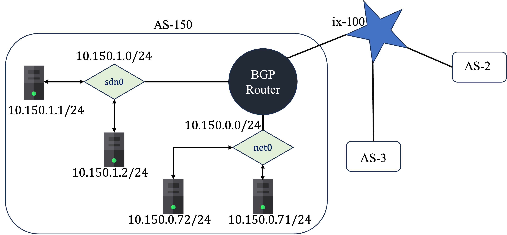

# This experiment will create a small SDN network(sdn0) in the Autonomous System (AS-150)
Goal of this experiment is to create a SDN network that co-exist with regular network in the seed-emulator. I choose autonomous system (AS-150) for this experiment. AS-150 has two networks: `net0 (regular network: 10.150.0.0/24)` and `sdn0 (sdn network: 10.150.1.0/24)`. Network topology is available in the file `sdn-with-mini-internet-topo.png`


## Steps to recreate the result
1. Go to the directory `seed-emulator/examples/sdn/initial-exp`
    ```
    cd seed-emulator/examples/sdn/initial-exp
    ```
2. Start the containers for a the small sdn network.

    ```
    dcdown && docker-compose up --remove-orphans
    ```
    Caveats: I ran the emulation on an arm-machine. Hence, I used the `seed-ubuntu:large-arm`. If you're running the emulation on an x86 machine, you need to replace `seed-ubuntu:large-arm` with `seed-ubuntu:large`.

3. On a new terminal, go to `seed-emulator` directory

4. Run this command to prepare python environment to run seed-emulator.
    ```
    source development.env
    ```
5. Go to `examples/sdn/initial-exp` directory and build the emulation for mini-internet.
    ```
    python3 mini-internet-with-sdn.py
    ```
<!-- Some caveats, If you're running on a x86 machine, you need to uncomment  -->

6. Go to output directory and start the emulation of mini-internet. 
    ```
    cd output && dcdown && docker-compose up --remove-orphans
    ```
7. After all the docker-cotainers are up, on a new terminal go to the (`initial-exp`) directory run the `demo-bgp.sh` script.
    ```
    ./demo-bgp.sh
    ```
8. At this stage both the sdn network and regular mini-internet is ready. We need to configure BGP router of faucet (SDN controller) as well as BGP router of the regular network. Configuration for the BGP router of the SDN controller is already provided in the `faucet-bgp.yaml` file. Here we are configuring the BGP router of AS-150 so that it peers with the bgp router of SDN controller. 
    ```
    docksh as150r-router0-10.150.0.254
    vim /etc/bird/bird.conf
    ```
    (a) In the config file add sdn0 interface to the direct local_nets protocol. This is basically including the sdn network in the autonomus system. 

    ```
    protocol direct local_nets {
        ipv4 {
            table t_direct;
            import all;
        };
        interface "net0";
    }
    ``` 
    So, direct local_nets protocol now looks like this: 
    ```
    protocol direct local_nets {
        ipv4 {
            table t_direct;
            import all;
        };
        interface "net0", "sdn0";
    }
    ```
    (b) Add a bgp protocol to peer with the bgp router of sdn controller.  <!--Here we are configuring the BGP router of AS-150 (container `as150r-router0-10.150.0.254`)>.  -->
    
    Include this at the end of the bird config file.
    ```
    protocol bgp faucet {
        ipv4 {
            export all;
            import all;
        };
        local 10.150.1.254 as 150;
        neighbor 10.150.1.253 port 9179 as 65000;
    }
    ```
    (c) save and close the `bird.conf` file and restart the bird router to reload the config 
    ```
    birdc
    birdc> graceful restart
    bird
    ```

9. At this stage, any host of the sdn0 network, or any host of the net0 network, or any host from those autonomous system that peers with AS-3 or AS-2 is able to ping each other. 

11. For example:
if you go to host-a1 (10.150.1.1) which is a host from the sdn0 network. 
    ```
    docksh host-a1
    ping 10.161.0.72
    ```
    you should see ping reply from `10.161.0.72 (a host that is part of AS-161 which peers with AS-3)`. You can also ping `10.154.0.71` since it peered with AS-2. Additionally, you can also ping `10.150.0.71` a host from the net0 network of AS-150.

## Additional Documentation:
1. SDN controller configuration file (`faucet-bgp.yaml`) has comments for each of the components of the configuration.
2. Look at the comments in `demo-bgp.sh` file to understand how openvswitch bridge is configured. 

## Other resources:
1. Faucet Documentation: [https://docs.faucet.nz/en/latest/configuration.html]()
2. OpenVSwitch Documentation: [https://docs.openvswitch.org/en/latest/tutorials/faucet/]()
