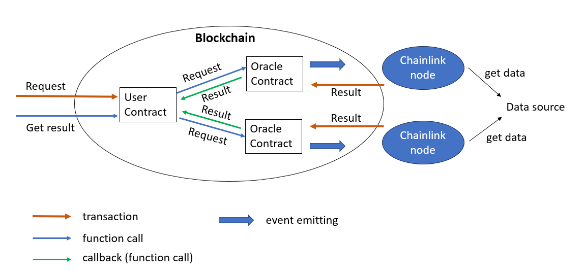

# Contracts used by Chainlink Service

This document provides a detailed overview and operational guidelines for the smart contracts used in our Chainlink-based oracle system.

## Contract Descriptions

### [LinkToken Contract](./LinkToken.sol):
- **Purpose**: Manages LINK tokens within the Chainlink network, extending ERC20 functionality with ERC677 features to facilitate advanced contract interactions.
- **Key Features**:
  - **ERC20 Standard Functions**: Includes methods like `transfer`, `approve`, `transferFrom`, `balanceOf`, and `allowance`.
  - **ERC677 Functionality**:
    - `transferAndCall`:  This function significantly extends the transfer capability by allowing tokens to be transferred to a contract with an additional data payload in a single transaction. This triggers a callback function in the recipient contract, which can then execute further actions based on the data received. This mechanism is critical for Chainlink operations as it simplifies the workflow by combining payment and data transmission into a single operation.
- **Github Source**: https://github.com/smartcontractkit/LinkToken/blob/master/contracts/v0.4/LinkToken.sol

### [Operator/Oracle Contract](./Operator.sol):
- **Purpose**: Serves as the critical intermediary between Chainlink nodes and user contracts, like the `ETHPriceAverageFeed`, that request data. This contract is essential for managing the complex lifecycle of requests and responses within the Chainlink network.
- **Key Features**:
  - `oracleRequest` and `operatorRequest`: These methods are used to receive requests from the ChainlinkClient. They handle different types of requests, whether single or multi-word responses, and manage these requests by logging, verifying, and forwarding them to the appropriate Chainlink nodes.
  - `fullfillOracleRequest`: This method is crucial for processing data received from Chainlink nodes. When a Chainlink node retrieves data from an external source, it submits this data back to the contract through this function.
  - `cancelOracleRequest`: Provides the functionality for requesters to cancel their pending data requests. This feature is particularly useful in dynamic environments where the need for specific data might change rapidly or if the data becomes irrelevant before being processed. It empowers user contracts to maintain control over their data requests and manage their LINK resources effectively.
- **Github Source**: https://github.com/smartcontractkit/chainlink/blob/develop/contracts/src/v0.8/operatorforwarder/Operator.sol

### [ChainlinkClient Contract](./ChainlinkClient.sol):
- **Purpose**: The ChainlinkClient contract serves as a foundational component for contract developers who wish to request data from the Chainlink network. It abstracts much of the complexity involved in creating, sending, and managing these requests and responses.
- **Key Features**:
  - `_buildChainlinkRequest`: This function sets up a new Chainlink request for a specific job, identified by its specification ID (specId), to be called back on a specified address (callbackAddr) with a particular function (callbackFunctionSignature). It initializes and returns a Chainlink.Request struct that can then be populated with additional parameters.
  - `_sendChainlinkRequest` and `_sendChainlinkRequestTo`: These functions handle the sending of the constructed Chainlink request to a specified oracle. They use the transferAndCall method from the LINK token contract to transfer LINK tokens and make the request in a single transaction, thus ensuring that the oracle is paid for its services. A unique request ID is generated for each request using the sender's address and a nonce, and this request ID is used throughout the lifecycle of the request.
- **Github Source**: https://github.com/smartcontractkit/chainlink/blob/develop/contracts/src/v0.8/ChainlinkClient.sol

### [ETHPriceAverageFeed/User Contract](./ETHPriceAverageFeed.sol):
- **Purpose**:  Inherits from the ChainlinkClient to fetch and aggregate Ethereum price data from multiple Chainlink oracles.
- **Key Features**:
  - `requestPriceData`: Utilizes the inherited `ChainlinkClient` methods to send data requests to multiple Chainlink oracles. This function configures a Chainlink request with the required job specification ID and callback function, then sends it through the `sendChainlinkRequestTo` method of the ChainlinkClient. This ensures that each oracle receives an appropriate amount of LINK tokens along with the data request.
  - `fulfill`: This callback function is triggered by the Oracle Contract once it receives the requested data from the Chainlink node. The function processes received price data from multiple oracles, aggregates this information, and calculates an average price. This method is crucial for ensuring robust data integrity and provides a reliable average price by considering responses from various sources.

## Chainlink Process Flow
This diagream illustrates the process flow for interacting with Chainlink oracles and smart contracts within the Chainlink network.


### Understanding the Flow:
1. **User Contract Interaction**: The `ETHPriceAverageFeed/User Contract` contract, which directly inherits from the `ChainlinkClient`, initiates a data request. This request is built by using the inherited `buildChainlinkRequest` function, specifying the job ID, current contract address, callback function, and other relevant parameters necessary for the data request.
  ```python
    Chainlink.Request memory request = buildChainlinkRequest(
        oracles[i].jobId,
        address(this),
        this.fulfill.selector
    );

    request.add("get", url);
    request.add("path", path);
    request.addInt("multiply", 100);

    bytes32 requestId = sendChainlinkRequestTo(oracles[i].oracle, request, ORACLE_PAYMENT);
  ```
2. **Sending Request to Oracle**: After constructing the request, User Contract uses the inherited `sendChainlinkRequestTo` function to send the request to the LINK token contract, which forwards the request to the `Operator/Oracle` contract. This function leverages the LINK token's `transferAndCall` functionality to send the request and payment in a single transaction, ensuring that the oracle is compensated for its services.
  ```python
    s_link.transferAndCall(oracleAddress, payment, encodedRequest)
  ```
3. **Oracle Request Handling**: Upon receiving the request, the `Operator/Oracle` contract logs, verifies, and processes the request accordingly. It then emits an event to notify the Chainlink nodes about the new request, triggering them to fetch data from external sources.
  ```python
    emit OracleRequest(specId, sender, requestId, payment, sender, callbackFunctionId, expiration, dataVersion, data);
  ```
4. **Chainlink Node Response**: Chainlink nodes receive the request, fetch data from external sources, and submit the data back to the `Operator/Oracle` contract using the `fulfillOracleRequest` function.
5. **Data Processing**: The `fulfillOracleRequest` function in `Operator/Oracle` contract processes the data received from the Chainlink nodes, verifies its integrity, and forwards it to the user contract through the callback function specified in the initial request.
  ```python
    callbackAddress.call(abi.encodeWithSelector(callbackFunctionId, requestId, data));
  ```
6. **Data Aggregation**: The user contract, such as the `ETHPriceAverageFeed`, receives data from multiple Chainlink oracles in the `fulfill` callback function. It aggregates this data, calculates an average price.
