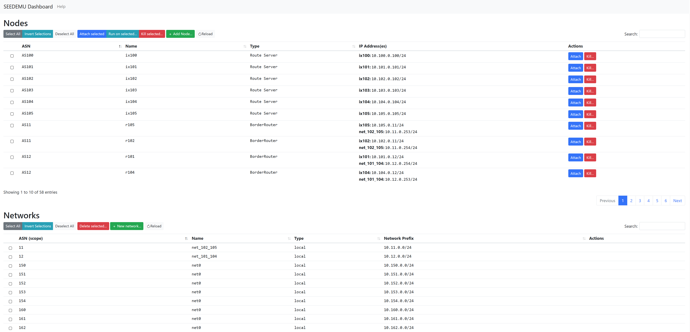
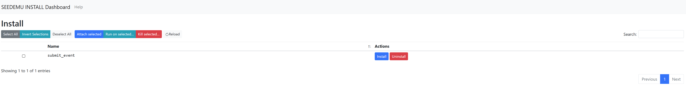
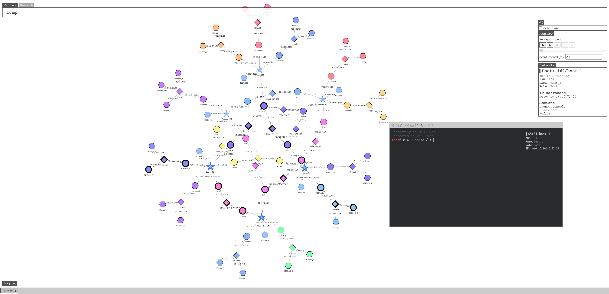
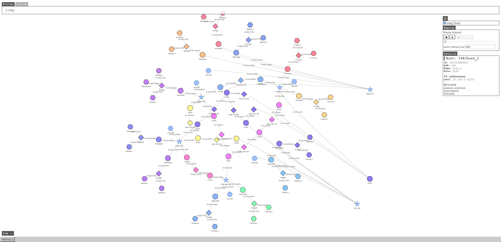

# seedemu-client

This is a work-in-progress prototype of the seedemu client. 

What's working:

- listing nodes in the emulation.
- attaching to nodes in the emulation.
- search nodes with their ASN, node name, or IP address.
- map:
    - show topology on the map.
    - search and highlight nodes on the map.
    - animate packet flows with BPF expression.
    - disconnect/reconnect nodes from emulation.
    - enable/disable bgp peers.
    - customize the style of the node.
    - expand / collapse nodes
    - drag fixed

How to use:
1. start the emulation as you normally would. (e.g., `docker-compose up`)
2. do `docker-compose build && docker-compose up` in this folder.
3. there are mainly the following pages
   1. visit [http://localhost:8080/](http://localhost:8080/) or [http://localhost:8080/index.html](http://localhost:8080/index.html) for list
   2. visit [http://localhost:8080/install.html](http://localhost:8080/install.html) for install plugin.
   3. visit [http://localhost:8080/map.html](http://localhost:8080/map.html) for map.

Alternatively, set `clientEnabled = True` when using `Docker` compiler. Note that `seedemu-client` allows unauthenticated console access to all nodes, which can potentially allow root access to your emulator host. Only run `seedemu-client` on trusted networks.

## index.html

Display the current simulator node and network



## install.html

Plugin installation page



Click "install" to install the corresponding plugin for each emulator container

### submit_event plugin

The `submit_event.sh` script will be generated in the root directory of the emulator container

- submit_event.sh
  - params
    - `-a, --action`, flash|highlight, default: null
      - flash, the container where it is located is flashing
      - flashOnce, the difference from flash is that flash flashes all the time, while Flash Once flashes only once
      - highlight, highlight the container where it is located
      - without parameters, a custom style in the file will be set. This file needs to be created by yourself in json format. The file path must be specified with `-f, --file`
    - `-f, --file`, option json file path, default: /option.json
      - custom style configuration file
  - usage
    - `bash /submit_event.sh -a flash --file /option.json`
  
- Custom style configuration file
    ```python
    # static styles and dynamic styles alternate to create a flickering effect
    {
      # the style displayed when the topology diagram does not flicker
      "static": {}, 
      # the style displayed when the topology diagram flickers
      "dynamic": {}
    }
    ```
    
    ```js
    // static field description example  (same as dynamic)
    // Please see https://visjs.github.io/vis-network/docs/network/nodes.html# more detailed explanation
    {
        "borderWidth": 1,
        "color": {
            "background": "blue"
        },
        "size": 50
    }
    ```
For usage examples, please refer to `tools/InternetMap/example/submit_event`

## map.html

The network topology diagram shows the interconnections between each node and their networks, and also includes some auxiliary functions.



### filter

Set packet capture filtering conditions.
The input parameters will be used as the parameters of tcpdump to set the packet capture and filtering conditions of tcpdump.
1. input valid packet capture conditions
2. when the mouse cursor is in the "filter" input box, press the Enter key to send data and trigger packet capture
3. The node that catches the data packet will flash
4. The specific content of the data packet will be reflected in the `data packet log echo`

### search

Search for nodes that meet the conditions. The found nodes will be highlighted


### setting

Optional settings.

#### drag fixed

After dragging the topology graph with the mouse, will the graph remain in its current position? Check it to indicate yes, and check it not to indicate no



### replay

Replay the packet capture flickering process recorded


### operate the container


Clicking "Launch console" will open the container terminal


### data packet log echo

The content of the captured data packets that conform to "filter" will all be displayed in "Log".


Note on the map:

- try not to click on any nodes or start packet capture on the map until the emulation is fully started (i.e., all containers are created).