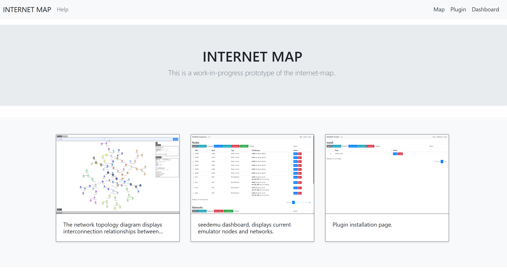
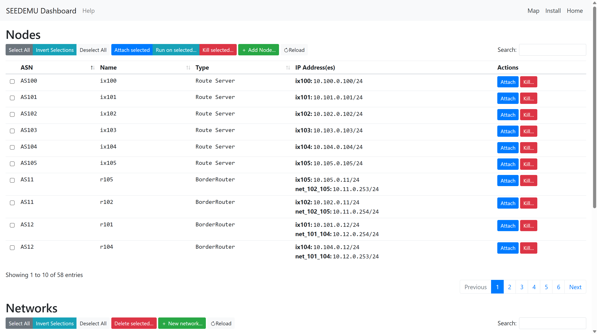

# InternetMap

This is a visualization tool that we developed for the Internet emulator. 

- [index](#indexhtml):
  - Home page
- [map](#maphtml):
  - Display topology of the network
  - Search and highlight nodes on the map 
  - Animate packet flows using BPF expressions 
  - Disconnect/reconnect nodes from emulation 
  - Enable/disable BGP peers 
  - Customize node styles 
  - Expand/collapse nodes 
  - Drag-to-fix node positions
- [dashboard](#dashboardhtml):
  - List nodes in the emulation 
  - Access nodes in the emulation 
  - Search nodes by ASN, node name, or IP address
- [plugin](#pluginhtml)
  - Plugin installation page

How to use:
1. Start the emulation as you normally would. (e.g., `docker-compose up`)
2. Run `docker-compose build && docker-compose up` in this folder.
3. This tool has the following pages:
   1. Home page: [http://localhost:8080/](http://localhost:8080/) or [http://localhost:8080/index.html](http://localhost:8080/index.html) 
   2. The Map page: [http://localhost:8080/map.html](http://localhost:8080/map.html)
   3. Dashboard: [http://localhost:8080/dashboard.html](http://localhost:8080/dashboard.html)
   4. Plugin pag: [http://localhost:8080/plugin.html](http://localhost:8080/plugin.html)

Alternatively, set `clientEnabled = True` when using `Docker` compiler. Note that `internet-map` allows unauthenticated console access to all nodes, which can potentially allow root access to your emulator host. Only run `internet-map` on trusted networks.
At the same time, configuration options are provided to prohibit Internet-map from accessing the console of the node. For details, please refer to [example/internet/B07_internet_map_unable_console](../../examples/internet/B07_internet_map_unable_console/README.md)

## index.html
Home page, default page

## map.html

The network topology diagram displays interconnection relationships between nodes and networks, along with auxiliary functions including filtering, search, settings, replay, and logging. For a detailed introduction, [please refer to this document](./docs/map.md)

## dashboard.html

`seedemu dashboard`, displays current emulator nodes and networks

## plugin.html

Plugin installation page.

Plugins are implemented through the Docker API and operate independently of the core "client" functionality. They enable extended custom functionality.

For example, the submit_event plugin allows customization of host node styles on the map.

Simply install the corresponding plugin for your required functionality.

Currently, only the submit_event plugin is available. More plugins will be added in the future.

For specific usage instructions, [please refer to this document](docs/plugin.md)

