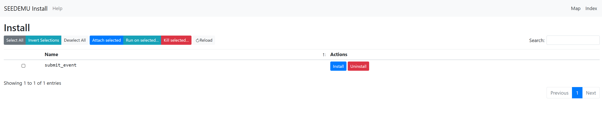

# InternetMap

This is a visualization tool that we developed for the Internet emulator. 

## Features supported

Currently, the tool supports the following features:

- [index](#indexhtml):
  - Home page
- [map](#maphtml):
  - Display topology of the network
  - Search and highlight nodes on the map 
  - Animate packet flows using BPF expressions 
  - Disconnect/reconnect nodes from emulation 
  - Enable/disable BGP peers 
  - Customize node styles 
  - Expand/collapse nodes 
  - Drag-to-fix node positions
- [dashboard](#dashboardhtml):
  - List nodes in the emulation 
  - Access nodes in the emulation 
  - Search nodes by ASN, node name, or IP address
- [plugin](#pluginhtml)
  - Plugin installation page

## How to use this tool

### Start the tool during the runtime

The Internet Map runs inside an independent container. We can use the `docker-compose.yml` file inside this folder to bring up the container. 

1. Start the emulation as you normally would. (e.g., `docker-compose up`)
2. Run `docker-compose build && docker-compose up` in this folder to build and start the Internet Map container.
3. Once the container is up, access the tool using the the following pages:
   1. Home page: [http://localhost:8080/](http://localhost:8080/) or [http://localhost:8080/index.html](http://localhost:8080/index.html) 
   2. The Map page: [http://localhost:8080/map.html](http://localhost:8080/map.html)
   3. Dashboard: [http://localhost:8080/dashboard.html](http://localhost:8080/dashboard.html)
   4. Plugin pag: [http://localhost:8080/plugin.html](http://localhost:8080/plugin.html)

### Start the tool during the runtime

Alternatively, the Internet Map container can be directly included in the emulator when we build the emulator. Just set `clientEnabled = True` when using `Docker` compiler (the default value is `True`, so by default, the Internet Map is already included in the emulator). 

### The security issue

Note that the Internet Map allows unauthenticated console access to all nodes, which can potentially allow root access to your emulator host. Only run this tool on trusted networks. If you only want to use the Internet Map to visualize the network, without providing the node access, you can disable the access. For details, please refer to [example/internet/B07_internet_map_unable_console](../../examples/internet/B07_internet_map_unable_console/README.md).

## Pages 

### index.html

Home page, the entry point. 

### map.html

The network topology diagram displays interconnection relationships between nodes and networks, along with auxiliary functions including filtering, search, settings, replay, and logging. For detailed introductions, [please refer to this document](./docs/map.md).

### dashboard.html

Displays the emulator nodes and networks.

### plugin.html

Plugin installation page: installing additional tools inside the emulator. For detailed instructions, [please refer to this document](docs/plugin.md).

