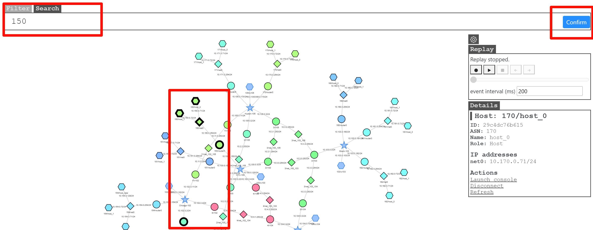
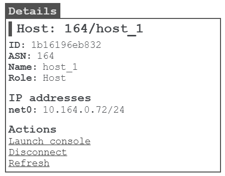

### filter

Set packet capture filtering conditions.
The input parameters will be used as the parameters of tcpdump to set the packet capture and filtering conditions of tcpdump.
1. input valid packet capture conditions
2. when the mouse cursor is in the "filter" input box, press the Enter key to send data and trigger packet capture
3. The node that catches the data packet will flash
4. The specific content of the data packet will be reflected in the `data packet log echo`

### search

Search for nodes and networks that meet the conditions, such as ip, name, label, etc. The found nodes will be highlighted.

### setting

Optional settings.

#### drag fixed

After dragging the topology graph with the mouse, will the graph remain in its current position? Check it to indicate yes, and check it not to indicate no

### replay

To better record the display of data packets on the map page, 

the `Replay` function is provided, which can reproduce the recorded data packet transmission process and specify the display rate. 

It supports fast-forward and rewind functions.

- `Dot` button: start recording
- `Triangle button`: start / pause replay
- `Square` button: stop replay
- `Left arrow` button: step backward
- `Right arrow` button: step frontward
- `event interval`: replay rate

### operate the container

Clicking "Start Console" will open the container terminal, 

allowing you to enter the container for operations without executing docker commands, which is more convenient

### data packet log echo

The content of the captured data packets that conform to "filter" will all be displayed in "Log", making it convenient to view the specific content of the data packets.

When not needed, they can be folded up.

Note on the map:

- try not to click on any nodes or start packet capture on the map until the emulation is fully started (i.e., all containers are created).