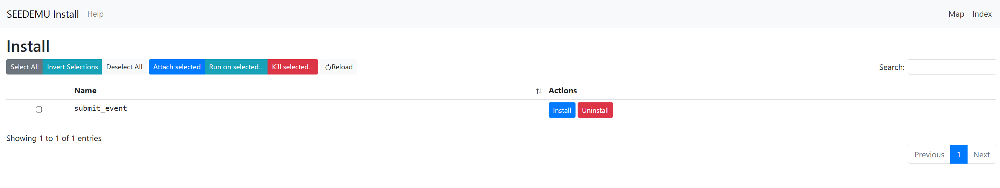

# Plugin Page: plugin.html

To interact with the Internet Map, corresponding tools need to be installed on each container. Tools that support the core visualization features are already installed on containers; this is done during the building time, i.e., when the emulator is constructed. If we add new visualization features to the Internet Map, if we want to install the additional tools on containers again during the building time, we will have to change the emulator code. This is not a good approach, as it makes the emulator depend on the Internet Map tool.

To make the Internet Map and the emulator as independent as possible, we introduce the plugin framework. Plugins are tools that are installed on containers during the runtime.  For example, the `submit_event` plugin allows containers to directly instruct the Internet Map how they want the Map to visualize them (flahsing, changing color, etc.) .

Currently, only the `submit_event` plugin is available, but more plugins will be added in the future.



## submit_event plugin

Support customizing the display style on the map. The plugin needs to run inside each emulator container.

Click `install` to install the corresponding plugin on each emulator container. The `submit_event.sh` script will be generated in the `/map-plugins` directory inside each emulator container.

Here is now to use the script:

- `submit_event.sh`
  - params
    - `-a, --action`, `flash|flashOnce|highlight`, default: `highlight`
      - `flash`, the container node on the Map will be constantly flashing 
      - `flashOnce`, the container node will flash only once
      - `highlight`, the container node will be highlighted 
    - `-s, --style`, custom style file (optional), providing custom styles for the action. Without the style file, actions will use the default styles
  - usage example
    - Execute this script inside an emulator container, `bash /submit_event.sh -a flash --style /option.json`
  
- Custom style file
    ```python
    {
      # The hightlight style
      "highlight": { ... }, 
      # The flashing style. Flashing includes two styles; it basically switches between these two styles
      "flash": {  # both fields can be null, using the default setting
             "static":  { ... },  
             "dynamic": { ... },
             "duration": N  # The durating (seconds) between two flashes (only meaningful for the constantly flashing option)
        }
    }
    ```
    
    The ... above represents the actual style specificataion, which follows the official `vis-network` document. Please see [vis-network](https://visjs.github.io/vis-network/docs/network/nodes.html) for more detailed explanation. Here we give an example.
    ```js
    {
        "borderWidth": 1,
        "color": {
            "background": "blue"
        },
        "size": 50
    }
    ```

For usage examples, please refer to [tools/InternetMap/example/submit_event](../example/submit_event/REMDME.md)