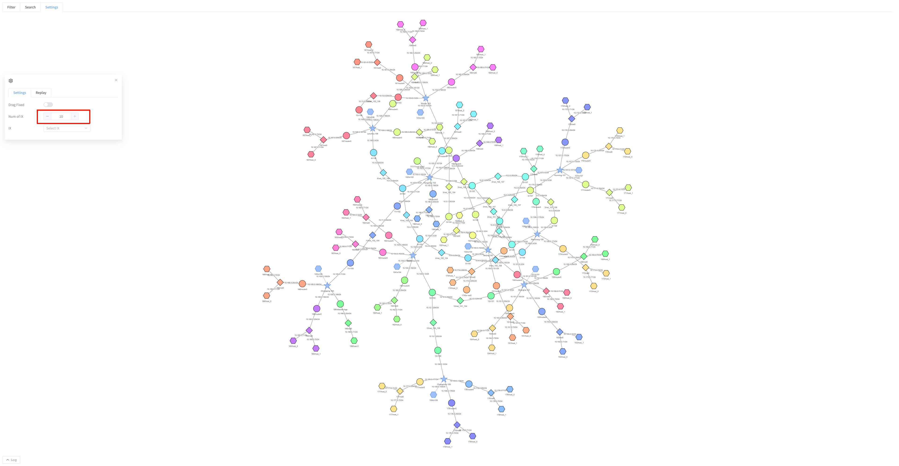
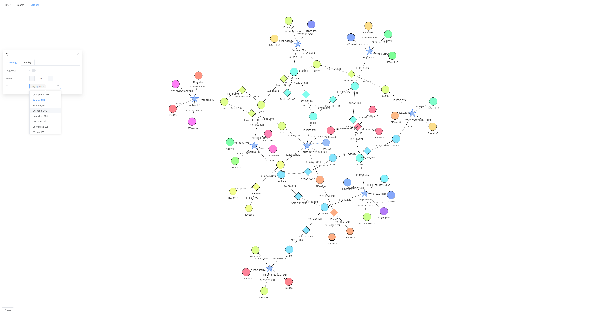
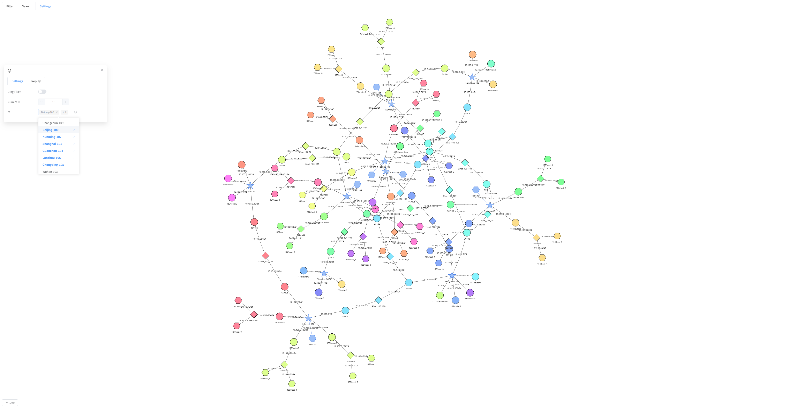
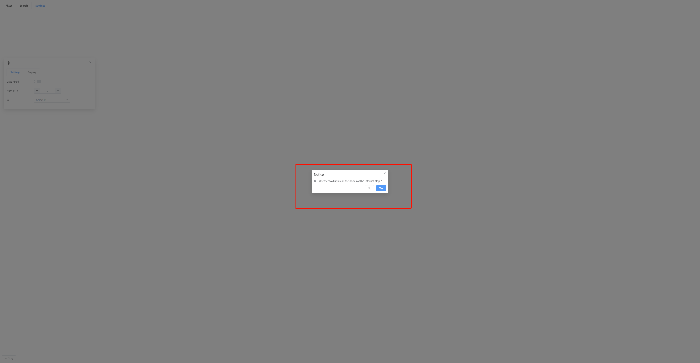

## ixMap

Similar to the map page in function, the difference lies in the display dimension. ixMap only shows up to the IX dimension and does not display the Host at a deeper level.
IX refers to the "star" in the map.
- display
  - [by number](#by-number)
  - [by name](#by-name)
  - [full / partial](#full--partial)

### by number
The page can change the displayed quantity. The new quantity takes effect when the quantity input box loses focus.
ix weight takes priority.

### by name
Display according to the ix name of the selected ix. By default, all are displayed.

1. Select IX. 
2. After making your selection, simply click anywhere outside the IX selection box to take effect.

### full / partial
As soon as you enter the webpage, a prompt will appear asking whether you want to display all the nodes.

- Yes
  - Display all nodes
- No
  - Please select the options to be displayed in the "Settings -> Categories" section.

