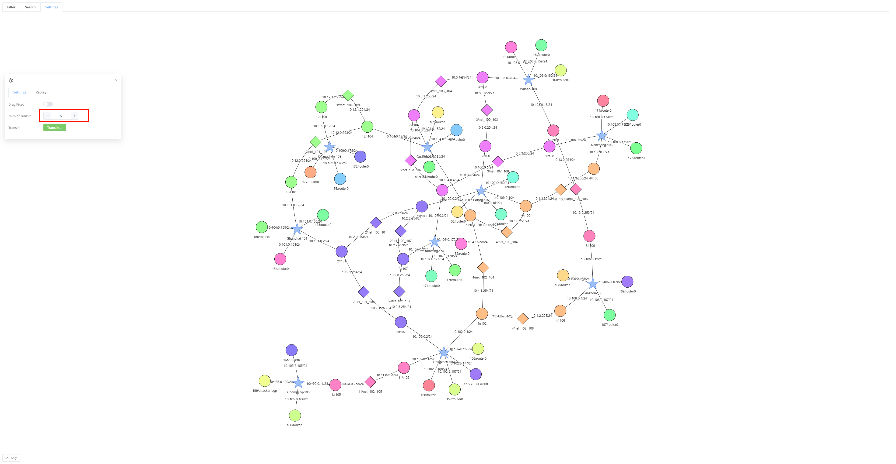
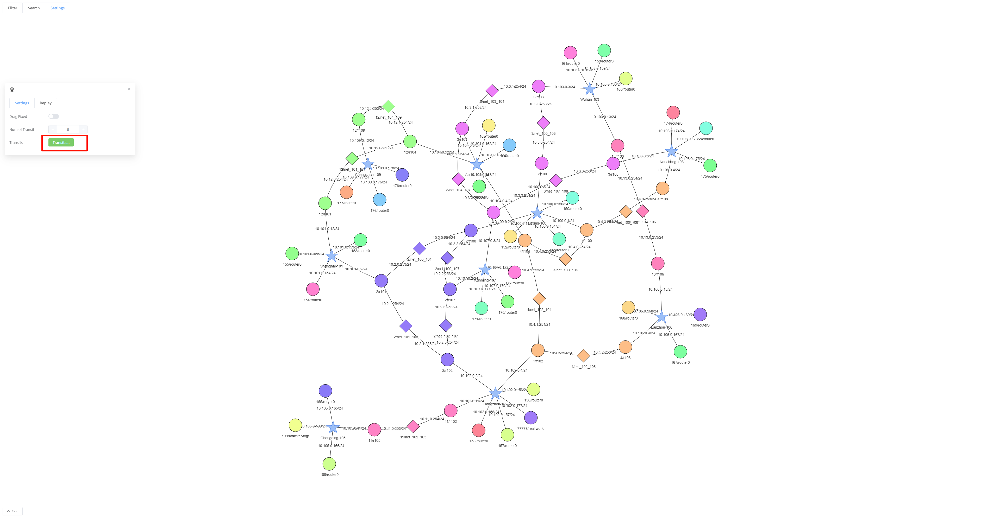
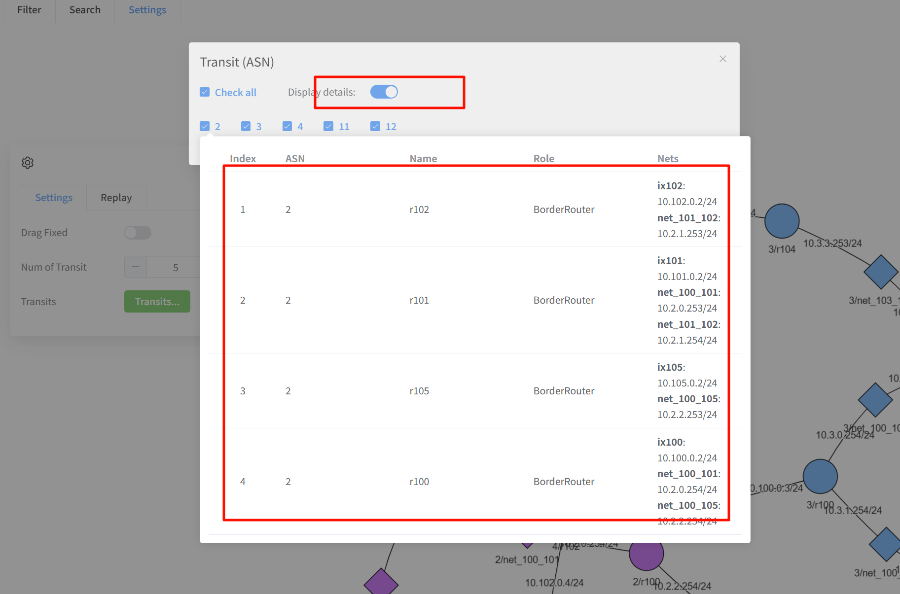
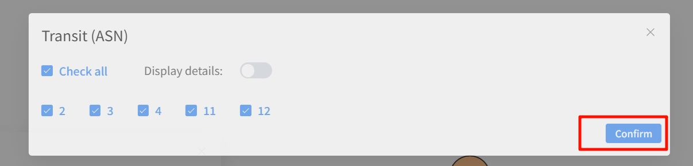
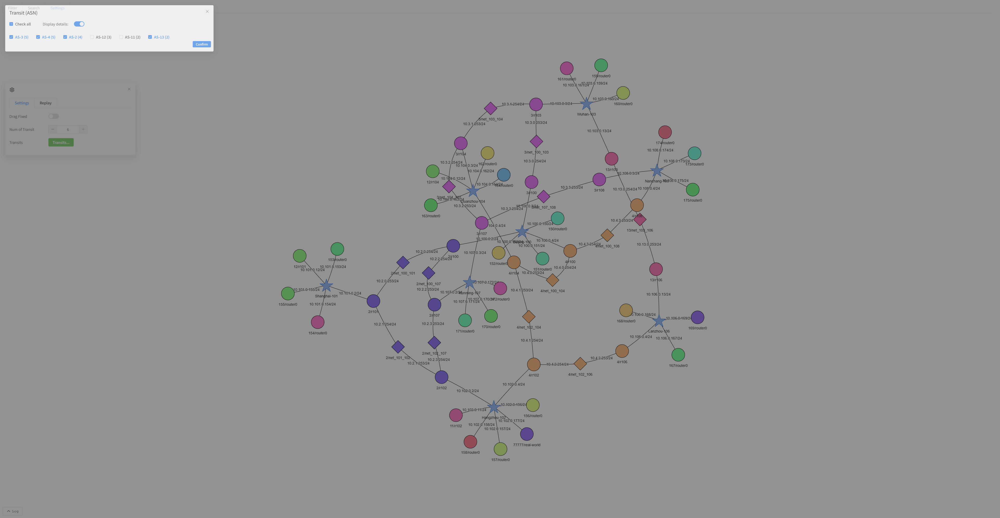
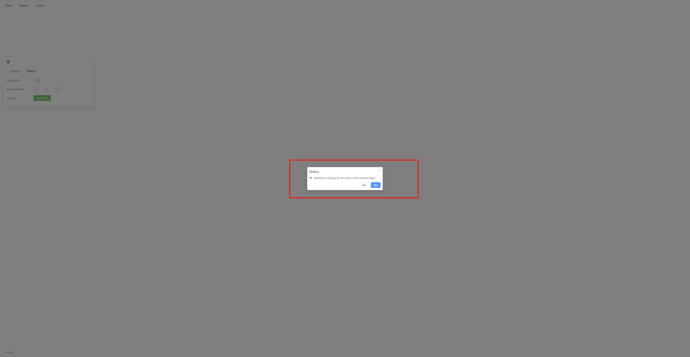

## transitMap

Similar to the map page in function, the difference lies in the display dimension. transitMap only shows up to the transit dimension and does not display the Host at a deeper level. 
- display
  - [by number](#by-number)
  - [by name](#by-name)
  - [full / partial](#full--partial)

### by number
By default, all transit is displayed. The page can change the displayed quantity. The new quantity takes effect when the quantity input box loses focus.
transit weight takes priority. For instance, if transitA has 2/101, 2/102, and 2/103, and transitB has 3/101 and 3/102, then transitA takes priority.

### by name
Display according to the ASN name of the selected transit. By default, all are displayed.

1. Click `Transit`
2. Select ASN. Hover the mouse over the corresponding ASN to Display its detailed information. `Display details` can turn this function off/on
3. Click `Confirm` to take effect and wait for re-rendering

### full / partial
As soon as you enter the webpage, a prompt will appear asking whether you want to display all the nodes.

- Yes
  - Display all nodes
- No
  - Please select the options to be displayed in the "Settings -> Categories" section.

