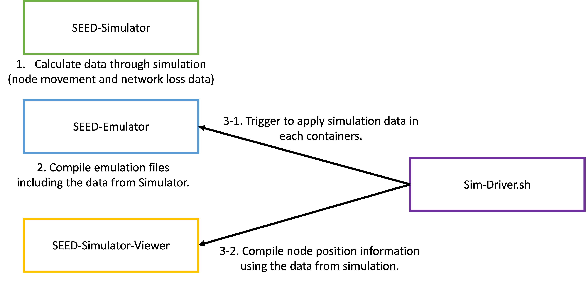

# SEED Simulator

The main role of the `SEED-Simulator` is to control the network flow between nodes powered by the seed emulator. The current `SEED-Simulator` supports several network propagation models, and it also supports some topologies to easily configure the movement of nodes.

In `SEED-Simulator`, there are two main settings: (1) `MobilityModel` and (2) `PropagationLossModel` for nodes. Through a specified number of iterations, the simulation updates the positions of nodes based on the configured mobility model and calculates the network loss between nodes according to the propagation loss model. The data produced by SEED-Simulator is processed and used by SEED-Emulator and the Viewer.



At the current stage, the Simulator and Emulator are not interconnected in real-time. This is a task to be addressed in the future. Currently, the approach involves running the Simulator first, saving the network loss rate between nodes for each iteration, and then applying the simulation data, specifically the network loss rate, to Emulator nodes using a separate driver.sh script that utilizes the tc command.

## Table of Contents

-  [Tutorials Introduction](#seed-simulator-tutorials)
-  [Tutorials Status](#tutorial-status)
-  [Basic Sequece for Running Simulator](#the-basic-sequence-for-running-the-simulator-and-emulator)
-  [Before Running Tutorials](#before-running-tutorials)
-  [Development Status](#development-status)
-  [Evaluation](evaluation/README.md)

# SEED-Simulator Tutorials
- [Tutorials](examples/README.md)
The `examples` folder contains tutorial information on how to use the `SEED-simulator`. 

The `AXX-` folder includes files for the `SEED Emulator` and `SEED Simulator Viewer`, which are used in conjunction with the `SEED Simulator`. The simulator cannot be used standalone; it needs to be used together with the `SEED Emulator`.

The `BXX-` folders contain tutorials for the propagation models provided by the seed simulator, and the `CXX-` folders contain tutorials for the node topologies provided by the seed simulator.

## Tutorial Status
Below the examples folder, I have created 11 folders so far. And checkbox indicates that document is ready or not.

- [X] A00-emulator - https://github.com/seed-labs/seed-blockchain/tree/experiment/wireless/SEED-Simulator/examples/A00-emulator
- [X] A01-visualization - https://github.com/seed-labs/seed-blockchain/tree/experiment/wireless/SEED-Simulator/examples/A01-visualization
- [X] A02-simulation-driver - https://github.com/seed-labs/seed-blockchain/tree/experiment/wireless/SEED-Simulator/examples/A02-simulation-driver
- [X] B01-log-distance - https://github.com/seed-labs/seed-blockchain/tree/experiment/wireless/SEED-Simulator/examples/B01-log-distance
- [ ] B02-three-gpp-urban
- [X] B03-three-gpp-v2v-urban - https://github.com/seed-labs/seed-blockchain/tree/experiment/wireless/SEED-Simulator/examples/B03-three-gpp-v2v-urban 
- [X] C00-constant-velocity - https://github.com/seed-labs/seed-blockchain/blob/experiment/wireless/SEED-Simulator/examples/C00-constant-velocity/README.md
- [X] C01-linear-topology - https://github.com/seed-labs/seed-blockchain/tree/experiment/wireless/SEED-Simulator/examples/C01-linear-topology
- [X] C02-circular-topology - https://github.com/seed-labs/seed-blockchain/blob/experiment/wireless/SEED-Simulator/examples/C02-circular-topology/README.md 
- [X] C03-star-topology - https://github.com/seed-labs/seed-blockchain/blob/experiment/wireless/SEED-Simulator/examples/C3-start-topology/README.md 
- [X] C04-grid-topology - https://github.com/seed-labs/seed-blockchain/tree/experiment/wireless/SEED-Simulator/examples/C04-grid-topology


## The basic sequence for running the simulator and emulator
### Step 1. Run Simulator 

Simulator scripts for tutorials are located in `BXX-` and `CXX-` example folders.

i.e.)
```sh
$ cd examples/B01-log-distance
$ ./log-distance-sim.py
```

After running the Simulator, two types of data are generated. The first one is the `/tmp/siminfo/siminfo.csv`, which includes the positions of nodes for each iteration and the network loss rate between nodes. And the following file structure will be created in the /tmp/seedinfo folder:
`/tmp/seedsim/tc_command/{node_id}` folder will be shared with the container with {node_id}. And when the simulation is running, `tc_command_{iter}` will be executed at the given `{iter}`.

```sh
/tmp/seedsim/
├── setting
│   └── info.txt
├── siminfo
│   └── siminfo.csv
├── tc_command
│   ├── 0
│   │   ├── tc_command_0
│   │   ├── tc_command_1
│   │   ├──    ...
│   ├── 1
│   │   ├── tc_command_0
│   │   ├── tc_command_1
│   │   ├──    ...
│   ├── 2
│   │   ├── tc_command_0
│   │   ├── tc_command_1
│   │   ├──    ...
│   │   ...
└── tc_runner.sh
```

### Step 2. Generate emulation files and run containers

```sh
$ cd examples/A00-emulator
$ ./emulator.py
$ cd output
$ dcbuild
$ ./z_start.sh
```

### Step 3. Run simulator client (for visualization)

```sh
$ cd examples/A01-visualization
$ dcbuild && dcup
```

You can access to the page with "http://localhost:8080/simulator.html".
The nodes will appear after going through Step 5.

### Step 4. Run sim-driver.sh script

```sh
$ cd examples/A02-simulation-driver
$ ./sim-driver.sh
```

This script will trigger to apply simulation data inside the emulators.
When you want to rerun the simulation inside the emulators, run `sim-driver.sh` script again without running step 1 - step 3.

## Before Running Tutorials

### (1) SEED-Emulator
Use wireless branch of SEED-Emulator repo.
```sh
$ git clone https://github.com/seed-labs/seed-emulator
$ cd seed-emulator
$ git checkout wireless
$ source development.env
```

### (2) SEED-Blockchain
Use experiment branch of SEED-Blockchain repo.
```sh
$ git clone https://github.com/seed-labs/seed-blockchain.git
$ cd seed-blockchain
$ git checkout experiment
```

Add PythonPath to use `seedsim` package. 
```sh
$ cd seed-blockchain
$ cd wireless/SEED-Simulator
$ source development.env
``` 

Install required python packages. 
```sh
$ cd seed-blockchain
$ cd wireless/SEED-Simulator
$ pip3 install -r requirements.txt
``` 

# Development status

## Propagation Models
- Propagation Delay Model 
    - ConstantSpeedPropagationDelayModel
    - RandomPropagationDelayModel
- Propagation Loss Model
    - FriisPropagationLossModel
    - NakagamiPropagationLossModel
    - LogDistancePropagationLossModel
    - ThreeGppPropagationLossModel
        - ThreeGppRmaPropagationLossModel
        - ThreeGppUmiStreetCanyonPropagationLossModel
        - ThreeGppUmaPropagationLossModel
        - ThreeGppIndoorOfficePropagationLossModel
        - ThreeGppV2vUrbanPropagationLossModel
        - ThreeGppV2vHighwayPropagationLossModel
    
We have developed our propagation loss model based on ns3. However, there is a difference between our model and ns3. While ns3 calculates the loss value itself, our SEED simulator calculates the loss ratio. The reason for this difference is that in our simulator, the calculated loss rate is applied using tc in the emulator. Currently, in the process of determining the loss rate, we adopt a method of calculating probabilities from various forms of distributions. Further improvements will be needed in the future.

## Needs to be done
We attempted to evaluate SEED wireless internet emulator by comparing its performance with other simulators or emulators used in academic papers. 
We aims to replicate their experiments and contrast the results with those obtained from our emulator.  However, this endeavor encountered certain limitations. Our emulator lacks adequate configuration support in comparison to other simulators or emulators. Prior to proceeding with this evaluation, we opted to enhance our emulator.

### MAC Layer configuration supports
We are emulating wireless networks using a wired network. After calculating the loss rate and delay between nodes using propagation loss and delay models, we apply the network loss rate and delay between nodes using the `tc` tool. Due to this design, our platform currently lacks sufficient support for detailed configuration of the MAC layer compared to other simulators or emulators. For example, experiments such as assigning different channels to nodes or comparing performance based on WiFi standards cannot be conducted. The parameters provided by NS3 for the MAC layer include the following:
- WiFi Standard
- DataMode
- ControlMode
- MCS
- ChannelWidth
- Channel number

### Mobility Simulation (SUMO)
When reviewing the VANET simulator[1], they implemented two types of simulators: Network simulator and Mobility simulator. As of now, we have Network simulator. We also need to integrate a mobility simulator into our platform, similar to these considerations. Since most VANET simulators adopt SUMO as the mobility simulator, we believe it is necessary to review and analyze SUMO[2].

### Various Routing Protocol supports.
Upon reviewing various papers, I found that there are many articles comparing routing protocols. However, at present, we only support the Babel routing protocol, which means we are not equipped to compare multiple routing protocols.

### Network Performance Testing
We need to provide functionality for Network Performance Testing. There is a necessity to offer capabilities for testing not only with Iperf but also for assessing performance during video streaming. (This aspect is currently being developed by one of the CIS700 students.)

[1] Weber, J., Neves, M. & Ferreto, T. VANET simulators: an updated review. J Braz Comput Soc 27, 8 (2021). https://doi.org/10.1186/s13173-021-00113-x
[2] Pablo Alvarez Lopez, Michael Behrisch, Laura Bieker-Walz, Jakob Erdmann, Yun-Pang Flötteröd, Robert Hilbrich, Leonhard Lücken, Johannes Rummel, Peter Wagner, and Evamarie Wießner. 2018. Microscopic Traffic Simulation using SUMO, In The 21st IEEE International 