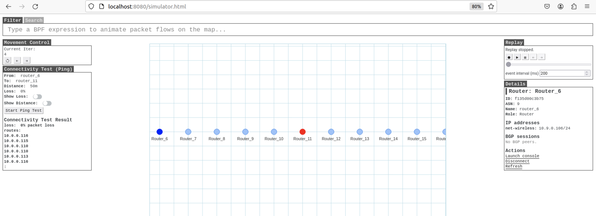
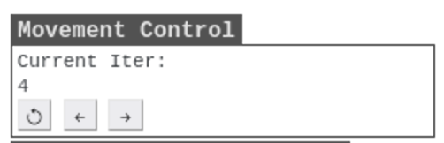
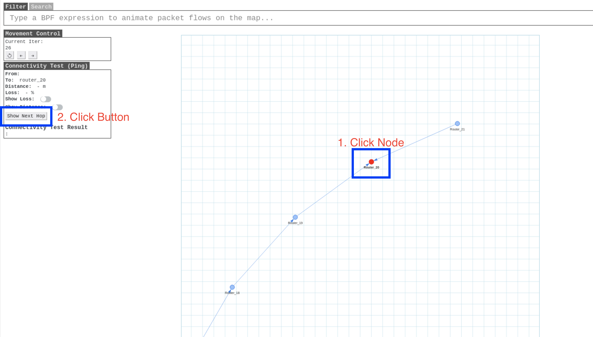
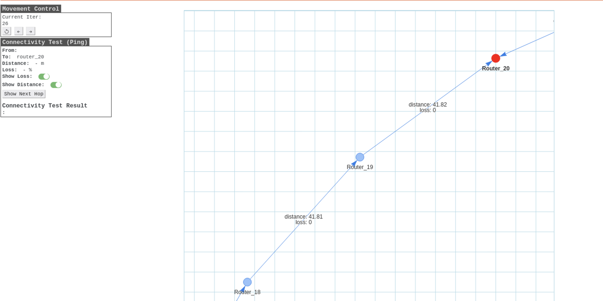

# SEED-SIMULATOR-VIEWER

The seed-simulator-viewer is a tool that aids in analyzing the operation of the simulator. By using this tool, you can observe the movement of nodes, conduct tests for network communication between nodes, and assess network loss rates and distances among nodes.



The current visualization is built using Node.js for the web. The code is being developed at https://github.com/seed-labs/seed-emulator/tree/wireless/client. For the completed parts so far, we have built a Docker image for easy use. You can use the viewer effortlessly by following the instructions below:

```sh
$ docker-compose build
$ docker-compose up
```

You can access to the page with "http://localhost:8080/simulator.html".


The SEED-simulator-viewer is a web-based tool developed based on the existing seed emulator client (viewer). Therefore, in this document, the focus will be on explaining the features developed in the simulator-viewer tool. Using this tool, we can primarily perform three functions: (1) Adjust Time Step, (2) Confirm the next hop for each node when selected nodes are set as destinations, and (4) Confirm the loss rate and routes between two nodes through ping tests.

## 1) Adjust Time Step (Iteration)


Using the first panel at the top left of the web page, you can change the time step (iteration). Whenever the time step is changed, the loss rate and the positions of nodes at that moment are reflected. The [<-] button moves to the previous time step, and the [->] button moves to the next time step.

## 2) Next Hop



Using the second panel at the top left of the web page, you can confirm the next hop for each node when the selected node is set as the destination.

1. Click on the node you want to designate as the destination among the nodes shown in the center panel. Clicking on a node changes its color to red. (If the node's color turns blue, click again to change it to red.)

2. After selecting the destination node, click the [Show Next Hop] button in the second panel at the top left. Clicking the button updates the center panel.

3. The updated panel visually represents information about which path each node should take as the next hop to reach the destination node. For example, in the given figure, router-20 node is selected as the destination. The visualization indicates an arrow from router-18 node to router-19 node. This means that when router-18 communicates with the destination node router-20, the next hop is router-19 node.



Pressing the slider buttons next to `[show loss]` and `[show distance]` allows you to display or hide the loss rate and distance set between the starting node and the ending node represented by the arrows.

## 3) Ping Test


Using the second panel at the top left of the web page, specifically the [Connectivity Test] panel, you can execute a ping test between two selected nodes.

1. Click on two nodes you want to designate as the Destination and Start nodes among the nodes shown in the center panel. The Destination Node will turn red, and the Start Node will turn blue. Once you have selected two nodes, you will notice that the [Show Next Hop] button in the second panel at the top left changes to [Start Ping Test].

2. Click the changed [Start Ping Test] button. After clicking, the [Connectivity Test] panel will update after a few seconds.

3. The updated panel displays the Connectivity Test Result, i.e., the loss rate between the two nodes, and shows the routes. This information is visualized in the center panel.
