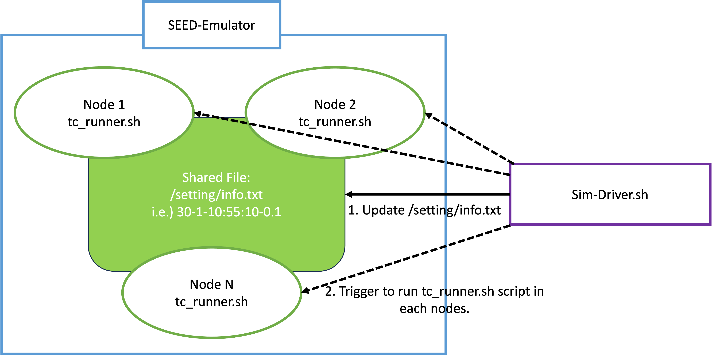

# Simulation Driver

The simulation data consists mainly of loss rates and node positions at each time step (iteration). The information about loss rates is already compiled into files inside the containers of each node in the emulator using the tc command. It is crucial that the loss rate settings are applied almost simultaneously within all nodes at a specific time step. For example, if the time step duration is 1 second and the simulation runs for 30 seconds, the network loss information at time step N must be applied to all nodes in the emulator almost simultaneously.

To address this issue, we have solved it using the `sim-driver.sh` and `tc-runner.sh` scripts. 

Each node in the emulator has a `tc-runner.sh` script file and shares the `/setting/info.txt` file. `/setting/info.txt` contains the necessary information for executing `tc-runner.sh`. This information is stored in the format of `TimeSteps-StepDuration(sec)-SimulationStartTime-SleepDuration`. For example, 30-1-10:55:10-0.1 indicates that the total number of simulation time steps (iterations) is 30, each step has a duration of 1 second, the simulation starts at 10:55:10, and the SleepDuration is 0.1 seconds.

To elaborate further, the simulation starts at 10:55:10, and the loss rate and node positions are updated every 1 second. If, for example, at 10:55:14, the data for time step 4 is applied, we need to wait within a while loop until the current time reaches time step 5, specifically 10:55:15. Within the while loop, the SleepDuration is used to determine how often to check the current time.