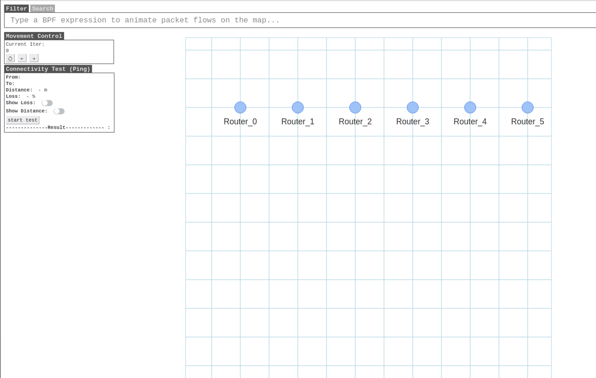
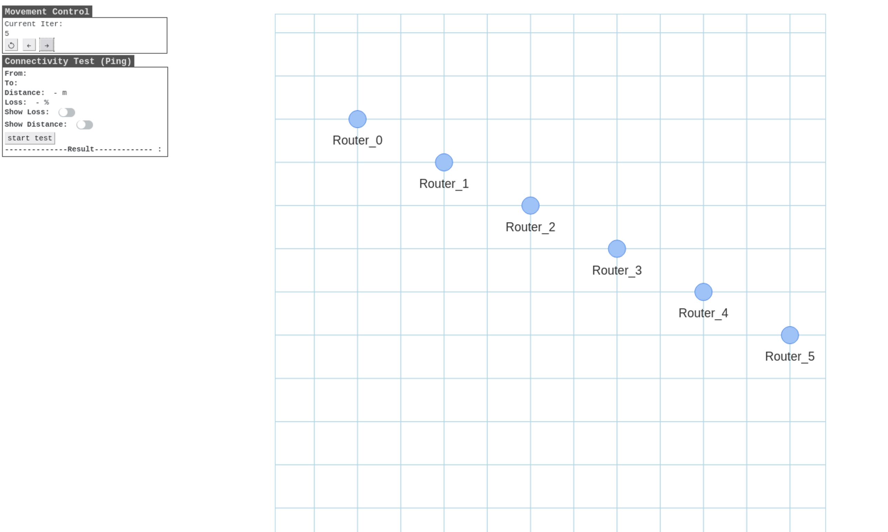

# Constanct Velocity Mobility Model

The ConstantVelocityMobilityModel is a mobility model that moves a specified distance at every step (iteration).

This model requires the initial Position and Velocity to be specified in vector form. The Vector(x, y, z) represents the x, y, and z coordinates, respectively. While it can consider 3D coordinates by including the z value, the tutorial currently focuses on 2D, so the z value is not heavily utilized.

Example configuration for ConstantVelocityMobilityModel:
```python
ConstantVelocityMobilityModel(position=Vector(a, b, c), velocity=Vector(a', b', c'))
```

For instance, with the configuration above, the initial position of the node is (a, b, c), and it moves by (a', b', c') every second. Therefore, after n seconds, the node's position will be (a+n*a', b+n*b', c+n*c').

```python
ITERATION       = 30
NODE_TOTAL      = 30

# To use the Simulation class, you need to define how many nodes you want to use in the SEED emulator. 
# In the example A00-emulator-code, 30 nodes are used. 
# Therefore, in this tutorial, you would input 30 when configuring the Simulation class.
sim = Simulation(NODE_TOTAL)

# You can use the `getNodeList()` method to retrieve a list of node objects initialized in the Simulation class. 
# With the Node objects obtained from this list, you can configure the movement of each node.
nodes = sim.getNodeList()

for i, node in enumerate(nodes):
    mobility = ConstantVelocityMobilityModel(position=Vector(i*10, 0, 0), velocity=Vector(0,i,0))
    nodes[i].setMobility(mobility)
```
In the tutorial, the routers' initial positions for router-0, router-1, and router-2 are (0, 0, 0), (10, 0, 0), and (20, 0, 0), respectively. The diagram below shows the node positions at iter 0 in the viewer, with 10m intervals marked. 



Additionally, based on the code, each node moves by 0, 1, and 2 along the y-axis at every step (iteration). Therefore, at step 5, the positions for router-0, router-1, and router-2 become (0, 0, 0), (10, 5, 0), and (20, 10, 0) respectively, as shown in the viewer for iter 5.

