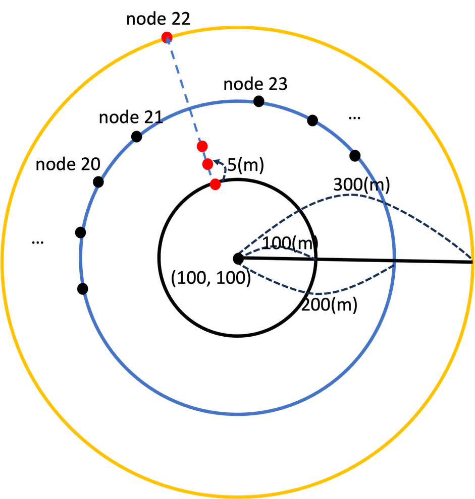

# Circular Mobility Model

https://github.com/seed-labs/seed-blockchain/assets/19922651/93302a56-76b4-482c-bf1e-45ac6aec3229

The Circular Mobility Model positions nodes on a circular path based on the given center and radius of the circle. The distance between nodes is constant in this circular arrangement.

In this tutorial, all nodes except for node 22 and node 29 have a radius set to 200. On the other hand, node 22 and node 29 have a radius of 100, and the maxRadius is set to 300.

Example configuration for CircularMobilityModel:
```python
for i, node in enumerate(nodes):
    # Circular
    if i==22 or i==29:
        mobility = CircularMobilityModel(nodeId=i, nodeTotal=NODE_TOTAL, centerX=100, centerY=100, radius=100, maxRadius=300)
    else:
        mobility = CircularMobilityModel(nodeId=i, nodeTotal=NODE_TOTAL, centerX=100, centerY=100, radius=200)
 
    nodes[i].setMobility(mobility)
```



A simplified representation is as follows:

- All nodes except for node 22 and node 29: Positioned on a blue circle with a center at (100,100) and a radius of 200. These nodes remain stationary.

- Node 22 and node 29: Positioned initially at a distance of 100 from the center (100, 100) and move 5 units away from the center per iteration until reaching a maxRadius of 300 or until the given iterations are completed. In the diagram, only node 22 is represented.
