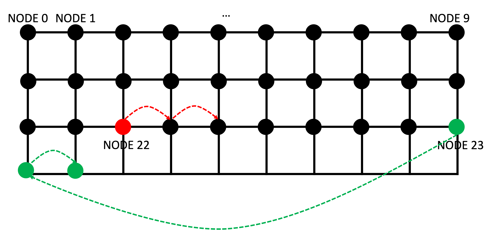

# Grid Mobilitiy Model


https://github.com/seed-labs/seed-blockchain/assets/19922651/fe16984b-5147-4534-9c00-7c8a8db95e0b

The Grid Mobility Model positions nodes along grid lines. The grid's shape is determined by the total number of columns (colTotal), indicating how many nodes will be positioned in one row, and the distance between nodes (dist). You can use the 'paused' parameter to determine whether nodes should move or remain stationary.

In this tutorial, the configuration is as follows:


```python
for i, node in enumerate(nodes):
    # Grid
    if i==22 or i==29:
        mobility = GridMobilityModel(nodeId=i, nodeTotal=NODE_TOTAL, colTotal=10, dist=10, paused=False)
    else:
        mobility = GridMobilityModel(nodeId=i, nodeTotal=NODE_TOTAL, colTotal=10, dist=10, paused=True)
    
    nodes[i].setMobility(mobility)
```



This can be represented graphically as follows:
- A total of 30 nodes are positioned on the grid.
- There are 10 nodes aligned in one row, and the distance between nodes is 10 meters.
- When 'paused' is set to False, nodes move one cell per time step (iteration).
